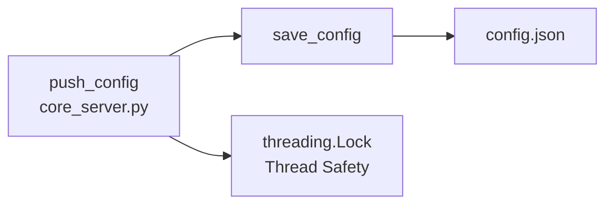

# util_config

> 📅 Last Updated: 2026/06/11

Web module configuration file read/write utility, responsible for persistent management of `config.json`. Has no internal thread lock protection — thread safety is guaranteed by the upper-level caller (`push_config` in `core_server.py`).

## load_config

```python
def load_config(config_path: str) -> dict[str, Any]:
    """Loads and validates the frontend configuration from the specified path, returns a dictionary."""
```

- **File not found**: Directly raises `ConfigurationError`, does not initialize from a default template.
- Uses `os.path.exists()` to check file existence, then reads JSON with UTF-8 encoding.

## save_config

```python
def save_config(config: dict[str, Any], config_path: str) -> bool:
    """Saves the frontend configuration to a JSON file, returns whether successful."""
```

- Writes in `w` mode, with `indent=4` and `ensure_ascii=False` for readability and Chinese character support.
- No built-in thread lock; multi-concurrency safety is handled by the `push_config` route in the calling `core_server.py`.
- Catches all `Exception` and prints error info on failure, returning `False`.

## Call Relationships



| Function | Thread Safety | Exception Handling |
|----------|--------------|--------------------|
| `load_config` | Not applicable (read-only) | File not found → `ConfigurationError`; JSON parse failure → propagates upward |
| `save_config` | ❌ No lock, guaranteed by caller | Write exception → prints error and returns `False` |

## Usage Examples

### Complete Usage Examples for load_config / save_config

```python
from celestialflow.web.util_config import load_config, save_config

# Assume config.json has the new nested grouping structure:
# {
#     "global": {
#         "theme": "dark",
#         "refreshInterval": 5000,
#         "language": "zh-CN"
#     },
#     "dashboard": {
#         "historyLimit": 20,
#         "layout": {
#             "left": ["mermaid"],
#             "middle": ["status"],
#             "right": ["progress"]
#         }
#     }
# }

config_path = "/path/to/web/config.json"

# --- Read configuration ---
try:
    config = load_config(config_path)
    print(f"Load successful, theme: {config['global']['theme']}")
    print(f"Refresh interval: {config['global']['refreshInterval']}ms")
    print(f"Language: {config['global']['language']}")
    print(f"Left panel cards: {config['dashboard']['layout']['left']}")
except Exception as e:
    print(f"Configuration loading failed: {e}")

# --- Modify and save configuration ---
config["global"]["theme"] = "light"
config["global"]["refreshInterval"] = 3000
config["global"]["language"] = "en"

success = save_config(config, config_path)
if success:
    print("Configuration saved successfully")
else:
    print("Configuration save failed")

# --- Verify saved result ---
reloaded = load_config(config_path)
print(f"Reloaded theme: {reloaded['global']['theme']}")  # light
print(f"Reloaded language: {reloaded['global']['language']}")  # en
```

### Using with WebConfigModel

```python
from celestialflow.web.util_config import load_config, save_config

# The complete structure of config.json conforms to the WebConfigModel Pydantic model
# It's recommended to use the Pydantic model for validation before saving / after reading

try:
    raw_config = load_config("/path/to/config.json")

    # Validate using the Pydantic model (assumed in core_server.py)
    from celestialflow.web.util_models import WebConfigModel
    validated = WebConfigModel.model_validate(raw_config)

    print(f"Validation passed: theme={validated.global_.theme}, refresh={validated.global_.refreshInterval}ms")

    # Modify and save
    validated.global_.theme = "dark"
    save_config(validated.model_dump(by_alias=True), "/path/to/config.json")
except Exception as e:
    print(f"Configuration processing failed: {e}")
```
