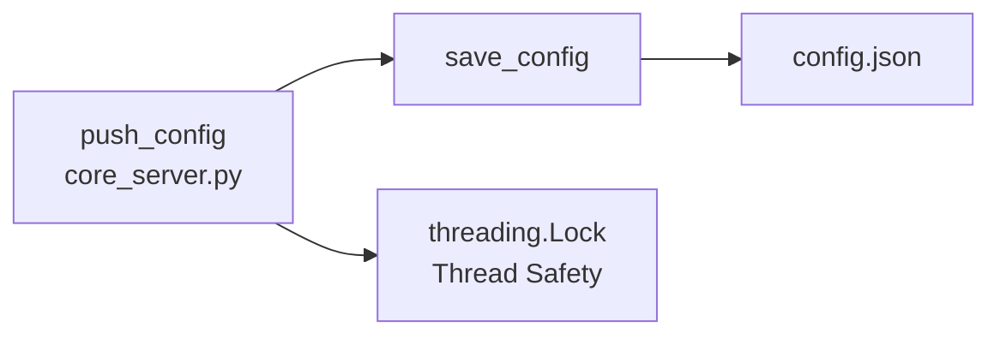

# util_config

> 📅 Last Updated: 2026/05/28

Configuration file read/write utilities for the Web module, responsible for `config.json` persistence management. No thread lock protection — thread safety is guaranteed by the upper-layer caller (`core_server.py`'s `push_config`).

## load_config

```python
def load_config(config_path: str) -> dict[str, Any]:
    """Load and validate frontend configuration from the specified path, returning a dictionary."""
```

- **File not found**: Directly raises `ConfigurationError`, does not initialize from a default template.
- After checking file existence via `os.path.exists()`, reads JSON with UTF-8 encoding.

## save_config

```python
def save_config(config: dict[str, Any], config_path: str) -> bool:
    """Save frontend configuration to a JSON file, returning whether the operation succeeded."""
```

- Writes in `w` mode, `indent=4`, `ensure_ascii=False` for readability and Chinese character support.
- No built-in thread lock; multi-concurrency safety is handled by the caller `core_server.py`'s `push_config` route.
- Catches all `Exception` and prints error info on failure, returning `False`.

## Call Relationships



| Function | Thread Safe | Exception Handling |
|----------|-------------|-------------------|
| `load_config` | N/A (read-only) | File not found → `ConfigurationError`; JSON parse failure → propagates upward |
| `save_config` | ❌ No lock, caller guarantees | Write exception → prints error and returns `False` |

## Usage Example

### Complete load_config / save_config Usage

```python
from celestialflow.web.util_config import load_config, save_config

# Assume config.json contents:
# {
#     "theme": "dark",
#     "refreshInterval": 5000,
#     "language": "zh-CN",
#     "dashboard": {
#         "left": ["mermaid"],
#         "middle": ["status"],
#         "right": ["progress"]
#     }
# }

config_path = "/path/to/web/config.json"

# --- Load Configuration ---
try:
    config = load_config(config_path)
    print(f"Loaded successfully, theme: {config.get('theme')}")
    print(f"Refresh interval: {config.get('refreshInterval')}ms")
    print(f"Language: {config.get('language')}")
    print(f"Left panel cards: {config['dashboard']['left']}")
except Exception as e:
    print(f"Configuration load failed: {e}")

# --- Modify and Save Configuration ---
config["theme"] = "light"
config["refreshInterval"] = 3000
config["language"] = "en"

success = save_config(config, config_path)
if success:
    print("Configuration saved successfully")
else:
    print("Configuration save failed")

# --- Verify Saved Result ---
reloaded = load_config(config_path)
print(f"Theme after reload: {reloaded['theme']}")  # light
print(f"Language after reload: {reloaded['language']}")  # en
```

### Usage with WebConfigModel

```python
from celestialflow.web.util_config import load_config, save_config

# The complete structure of config.json conforms to the WebConfigModel Pydantic model
# It is recommended to use the Pydantic model for validation before saving / after reading

try:
    raw_config = load_config("/path/to/config.json")

    # Validate using Pydantic model (assumed in core_server.py)
    from celestialflow.web.util_models import WebConfigModel
    validated = WebConfigModel(**raw_config)

    print(f"Validation passed: theme={validated.theme}, refresh={validated.refreshInterval}ms")

    # Modify and save
    validated.theme = "dark"
    save_config(validated.model_dump(), "/path/to/config.json")
except Exception as e:
    print(f"Configuration processing failed: {e}")
```
