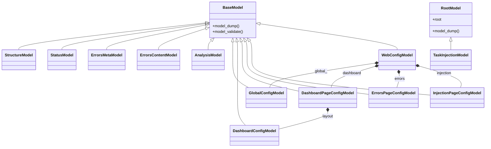

# util_models

> 📅 Last Updated: 2026/06/11

## Purpose

The `celestialflow.web.util_models` module defines all Pydantic data models used by the Web module for data validation, serialization, and API request/response type constraints.

## Model List

### StructureModel

Task structure data model, representing the structural information of a task graph.

| Field | Type | Description |
|-------|------|-------------|
| `structure` | `dict[str, Any]` | Structure snapshot dict, typically contains `nodes`, `edges`, `source_nodes` |

### StatusModel

Node status data model, representing the runtime status of each node.

| Field | Type | Description |
|-------|------|-------------|
| `timestamp` | `float` | Timestamp of the status data (Unix) |
| `status` | `dict[str, dict[str, Any]]` | Mapping from node name to status dictionary |

### ErrorsMetaModel

Error metadata model, representing meta information about error log files.

| Field | Type | Description |
|-------|------|-------------|
| `jsonl_path` | `str` | Error log JSONL file path |
| `rev` | `int` | Current revision/offset of the error log |

### ErrorsContentModel

Error content data model, containing a complete list of error records.

| Field | Type | Description |
|-------|------|-------------|
| `errors` | `list[dict[str, Any]]` | List of error records; each item is an error dictionary |
| `jsonl_path` | `str` | Error log JSONL file path |
| `rev` | `int` | Current revision/offset of the error log |

### AnalysisModel

Task analysis data model.

| Field | Type | Description |
|-------|------|-------------|
| `analysis` | `dict[str, Any]` | Analysis result dictionary |

### TaskInjectionModel

Task injection request model, used to dynamically insert new tasks into a running task graph.

> This model inherits from `RootModel[dict[str, list[Any]]]`. The request body is directly a `{node_name: [task_list]}` format dictionary, no longer containing standalone fields like `node`/`task_datas`/`timestamp`.

| Root Value Type | Description |
|-----------------|-------------|
| `dict[str, list[Any]]` | Key is the node name, value is the list of task data to inject for that node |

**Request body example:**

```json
{
  "StageA": [{"id": 1, "value": 42}, {"id": 2, "value": 99}],
  "StageB": [{"id": 3, "value": 55}]
}
```

### DashboardConfigModel

Dashboard layout configuration model, defining frontend panel card layout.

| Field | Type | Description |
|-------|------|-------------|
| `left` | `list[str]` | List of card types to display in the left panel |
| `middle` | `list[str]` | List of card types to display in the middle panel |
| `right` | `list[str]` | List of card types to display in the right panel |

### GlobalConfigModel

Global shared configuration model (nested under `WebConfigModel.global_`).

| Field | Type | Default | Description |
|-------|------|---------|-------------|
| `theme` | `str` | — | UI theme (e.g. `"light"`, `"dark"`) |
| `autoRefreshEnabled` | `bool` | `True` | Whether auto-refresh is enabled |
| `refreshInterval` | `int` | — | Page data refresh interval (ms) |
| `language` | `str` | `"zh-CN"` | Interface language |

### DashboardPageConfigModel

Dashboard page configuration model (nested under `WebConfigModel.dashboard`).

| Field | Type | Default | Description |
|-------|------|---------|-------------|
| `historyLimit` | `int` | — | Maximum history record count |
| `showStructureEdgeDelta` | `bool` | `False` | Whether to show structure diagram edge deltas |
| `useTotalPendingInStatus` | `bool` | `False` | Whether node pending count uses global estimation |
| `layout` | `DashboardConfigModel` | — | Dashboard card three-column layout definition |

### ErrorsPageConfigModel

Error page configuration model (nested under `WebConfigModel.errors`).

| Field | Type | Default | Description |
|-------|------|---------|-------------|
| `pageSize` | `int` | `10` | Records per page on the error page |
| `sortOrder` | `str` | `"newest"` | Default sort order (`"newest"` / `"oldest"`) |
| `jumpToInjectionAfterRetry` | `bool` | `True` | Whether to jump to the injection page after task retry |

### InjectionPageConfigModel

Injection page configuration model (nested under `WebConfigModel.injection`).

| Field | Type | Default | Description |
|-------|------|---------|-------------|
| `showInjectableOnly` | `bool` | `True` | Whether to show only injectable nodes |

### WebConfigModel

Web UI global configuration model (changed to a nested grouping structure).

| Field | Type | Default | Description |
|-------|------|---------|-------------|
| `global_` | `GlobalConfigModel` | — | Global shared configuration (JSON alias `"global"`) |
| `dashboard` | `DashboardPageConfigModel` | — | Dashboard page configuration |
| `errors` | `ErrorsPageConfigModel` | — | Error page configuration |
| `injection` | `InjectionPageConfigModel` | `InjectionPageConfigModel()` | Injection page configuration |

> **Changed**: `WebConfigModel` has been changed from the old flat field layout (`theme`, `refreshInterval`, `historyLimit`...) to a nested grouping structure. The original `theme`, `refreshInterval` etc. fields have been moved into `GlobalConfigModel` (alias `"global"`), `historyLimit`, `showStructureEdgeDelta` etc. into `DashboardPageConfigModel`, `errorPageSize`, `errorSortOrder` etc. into `ErrorsPageConfigModel`.

## Usage Examples

### Data Validation and Serialization

```python
from celestialflow.web.util_models import (
    WebConfigModel, GlobalConfigModel, DashboardPageConfigModel,
    DashboardConfigModel, ErrorsPageConfigModel, InjectionPageConfigModel,
    TaskInjectionModel,
)

# --- WebConfigModel usage (nested structure) ---
config = WebConfigModel(
    global=GlobalConfigModel(
        theme="dark",
        autoRefreshEnabled=True,
        refreshInterval=5000,
        language="zh-CN",
    ),
    dashboard=DashboardPageConfigModel(
        historyLimit=20,
        showStructureEdgeDelta=False,
        useTotalPendingInStatus=False,
        layout=DashboardConfigModel(
            left=["mermaid"],
            middle=["status"],
            right=["progress"],
        ),
    ),
    errors=ErrorsPageConfigModel(
        pageSize=10,
        sortOrder="newest",
        jumpToInjectionAfterRetry=True,
    ),
    injection=InjectionPageConfigModel(
        showInjectableOnly=True,
    ),
)
print(f"Theme: {config.global_.theme}")
print(f"Dashboard layout: {config.dashboard.layout.model_dump()}")

# Serialize to dict (by_alias=True converts global_ to "global")
config_dict = config.model_dump(by_alias=True)

# Create from dict
restored = WebConfigModel.model_validate(config_dict)

# --- TaskInjectionModel usage ---
injection = TaskInjectionModel(
    StageA=[{"id": 1, "value": 42}, {"id": 2, "value": 99}],
    StageB=[{"id": 3, "value": 55}],
)
print(f"Injected node count: {len(injection.root)}")
for node_name, tasks in injection.root.items():
    print(f"  {node_name}: {len(tasks)} tasks")
```

> Note: `TaskInjectionModel` is `RootModel[dict[str, list[Any]]]`, meaning the request body is directly a mapping from node names to task lists, no longer wrapping `node`/`task_datas` or similar fields.

### Error Data Handling

```python
from celestialflow.web.util_models import ErrorsContentModel, ErrorsMetaModel

# Error metadata
meta = ErrorsMetaModel(jsonl_path="./fallback/2026-05-28/errors.jsonl", rev=150)
print(f"Error log path: {meta.jsonl_path}, current offset: {meta.rev}")

# Error content
errors = ErrorsContentModel(
    errors=[
        {"error_type": "ValueError", "error_message": "Invalid input"},
        {"error_type": "TimeoutError", "error_message": "Connection lost"},
    ],
    jsonl_path="./fallback/2026-05-28/errors.jsonl",
    rev=152,
)
print(f"Error count: {len(errors.errors)}")
```

## Model Hierarchy


