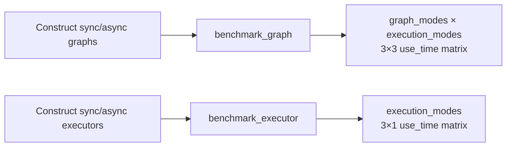

# Performance Benchmark Tests (test_benchmark.py)

> 📅 Last Updated: 2026/08/19

## Purpose

Validates the `benchmark_graph` and `benchmark_executor` benchmark functions in `celestialflow.benchmark.util_benchmark`, ensuring they output a complete execution time matrix across the `serial` / `thread` / `async` modes.

## Core Test Objects

- `benchmark_graph`: Accepts synchronous and asynchronous `TaskGraph` instances and benchmarks them across the `graph_mode × execution_mode` 3×3 combinations.
- `benchmark_executor`: Accepts synchronous and asynchronous `TaskExecutor` instances and benchmarks them across the three values of `execution_mode`.
- `TaskGraph` / `TaskStage` / `TaskExecutor`: Used to construct the minimal runnable graph and executor.

## Test Coverage Matrix

| Test Class | Case | Coverage Target |
|--------|------|----------|
| `TestBenchmarkGraph` | `test_benchmark_graph_covers_all_nine_combinations` | `benchmark_graph` returns a 3×3 graph/execution combination matrix |
| `TestBenchmarkExecutor` | `test_benchmark_executor_returns_execution_modes` | `benchmark_executor` returns a uniform `execution_modes` column order |

## Key Test Scenarios

### `test_benchmark_graph_covers_all_nine_combinations`

- Constructs a sync graph `sync_graph` (containing one `TaskStage` in serial mode) and an async graph `async_graph` (`graph_mode="async"`, containing one `TaskStage` in async mode).
- Calls `benchmark_graph` with `{"s": [1, 2, 3]}` as the initial tasks.
- Asserts:
  - The returned dictionary's `graph_modes` equals `["serial", "thread", "async"]`.
  - `execution_modes` equals `["serial", "thread", "async"]`.
  - `use_time` is a 2D list of 3 rows by 3 columns.

### `test_benchmark_executor_returns_execution_modes`

- Constructs a sync executor `sync_executor` (`execution_mode="serial"`) and an async executor `async_executor` (`execution_mode="async"`).
- Calls `benchmark_executor` with `[1, 2, 3]` as the task list.
- Asserts:
  - The returned dictionary's `execution_modes` equals `["serial", "thread", "async"]`.
  - `use_time` is a 2D list of 3 rows by 1 column (one result per `execution_mode`).



## How to Run

```bash
# Run all
pytest tests/benchmark/test_benchmark.py -v

# Run graph benchmark tests only
pytest tests/benchmark/test_benchmark.py -k "graph" -v

# Run executor benchmark tests only
pytest tests/benchmark/test_benchmark.py -k "executor" -v
```

## Important Details

- `benchmark_graph` internally expands to 9 independent execution combinations by the cartesian product of `graph_mode` × `execution_mode`, and uses `clone_graph` to copy the graph structure to avoid mutual interference.
- `benchmark_executor` only takes the cartesian product along the `execution_mode` dimension (3 execution modes), and uses `clone_executor` to copy the executor.
- Both tests are decorated as asynchronous coroutines via `pytest.mark.asyncio`, with `await` triggering the benchmark loop and waiting for completion.

## Notes

- Benchmark tests require the `celestialflow.benchmark` dependency. The actual implementations of the clone and benchmark utilities are located at `src/celestialflow/benchmark/util_clone.py` and `src/celestialflow/benchmark/util_benchmark.py` respectively.
- The tests in this file only verify the structural integrity of the returned matrix, and do not assert on specific timing values.
