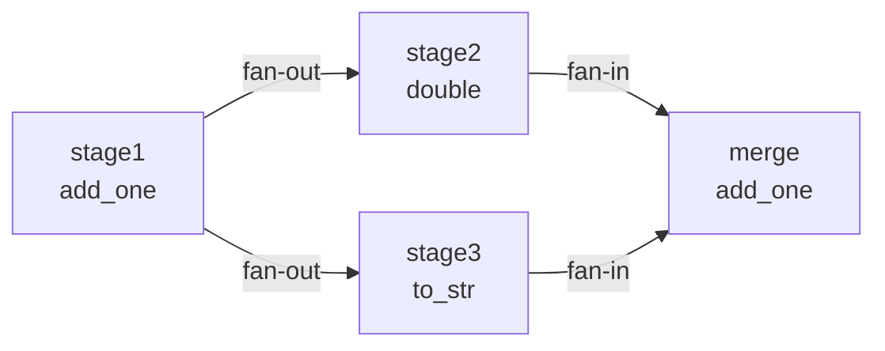

# Task Graph Core Feature Tests (test_graph.py)

> 📅 Last Updated: 2026/06/11

## Purpose
Comprehensively validates the core functionality of `TaskGraph` and its various topology subclasses (`TaskChain`, `TaskCross`, `TaskGrid`), covering synchronous/asynchronous execution, error propagation, topology analysis, execution mode matrix, source node derivation, cyclic graph behavior, finalization safety checks, and runtime snapshot collection.

## Core Test Objects
- `TaskGraph`: General-purpose task graph container
- `TaskChain`, `TaskCross`, `TaskGrid`: Predefined topology structures
- `TaskStage`: Graph node definition

## Test Scope

### Summary Table

| Test Class | Case Count | Coverage Points |
|------------|------------|-----------------|
| `TestTaskGraphBasic` | 4 | Two-node DAG, fan-out, fan-in, error propagation |
| `TestTaskGraphAsync` | 5 | Async mode two-node, fan-out, fan-in, error propagation, async+thread stage_mode |
| `TestTaskGraphStructure` | 3 | Chain, Cross, Grid structures |
| `TestTaskGraphAnalysis` | 2 | DAG detection, level computation |
| `TestTaskGraphFinalize` | 1 | Finalization thread safety check |
| `TestTaskGraphRuntimeSnapshot` | 1 | Reporter snapshot tolerance for unstarted Stages |
| `TestStageExecutionMatrix` | 6 | serial/thread stage_mode × serial/thread/async execution_mode |
| `TestTaskGraphThread` | 6 | Thread mode two-node, fan-out, fan-in, error propagation, lambda, staged dispatch |
| `TestSourceStages` | 5 | Linear graph source, fan-in source, diamond graph source, single-SCC representative, multi-SCC one-per-source |
| `TestCyclicGraph` | 2 | Cyclic graph isDAG detection, same-level within cycle + tail level |
| **Total** | **35** | |

> **Note**: The statistics here cover test classes in `test_graph.py`. Dedicated tests for `TaskLoop` and `TaskWheel` are in `test_structure.py`.

### Key Test Flows

#### Basic Topology Execution


- **Two-node DAG** (`test_graph_dag_two_nodes`): Verifies A→B data flow is correct, both nodes succeed with 3 each.
- **Fan-out** (`test_graph_fan_out`): One upstream distributes to multiple downstreams, sink_a and sink_b each succeed with 2.
- **Fan-in** (`test_graph_fan_in`): Multiple upstreams converge to one downstream, merge node receives 4 tasks.
- **Error propagation** (`test_graph_error_propagation`): Verifies `50` triggers `ValueError` without blocking the flow; downstream only receives successful tasks.

#### Async and Concurrency
- Two-node, fan-out, fan-in, and error propagation in async mode share the same semantics as sync mode.
- `test_graph_async_thread_stage_mode`: Verifies `stage_mode="thread"` + `execution_mode="async"` combination.

#### Execution Mode Matrix (`TestStageExecutionMatrix`)
Covers all **6 combinations** of `stage_mode` × `execution_mode`:

| Case | stage_mode | execution_mode |
|------|-----------|----------------|
| `test_serial_serial` | serial | serial |
| `test_serial_thread` | serial | thread |
| `test_serial_async` | serial | async |
| `test_thread_serial` | thread | serial |
| `test_thread_thread` | thread | thread |
| `test_thread_async` | thread | async |

Each case uses a two-node DAG with 5 input tasks, verifying both stages succeed with 5 each.

#### Graph Structure Analysis (`TestTaskGraphAnalysis`)
- **DAG detection** (`test_dag_detection`): The `isDAG` flag should correctly reflect whether the graph has a cycle.
- **Level computation** (`test_layer_computation`): Topological levels of a linear chain A→B→C should be {A:0, B:1, C:2}.

#### Finalization and Snapshots
- **Finalization safety check** (`TestTaskGraphFinalize`): Verifies that `_finalize_nodes()` raises `RuntimeStateError` when threads are still alive, preventing dangerous cleanup.
- **Snapshot tolerance** (`TestTaskGraphRuntimeSnapshot`): Verifies that the Reporter does not crash when collecting a snapshot from a node that hasn't started yet (no `start_time`).

#### Complex Structures (`TestTaskGraphStructure`)
| Structure | Node Count | Thread Count | Covered Scenario |
|-----------|------------|-------------|-----------------|
| Chain | 3-chain | 3 | Linear pipeline |
| Cross | 2×3 grid | 4 | Fully connected cross |
| Grid | 2×2 grid | 4 | Grid-like connections |

#### Thread Mode (`TestTaskGraphThread`)
Verifies fan-out, fan-in, error propagation, lambda function support, and staged dispatch under `stage_mode="thread"`.

#### Source Node Derivation (`TestSourceStages`)
5 cases covering the following scenarios:

| Case | Topology | Expected Result |
|------|----------|----------------|
| `test_source_stages_linear` | A→B→C | [A] |
| `test_source_stages_fan_in` | A→C, B→C | [A, B] |
| `test_source_stages_diamond` | A→{B,C}→D | [A] |
| `test_source_stages_cycle_returns_one_source_scc_member` | s1→s2→s3→s1 | 1 representative from within the cycle |
| `test_source_stages_returns_one_member_per_source_scc` | Two disjoint cycles converge to s5 | 1 representative per source SCC |

#### Cyclic Graph (`TestCyclicGraph`)
| Case | Verification Point |
|------|-------------------|
| `test_cyclic_isDAG_false` | `isDAG` for s1→s2→s3→s1 should be `False` |
| `test_cyclic_layers` | Cycle nodes (s1,s2,s3) share the same level, tail s4 is at cycle level + 1 |

### Runtime Snapshots
`get_graph_summary()` returns snapshot data from the most recent `collect_runtime_snapshot()` call. In tests without an active `TaskReporter`, it must be called manually.

## Important Details

### Termination Signal Behavior
- Cyclic graphs use `put_termination_signal=True` to ensure test exit.
- Non-DAG graphs in eager mode trigger a `RuntimeWarning`; tests use relaxed assertions (`>= 1`).

### Lambda Support
Lambda functions can be used as task functions in thread mode (`test_graph_thread_with_lambda`).

## Dependencies

| Dependency | Description |
|------------|-------------|
| `pytest` | Test framework |
| `celestialflow` | `TaskGraph`, `TaskChain`, `TaskCross`, `TaskGrid`, `TaskStage` |

## How to Run

```bash
# Run all
pytest tests/graph/test_graph.py -v

# Structure tests only (most time-consuming, includes multithreading)
pytest tests/graph/test_graph.py::TestTaskGraphStructure -v

# Analysis tests only (fastest, no task execution)
pytest tests/graph/test_graph.py::TestTaskGraphAnalysis -v
```

## Performance Reference

| Test | Duration (Windows / i5) |
|------|------------------------|
| `TestTaskGraphBasic` | ~2s |
| `TestTaskGraphAsync` | ~3s |
| `TestTaskGraphStructure` | ~5s |
| `TestTaskGraphAnalysis` | ~1s |
| `TestTaskGraphFinalize` | < 0.1s |
| `TestTaskGraphRuntimeSnapshot` | < 0.1s |
| `TestStageExecutionMatrix` | ~5s |
| `TestTaskGraphThread` | ~4s |
| `TestSourceStages` | ~2s |
| `TestCyclicGraph` | ~2s |

## Related Files

- `src/celestialflow/graph/core_graph.py`: `TaskGraph` implementation
- `src/celestialflow/graph/core_structure.py`: Graph structure subclasses
- `tests/graph/test_structure.py`: TaskLoop / TaskWheel dedicated tests
