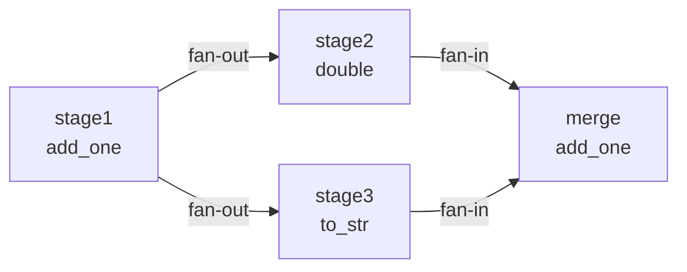

# Core TaskGraph Functionality Tests (test_graph.py)

> Last Updated: 2026/05/24

## Purpose
Comprehensively validates the core behavior of `TaskGraph` and its topology subclasses (`TaskChain`, `TaskCross`, and `TaskGrid`), covering sync and async execution, error propagation, topology analysis, the execution-mode matrix, source-stage derivation, and cyclic-graph behavior.

## Key Test Objects
- `TaskGraph`: General-purpose task graph container
- `TaskChain`, `TaskCross`, `TaskGrid`: Predefined topologies
- `StageRuntime`: Runtime state management
- `TaskStage`: Graph node definition

## Test Scope

### Summary Table

| Test Class | Cases | Coverage |
|------------|-------|----------|
| `TestTaskGraphBasic` | 4 | Two-node DAG, fan-out, fan-in, error propagation |
| `TestTaskGraphAsync` | 5 | Async two-node, fan-out, fan-in, error propagation, async + thread `stage_mode` |
| `TestTaskGraphStructure` | 3 | Chain, Cross, Grid structures |
| `TestTaskGraphAnalysis` | 2 | DAG detection, level computation |
| `TestTaskGraphSummary` | 1 | Summary statistics |
| `TestStageExecutionMatrix` | 6 | serial/thread `stage_mode` x serial/thread/async `execution_mode` |
| `TestTaskGraphThread` | 6 | Thread-mode two-node, fan-out, fan-in, error propagation, lambda, staged scheduling |
| `TestSourceStages` | 5 | Linear source, fan-in source, diamond source, one representative from a source SCC, one representative from each source SCC |
| `TestCyclicGraph` | 2 | `isDAG` detection on cyclic graphs, same-layer cycle nodes plus tail level |
| **Total** | **34** | |

> **Note**: This table counts the test classes inside `test_graph.py`. Dedicated tests for `TaskLoop` and `TaskWheel` live in `test_structure.py`.

### Key Test Flows

#### Basic Topology Execution


- **Two-node DAG** (`test_graph_dag_two_nodes`): Verifies that the A→B data flow is correct and both nodes succeed on 3 tasks.
- **Fan-out** (`test_graph_fan_out`): Verifies that one upstream stage distributes work to multiple downstream stages and both `sink_a` and `sink_b` succeed on 2 tasks.
- **Fan-in** (`test_graph_fan_in`): Verifies that multiple upstream stages converge into one downstream stage and the `merge` node receives 4 tasks.
- **Error propagation** (`test_graph_error_propagation`): Verifies that a `ValueError` triggered by `50` does not block the pipeline and downstream stages only receive successful tasks.

#### Async and Concurrency
- In async mode, the semantics of two-node, fan-out, fan-in, and error-propagation cases remain consistent with sync mode.
- `test_graph_async_thread_stage_mode`: Verifies the combination `stage_mode="thread"` + `execution_mode="async"`.

#### Execution-Mode Matrix (`TestStageExecutionMatrix`)
Covers all **6 combinations** of `stage_mode` x `execution_mode`:

| Case | stage_mode | execution_mode |
|------|------------|----------------|
| `test_serial_serial` | serial | serial |
| `test_serial_thread` | serial | thread |
| `test_serial_async` | serial | async |
| `test_thread_serial` | thread | serial |
| `test_thread_thread` | thread | thread |
| `test_thread_async` | thread | async |

Each case uses a two-node DAG with 5 input tasks and verifies that both stages each succeed on 5 tasks.

#### Graph Structure Analysis (`TestTaskGraphAnalysis`)
- **DAG detection** (`test_dag_detection`): The `isDAG` flag must correctly reflect whether the graph contains a cycle.
- **Level computation** (`test_layer_computation`): The topological levels of the linear chain A→B→C should be `{A:0, B:1, C:2}`.

#### Complex Structures (`TestTaskGraphStructure`)
| Structure | Nodes | Threads | Covered Scenario |
|-----------|-------|---------|------------------|
| Chain | 3-node chain | 3 | Linear pipeline |
| Cross | 2x3 grid | 4 | Fully connected cross-links |
| Grid | 2x2 grid | 4 | Grid-style connections |

#### Thread Mode (`TestTaskGraphThread`)
Verifies fan-out, fan-in, error propagation, lambda support, and staged scheduling under `stage_mode="thread"`.

#### Source-Stage Derivation (`TestSourceStages`)
Five cases cover the following scenarios:

| Case | Topology | Expected Result |
|------|----------|-----------------|
| `test_source_stages_linear` | A→B→C | [A] |
| `test_source_stages_fan_in` | A→C, B→C | [A, B] |
| `test_source_stages_diamond` | A→{B,C}→D | [A] |
| `test_source_stages_cycle_returns_one_source_scc_member` | s1→s2→s3→s1 | 1 representative inside the cycle |
| `test_source_stages_returns_one_member_per_source_scc` | Two disjoint cycles converge into s5 | 1 representative from each source SCC |

#### Cyclic Graphs (`TestCyclicGraph`)
| Case | Validation Point |
|------|------------------|
| `test_cyclic_isDAG_false` | `isDAG` should be `False` for s1→s2→s3→s1 |
| `test_cyclic_layers` | Nodes in the cycle (`s1`,`s2`,`s3`) share one level, and tail node `s4` is one level after the cycle |

### Summary Statistics (`TestTaskGraphSummary`)
Verifies that `collect_runtime_snapshot()` correctly counts the number of succeeded, failed, and pending tasks for each node.
**Note**: `TaskReporter` is not enabled in the unit tests, so `collect_runtime_snapshot()` must be called manually.

## Important Details

### Termination-Signal Behavior
- Cyclic graphs use `put_termination_signal=True` to ensure the test exits.
- Non-DAG graphs trigger a `RuntimeWarning` in eager mode, so the tests use relaxed assertions (`>= 1`).

### Snapshot Statistics
`get_graph_summary()` returns the data from the last `collect_runtime_snapshot()` call. In tests without `TaskReporter`, you must call it manually.

### Lambda Support
Lambda functions can be used as task functions in thread mode (`test_graph_thread_with_lambda`).

## Dependencies

| Dependency | Description |
|------------|-------------|
| `pytest` | Test framework |
| `celestialflow` | `TaskGraph`, `TaskChain`, `TaskCross`, `TaskGrid`, `TaskStage` |

## How to Run

```bash
# Run all tests
pytest tests/graph/test_graph.py -v

# Structure tests only (slowest, includes multithreading)
pytest tests/graph/test_graph.py::TestTaskGraphStructure -v

# Analysis tests only (fastest, no task execution)
pytest tests/graph/test_graph.py::TestTaskGraphAnalysis -v
```

## Performance Reference

| Test | Duration (Windows / i5) |
|------|-------------------------|
| `TestTaskGraphBasic` | ~2s |
| `TestTaskGraphAsync` | ~3s |
| `TestTaskGraphStructure` | ~5s |
| `TestTaskGraphAnalysis` | ~1s |
| `TestTaskGraphSummary` | ~1s |
| `TestStageExecutionMatrix` | ~5s |
| `TestTaskGraphThread` | ~4s |
| `TestSourceStages` | ~2s |
| `TestCyclicGraph` | ~2s |

## Related Files

- `src/celestialflow/graph/core_graph.py`: `TaskGraph` implementation
- `src/celestialflow/graph/core_structure.py`: Graph topology subclasses
- `tests/demo_structure.py`: More complex graph-structure demo, including cyclic graphs and multi-layer networks

