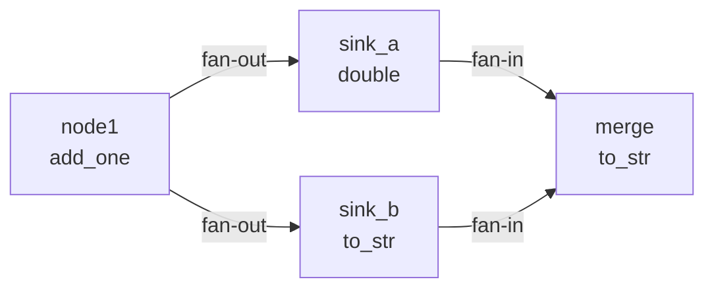

# tests/graph/test_graph.py

> 📅 Last Updated: 2026/09/24

## Purpose
Comprehensively validates the core functionality of `TaskGraph` and its various topology subclasses (`TaskChain`, `TaskCross`, `TaskGrid`), covering synchronous/asynchronous/threaded execution, error propagation, SQLite replay, runtime snapshot counts, topology analysis, the execution mode matrix, source node derivation (including SCC), and cyclic graph behavior.

## Core Test Objects
- `TaskGraph`: General-purpose task graph container
- `TaskChain`, `TaskCross`, `TaskGrid`: Predefined topology structures
- `TaskExecutor`: Graph node definition

## Test Scope

### Summary Table

| Test Class | Case Count | Coverage Points |
|--------|--------|---------|
| `TestTaskGraphBasic` | 10 | set_ctree updates existing nodes, unknown node name lookup error, two-node DAG, fan-out, fan-in, error propagation, DB replay, DB error type filtered replay, DB keeps pending records, unified exception group after finish |
| `TestTaskGraphSnapshotCounts` | 3 | fan-in upstream counts, fan-out downstream counts, snapshot derivation of `tasks_processed`/`tasks_pending` |
| `TestTaskGraphAsync` | 6 | async mode two-node, fan-out, fan-in, error propagation, async execution_mode, unified exception group after async finish |
| `TestTaskGraphStructure` | 3 | Chain, Cross, Grid structures |
| `TestTaskGraphAnalysis` | 5 | Node metadata, getters build analysis on demand, auto-rebuild cache after structure change, DAG detection, layer computation |
| `TestNodeExecutionMatrix` | 7 | serial/thread/async graph_mode × serial/thread/async execution_mode |
| `TestTaskGraphThread` | 6 | thread mode two-node, fan-out, fan-in, error propagation, lambda, linear chain dispatch |
| `TestSourceNodes` | 5 | Linear graph source, fan-in source, diamond graph source, single-source SCC representative, multi-source SCC returns one representative each |
| `TestCyclicGraph` | 3 | Cyclic graph raises in serial mode, cyclic isDAG detection, same level within cycle + tail level |
| **Total** | **48** | |

> **Note**: The statistics here cover test classes in `test_graph.py`. Dedicated tests for `TaskLoop` and `TaskWheel` are in `test_structure.py`.

### Key Test Flows

#### Basic Topology Execution

```mermaid
graph LR
    A[node1<br/>add_one] -->|fan-out| B[sink_a<br/>double]
    A -->|fan-out| C[sink_b<br/>to_str]
    B -->|fan-in| D[merge<br/>to_str]
    C -->|fan-in| D
```

- **Two-node DAG** (`test_graph_dag_two_nodes`): Verifies the A→B data flow is correct, and both nodes succeed with 3 each.
- **Fan-out** (`test_graph_fan_out`): One upstream distributes to multiple downstreams, `sink_a` and `sink_b` each succeed with 2.
- **Fan-in** (`test_graph_fan_in`): Multiple upstreams converge to one downstream, the merge node receives 4 tasks.
- **Error propagation** (`test_graph_error_propagation`): Verifies that `50` triggers a `ValueError` without blocking the flow, and downstream only receives successful tasks (node1: 2 succeeded / 1 failed, node2: 2 succeeded / 0 failed).
- **DB replay** (`test_graph_restore_db`): `restore_db` by default reads `failed` and `pending` records and replays them grouped by node name.
- **DB error type filtering** (`test_graph_restore_db_filters_error_type_when_enabled`): `restore_db(..., statuses=["failed"], filter_by_error_type=True)` filters `error_type` by each node's `retry_exceptions`.
- **DB keeps pending records** (`test_graph_restore_db_filter_keeps_pending_records`): When filtering is enabled, `pending` records continue to be replayed.
- **Unknown node name error** (`test_graph_node_lookup_unknown_node_raises`): When injecting tasks explicitly by node, a non-existent node name should raise `NodeNotFoundError`.
- **set_ctree updates existing nodes** (`test_set_ctree_updates_existing_nodes`): When `set_nodes` is called before `set_ctree`, existing nodes should also share the same event client.
- **Unified exception group after finish** (`test_start_raises_exception_group_after_finish`): Synchronous `start` raises the collected `ExceptionGroup` in a unified manner after `_finish_start`.

#### Snapshot Edge Counts (`TestTaskGraphSnapshotCounts`)
- `test_fan_in_upstream_counts`: The fan-in node's `get_snapshot()["upstream_counts"]` records the number of tasks provided by each upstream, and the `downstream_counts` of the upstream nodes correspond accordingly.
- `test_fan_out_downstream_counts`: The fan-out node's `downstream_counts` records the number sent to each downstream.
- `test_snapshot_restores_processed_and_pending`: The snapshot layer derives `tasks_processed` / `tasks_pending` / `tasks_succeeded`.

#### Async and Concurrency (`TestTaskGraphAsync`)
- Two-node, fan-out, fan-in, and error propagation in async mode share the same semantics as synchronous mode.
- `test_graph_async_execution_mode`: Verifies the `graph_mode="async"` + `execution_mode="async"` combination.
- `test_start_async_raises_exception_group_after_finish`: Asynchronous `start_async` raises a unified exception group after finish.

#### Execution Mode Matrix (`TestNodeExecutionMatrix`)
Covers all **7 combinations** of `graph_mode` × `execution_mode`:

| Case | graph_mode | execution_mode |
|------|-----------|----------------|
| `test_serial_serial` | serial | serial |
| `test_serial_thread` | serial | thread |
| `test_thread_serial` | thread | serial |
| `test_thread_thread` | thread | thread |
| `test_async_serial` | async | serial |
| `test_async_thread` | async | thread |
| `test_async_async` | async | async |

Each case uses a two-node DAG with 5 input tasks, verifying both nodes succeed with 5 each.

#### Graph Structure Analysis (`TestTaskGraphAnalysis`)
- **Node metadata** (`test_get_node_meta_covers_all_nodes`): `get_node_meta()` gives build-time metadata such as `class_name` and `execution_mode` for each node.
- **On-demand build** (`test_getters_build_analysis_on_demand`): Analysis and structure getters (`get_graph_analysis`, `get_nodes`, `get_edges`, `get_structure_list`, `get_source_nodes`) should be usable directly even when `build()` is not explicitly called.
- **Auto-rebuild cache** (`test_getters_refresh_analysis_after_connect`): After `connect`, getters should automatically rebuild the analysis cache, and source nodes and levels update accordingly.
- **DAG detection** (`test_dag_detection`): The `isDAG` flag should correctly reflect whether the graph has a cycle.
- **Layer computation** (`test_layer_computation`): Topological levels of a linear chain A→B→C are {A:0, B:1, C:2}.

#### Complex Structures (`TestTaskGraphStructure`)
| Structure | Node Count | Covered Scenario |
|------|--------|---------|
| Chain | 3-chain | Linear pipeline, each node succeeds with 2 |
| Cross | 2×3 layered fully-connected | Each layer2 node receives 1 result from each of the 2 layer1 nodes |
| Grid | 2×2 grid | The top-left root processes 2 tasks, the rest accumulate by propagation |

#### Thread Mode (`TestTaskGraphThread`)
Verifies two-node serial, fan-out, fan-in, error propagation, lambda function support, and linear chain dispatch under `graph_mode="thread"`.

#### Source Node Derivation (`TestSourceNodes`)
5 cases covering the following scenarios:

| Case | Topology | Expected Result |
|------|------|-------------|
| `test_source_nodes_linear` | A→B→C | `[A]` |
| `test_source_nodes_fan_in` | A→C, B→C | `{A, B}` |
| `test_source_nodes_diamond` | A→{B,C}→D | `[A]` |
| `test_source_nodes_cycle_returns_one_source_scc_member` | s1→s2→s3→s1 | 1 representative within the cycle |
| `test_source_nodes_returns_one_member_per_source_scc` | Two disjoint cycles converge to s5 | 1 representative per source SCC |

#### Cyclic Graph (`TestCyclicGraph`)
| Case | Verification Point |
|------|--------|
| `test_cyclic_serial_graph_raises` | Calling `get_source_nodes()` in serial graph_mode on a cyclic graph should raise `ConfigurationError` (matches `"TaskGraph contains a cycle while graph_mode='serial'"`) |
| `test_cyclic_is_dag_false` | `isDAG` for s1→s2→s3→s1 should be `False` |
| `test_cyclic_layers` | Nodes within the cycle (s1,s2,s3) share the same level, tail s4 is at cycle level + 1 |

## Important Details

### Termination Signal Behavior
- Cyclic graphs use `run()` to start and inject tasks (`run` defaults to `if_put_signal=True`, automatically emitting a termination signal for the source node) to ensure test exit.
- Calling `get_source_nodes()` in serial graph_mode on a cyclic graph triggers `ConfigurationError` (see `test_cyclic_serial_graph_raises`).

### Database Replay
- `restore_db(db_path, statuses=None, *, filter_by_error_type=False, if_put_signal=True)`: `statuses` defaults to `["failed", "pending"]`; `filter_by_error_type` is a keyword argument that, when enabled, filters `error_type` by each node's `metrics.get_retry_error_type_names()`, but `pending` records are always kept.

### Lambda Support
Lambda functions can be used as task functions in thread mode (`test_graph_thread_with_lambda`).

## Dependencies

| Dependency | Description |
|------|------|
| `pytest` | Test framework |
| `celestialflow` | `TaskGraph`, `TaskChain`, `TaskCross`, `TaskGrid`, `TaskExecutor` |
| `celestialflow.persistence.util_sqlite` | `append_records` (DB replay cases write test records) |
| `celestialflow.runtime.util_errors` | `ConfigurationError`, `NodeNotFoundError` |
| `celestialflow.runtime.util_event` | `LocalEventClient` (`set_ctree` case) |

## How to Run

```bash
# Run all
pytest tests/graph/test_graph.py -v

# Structure tests only (includes multithreading)
pytest tests/graph/test_graph.py::TestTaskGraphStructure -v

# Analysis tests only (fastest, no task execution)
pytest tests/graph/test_graph.py::TestTaskGraphAnalysis -v

# Snapshot count tests only
pytest tests/graph/test_graph.py::TestTaskGraphSnapshotCounts -v
```

## Performance Reference

| Test | Duration |
|------|------|
| `TestTaskGraphBasic` | ~2s |
| `TestTaskGraphSnapshotCounts` | < 0.5s |
| `TestTaskGraphAsync` | ~3s |
| `TestTaskGraphStructure` | ~5s |
| `TestTaskGraphAnalysis` | ~1s |
| `TestNodeExecutionMatrix` | ~5s |
| `TestTaskGraphThread` | ~4s |
| `TestSourceNodes` | ~2s |
| `TestCyclicGraph` | ~2s |

## Related Files

- `src/celestialflow/graph/core_graph.py`: `TaskGraph` implementation
- `src/celestialflow/graph/core_structure.py`: Graph structure subclasses
- `tests/graph/test_structure.py`: TaskLoop / TaskWheel dedicated tests
