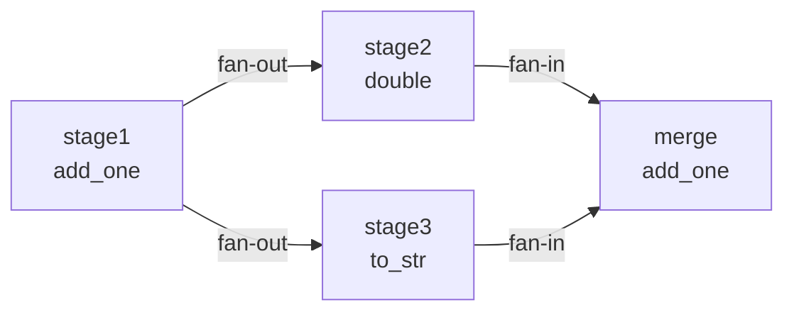

# Task Graph Core Feature Tests (test_graph.py)

> 📅 Last Updated: 2026/08/31

## Purpose
Comprehensively validates the core functionality of `TaskGraph` and its various topology subclasses (`TaskChain`, `TaskCross`, `TaskGrid`), covering synchronous/asynchronous execution, error propagation, topology analysis, execution mode matrix, source node derivation, cyclic graph behavior, finalization safety checks, and runtime snapshot collection.

## Core Test Objects
- `TaskGraph`: General-purpose task graph container
- `TaskChain`, `TaskCross`, `TaskGrid`: Predefined topology structures
- `TaskStage`: Graph node definition

## Test Scope

### Summary Table

| Test Class | Case Count | Coverage Points |
|--------|--------|---------|
| `TestTaskGraphBasic` | 10 | set_ctree updates existing stage, unknown stage name lookup error, two-node DAG, fan-out, fan-in, error propagation, DB replay, DB error type filtered replay, DB keeps pending records, unified exception group after finish |
| `TestTaskGraphAsync` | 6 | Async mode two-node, fan-out, fan-in, error propagation, async execution_mode, unified exception group after async finish |
| `TestTaskGraphStructure` | 3 | Chain, Cross, Grid structures |
| `TestTaskGraphAnalysis` | 4 | Getters build analysis on demand, auto-refresh cache after structure change, DAG detection, level computation |
| `TestTaskGraphRuntimeSnapshot` | 1 | Reporter snapshot tolerance for unstarted Stages |
| `TestStageExecutionMatrix` | 7 | serial/thread/async graph_mode × serial/thread/async execution_mode |
| `TestTaskGraphThread` | 6 | Thread mode two-node, fan-out, fan-in, error propagation, lambda, staged dispatch |
| `TestSourceStages` | 5 | Linear graph source, fan-in source, diamond graph source, single-SCC representative, multi-SCC one-per-source |
| `TestCyclicGraph` | 3 | Cyclic graph warning in serial mode, cyclic isDAG detection, same-level within cycle + tail level |
| **Total** | **45** | |

> **Note**: The statistics here cover test classes in `test_graph.py`. Dedicated tests for `TaskLoop` and `TaskWheel` are in `test_structure.py`.

### Key Test Flows

#### Basic Topology Execution

```mermaid
graph LR
    A[stage1<br/>add_one] -->|fan-out| B[stage2<br/>double]
    A -->|fan-out| C[stage3<br/>to_str]
    B -->|fan-in| D[merge<br/>add_one]
    C -->|fan-in| D
```

- **Two-node DAG** (`test_graph_dag_two_nodes`): Verifies A→B data flow is correct, both nodes succeed with 3 each.
- **Fan-out** (`test_graph_fan_out`): One upstream distributes to multiple downstreams, sink_a and sink_b each succeed with 2.
- **Fan-in** (`test_graph_fan_in`): Multiple upstreams converge to one downstream, merge node receives 4 tasks.
- **Error propagation** (`test_graph_error_propagation`): Verifies `50` triggers `ValueError` without blocking the flow; downstream only receives successful tasks.
- **DB startup** (`test_graph_restore_db`): Verifies replay of failed/pending tasks from SQLite.
- **DB startup filtering** (`test_graph_restore_db_filters_error_type_when_enabled`): Verifies replay tasks are filtered by each stage's `retry_exceptions`.
- **DB keeps pending records** (`test_graph_restore_db_filter_keeps_pending_records`): Verifies that pending records continue to be replayed when filtering is enabled.
- **Unknown stage name error** (`test_graph_stage_lookup_unknown_stage_raises`): When injecting tasks into a stage by explicit name, a non-existent stage name should raise `NodeNotFoundError`.
- **set_ctree updates existing stage** (`test_set_ctree_updates_existing_stages`): When `set_stages` is called before `set_ctree`, the existing stage should also share the same event client.
- **Unified exception group after finish** (`test_start_raises_exception_group_after_finish`): Synchronous `start` raises collected exceptions in a unified manner after finish.

#### Async and Concurrency
- Two-node, fan-out, fan-in, and error propagation in async mode share the same semantics as sync mode.
- `test_graph_async_execution_mode`: Verifies the `graph_mode="async"` + `execution_mode="async"` combination.
- `test_start_async_raises_exception_group_after_finish`: Asynchronous `start_async` raises a unified exception group after finish.

#### Execution Mode Matrix (`TestStageExecutionMatrix`)
Covers all **7 combinations** of `graph_mode` × `execution_mode`:

| Case | graph_mode | execution_mode |
|------|-----------|----------------|
| `test_serial_serial` | serial | serial |
| `test_serial_thread` | serial | thread |
| `test_thread_serial` | thread | serial |
| `test_thread_thread` | thread | thread |
| `test_async_serial` | async | serial |
| `test_async_thread` | async | thread |
| `test_async_async` | async | async |

Each case uses a two-node DAG with 5 input tasks, verifying both stages succeed with 5 each.

#### Graph Structure Analysis (`TestTaskGraphAnalysis`)
- **On-demand build** (`test_getters_build_analysis_on_demand`): Analysis and structure getters should be usable directly even when `build()` is not explicitly called.
- **Auto-refresh cache** (`test_getters_refresh_analysis_after_connect`): Getters should automatically rebuild the analysis cache after structure changes.
- **DAG detection** (`test_dag_detection`): The `isDAG` flag should correctly reflect whether the graph has a cycle.
- **Level computation** (`test_layer_computation`): Topological levels of a linear chain A→B→C should be {A:0, B:1, C:2}.

#### Finalization and Snapshots
- **Finalization exception group** (`test_start_raises_exception_group_after_finish`): Synchronous `start` raises a unified ExceptionGroup after finish.
- **Snapshot tolerance** (`TestTaskGraphRuntimeSnapshot`): Verifies that the Reporter does not crash when collecting a snapshot from a node that hasn't started yet (no `start_time`).

#### Complex Structures (`TestTaskGraphStructure`)
| Structure | Node Count | Thread Count | Covered Scenario |
|------|--------|--------|---------|
| Chain | 3-chain | 3 | Linear pipeline |
| Cross | 2×3 grid | 4 | Fully connected cross |
| Grid | 2×2 grid | 4 | Grid-like connections |

#### Thread Mode (`TestTaskGraphThread`)
Verifies fan-out, fan-in, error propagation, lambda function support, and staged dispatch under `graph_mode="thread"`.

#### Source Node Derivation (`TestSourceStages`)
5 cases covering the following scenarios:

| Case | Topology | Expected Result |
|------|------|-------------|
| `test_source_stages_linear` | A→B→C | [A] |
| `test_source_stages_fan_in` | A→C, B→C | [A, B] |
| `test_source_stages_diamond` | A→{B,C}→D | [A] |
| `test_source_stages_cycle_returns_one_source_scc_member` | s1→s2→s3→s1 | 1 representative from within the cycle |
| `test_source_stages_returns_one_member_per_source_scc` | Two disjoint cycles converge to s5 | 1 representative per source SCC |

#### Cyclic Graph (`TestCyclicGraph`)
| Case | Verification Point |
|------|--------|
| `test_cyclic_serial_graph_raises` | Calling `get_source_names()` in serial graph_mode on a cyclic graph should raise `ConfigurationError` (matches `"TaskGraph contains a cycle while graph_mode='serial'"`) |
| `test_cyclic_is_dag_false` | `isDAG` for s1→s2→s3→s1 should be `False` |
| `test_cyclic_layers` | Cycle nodes (s1,s2,s3) share the same level, tail s4 is at cycle level + 1 |

### Runtime Snapshots
The snapshot data written by `collect_runtime_snapshot()` is stored in `TaskGraph.status_dict` and can be read by components such as the Reporter.

## Important Details

### Termination Signal Behavior
- Cyclic graphs use `run()` to start and inject tasks (`run` defaults to `if_put_signal=True`, automatically emitting a termination signal for the source node) to ensure test exit.
- Calling `get_source_names()` in serial graph_mode on a cyclic graph triggers `ConfigurationError` (see `test_cyclic_serial_graph_raises`).

### Lambda Support
Lambda functions can be used as task functions in thread mode (`test_graph_thread_with_lambda`).

## Dependencies

| Dependency | Description |
|------|------|
| `pytest` | Test framework |
| `celestialflow` | `TaskGraph`, `TaskChain`, `TaskCross`, `TaskGrid`, `TaskStage` |

## How to Run

```bash
# Run all
pytest tests/graph/test_graph.py -v

# Structure tests only (most time-consuming, includes multithreading)
pytest tests/graph/test_graph.py::TestTaskGraphStructure -v

# Analysis tests only (fastest, no task execution)
pytest tests/graph/test_graph.py::TestTaskGraphAnalysis -v
```

## Performance Reference

| Test | Duration (Windows / i5) |
|------|---------------------|
| `TestTaskGraphBasic` | ~2s |
| `TestTaskGraphAsync` | ~3s |
| `TestTaskGraphStructure` | ~5s |
| `TestTaskGraphAnalysis` | ~1s |
| `TestTaskGraphRuntimeSnapshot` | < 0.1s |
| `TestStageExecutionMatrix` | ~5s |
| `TestTaskGraphThread` | ~4s |
| `TestSourceStages` | ~2s |
| `TestCyclicGraph` | ~2s |

## Related Files

- `src/celestialflow/graph/core_graph.py`: `TaskGraph` implementation
- `src/celestialflow/graph/core_structure.py`: Graph structure subclasses
- `tests/graph/test_structure.py`: TaskLoop / TaskWheel dedicated tests
