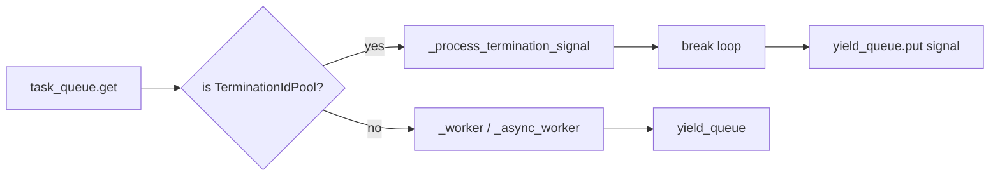

# tests/node/test_dispatch.py

> 📅 Last Updated: 2026/09/24

## Purpose

Verifies the core behavior of `celestialflow.node.core_dispatch.TaskDispatch` across the three scheduling modes `serial` / `thread` / `async`: normal task execution, exception retry (success / exhaustion), termination signal merge exit, and fallback logic when the fail / retry handling chain itself crashes.

## Core Test Objects

| Class / Function | Role | Description |
|-----------|------|-------------|
| `TaskDispatch` | Class under test | Task dispatcher, pulls `TaskEnvelope` / `TerminationIdPool` from `task_queue`, executes them by mode, and writes the termination signal back to `yield_queue` |
| `TaskExecutor` | Host | Constructs the minimal runnable executor used as the dispatch host |
| `_CtreeStub` / `_SequentialCtreeStub` | Mock | Replaces `ctree_client.emit` with an incrementing integer to avoid conflicts with the sqlite unique constraint |
| `get_log_spout()` / `get_lifecycle_spout()` | Global handles | `stop()`-ed before and after each case in the `autouse` fixture `_cleanup_global_spouts` to avoid background thread and persistence state cross-contamination |
| `_RecordingLogInlet` / `_CrashRetryLogInlet` | Mock LogInlet | Records `worker_crash` or makes `task_retry` raise, to trigger handling-chain crash fallback |
| `_CrashOnFailObserver` | Mock Observer | Raises inside `on_task_fail` to verify the `observer_error` fallback |
| `_make_executor` / `_put` / `_put_termination` / `_collect_results` / `_run_dispatch` | Utility functions | Construct the executor, inject tasks / termination signals, collect results, and run the dispatcher by mode |

## Key Test Scenarios

### `TestDispatchSerial` — Serial Dispatch

| Case | Coverage Goal |
|------|----------|
| `test_single_task` | Serial mode processes a single task, result is 9 |
| `test_multiple_tasks` | Serial mode processes 5 tasks, result count + termination signal = 6 |
| `test_retry_then_succeed` | The first 2 calls raise `ValueError`, the 3rd succeeds; final `func.calls == 3` |
| `test_retry_exhausted` | When errors persist continuously, only the termination signal is output |
| `test_termination_single_id` | A single termination ID is correctly passed to the result queue |
| `test_termination_multi_id` | Multiple termination IDs are merged into 1 termination signal output |
| `test_success_fanout_creates_distinct_downstream_ids` | On success fanout, each real downstream node is given an independent `TaskEnvelope.get_id()`, and the persisted `get_success_pairs()` can read the results back |

### `TestDispatchThread` — Thread Dispatch

| Case | Coverage Goal |
|------|----------|
| `test_basic_parallel` | 10 tasks, 4 threads in parallel, result count = 10 |

### `TestDispatchAsync` — Async Dispatch

| Case | Coverage Goal |
|------|----------|
| `test_basic_async` | 10 tasks, 4 coroutines concurrently, result count = 10 |
| `test_async_retry_then_succeed` | Async retry: the first 2 calls raise, the 3rd succeeds, `func.calls == 3` |

### `TestWorkerCrashKeepsTerminationSignal` — Worker Crash Fallback (parameterized over three modes)

| Case | Coverage Goal |
|------|----------|
| `test_fail_handler_crash_keeps_termination` | The observer's failure callback raises `RuntimeError`, caught by the `observer_error` fallback, `worker_crash` is **not** triggered, and the termination signal is emitted as usual |
| `test_retry_handler_crash_keeps_termination` | When `LogInlet.task_retry` raises, scheduling is not interrupted, the termination signal is emitted as usual, and `worker_crash` records the exception |

### `TestDispatchCoreBehavior` — Cross-Mode Parameterized

| Case | Coverage Goal |
|------|----------|
| `test_empty_queue_with_termination` | All three modes exit correctly with empty queue + termination signal |
| `test_result_count` | The result count for 5 tasks is 5 in all three modes (excluding the termination signal) |

## Key Data Flow



## Test Coverage Matrix

| Test Class | Case Count | Coverage Goals |
|--------|--------|---------|
| `TestDispatchSerial` | 7 | Single/multi task, retry success, retry exhaustion, single/multi ID termination signal, success fanout with independent downstream IDs |
| `TestDispatchThread` | 1 | 10-task concurrency |
| `TestDispatchAsync` | 2 | 10-task concurrency, async retry success |
| `TestWorkerCrashKeepsTerminationSignal` | 2 | Failure handling chain crash, retry log crash (parameterized over 3 modes → 6 cases) |
| `TestDispatchCoreBehavior` | 2 | Empty queue exit, 5-task result count (parameterized over 3 modes → 6 cases) |
| **Total** | **14** (22 after parameter expansion) | |

## How to Run

```bash
# Run all
pytest tests/node/test_dispatch.py -v

# Serial dispatch tests only
pytest tests/node/test_dispatch.py -k "Serial" -v

# Thread dispatch tests only
pytest tests/node/test_dispatch.py -k "Thread" -v

# Async dispatch tests only
pytest tests/node/test_dispatch.py -k "Async" -v

# Worker crash fallback tests only
pytest tests/node/test_dispatch.py -k "Crash" -v

# Cross-mode parameterized tests only
pytest tests/node/test_dispatch.py -k "CoreBehavior" -v
```

## Performance Reference

| Test Class | Duration |
|------------|----------|
| `TestDispatchSerial` | < 0.5s |
| `TestDispatchThread` | < 0.5s |
| `TestDispatchAsync` | < 0.5s |
| `TestWorkerCrashKeepsTerminationSignal` | < 1.0s (6 cases = 2 scenarios × 3 modes) |
| `TestDispatchCoreBehavior` | < 1.0s (6 cases = 2 scenarios × 3 modes) |

## Notes

- Each case has an `autouse` fixture `_cleanup_global_spouts` that ensures `LogSpout` / `LifecycleSpout` are `stop()`-ed once before and after the case, avoiding background thread leaks or persistence state cross-contamination.
- `_CtreeStub` starts with a default ID of 42, avoiding conflicts with the sqlite unique constraint; `test_success_fanout_creates_distinct_downstream_ids` additionally uses `_SequentialCtreeStub` (starting at 100) to distinguish each downstream's ID.
- Test fixtures are injected through the public API (`task_queue.put` / `yield_queue.add_queue`), avoiding direct modification of `executor` internal state; `metrics.set_downstream_counter` is bound in pairs with `yield_queue.add_queue`, simulating the behavior of `connect_to`.
- `_RecordingLogInlet`'s `_log` is a no-op, avoiding dependency on the real spout queue.
- When using `monkeypatch.setattr` to replace `get_log_inlet`, you must cover both `celestialflow.node.core_node` and `celestialflow.node.core_dispatch` because both call it.
- The related implementation is at `src/celestialflow/node/core_dispatch.py` and `src/celestialflow/node/core_node.py`.
