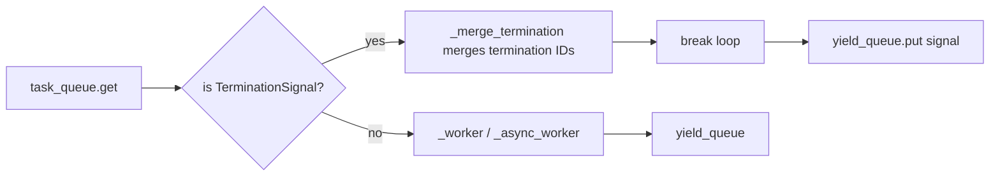

# tests/node/test_dispatch.py

> 📅 Last Updated: 2026/10/09

## Purpose

Verifies the core behavior of `celestialflow.node.core_dispatch.TaskDispatch` across the three scheduling modes `serial` / `thread` / `async`: normal task execution, exception retry (success / exhaustion), termination signal merge exit, and fallback logic when the fail / retry handling chain itself crashes, where it is isolated by the observer hub and the termination signal is still emitted as usual.

## Core Test Objects

| Class / Function | Role | Description |
|-----------|------|------|
| `TaskDispatch` | Class under test | Task dispatcher, pulls `TaskEnvelope` / `TerminationSignal` from `task_queue`, executes them by mode, and writes the termination signal back to `yield_queue` |
| `TaskExecutor` | Host | Constructs the minimal runnable executor used as the dispatch host |
| `_CtreeStub` / `_SequentialCtreeStub` | Mock | Replaces `ctree_client.emit` with an incrementing integer to avoid conflicts with the sqlite unique constraint |
| `MetricsObserver` | Metric observer | Registered by `_make_executor` via `e.observers.add_observer(...)`, metrics update with events; tests read them via `metrics_of(executor)` |
| `_CrashOnFailObserver` | Mock Observer | Raises inside `on_task_fail` to verify the observer hub's exception isolation |
| `_CrashOnRetryObserver` | Mock Observer | Raises inside `on_task_retry` to verify the retry-handling-chain crash fallback |
| `_RecordingCrashObserver` | Mock Observer | Records `on_worker_crash` events, used to assert that the crash does not surface to the worker layer |
| `_make_executor` / `_put` / `_put_termination` / `_collect_results` / `_run_dispatch` | Utility functions | Construct the executor, inject tasks / termination signals, collect results, and run the dispatcher by mode |

Key composition of `_make_executor`:
- `TaskExecutor(name, func, max_retries=...)` + `set_retry_exceptions(ValueError)`
- `e.ctree_client = _CtreeStub()`
- Registers a single-node `MetricsObserver` (simulating the `node.run` path)
- Registers a result collection queue via the public API `e.yield_queue.add_queue("test_collector", collector)`, traced back through the `_RESULT_COLLECTORS[e]` weak-reference mapping

## Key Test Scenarios

### `TestDispatchSerial` — Serial Dispatch

| Case | Coverage Goal |
|------|---------|
| `test_single_task` | Serial mode processes a single task, `get_task() == 9` |
| `test_multiple_tasks` | Serial mode processes 5 tasks, result count + termination signal = 6 |
| `test_retry_then_succeed` | The first 2 calls raise `ValueError`, the 3rd succeeds; final `func.calls == 3` |
| `test_retry_exhausted` | When errors persist continuously, only the termination signal is output |
| `test_termination_single_id` | A single termination ID is correctly passed to the result queue |
| `test_termination_multi_id` | Multiple termination IDs are merged into 1 termination signal output |
| `test_success_fanout_creates_distinct_downstream_ids` | On success fanout, each real downstream is given an independent `TaskEnvelope.get_id()`, and after persistence via `LifecycleSpout`, `get_success_pairs()` can read the results back |

### `TestDispatchThread` — Thread Dispatch

| Case | Coverage Goal |
|------|---------|
| `test_basic_parallel` | 10 tasks, 4 threads in parallel, result count = 10 |

### `TestDispatchAsync` — Async Dispatch

| Case | Coverage Goal |
|------|---------|
| `test_basic_async` | 10 tasks, 4 coroutines concurrently, result count = 10 |
| `test_async_retry_then_succeed` | Async retry: the first 2 calls raise, the 3rd succeeds, `func.calls == 3` |

### `TestWorkerCrashKeepsTerminationSignal` — Worker Crash Fallback (parameterized over three modes)

| Case | Coverage Goal |
|------|---------|
| `test_fail_handler_crash_keeps_termination` | Raises `RuntimeError` inside the `on_task_fail` observer callback; isolated by the observer hub, it does **not** trigger `on_worker_crash`, the termination signal is emitted as usual, and the fail count `== 1` |
| `test_retry_handler_crash_keeps_termination` | When an exception is raised inside the `on_task_retry` observer callback, scheduling is not interrupted, the termination signal is emitted as usual, `on_worker_crash` is not triggered, and it is ultimately counted as one failure |

### `TestDispatchCoreBehavior` — Cross-Mode Parameterized

| Case | Coverage Goal |
|------|---------|
| `test_empty_queue_with_termination` | All three modes exit correctly with empty queue + termination signal |
| `test_result_count` | The result count for 5 tasks is 5 in all three modes (excluding the termination signal) |

## Key Data Flow


```mermaid
flowchart LR
    In[task_queue.get] --> Sig{is TerminationSignal?}
    Sig -- yes --> Merge[_merge_termination merges termination IDs]
    Merge --> Break[break loop]
    Sig -- no --> Worker[_worker / _async_worker]
    Worker --> Out[yield_queue]
    Break --> Put[yield_queue.put signal]
```

## Test Coverage Matrix

| Test Class | Case Count | Coverage Goals |
|--------|--------|---------|
| `TestDispatchSerial` | 7 | Single/multi task, retry success, retry exhaustion, single/multi ID termination signal, success fanout with independent downstream IDs |
| `TestDispatchThread` | 1 | 10-task concurrency |
| `TestDispatchAsync` | 2 | 10-task concurrency, async retry success |
| `TestWorkerCrashKeepsTerminationSignal` | 2 | Failure handling chain crash, retry handling chain crash (parameterized over 3 modes → 6 cases) |
| `TestDispatchCoreBehavior` | 2 | Empty queue exit, 5-task result count (parameterized over 3 modes → 6 cases) |
| **Total** | **14** (22 after parameter expansion) | |

## How to Run

```bash
# Run all
pytest tests/node/test_dispatch.py -v

# Serial dispatch tests only
pytest tests/node/test_dispatch.py -k "Serial" -v

# Thread dispatch tests only
pytest tests/node/test_dispatch.py -k "Thread" -v

# Async dispatch tests only
pytest tests/node/test_dispatch.py -k "Async" -v

# Worker crash fallback tests only
pytest tests/node/test_dispatch.py -k "Crash" -v

# Cross-mode parameterized tests only
pytest tests/node/test_dispatch.py -k "CoreBehavior" -v
```

## Performance Reference

| Test Class | Duration |
|------------|----------|
| `TestDispatchSerial` | < 0.5s |
| `TestDispatchThread` | < 0.5s |
| `TestDispatchAsync` | < 0.5s |
| `TestWorkerCrashKeepsTerminationSignal` | < 1.0s (6 cases = 2 scenarios × 3 modes) |
| `TestDispatchCoreBehavior` | < 1.0s (6 cases = 2 scenarios × 3 modes) |

## Notes

- The termination signal is injected via the public API `executor.task_queue.put(TerminationSignal(_id=..., source="input"))`, and is naturally merged by the dispatcher's `_merge_termination()` before exiting the loop, without directly manipulating the internal termination ID pool.
- `_CtreeStub` starts with a default ID of 42, avoiding conflicts with the sqlite unique constraint; `test_success_fanout_creates_distinct_downstream_ids` additionally uses `_SequentialCtreeStub` (starting at 100) to distinguish each downstream's ID.
- `test_success_fanout_creates_distinct_downstream_ids` drives dispatch directly (bypassing `node.run`), so it manually assembles `LifecycleSpout` / `LifecycleInlet` and registers them on the executor to simulate the persistence regression.
- Test fixtures are injected through the public API (`task_queue.put` / `yield_queue.add_queue`), avoiding modification of `executor` internal state; result collection queues are traced back via a weak-reference dictionary.
- Exceptions raised by the fail / retry observers are isolated at the observer hub layer, verifying that `_RecordingCrashObserver`'s `on_worker_crash` is not triggered, i.e., errors do not leak into the worker thread.
- The related implementation is at `src/celestialflow/node/core_dispatch.py` and `src/celestialflow/node/core_node.py`.