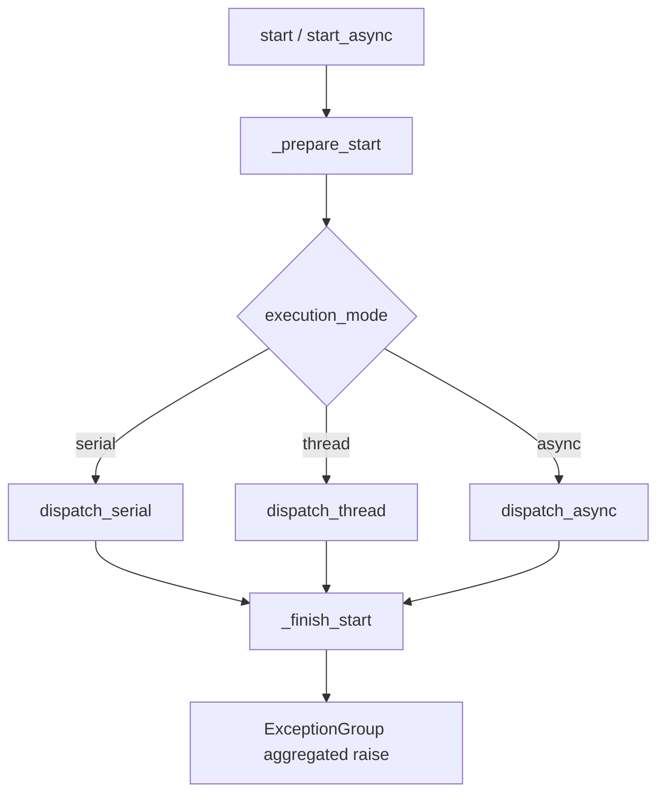

# tests/node/test_node.py

> 📅 Last Updated: 2026/10/09

## Purpose

Validates the general configuration, binding, and startup exception aggregation behavior provided by `celestialflow.node.core_node.BaseTaskNode` (covered indirectly through the public subclass `TaskExecutor`), including node unique identity, execution mode validation, retryable exception configuration, `get_meta()` build-time field separation, and the queue bindings established by `connect_to` remaining stable after switching execution mode.

## Core Test Objects

| Class / Function | Role | Description |
|-----------|------|------|
| `add_one(x)` | Test callback | Synchronous add-one function |
| `async_add_one(x)` | Test callback | Asynchronous add-one coroutine function |
| `TestBaseTaskNodeConfig` | Test class | Covers name, execution mode, retryable exceptions, metadata, and downstream binding not lost when switching mode |
| `TestBaseTaskNodeStartErrors` | Test class | Covers `start` / `start_async` exception aggregation behavior |

## Key Test Scenarios

### `TestBaseTaskNodeConfig` — Configuration and Binding

| Case | Coverage Goal |
|------|---------|
| `test_node_name_identity` | Node name comes directly from the constructor argument `name` |
| `test_node_name_changes_with_name` | After modifying the name with `set_name(...)`, `get_name()` updates synchronously |
| `test_valid_execution_mode_serial` | Supports `execution_mode="serial"` |
| `test_valid_execution_mode_thread` | Supports `execution_mode="thread"` |
| `test_valid_execution_mode_async` | Supports `execution_mode="async"` (using `async_add_one`) |
| `test_invalid_execution_mode` | An illegal mode should raise `InvalidOptionError` |
| `test_default_retry_exceptions_empty` | Retryable exceptions are empty by default (`retry_exceptions == ()`, `get_retry_error_type_names() == set()`) |
| `test_set_retry_exceptions_is_additive` | `set_retry_exceptions(...)` accumulates exception types and maps them to a set of type names |
| `test_get_meta_reports_build_time_fields` | `get_meta()` returns only `class_name` / `execution_mode` / `max_workers` |
| `test_connect_to_binding_survives_execution_mode_switch` | The downstream / upstream queue bindings established by `connect_to` remain stable after `set_execution_mode("thread")` |

### `TestBaseTaskNodeStartErrors` — Startup Exception Aggregation

| Case | Coverage Goal |
|------|---------|
| `test_start_raises_exception_group_after_finish` | Use `monkeypatch` to make `_prepare_start` raise `ValueError("prepare failed")` and `_finish_start` return `[RuntimeError("finish failed")]`; the synchronous `start()` ultimately raises an `ExceptionGroup`, with the two exceptions ordered "prepare → finish" |
| `test_start_async_raises_exception_group_after_finish` | The asynchronous version similarly aggregates the prepare exception and finish exception into an `ExceptionGroup` |

## Key Data Flow


```mermaid
flowchart TB
    Start[start / start_async]
    Prep[_prepare_start]
    Mode{execution_mode}
    Serial[dispatch_serial]
    Thread[dispatch_thread]
    Async[dispatch_async]
    Finish[_finish_start]
    Agg[ExceptionGroup aggregated raise]

    Start --> Prep
    Prep --> Mode
    Mode -- serial --> Serial
    Mode -- thread --> Thread
    Mode -- async --> Async
    Serial --> Finish
    Thread --> Finish
    Async --> Finish
    Finish --> Agg
```

## Test Coverage Matrix

| Test Class | Case Count | Coverage Goals |
|--------|--------|---------|
| `TestBaseTaskNodeConfig` | 10 | Name identity and modification, three valid execution modes, invalid mode error, retryable exception default and accumulation, metadata field separation, switching mode does not break downstream binding |
| `TestBaseTaskNodeStartErrors` | 2 | Synchronous / asynchronous `start*` exception aggregation |
| **Total** | **12** | |

## How to Run

```bash
# Run all
pytest tests/node/test_node.py -v

# Configuration-only cases
pytest tests/node/test_node.py -k "Config" -v

# Startup exception aggregation cases only
pytest tests/node/test_node.py -k "StartErrors" -v

# Execution mode related cases only
pytest tests/node/test_node.py -k "execution_mode" -v
```

## Performance Reference

| Test Class | Duration |
|--------|------|
| `TestBaseTaskNodeConfig` | < 0.5s |
| `TestBaseTaskNodeStartErrors` | < 0.5s |

## Notes

- `test_connect_to_binding_survives_execution_mode_switch` is a regression test: the downstream queue pool `yield_queue` and upstream input sources `source_names` established by `connect_to` remain stable after switching execution mode; the binding is not lost when the dispatcher is rebuilt.
- `get_meta()` only returns build-time metadata (`class_name` / `execution_mode` / `max_workers`), which is reported once with the graph structure.
- `TestBaseTaskNodeStartErrors` uses `monkeypatch.setattr` to replace two **internal hooks**, `_prepare_start` and `_finish_start`, verifying that exceptions are aggregated into an `ExceptionGroup` on both synchronous and asynchronous startup.
- `ExceptionGroup` is only available in Python 3.11+; this repository is based on Python 3.14 which satisfies the requirement.
- The related implementation is at `src/celestialflow/node/core_node.py`.