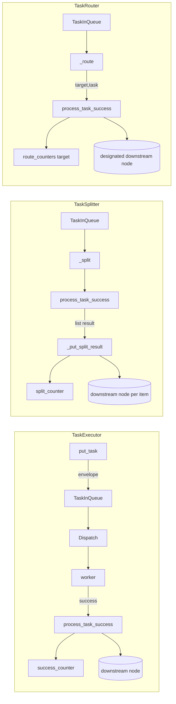

# Concrete Node Class Tests (test_nodes.py)

> 📅 Last Updated: 2026/09/10

## Purpose

Validates the execution, splitting, and routing behavior of the three concrete node classes `TaskExecutor` / `TaskSplitter` / `TaskRouter` in `celestialflow.node.core_nodes`, covering the `serial` / `thread` / `async` execution modes, the Web-compatible semantic of the duplicate check default value, replay from sqlite persistence, node initialization constraints, and the stable lock for routing counters.

## Core Test Objects

| Class / Function | Role | Description |
|-----------|------|-------------|
| `TaskExecutor` | Class under test | General executor, validates `serial` / `thread` / `async`, exception handling, retry, duplicate, restore_db |
| `TaskSplitter` | Class under test | 1→N splitter, validates `split_counter`, empty iterable, generator, custom `split_item` |
| `TaskRouter` | Class under test | Router, validates `route_counters`, unknown target raises `InvalidOptionError`, stable lock |
| `append_records` | Utility | Writes failure / pending records directly via `celestialflow.persistence.util_sqlite` for replay tests |
| `build_result_dict` | Utility | Aggregates `get_success_pairs` and `get_error_pairs` into `{task: result_or_error_str}` |

## Key Test Scenarios

### `TestTaskExecutor` — Executor (17 cases)

| Case | Coverage Goal |
|------|---------|
| `test_serial_basic` | Serial execution of 5 tasks, succeeded=5, failed=0, pending=0 |
| `test_serial_with_errors` | Serial execution of `[1,-1,2,-2,3]`, `PersistedError.error_type == "ValueError"`, succeeded=3 / failed=2 |
| `test_serial_retry` | Registers `RuntimeError` as retryable; first 2 calls raise, the 3rd returns `x+100`, `call_count == 3` |
| `test_serial_no_retry_for_unmatched_exception` | Unregistered retryable exceptions do not trigger retry, going directly to failed |
| `test_thread_basic` | Thread mode (4 workers) successfully processes 5 tasks |
| `test_async_basic` | Async mode successfully processes 3 tasks |
| `test_async_double` | Async mode continuously processes 20 tasks |
| `test_duplicate_check_disabled_by_default` | **Regression**: `enable_duplicate_check` defaults to `False`, duplicate tasks are not counted |
| `test_duplicate_check_enabled` | When explicitly enabled, succeeded=3 / duplicated=3 |
| `test_duplicate_check_disabled` | When explicitly disabled, succeeded=6 / duplicated=0 |
| `test_restore_db` | By default only reads failed / pending with `stage == self.get_name()` for this node, replays 3 successes |
| `test_restore_db_filters_error_type_when_enabled` | When `filter_by_error_type=True` and `set_retry_exceptions(RuntimeError)` is set, only `RuntimeError` is replayed |
| `test_restore_db_filter_keeps_pending_records` | When filtering is enabled, `pending` records are always kept |
| `test_success_persist` | Successful results are written to the `LifecycleSpout` cache, `get_success_pairs()` can read them back |
| `test_rejects_zero_argument_func` | 0-arg function should raise `ConfigurationError` |
| `test_rejects_multi_argument_func` | Multi-arg function should raise `ConfigurationError` |
| `test_name_and_execution_mode` | `get_name()` and `execution_mode` are exposed correctly |

### `TestTaskSplitter` — Splitter (5 cases)

| Case | Coverage Goal |
|------|---------|
| `test_splitter_init` | Default `execution_mode="serial"`, `max_retries=0`, `split_counter.get() == 0` |
| `test_splitter_process_success` | After `TaskGraph` cascade, downstream `tasks_succeeded == 3`, `split_counter == 3` |
| `test_splitter_allows_empty_iterable` | Empty iterable does not raise, downstream succeeded=0, split_counter=0 |
| `test_splitter_supports_generator_input` | A one-shot generator can still be fully split (split_counter=3) |
| `test_splitter_allows_constructor_split_item` | Constructor arg `split_item=lambda item: item.strip()`, `_split([" a ", " b ", " c "]) == ("a", "b", "c")` |

### `TestTaskRouter` — Router (4 cases)

| Case | Coverage Goal |
|------|---------|
| `test_router_init` | Default `serial` / `max_retries=0` / `route_counters == {}` |
| `test_router_route_logic` | `_route` returns `(target, task)`; unregistered target raises `InvalidOptionError` |
| `test_router_process_success` | In `TaskGraph`, two downstream `target1` / `target2` each receive 1, `route_counters` each = 1 |
| `test_router_binding_counter_uses_stable_metrics_lock` | The route counter binds to `metrics.lock` from creation; the lock object is unchanged after switching `execution_mode` |

## Key Data Flow



## Test Coverage Matrix

| Test Class | Case Count | Coverage Goals |
|--------|--------|---------|
| `TestTaskExecutor` | 17 | Three execution modes, retry hit/miss, duplicate default value, sqlite replay (including filtering by error_type), persistence, callback signature validation |
| `TestTaskSplitter` | 5 | Default parameters, graph integration, empty iterable, generator, custom `split_item` |
| `TestTaskRouter` | 4 | Default parameters, `_route` rejects unknown target, graph integration, stable lock |
| **Total** | **26** | |

## How to Run

```bash
# Run all
pytest tests/node/test_nodes.py -v

# TaskExecutor tests only
pytest tests/node/test_nodes.py -k "TaskExecutor" -v

# TaskSplitter tests only
pytest tests/node/test_nodes.py -k "TaskSplitter" -v

# TaskRouter tests only
pytest tests/node/test_nodes.py -k "TaskRouter" -v

# Duplicate check related cases only
pytest tests/node/test_nodes.py -k "duplicate" -v

# sqlite replay cases only
pytest tests/node/test_nodes.py -k "restore_db" -v
```

## Performance Reference

| Test Class | Duration |
|--------|------|
| `TestTaskExecutor` | < 2.0s (includes sqlite persistence and replay) |
| `TestTaskSplitter` | < 1.0s |
| `TestTaskRouter` | < 1.0s |

## Notes

- `test_duplicate_check_disabled_by_default` is a regression test ensuring that `enable_duplicate_check` defaults to `False`, which reduces hashing overhead and supports the Web-side retry semantics.
- The `test_restore_db*` cases use `append_records` to write directly to sqlite, validating the replay logic of `load_tasks_grouped_by_stage`; the `stage` field in the records is the node name (consistent with `set_nodes` in `TaskGraph`).
- `test_router_binding_counter_uses_stable_metrics_lock` is a regression test covering a previous issue where `route_counters` lost the lock reference due to `TaskMetrics` rebuilding under different modes; the current version uniformly uses the `metrics.lock`.
- Async cases require the `pytest-asyncio` plugin (the project is already configured with `pytest.mark.asyncio`).
- Persistence-related cases depend on global `LifecycleSpout` / `LogSpout`; if you need to isolate them, it is recommended to explicitly call `start()` / `stop()` in custom fixtures.
- The related implementation is at `src/celestialflow/node/core_nodes.py`.
