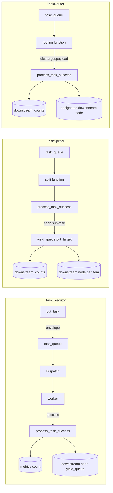

# tests/node/test_nodes.py

> 📅 Last Updated: 2026/10/09

## Purpose

Validates the execution, splitting, and routing behavior of the three concrete node classes `TaskExecutor` / `TaskSplitter` / `TaskRouter` in `celestialflow.node.core_nodes`, covering the serial / thread / async execution modes, replay from sqlite persistence, node initialization constraints, routing unknown target errors, and bindings staying stable across multiple modes.

## Core Test Objects

| Class / Function | Role | Description |
|-----------|------|------|
| `TaskExecutor` | Class under test | General executor, validates `serial` / `thread` / `async`, exception handling, retry, restore_db, result persistence, and fan-out payload semantics |
| `TaskSplitter` | Class under test | 1→N splitter, validates `downstream_counts`, empty iterable, generator, custom split function |
| `TaskRouter` | Class under test | Router, `func` returns a `dict[str, Y]` mapping; validates `downstream_counts`, unknown-target failure hints, dispatch by target, and stable bindings across modes |
| `append_records` | Utility | Writes failure / pending records directly via `celestialflow.persist.util_sqlite` for replay tests |
| `load_task_error_records` / `load_task_result_records` | Utility | Reads task-error / task-result pairs from sqlite to assert lifecycle persistence results |
| `build_result_dict` | Utility | Aggregates `get_success_pairs` and `get_error_pairs` into `{task: result_or_error_str}` |
| `_counts` | Utility | Retrieves the node metric snapshot via `metrics_of(node).get_node_metrics(name)` and maps it into an old-field-name dictionary |

## Key Test Scenarios

### `TestTaskExecutor` — Executor (15 cases)

| Case | Coverage Goal |
|------|---------|
| `test_serial_basic` | Serial execution of 5 tasks, succeeded=5, failed=0, pending=0 |
| `test_serial_with_errors` | Serial execution of `[1,-1,2,-2,3]`, `PersistedError.error_type == "ValueError"`, succeeded=3 / failed=2 |
| `test_serial_retry` | Registers `RuntimeError` as retryable; the first 2 calls raise, the 3rd returns `x+100`, `call_count == 3` |
| `test_serial_no_retry_for_unmatched_exception` | Unregistered exceptions do not trigger retry, going directly to failed |
| `test_thread_basic` | Thread mode (4 workers) successfully processes 5 tasks |
| `test_async_basic` | Async mode successfully processes 3 tasks |
| `test_async_double` | Async mode continuously processes 20 tasks |
| `test_restore_db` | By default only reads failed / pending with `node == self.get_name()` for this node, replays 3 successes |
| `test_restore_db_filters_error_type_when_enabled` | When `filter_by_error_type=True` + `set_retry_exceptions(RuntimeError)` is set, only RuntimeError is replayed |
| `test_restore_db_filter_keeps_pending_records` | When filtering is enabled, `pending` records are always kept |
| `test_success_persist` | After successful results are persisted, `get_success_pairs()` can read them back |
| `test_rejects_zero_argument_func` | 0-arg function should raise `ConfigurationError` |
| `test_rejects_multi_argument_func` | Multi-arg function should raise `ConfigurationError` |
| `test_name_and_execution_mode` | `get_name()` and `execution_mode` are exposed correctly |
| `test_fanout_downstream_records_result_as_input` | When a regular executor fans out, the downstream records the upstream's result rather than the upstream's input |

### `TestTaskSplitter` — Splitter (5 cases)

| Case | Coverage Goal |
|------|---------|
| `test_splitter_init` | Default `execution_mode="serial"`, no downstream bound yet |
| `test_splitter_process_success` | After `TaskGraph` cascade, downstream `succeeded == 3`, `downstream_counts["A"] == 3` |
| `test_splitter_allows_empty_iterable` | Empty iterable does not raise, downstream succeeded=0, no send count |
| `test_splitter_supports_generator_input` | A one-shot generator can also be fully split (send count=3) |
| `test_splitter_custom_func_transforms_items` | A custom split function transforms the sub-tasks before dispatching; the downstream result is `["a", "b", "c"]` |

### `TestTaskRouter` — Router (6 cases)

| Case | Coverage Goal |
|------|---------|
| `test_router_init` | Default `serial`, no downstream bound yet |
| `test_router_func_returns_target_payload_map` | `func(task)` returns a `{target: payload}` mapping |
| `test_router_process_success` | In `TaskGraph`, two downstream `target1` / `target2` each receive 1; `downstream_counts` each = 1 |
| `test_router_unknown_target_fails_with_hint` | Connected targets are delivered normally; unconnected targets are counted as failed, and the error message contains `Unknown target: ghost` and the list of allowed targets |
| `test_router_dispatch_targets_receive_own_payload` | When one routing returns multiple targets, each downstream receives its own payload rather than the router input |
| `test_router_binding_survives_mode_switch` | The binding established by `connect_to` remains stable after switching `execution_mode` |

## Key Data Flow


```mermaid
flowchart LR
    subgraph "TaskExecutor"
        PutTask[put_task] -->|envelope| Q[task_queue]
        Q --> D[Dispatch]
        D --> W[worker]
        W -->|success| SP[process_task_success]
        SP --> Counter[(metrics count)]
        SP --> Downstream[(downstream node yield_queue)]
    end

    subgraph "TaskSplitter"
        Q2[task_queue] --> DS[split function]
        DS --> PSR[process_task_success]
        PSR -->|each sub-task| PSR_put[yield_queue.put_target]
        PSR_put --> SC[(downstream_counts)]
        PSR_put --> Down2[(downstream node per item)]
    end

    subgraph "TaskRouter"
        Q3[task_queue] --> DR[routing function]
        DR -->|dict target:payload| PR[process_task_success]
        PR --> RC[(downstream_counts)]
        PR --> Down3[(designated downstream node)]
    end
```

> Metric counts are read via `metrics_of(graph).get_node_metrics(name).downstream_counts`; `downstream_counts` is a mapping of the actual number of sends between nodes (edges that were not sent do not appear).

## Test Coverage Matrix

| Test Class | Case Count | Coverage Goals |
|--------|--------|---------|
| `TestTaskExecutor` | 15 | Three execution modes, retry hit/miss, sqlite replay (including filtering by error_type), persistence, callback signature validation, fan-out payload semantics |
| `TestTaskSplitter` | 5 | Default parameters, graph integration, empty iterable, generator, custom split function |
| `TestTaskRouter` | 6 | Default parameters, `func` returns mapping, graph integration, unknown target error, payload-based dispatch, bindings stable across modes |
| **Total** | **26** | |

## How to Run

```bash
# Run all
pytest tests/node/test_nodes.py -v

# TaskExecutor tests only
pytest tests/node/test_nodes.py -k "TaskExecutor" -v

# TaskSplitter tests only
pytest tests/node/test_nodes.py -k "TaskSplitter" -v

# TaskRouter tests only
pytest tests/node/test_nodes.py -k "TaskRouter" -v

# sqlite replay cases only
pytest tests/node/test_nodes.py -k "restore_db" -v
```

## Performance Reference

| Test Class | Duration |
|--------|------|
| `TestTaskExecutor` | < 2.0s (includes sqlite persistence and replay) |
| `TestTaskSplitter` | < 1.0s |
| `TestTaskRouter` | < 1.0s |

## Notes

- The `test_restore_db*` cases use `append_records` to write directly to sqlite (the record's `node` field is the node name), validating the restore-replay logic.
- `test_router_unknown_target_fails_with_hint` asserts the unknown-target failure via `load_task_error_records` and `get_node_metrics(...).failed / processed`, and the error message contains `Unknown target: <name>` and the list of allowed targets, rather than raising an exception at the router layer.
- `test_router_binding_survives_mode_switch` and `test_connect_to_binding_survives_execution_mode_switch` (see `test_node.md`) are both regression tests covering the semantics of bindings staying stable across multiple modes.
- Async cases require the `pytest-asyncio` plugin (the project is already configured with `pytest.mark.asyncio`).
- The related implementation is at `src/celestialflow/node/core_nodes.py` and `src/celestialflow/persist/util_sqlite.py`.