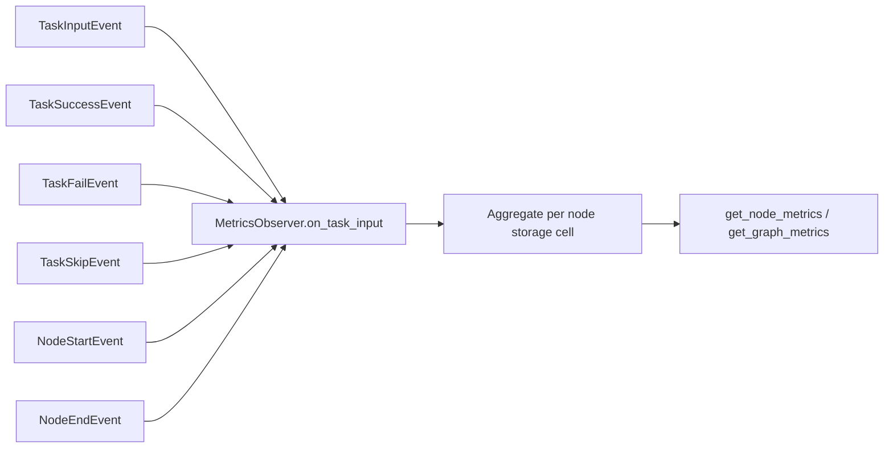

# tests/observer/test_metrics.py

> 📅 Last Updated: 2026/10/09

## Purpose

Validates the event-driven metric aggregation logic of `celestialflow.observer.MetricsObserver`: external / upstream input counting, success / failure / skip counting, node running-status maintenance, and a per-node-isolated graph-level metric view. After the refactor, `MetricsObserver` replaces the old `core_report` reporting logic and updates metrics as an observer in response to events.

## Core Test Objects

| Class / Function | Source | Description |
|-----------|------|------|
| `MetricsObserver` | `celestialflow.observer` | Metrics observer that consumes `NodeStartEvent` / `NodeEndEvent` / `TaskInputEvent` / `TaskSuccessEvent` / `TaskFailEvent` / `TaskSkipEvent` events and aggregates metrics |
| `get_node_metrics(name)` | MetricsObserver | Returns a single node's metrics; returns `None` for an unregistered node |
| `get_graph_metrics()` | MetricsObserver | Returns a snapshot map of metrics for all registered nodes |
| `NodeStatus` | `celestialflow.runtime.util_types` | Node status enum (`RUNNING` / `STOPPED`) |
| `_external_input` / `_upstream_input` | Helper functions | Builds external-input / upstream-delivered `TaskInputEvent`s |

## Test Coverage Matrix

### `TestMetricsObserverStorage` — Storage and Read

| Case | Coverage Target |
|------|---------|
| `test_unknown_node_returns_none` | `get_node_metrics("ghost")` returns `None` for an unregistered node |

### `TestMetricsObserverEvents` — Event Aggregation

| Case | Coverage Target |
|------|---------|
| `test_external_input_counted` | External input only increases the receiver's count: `external_input == 1`, `input_total == 1` |
| `test_upstream_input_updates_both_sides` | Upstream delivery writes the receiver's upstream count `upstream_counts` and the source's downstream count `downstream_counts` at the same time |
| `test_success_fail_skip_counts` | Success / failure / skip events write `succeeded` / `failed` / `skipped` respectively, and `processed` is their sum |
| `test_node_status_transitions` | `on_node_start` sets the status to `RUNNING` with `start_time > 0`; `on_node_end` sets the status to `STOPPED` |

### `TestMetricsObserverGraphView` — Graph-Level View

| Case | Coverage Target |
|------|---------|
| `test_cells_are_isolated_between_nodes` | The storage cells of different nodes do not affect each other: only the manipulated node's `succeeded` changes |
| `test_graph_metrics_covers_all_registered_nodes` | `get_graph_metrics()` covers all registered nodes (`{"a", "b"}`) |

## Key Data Flow



> Metrics are stored in isolation per node; `downstream_counts` / `upstream_counts` record the real data delivery direction and count between nodes.

## How to Run

```bash
# Run all
pytest tests/observer/test_metrics.py -v

# Run storage / read tests only
pytest tests/observer/test_metrics.py -k "Storage" -v

# Run event aggregation tests only
pytest tests/observer/test_metrics.py -k "Events" -v

# Run graph-level view tests only
pytest tests/observer/test_metrics.py -k "GraphView" -v
```

## Notes

- `MetricsObserver` updates metrics in a purely event-driven way; tests directly call the `on_*` event methods to simulate the lifecycle, without running an actual task graph.
- One upstream delivery both writes the receiver (`upstream_counts` / `upstream_input`) and the source (`downstream_counts`), both within the same event.
- The related implementation is located in `src/celestialflow/observer/core_metrics.py`.