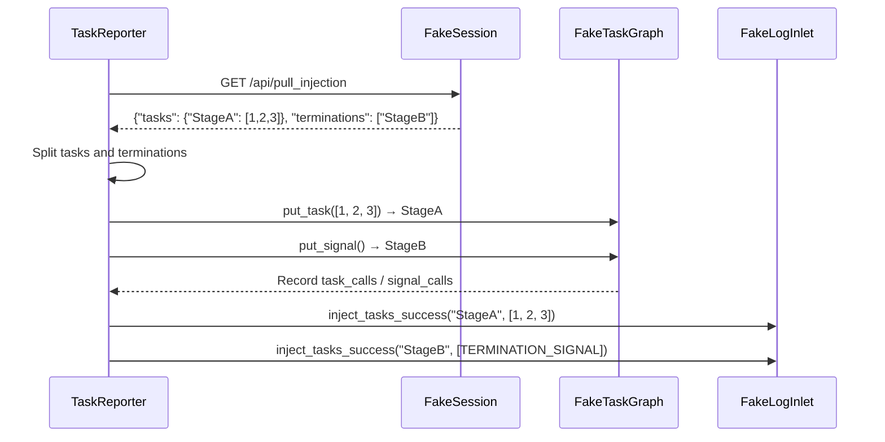

# tests/observability/test_reporter.py

> 📅 Last Updated: 2026/09/24

## Purpose

Validates the task injection, error push, graph metadata push, and status push logic of `TaskReporter` in `celestialflow.observability.core_report`: after the Reporter pulls split tasks and termination signal payloads from the remote, it verifies whether the tasks and termination signals are correctly injected per node via `put_task` / `put_signal`; also validates the endpoint selection for error push and the incremental push behavior based on the server-side watermark, the one-shot graph metadata push, and the status snapshot deduplication and forced push on context switch.

## Core Test Objects

| Class | Type | Description |
|----|------|------|
| `FakeResponse` / `FakePostResponse` | Mock | Simulates HTTP GET/POST responses |
| `FakeSession` / `FakePushSession` | Mock | Simulates `requests.Session` GET/POST methods and records calls |
| `FakeTaskGraph` / `FakeErrorGraph` | Mock | Simulates graph injection interface and error query interface |
| `FakeNode` | Mock | Records single-node `put_task` / `put_signal` calls |
| `FakeStatusNode` / `FakeStatusGraph` | Mock | Provides a manually mutable `get_snapshot()` and `get_graph_id()` |
| `FakeLogInlet` | Mock | Records injection success/failure, pull failure, error push failure, and status push failure logs |
| `TaskReporter` | Class under test | The injector and reporter in `celestialflow.observability` |

## Key Test Scenarios

### `test_reporter_accepts_split_task_and_termination_payload`

**Coverage Goal**: Validates that `TaskReporter._pull_injection()` can consume the split payload `{"tasks": {...}, "terminations": [...]}` returned by the server, and inject the tasks and termination signals into the corresponding nodes via `put_task` / `put_signal` respectively.

**Assertion Intent**:

- `StageA`'s `task_calls` contains one task batch `[1, 2, 3]`, and `signal_calls` is 0.
- `StageB`'s `task_calls` is empty, but `signal_calls` is 1 (only the termination signal is injected).
- `log_inlet.successes` records two success logs: the task injection for StageA `(StageA, [1, 2, 3])` and the termination signal injection for StageB `(StageB, [TERMINATION_SIGNAL])`.
- No failure logs (`failures` and `pull_failures` are both empty).
- Replaces `celestialflow.observability.core_report.get_log_inlet` via `monkeypatch.setattr` to return `log_inlet`, isolating the global log injector.



### `test_reporter_merges_tasks_and_termination_for_same_stage`

**Coverage Goal**: When the same node appears in both `tasks` and `terminations`, the task list should be retained and an extra `put_signal()` sent on that node, rather than overwriting each other.

**Assertion Intent**:

- `StageA`'s `task_calls` contains only `[1, 2, 3]` (tasks and termination signal call `put_task` / `put_signal` respectively), and `signal_calls` is 1.
- `log_inlet.successes` contains two records: first `(StageA, [1, 2, 3])` (task injection), then `(StageA, [TERMINATION_SIGNAL])` (termination signal injection).

### `test_reporter_pushes_errors_via_push_errors_endpoint_only`

**Coverage Goal**: Validates that `TaskReporter._push_errors()` only pushes errors via the `/api/push_errors` endpoint.

- Writes one sqlite error record.
- Sets `_server_has_current_graph = False` (triggers full push).
- Asserts the POST target URL ends with `/api/push_errors`.
- Asserts the payload contains `graph_id` and `errors` fields, and the error record fields match the sqlite record (including `id` / `event_id` / `stage` / `status` / `error_type` / `error_message` / `ts` / `task_json` / `result_json` / `retry_times`).

### `test_reporter_pushes_only_errors_after_server_max_event_id`

**Coverage Goal**: Validates that the Reporter only pushes failed records whose `event_id` is greater than the server's watermark.

- Writes 3 error records (`event_id=1,5,7`).
- Sets `_server_has_current_graph = True`, `_server_max_event_id_in_fail = 3`.
- Asserts that only records with `event_id` 5 and 7 are pushed.

### `test_reporter_pushes_graph_meta_in_one_request`

**Coverage Goal**: The graph structure, node metadata, and analysis results are pushed in a single `_push_graph_meta()`, and status pushes are disjoint from them.

- Constructs a `TaskGraph` with `StageA` (`thread`, `max_workers=3`) and `StageB` (default `serial`).
- Calls `_push_graph_meta()` and `_push_status()` in turn, asserting that two POSTs are produced: `/api/push_graph_meta` and `/api/push_status`.
- Asserts the metadata payload's `nodes == ["StageA", "StageB"]`, and that `analysis["graphId"]` and `analysis["layersDict"]` exist.
- Asserts `node_meta["StageA"] == {"class_name": "TaskExecutor", "execution_mode": "thread", "max_workers": 3}`, and `StageB` is `serial`.
- Asserts that the fields of each node in the status payload are **mutually exclusive** with the corresponding `node_meta` entry (build-time fields do not appear again).

### `test_reporter_pushes_status_only_when_snapshot_changes`

**Coverage Goal**: When the status snapshot is unchanged, no repeated push occurs; a new snapshot is pushed only after it changes.

- Sets `_server_has_current_graph = True`, calls `_push_status()` twice in a row, and asserts only 1 POST is produced.
- After modifying `FakeStatusNode.snapshot`, pushes again and asserts a 2nd POST is produced, with the payload being the latest snapshot.
- Pushes again with the same snapshot and asserts it stays at 2 POSTs (back to silent).

### `test_reporter_forces_status_push_on_context_switch`

**Coverage Goal**: When the server has just switched graph context, a push must be forced even if the snapshot is unchanged.

- After the first `_push_status()`, asserts 1 POST.
- Sets `_server_has_current_graph` to `False` (simulating that the server has just switched to this graph and the cache was cleared), then calls `_push_status()` again and asserts a 2nd POST is produced.

## Test Coverage Matrix

| Test Function | Coverage Target |
|----------|----------|
| `test_reporter_accepts_split_task_and_termination_payload` | Split payload parsing, tasks and termination signals injected separately, injection success logging |
| `test_reporter_merges_tasks_and_termination_for_same_stage` | Merge rules for tasks and termination signals on the same node |
| `test_reporter_pushes_errors_via_push_errors_endpoint_only` | Error push endpoint unified as `/api/push_errors`, full push payload structure |
| `test_reporter_pushes_only_errors_after_server_max_event_id` | Incremental error push based on server watermark |
| `test_reporter_pushes_graph_meta_in_one_request` | Graph structure / node metadata / analysis results pushed in a single request, with responsibilities mutually exclusive from status push |
| `test_reporter_pushes_status_only_when_snapshot_changes` | Deduplicated status snapshot push |
| `test_reporter_forces_status_push_on_context_switch` | Forced status push after graph context switch |

## How to Run

```bash
# Run all injection and push tests
pytest tests/observability/test_reporter.py -v

# Run injection payload parsing tests only
pytest tests/observability/test_reporter.py -k "accepts_split" -v

# Run merge rule tests only
pytest tests/observability/test_reporter.py -k "merges" -v

# Run error push tests only
pytest tests/observability/test_reporter.py -k "push_errors" -v

# Run graph metadata and status push tests only
pytest tests/observability/test_reporter.py -k "graph_meta or status" -v
```

## Notes

- Tests use Fake objects to completely isolate network dependencies; `TaskReporter`'s actual HTTP behavior is verified in other tests.
- Task payloads and termination signals are already split at the remote end; the Reporter side is responsible for calling `put_task` / `put_signal` respectively, and records the termination signal as the `[TERMINATION_SIGNAL]` singleton list in the log.
- `FakePushSession` records the URL, JSON payload, and timeout of each POST, making it easy to assert push content without depending on a real network.
- Status push is deduplicated by comparing `_last_status_dict`; when `_server_has_current_graph` is `False`, deduplication is bypassed to force one push, used for the first synchronization after a graph context switch.
- The related implementation is located at `src/celestialflow/observability/core_report.py`.
