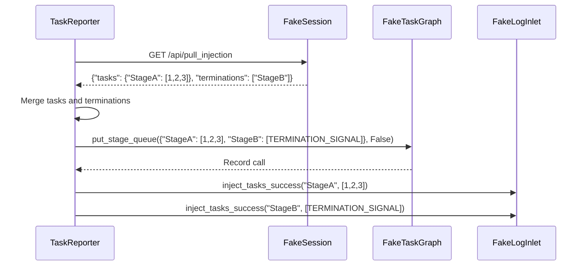

# Reporter Injection and Push Tests (test_reporter_injection.py)

> 📅 Last Updated: 2026/06/28

## Purpose

Validates the task injection and error push logic of `TaskReporter` in `celestialflow.observability.core_report`: after the Reporter pulls split tasks and termination signal payloads from the remote, it verifies correct merging and injection into the graph queue; also validates error push endpoint selection, deduplication, and incremental push behavior.

## Core Test Targets

| Class | Type | Description |
|----|------|------|
| `FakeResponse` / `FakePostResponse` | Mock | Simulates HTTP GET/POST responses |
| `FakeSession` / `FakePushSession` | Mock | Simulates `requests.Session` GET/POST methods and records calls |
| `FakeTaskGraph` / `FakeErrorGraph` | Mock | Simulates graph injection interface and error query interface |
| `FakeLogInlet` | Mock | Records logs for injection success/failure, pull failure, and push failure |
| `TaskReporter` | Class Under Test | The injector and reporter in `celestialflow.observability` |

## Key Test Scenarios

### `test_reporter_accepts_split_task_and_termination_payload`

**Coverage Goal**: Validates that `TaskReporter._pull_injection()` can consume the split payload `{"tasks": {...}, "terminations": [...]}` returned by the server, and inject both tasks and termination signals into the graph queue together.

**Assertion Intent**:

- `graph.put_stage_queue` is called once with the merged task dictionary as argument (termination node mapped to the `TERMINATION_SIGNAL` singleton), and `put_termination_signal=False`.
- `log_inlet.inject_tasks_success` records the task injection for StageA and the termination signal injection for StageB respectively.
- No failure logs (`failures` and `pull_failures` are both empty).



### `test_reporter_merges_tasks_and_termination_for_same_stage`

**Coverage Goal**: When the same node appears in both `tasks` and `terminations`, the task list should be preserved and the termination signal appended at the end, rather than overwriting each other.

**Assertion Intent**:

- `graph.put_stage_queue` is called once, with StageA's task list being `[1, 2, 3, TERMINATION_SIGNAL]`.
- `log_inlet.successes` contains only one StageA injection record.

### `test_reporter_pushes_errors_via_push_errors_endpoint_only`

**Coverage Goal**: Validates that `TaskReporter._push_errors()` only pushes errors via the `/api/push_errors` endpoint (no longer using the old `/api/push_errors_meta`).

- Writes one sqlite error record.
- Sets `_server_has_current_graph = False` (triggers full push).
- Asserts the POST target URL ends with `/api/push_errors`.
- Asserts the payload contains `graph_id` and `errors` fields, and the error record fields match the sqlite record.

### `test_reporter_pushes_only_errors_after_server_max_event_id`

**Coverage Goal**: Validates that the Reporter only pushes failed records whose `event_id` is greater than the server's watermark.

- Writes 3 error records (`event_id=1,5,7`).
- Sets `_server_has_current_graph = True`, `_server_max_event_id_in_fail = 3`.
- Asserts that only records with `event_id` 5 and 7 are pushed.

## Test Coverage Matrix

| Test Function | Coverage Goal |
|----------|----------|
| `test_reporter_accepts_split_task_and_termination_payload` | Split payload parsing, merged task and termination injection, injection success logging |
| `test_reporter_merges_tasks_and_termination_for_same_stage` | Merge rules for tasks and termination signals on the same node |
| `test_reporter_pushes_errors_via_push_errors_endpoint_only` | Error push endpoint unified as `/api/push_errors`, full push payload structure |
| `test_reporter_pushes_only_errors_after_server_max_event_id` | Incremental error push based on server watermark |

## How to Run

```bash
# Run all injection and push tests
pytest tests/observability/test_reporter_injection.py -v

# Run injection payload parsing tests only
pytest tests/observability/test_reporter_injection.py -k "accepts_split" -v

# Run merge rule tests only
pytest tests/observability/test_reporter_injection.py -k "merges" -v

# Run error push tests only
pytest tests/observability/test_reporter_injection.py -k "push_errors" -v
```

## Notes

- Tests use Fake objects to completely isolate network dependencies; `TaskReporter`'s actual HTTP behavior is verified in other tests.
- Task payloads and termination signals are already split at the remote end; the Reporter side is responsible for re-merging them and replacing termination signals with the `TERMINATION_SIGNAL` singleton.
- `FakePushSession` records the URL, JSON payload, and timeout of each POST, making it easy to assert push content without depending on a real network.
- The related implementation is located at `src/celestialflow/observability/core_report.py`.
