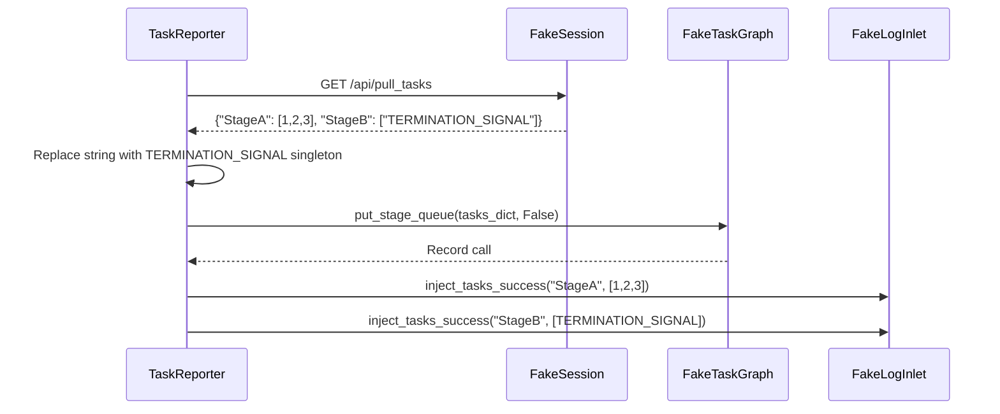

# Injection Tests (test_reporter_injection.py)

> 📅 Last Updated: 2026/06/11

## Purpose

Validates the task injection mechanism of `TaskReporter` — after the Reporter pulls a mapping in `{node_name: [tasklist]}` format from the remote, it verifies correct injection into the graph queue and recording of injection logs.

## Core Test Targets

| Class | Type | Description |
|----|------|------|
| `FakeResponse` | Mock | Simulates an HTTP response, returning a preset JSON payload |
| `FakeSession` | Mock | Simulates `requests.Session`, overriding only the `get` method |
| `FakeTaskGraph` | Mock | Records the call arguments to `put_stage_queue` |
| `FakeLogInlet` | Mock | Records logs for injection success/failure and pull failures |
| `TaskReporter` | Class Under Test | The injector in `celestialflow.observability` |

## Key Test Scenarios

### test_reporter_accepts_node_to_tasklist_mapping

**Coverage Goal**: Validates that `TaskReporter._pull_and_inject_tasks()` correctly handles a mapping in the `{StageA: [1, 2, 3], StageB: [TERMINATION_SIGNAL]}` format and injects the entire batch of tasks at once.

**Assertion Intent**:

- `graph.put_stage_queue` is called once with the merged task dictionary as argument (termination signal is replaced with the `TERMINATION_SIGNAL` singleton), and `put_termination_signal=False`.
- `log_inlet.inject_tasks_success` is called twice, recording successful injections for StageA and StageB respectively.
- No failure logs (`failures` and `pull_failures` are both empty).



## How to Run

```bash
# Run all injection tests
pytest tests/observability/test_reporter_injection.py -v

# Run node-mapping injection tests only
pytest tests/observability/test_reporter_injection.py -k "node_to_tasklist" -v
```

## Notes

- Tests use Fake objects to completely isolate network dependencies; `TaskReporter`'s actual HTTP behavior is verified in other tests.
- The `TERMINATION_SIGNAL` string is replaced with the global singleton object during injection — this is core logic. The test verifies this replacement behavior via `assert graph.calls`.
- `FakeResponse` and `FakeSession` are lightweight mocks that do not depend on `unittest.mock` or the `responses` library.
