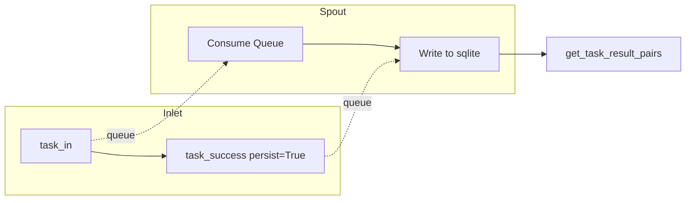

# Fallback Persistence Tests (test_fallback.py)

> Last Updated: 2026/06/18

## Purpose

Validates the `FallbackInlet` and `FallbackSpout` paired components in `celestialflow.persistence.core_fallback`, ensuring that task errors and success results can be written to a sqlite database via the background thread, and that task-error pairs and task-result pairs can be read by stage dimension.

## Core Test Objects

- `FallbackInlet`: Enqueues lifecycle events via `task_in()` / `task_retry()` / `task_fail()` / `task_success()` / `task_duplicate()` methods.
- `FallbackSpout`: A background thread consumes events from the queue, persists them to a sqlite file, and supports `get_task_error_pairs()` / `get_task_result_pairs()` queries.

## Test Coverage Matrix

| Test Class | Case Count | Coverage Target |
|--------|--------|---------|
| `TestFailPersistence` | 2 | Full lifecycle persistence, success result persistence |

## Key Test Scenarios

### `test_fallback_lifecycle_persistence`

Covers the complete persistence chain of `task_in` → `task_retry` → `task_fail` and `task_in` → `task_success` → `task_duplicate`.

- Verifies sqlite file creation (`.sqlite3` extension)
- Verifies `get_task_error_pairs("s1")` returns correct task-error pairs
- Directly queries the records table, verifying `event_id`, `stage`, `status`, `error_type`, `error_message`, `task_json`, and `result_json` fields match expectations exactly
- Intermediate event_ids from retries do not appear in final records (only the final `failed` status is retained)

### `test_success_persistence`

Covers the scenario where `persist=True` is called after task success.

- Verifies `get_task_result_pairs("s1")` returns a list of `(task, result)` tuples
- Verifies that the read order of multiple successes matches the write order



## How to Run

```bash
# Run all
pytest tests/persistence/test_fallback.py -v

# Match by keyword
pytest tests/persistence/test_fallback.py -k "lifecycle" -v
pytest tests/persistence/test_fallback.py -k "success" -v
```

## Notes

- Tests switch the working directory to a temporary directory via `monkeypatch.chdir(tmp_path)`, and sqlite files are automatically cleaned up after testing.
- Unlike the old `FailInlet`/`FailSpout` (JSONL format), the current implementation uses sqlite storage managed by the `util_sqlite` module.
- The related implementation is in `src/celestialflow/persistence/core_fallback.py`.
