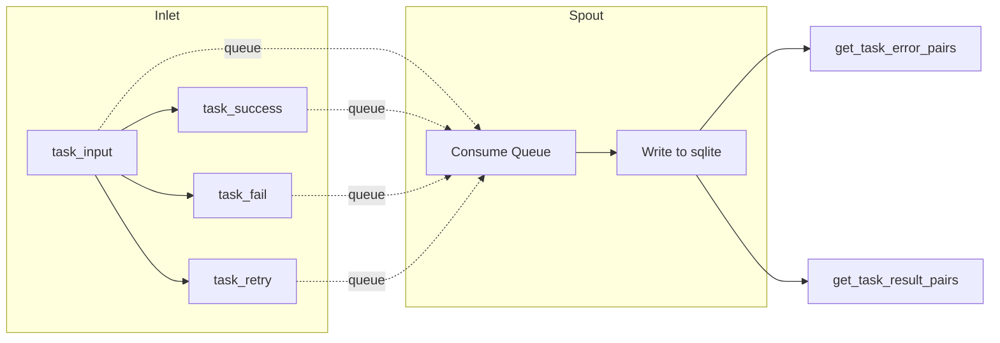

# tests/persistence/test_lifecycle.py

> 📅 Last Updated: 2026/09/24

## Purpose

Verifies the `LifecycleInlet` and `LifecycleSpout` paired components in `celestialflow.persistence.core_lifecycle`, ensuring that task lifecycle events (`task_input` / `task_success` / `task_fail` / `task_retry`) are written to a sqlite file via the background thread, and that task-error pairs and task-result pairs can be read by stage dimension; also validates retry-count persistence and automatic column addition for old databases.

## Core Test Objects

- `LifecycleInlet`: Enqueues lifecycle events through `task_input()` / `task_success()` / `task_fail()` / `task_retry()` via `_funnel()`.
- `LifecycleSpout`: A background thread consumes events from the queue and persists them to a sqlite file, supporting `get_task_error_pairs()` / `get_task_result_pairs()` queries.
- `connect_db` (`celestialflow.persistence.util_sqlite`): Establishes a connection and handles table structure upgrades (e.g., adding a `retry_times` column for old databases).

## Test Coverage Matrix

| Test Class | Case Count | Coverage Target |
|--------|--------|---------|
| `TestLifecyclePersistence` | 4 | Full lifecycle persistence, success result persistence, retry count persistence, old database column addition |

## Key Test Scenarios

### `test_lifecycle_persistence`

Covers the two lifecycle chains `task_input` → `task_fail` and `task_input` → `task_success` (two stages: s1 / s2).

- `task_input(stage_name, event_id, task)` injects a pending record into `LifecycleInlet`.
- `task_fail(event_id=1, error_id=21, error=ValueError("oops"))` promotes s1's pending record to failed; the final record uses `error_id` (21) as the stored `event_id`, and is bound to the error type and error message.
- `task_success(event_id=2, result="ok2")` promotes s2's pending record to success, retaining the original `event_id` (2) and writing the result.
- Asserts that the sqlite file is created successfully (`./lifecycles/<date>/flow_lifecycle(<time>).sqlite3`), and `get_task_error_pairs("s1")` returns `[("data1", ("ValueError", "oops"))]`.
- Directly queries the records table sorted by `id`, verifies the `event_id` sequence is `[21, 2]`, checks field by field the `stage` / `status` / `error_type` / `error_message` / `task_json` / `result_json`, and that the `ts` of both records is greater than 0.

### `test_success_persistence`

Covers the persistence and readback of successful results.

- Performs `task_input` + `task_success` for s1 and s2 respectively (results 100 / 200).
- Asserts that `get_task_result_pairs("s1")` returns `[("task1", 100)]`, i.e., task-result pairs are accurately read back by stage.

### `test_retry_persistence`

Covers the persistence of retry counts and the final promotion.

- For s1: `task_input` → two `task_retry` → `task_success`, asserting that on promotion to success the error information is cleared and `retry_times == 2` is retained.
- For s2: `task_input` → two `task_retry` → `task_fail(error_id=22)`, asserting that the failed record retains the latest error information (`ValueError` / `final boom`) and `retry_times == 2`.
- Asserts that `(event_id, status, retry_times)` in the records table is `[(1, "success", 2), (22, "failed", 2)]`.

### `test_old_db_gets_retry_times_column`

Covers old database structure upgrade.

- Manually creates a `records` table without the `retry_times` column.
- After calling `connect_db(db_path)`, asserts via `PRAGMA table_info(records)` that the `retry_times` column has been automatically added.



## How to Run

```bash
# Run all
pytest tests/persistence/test_lifecycle.py -v

# Match by keyword
pytest tests/persistence/test_lifecycle.py -k "lifecycle" -v
pytest tests/persistence/test_lifecycle.py -k "success" -v
pytest tests/persistence/test_lifecycle.py -k "retry" -v
```

## Notes

- Tests use `monkeypatch.chdir(tmp_path)` to switch the working directory to a temporary directory; the sqlite files (`./lifecycles/<date>/flow_lifecycle(<time>).sqlite3`) are automatically cleaned up after testing.
- The `event_id` of a failed record is replaced by the `error_id` passed in to `task_fail()`, consistent with the semantics of subsequent error queries/pushes for that stage.
- `LifecycleInlet` and `LifecycleSpout` are two test-isolated local instances; they do **not** use the `get_lifecycle_inlet()` / `get_lifecycle_spout()` global singletons, to avoid polluting other tests.
- The related implementation is in `src/celestialflow/persistence/core_lifecycle.py`.
