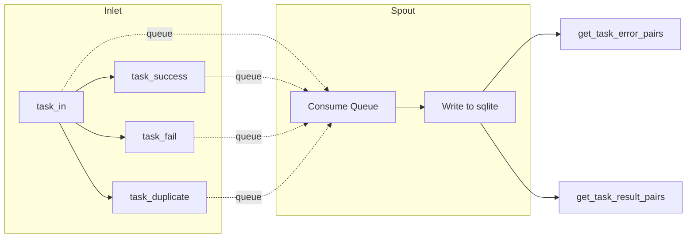

# Lifecycle Persistence Tests (test_lifecycle.py)

> 📅 Last Updated: 2026/08/26

## Purpose

Verifies the `LifecycleInlet` and `LifecycleSpout` paired components in `celestialflow.persistence.core_lifecycle`, ensuring that task lifecycle events (entry, success, failure, duplicate) are written to a sqlite file via the background thread, and that task-error pairs and task-result pairs can be read by stage dimension.

## Core Test Objects

- `LifecycleInlet`: Enqueues lifecycle events through `task_in()` / `task_success()` / `task_fail()` / `task_duplicate()` via `_funnel()`.
- `LifecycleSpout`: A background thread consumes events from the queue and persists them to a sqlite file, supporting `get_task_error_pairs()` / `get_task_result_pairs()` queries.

## Test Coverage Matrix

| Test Class | Case Count | Coverage Target |
|--------|--------|---------|
| `TestLifecyclePersistence` | 2 | Full lifecycle persistence, success result persistence |

## Key Test Scenarios

### `test_lifecycle_persistence`

Covers the three lifecycle chains `task_in` → `task_fail`, `task_in` → `task_success`, and `task_in` → `task_duplicate` (three stages: s1 / s2 / s3).

- `task_fail(event_id=1, error_id=21, error=ValueError("oops"))` promotes s1's pending record to failed; the final record uses `error_id` (21) as the stored `event_id`, and is bound to the error type and error message.
- `task_success(event_id=2, result="ok2")` promotes s2's pending record to success, retaining the original `event_id` (2) and writing the result.
- `task_duplicate(event_id=3)` deletes s3's pending record, and the final database has no residual record for it.
- Asserts that the sqlite file is created successfully (`.sqlite3` extension), and `get_task_error_pairs("s1")` returns `[("data1", ("ValueError", "oops"))]`.
- Directly queries the records table sorted by `id`, verifies the `event_id` sequence is `[21, 2]`, field-by-field checks `stage` / `status` / `error_type` / `error_message` / `task_json` / `result_json`, and that the `ts` of both records is greater than 0.

### `test_success_persistence`

Covers the persistence and readback of successful results.

- Performs `task_in` + `task_success` for s1 and s2 respectively (results 100 / 200).
- Asserts that `get_task_result_pairs("s1")` returns `[("task1", 100)]`, i.e., task-result pairs are accurately read back by stage.



## How to Run

```bash
# Run all
pytest tests/persistence/test_lifecycle.py -v

# Match by keyword
pytest tests/persistence/test_lifecycle.py -k "lifecycle" -v
pytest tests/persistence/test_lifecycle.py -k "success" -v
```

## Notes

- Tests use `monkeypatch.chdir(tmp_path)` to switch the working directory to a temporary directory; the sqlite files (`./lifecycles/<date>/flow_lifecycle(<time>).sqlite3`) are automatically cleaned up after testing.
- The `event_id` of a failed record is replaced by the `error_id` passed in to `task_fail()`, consistent with the semantics of subsequent error queries/pushes for that stage.
- The related implementation is in `src/celestialflow/persistence/core_lifecycle.py`.
