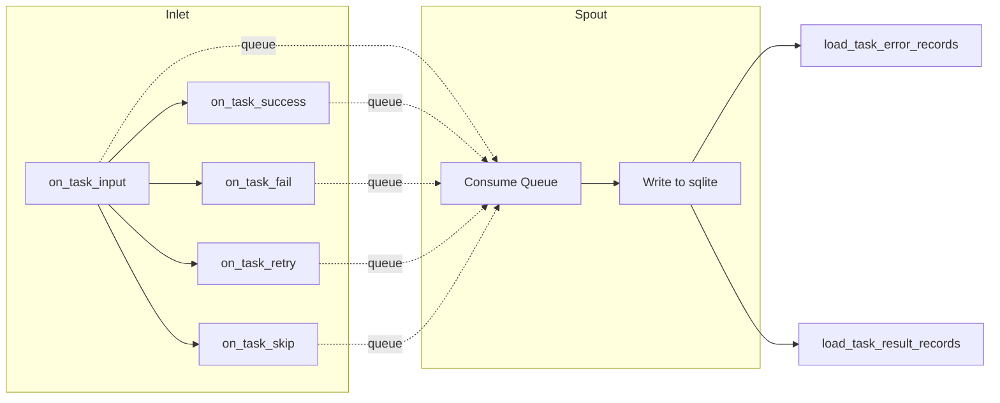

# tests/persist/test_lifecycle.py

> 📅 Last Updated: 2026/10/09

## Purpose

Verifies the paired `LifecycleInlet` and `LifecycleSpout` components in `celestialflow.persist.core_lifecycle`, ensuring that task lifecycle events (`on_task_input` / `on_task_success` / `on_task_fail` / `on_task_retry` / `on_task_skip`) are written to a sqlite file via a background thread, and that task-error pairs and task-result pairs can be read per node; it also validates retry-count persistence and automatic column addition for old databases.

## Core Test Objects

| Class / Object | Source | Description |
|-----------|------|------|
| `LifecycleInlet` | `celestialflow.persist.core_lifecycle` | Delivers lifecycle events to an internal queue via `bind_spout` |
| `LifecycleSpout` | `celestialflow.persist.core_lifecycle` | Background thread that consumes events from the queue and persists them to a sqlite file; `db_path` points to the generated database |
| `load_task_error_records` / `load_task_result_records` | `celestialflow.persist.util_sqlite` | Reads task-error / task-result pairs per node |
| `connect_db` | `celestialflow.persist.util_sqlite` | Establishes a connection and handles table structure upgrades (e.g., adding a `retry_times` column for old databases) |
| Event types | `celestialflow.observer` | `TaskInputEvent` / `TaskSuccessEvent` / `TaskFailEvent` / `TaskRetryEvent` / `TaskSkipEvent` |

## Test Coverage Matrix

| Test Class | Case Count | Coverage Target |
|--------|--------|---------|
| `TestLifecyclePersistence` | 5 | Full lifecycle persistence, success result persistence, retry count persistence, skip persistence, old database column addition |

## Key Test Scenarios

### `test_lifecycle_persistence`

Covers the two lifecycle chains `on_task_input` → `on_task_fail` and `on_task_input` → `on_task_success` (nodes s1 / s2).

- `on_task_input` injects a pending record into `LifecycleInlet`.
- `on_task_fail` promotes s1's pending record to failed; the final record uses the `event_id` (21) carried by the failure event as the stored ID, and binds the error type and error message.
- `on_task_success` promotes s2's pending record to success, retaining the original `event_id` (2) and writing the result.
- Asserts that the `.sqlite3` file is created successfully, and `load_task_error_records(db_path, "s1")` returns `[("data1", ("ValueError", "oops"))]`.
- Directly queries the `records` table sorted by `id`, verifies that the `event_id` sequence is `[21, 2]` (checking `node` / `status` / `error_type` / `error_message` / `task_json` / `result_json` field by field), and that the `ts` of both records is greater than 0.

### `test_success_persistence`

Covers the persistence and readback of successful results.

- Performs `on_task_input` + `on_task_success` for s1 and s2 respectively (results 100 / 200).
- Asserts that `load_task_result_records(db_path, "s1")` returns `[("task1", 100)]`.

### `test_retry_persistence`

Covers the persistence of retry counts and the final promotion.

- For s1: `on_task_input` → two `on_task_retry` → `on_task_success`, asserting that promotion to success clears the error info and retains `retry_times == 2`.
- For s2: `on_task_input` → two `on_task_retry` → `on_task_fail`, asserting that the failed record retains the latest error info (`ValueError` / `final boom`) and `retry_times == 2`.
- Asserts that `(event_id, status, retry_times)` in the `records` table is `[(1, "success", 2), (22, "failed", 2)]`.

### `test_skip_persistence`

Covers skip persistence.

- Performs `on_task_input` + `on_task_skip` for s1; `on_task_skip` promotes the pending record to `skipped` and switches to the `event_id` (31) carried by the skip event.

### `test_old_db_gets_retry_times_column`

Covers old database structure upgrade.

- Manually creates a `records` table without the `retry_times` column.
- After calling `connect_db(db_path)`, asserts via `PRAGMA table_info(records)` that the `retry_times` column has been automatically added.


```mermaid
flowchart LR
    subgraph Inlet
        A[on_task_input] --> B[on_task_success]
        A --> C[on_task_fail]
        A --> D[on_task_retry]
        A --> E[on_task_skip]
    end
    subgraph Spout
        F[Consume Queue] --> G[Write to sqlite]
    end
    A -.->|queue| F
    B -.->|queue| F
    C -.->|queue| F
    D -.->|queue| F
    E -.->|queue| F
    G --> H[load_task_error_records]
    G --> I[load_task_result_records]
```

## How to Run

```bash
# Run all
pytest tests/persist/test_lifecycle.py -v

# Match by keyword
pytest tests/persist/test_lifecycle.py -k "lifecycle" -v
pytest tests/persist/test_lifecycle.py -k "success" -v
pytest tests/persist/test_lifecycle.py -k "retry" -v
pytest tests/persist/test_lifecycle.py -k "skip" -v
```

## Notes

- Tests use `monkeypatch.chdir(tmp_path)` to switch the working directory to a temporary directory; the sqlite file is automatically cleaned up after testing.
- The stored `event_id` of failed / skipped records is replaced by the event ID carried by the final-status event (failure event ID / skip event ID), keeping subsequent error query / push semantics consistent.
- `LifecycleInlet` and `LifecycleSpout` are two test-isolated local instances; they do not rely on global singletons, avoiding pollution of other tests.
- The related implementation is in `src/celestialflow/persist/core_lifecycle.py`.