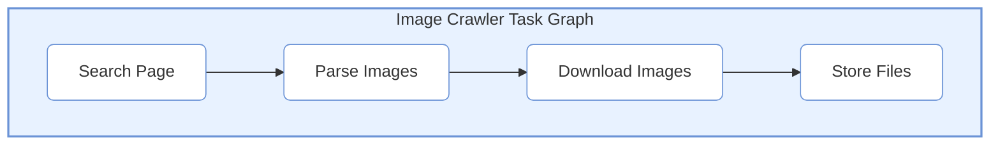

# Tutorial: Building an Image Crawler

> 📅 Last Updated: 2026/05/09

This tutorial will guide you through a complete hands-on project — **Baidu Image Crawler** — to learn CelestialFlow from scratch.

## Project Goal

Crawl Baidu image search results and download images for specified keywords to your local machine. We will learn how to:
1. Analyze and decompose the task flow
2. Write processing functions for each stage
3. Assemble and run the task graph
4. Monitor execution status via the Web UI

---

## Step 1: Task Analysis and Decomposition

Before coding, we need to analyze the crawler's execution flow:

```
User inputs keyword → Search page → Parse image list → Download images → Save files
```

### Task Layer Design

| Layer | Function | Input | Output |
|------|------|------|------|
| **Layer 1: Search** | Fetch search result page | Keyword | Page HTML |
| **Layer 2: Parse** | Extract image URL list | HTML | Image URL list |
| **Layer 3: Download** | Download image content | Image URL | Image binary data |
| **Layer 4: Store** | Save to local disk | Image data | File path |

### Task Graph Structure



---

## Step 2: Write Processing Functions

First, write the processing functions for each stage and test them individually.

### 2.1 Search Page

```python
import requests
from urllib.parse import quote

def search_images(keyword: str) -> str:
    """
    Search Baidu images by keyword and return page HTML.
    
    :param keyword: Search keyword
    :return: Page HTML content
    """
    url = f"https://image.baidu.com/search/index?tn=baiduimage&word={quote(keyword)}"
    headers = {
        "User-Agent": "Mozilla/5.0 (Windows NT 10.0; Win64; x64) AppleWebKit/537.36"
    }
    response = requests.get(url, headers=headers, timeout=10)
    response.raise_for_status()
    return response.text

# Standalone test
if __name__ == "__main__":
    html = search_images("cat")
    print(f"Fetched {len(html)} characters of HTML")
```

### 2.2 Parse Image URLs

```python
import re
import json

def parse_image_urls(html: str) -> list[str]:
    """
    Parse image URL list from HTML.
    
    :param html: Page HTML
    :return: List of image URLs
    """
    # Baidu image data is embedded in JavaScript
    pattern = r'"hoverURL":"(https?://[^"]+)"'
    urls = re.findall(pattern, html)
    # Handle escape characters
    urls = [url.replace("\\/", "/") for url in urls]
    return urls[:20]  # Limit quantity

# Standalone test
if __name__ == "__main__":
    html = search_images("cat")
    urls = parse_image_urls(html)
    print(f"Parsed {len(urls)} image URLs")
    for url in urls[:3]:
        print(f"  - {url}")
```

### 2.3 Download Images

```python
import time

def download_image(url: str) -> bytes | None:
    """
    Download image content.
    
    :param url: Image URL
    :return: Image binary data, None on failure
    """
    headers = {
        "User-Agent": "Mozilla/5.0 (Windows NT 10.0; Win64; x64) AppleWebKit/537.36",
        "Referer": "https://image.baidu.com/"
    }
    try:
        response = requests.get(url, headers=headers, timeout=15)
        response.raise_for_status()
        return response.content
    except Exception as e:
        print(f"Download failed: {url}, error: {e}")
        return None

# Standalone test
if __name__ == "__main__":
    html = search_images("cat")
    urls = parse_image_urls(html)
    if urls:
        data = download_image(urls[0])
        if data:
            print(f"Download successful, size: {len(data)} bytes")
```

### 2.4 Store Files

```python
import os
import hashlib

def save_image(image_data: bytes, keyword: str) -> str:
    """
    Save image to local disk.
    
    :param image_data: Image binary data
    :param keyword: Keyword (used to create directory)
    :return: Saved file path
    """
    # Create directory
    save_dir = os.path.join("images", keyword)
    os.makedirs(save_dir, exist_ok=True)
    
    # Use data hash as filename
    file_hash = hashlib.md5(image_data).hexdigest()[:12]
    file_path = os.path.join(save_dir, f"{file_hash}.jpg")
    
    # Avoid duplicate downloads
    if not os.path.exists(file_path):
        with open(file_path, "wb") as f:
            f.write(image_data)
    
    return file_path

# Standalone test
if __name__ == "__main__":
    html = search_images("cat")
    urls = parse_image_urls(html)
    if urls:
        data = download_image(urls[0])
        if data:
            path = save_image(data, "cat")
            print(f"Saved successfully: {path}")
```

---

## Step 3: Assemble the Task Graph

After verifying the processing functions, assign them to their respective `TaskStage` nodes and organize them with `TaskGraph`.

### 3.1 Create Nodes

```python
from celestialflow import TaskStage, TaskSplitter

# Search stage: input keyword, output HTML
stage_search = TaskStage(
    "Search Page",
    func=search_images,
    execution_mode="serial",  # Only one keyword, serial is sufficient
    max_retries=2,
)

# Parse stage: input HTML, output multiple image URLs (needs splitting)
# Need a custom Splitter to split the URL list
class URLSplitter(TaskSplitter):
    """Split URL list into individual tasks."""
    
    def _split(self, html: str):
        urls = parse_image_urls(html)
        print(f"Parsed {len(urls)} image URLs")
        return tuple(urls)

stage_parse = URLSplitter("Parse Images")

# Download stage: input URL, output image data
stage_download = TaskStage(
    "Download Images",
    func=download_image,
    execution_mode="thread",  # Network I/O intensive, use thread pool
    max_workers=10,           # Download 10 concurrently
    max_retries=3,
)

# Store stage: input image data, output file path
stage_save = TaskStage(
    "Store Files",
    func=lambda data: save_image(data, "cat") if data else None,
    execution_mode="serial",
    enable_duplicate_check=False,  # Allow saving duplicate data (for retries)
)
```

### 3.2 Build the Task Graph

```python
from celestialflow import TaskGraph

# Create task graph
graph = TaskGraph(schedule_mode="eager", log_level="SUCCESS")

# Set nodes
graph.set_stages(stages=[stage_search, stage_parse, stage_download, stage_save])

# Set connection relationships between nodes
graph.connect([stage_search], [stage_parse])
graph.connect([stage_parse], [stage_download])
graph.connect([stage_download], [stage_save])
```

### 3.3 Start Web Monitoring (Optional)

```python
# Enable Web monitoring
graph.set_reporter(True, host="127.0.0.1", port=5005)
```

Start the Web service:
```bash
celestialflow-web --port 5005
```

Visit http://localhost:5005 to view real-time status.

### 3.4 Run the Task Graph

```python
# Prepare initial tasks
init_tasks = {
    stage_search.get_tag(): ["cat", "dog", "scenery"]
}

# Start
print("Starting image crawl...")
graph.start_graph(init_tasks)

# Get statistics
print(f"Success: {graph.get_graph_summary().get('total_succeeded', 0)}")
print(f"Failed: {graph.get_graph_summary().get('total_failed', 0)}")
```

---

## Step 4: Complete Code

Combine all code into a single file:

```python
# crawler.py
import os
import re
import hashlib
import requests
from urllib.parse import quote

from celestialflow import (
    TaskStage, 
    TaskSplitter, 
    TaskGraph,
)

# ========== Processing Functions ==========

def search_images(keyword: str) -> str:
    """Search Baidu images."""
    url = f"https://image.baidu.com/search/index?tn=baiduimage&word={quote(keyword)}"
    headers = {"User-Agent": "Mozilla/5.0 (Windows NT 10.0; Win64; x64) AppleWebKit/537.36"}
    response = requests.get(url, headers=headers, timeout=10)
    response.raise_for_status()
    return response.text

def parse_image_urls(html: str) -> list[str]:
    """Parse image URLs."""
    pattern = r'"hoverURL":"(https?://[^"]+)"'
    urls = re.findall(pattern, html)
    return [url.replace("\\/", "/") for url in urls][:20]

def download_image(url: str) -> bytes | None:
    """Download image."""
    headers = {
        "User-Agent": "Mozilla/5.0 (Windows NT 10.0; Win64; x64) AppleWebKit/537.36",
        "Referer": "https://image.baidu.com/"
    }
    try:
        response = requests.get(url, headers=headers, timeout=15)
        response.raise_for_status()
        return response.content
    except Exception:
        return None

def save_image(image_data: bytes, keyword: str) -> str | None:
    """Save image."""
    if not image_data:
        return None
    save_dir = os.path.join("images", keyword)
    os.makedirs(save_dir, exist_ok=True)
    file_hash = hashlib.md5(image_data).hexdigest()[:12]
    file_path = os.path.join(save_dir, f"{file_hash}.jpg")
    if not os.path.exists(file_path):
        with open(file_path, "wb") as f:
            f.write(image_data)
    return file_path

# ========== Custom Node ==========

class URLSplitter(TaskSplitter):
    """URL list splitter."""
    
    def _split(self, html: str):
        urls = parse_image_urls(html)
        print(f"Parsed {len(urls)} image URLs")
        return tuple(urls)

# ========== Build Task Graph ==========

def build_crawler_graph(keyword: str) -> TaskGraph:
    """Build crawler task graph."""
    
    # Create nodes
    stage_search = TaskStage(
        "Search Page",
        func=search_images,
        execution_mode="serial",
        max_retries=2,
    )
    
    stage_parse = URLSplitter("Parse Images")
    
    stage_download = TaskStage(
        "Download Images",
        func=download_image,
        execution_mode="thread",
        max_workers=10,
        max_retries=3,
    )
    
    # Use closure to pass keyword
    stage_save = TaskStage(
        "Store Files",
        func=lambda data: save_image(data, keyword),
        execution_mode="serial",
        enable_duplicate_check=False,
    )
    
    # Set connections
    graph = TaskGraph(schedule_mode="eager", log_level="SUCCESS")
    graph.set_stages(stages=[stage_search, stage_parse, stage_download, stage_save])
    graph.connect([stage_search], [stage_parse])
    graph.connect([stage_parse], [stage_download])
    graph.connect([stage_download], [stage_save])
    
    return graph

# ========== Main ==========

if __name__ == "__main__":
    # Configuration
    KEYWORDS = ["cat", "dog", "scenery"]
    
    # Build graph
    graph = build_crawler_graph(KEYWORDS[0])
    graph.set_reporter(True, host="127.0.0.1", port=5005)
    
    # Run
    print("Starting image crawl...")
    graph.start_graph({
        graph.source_stages[0].get_tag(): KEYWORDS
    })
    
    # Statistics
    summary = graph.get_graph_summary()
    print(f"\nCrawl complete!")
    print(f"Success: {summary.get('total_succeeded', 0)}")
    print(f"Failed: {summary.get('total_failed', 0)}")
```

---

## Step 5: Run and Debug

### 5.1 Start Web Service

```bash
# Terminal 1: Start Web service
celestialflow-web --port 5005
```

### 5.2 Run the Crawler

```bash
# Terminal 2: Run the crawler
python crawler.py
```

### 5.3 View Web UI

Open http://localhost:5005, you can see:

1. **Dashboard**: Real-time display of processing progress for each node
2. **Structure**: Visualized structure of the task graph
3. **Errors**: Failed image URLs and error information
4. **Task Injection**: Dynamically inject new keywords

### 5.4 View Results

```bash
# View downloaded images
ls images/cat/
ls images/dog/
ls images/scenery/
```

---

## Extension: Dynamic Task Injection

You can dynamically inject new keywords via the Web UI:

```python
# Or inject via code
from celestialflow import TerminationSignal

# Inject new keywords
graph.put_stage_queue({
    stage_search.get_tag(): ["car", "food"]
})

# Inject termination signal (stop crawling)
graph.put_stage_queue({
    stage_search.get_tag(): [TerminationSignal()]
})
```

---

## Summary

This tutorial demonstrated the complete workflow of using CelestialFlow:

1. **Task Analysis**: Decompose complex tasks into independent layers
2. **Function Writing**: Write processing functions for each layer and test individually
3. **Node Creation**: Wrap functions as `TaskStage`
4. **Graph Assembly**: Organize node relationships with `TaskGraph`
5. **Monitor & Run**: Monitor execution status in real time via the Web UI

### Key Concept Review

| Concept | Description |
|------|------|
| `TaskStage` | Task node, wrapping a processing function |
| `TaskSplitter` | Splitter, splitting one task into multiple |
| `TaskGraph` | Task graph, organizing node relationships and execution flow |
| `stage_mode` | Node running mode (serial/thread) |
| `execution_mode` | Node internal execution mode (serial/thread/async) |

### Next Steps

- Try using `TaskRouter` for conditional dispatching
- Explore `TaskRedisTransport` for cross-language collaboration
- Read other [API References](reference/stage/core_executor.md) to learn more features
