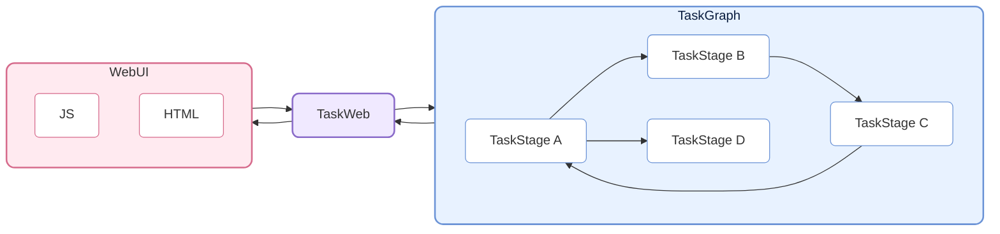
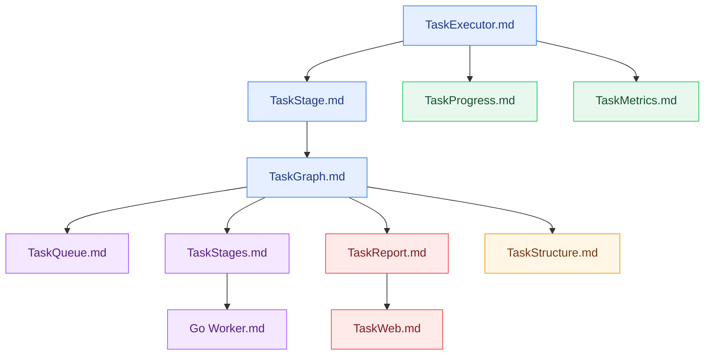

# CelestialFlow —— 軽量で並列可能なグラフ構造ベースの Python タスクスケジューリングフレームワーク

<p align="center">
  
</p>

<p align="center">
  <a href="https://pypi.org/project/celestialflow/"></a>
  <a href="https://pepy.tech/projects/celestialflow"></a>
  <a href="https://pypi.org/project/celestialflow/"></a>
  <a href="https://pypi.org/project/celestialflow/"></a>
</p>

<p align="center">
  
  
  
  
</p>

<p align="center">
  <a href="https://github.com/Mr-xiaotian/CelestialFlow/blob/main/docs/zh-CN/README.md">中文</a> | <a href="https://github.com/Mr-xiaotian/CelestialFlow/blob/main/docs/en/README.md">English</a> | <a href="https://github.com/Mr-xiaotian/CelestialFlow/blob/main/docs/ja/README.md">日本語</a>
</p>

**CelestialFlow** は、軽量でありながら完全な機能を備えたタスクフローフレームワークで、**複雑な依存関係**、**柔軟な実行モデル**、**クロスデバイス実行**、**リアルタイム可視化監視**を必要とする中/大規模 Python タスクシステムに適しています。

- Airflow/Dagster より軽量で、より早く開始可能
- multiprocessing/threading より構造化されており、loop / complete graph などの複雑な依存パターンを直接表現可能

フレームワークの基本ユニットは **TaskExecutor** で、独立して実行でき、3 つの実行モードをサポートします：

* **リニア（serial）**
* **マルチスレッド（thread）**
* **コルーチン（async）**

TaskExecutor はタスクの結果キャッシュ、タスク重複排除、プログレスバー表示、多実行モード比較などの機能を実装しており、単独でも非常に使いやすくなっています。

ただし、TaskExecutor を直接使用する以外に、より重要なのはそのサブクラス **TaskStage** の使用です。TaskStage は相互に接続して、上流と下流の依存関係を持つタスクグラフ（**TaskGraph**）を形成できます。下流の stage は上流の実行完了結果を自動的に入力として受け取り、明確なデータフローを形成します。

TaskStage のタスク実行モードも TaskExecutor と同様に 3 つを含みます。

グラフレベルでは、各 Stage は 2 つのコンテキストモードをサポートします：

* **リニア実行（serial layout）**：現在のノードが実行完了してから次のノードを起動（下流ノードは事前にタスクを受信可能ですが、すぐには実行されません）。
* **スレッド実行（thread layout）**：現在のノードがメインプロセスの独立したスレッドで起動され、I/O 集中型タスクや pickle 不可能な関数（lambda など）に適しています。

TaskGraph は完全な **有向グラフ構造（Directed Graph）** を構築でき、従来の有向非巡回グラフ（DAG）だけでなく、**ツリー（Tree）**、**循環（loop）**、さらには **完全グラフ（Complete Graph）** 形式のタスク依存関係も柔軟に表現できます。

実行とスケジューリングに加えて、CelestialFlow はさらに **CelestialTree（略称: ctree）イベント追跡システム**を導入し、各タスクとその派生動作（成功、失敗、リトライ、分割、ルーティングなど）に明確な因果関係を記録します。ctree を利用することで、任意の初期タスクから出発し、TaskGraph 内での伝播経路と実行軌跡を完全に復元でき、タスクシステムの完全な**追跡、分析、解釈**が可能になります。

これに加えて、CelestialFlow は Web 可視化監視をサポートし、Redis を通じてクロスプロセス、クロスデバイス連携を実現できます。同時に Go ベースの外部 worker（Redis 経由で通信）を導入し、CPU 集中型タスクを処理することで、このシナリオでの Python のパフォーマンスボトルネックを補完します。

## プロジェクト構造（Project Structure）



## クイックスタート（Quick Start）

CelestialFlow のインストール：

```bash
# 依存関係と環境の管理に `uv` の使用を推奨
uv pip install celestialflow

# ただし `pip` を直接使用することも可能
pip install celestialflow
```

シンプルな実行可能コード：

```python
from celestialflow import TaskStage, TaskGraph

def add(x, y): 
    return x + y

def square(x): 
    return x ** 2

if __name__ == "__main__":
    # 2 つのタスクノードを定義
    stage1 = TaskStage(name="Adder", func=add, stage_mode="thread", execution_mode="thread", unpack_task_args=True)
    stage2 = TaskStage(name="Squarer", func=square, stage_mode="thread", execution_mode="thread")

    # タスクグラフ構造を構築
    graph = TaskGraph()
    graph.set_stages(stages=[stage1, stage2])
    graph.connect([stage1], [stage2])

    # タスクを初期化して起動
    graph.start_graph({stage1.get_name(): [(1, 2), (3, 4), (5, 6)]})
```

.ipynb での実行は避けてください。

👉 完全な Quick Start は [Quick Start](https://github.com/Mr-xiaotian/CelestialFlow/blob/main/docs/zh-CN/quick_start.md) をご覧ください

## 詳細な読み物（Further Reading）

フレームワークの全体構造とコアコンポーネントを理解したい場合は、以下の参考ドキュメントが役立ちます：

- [stage/core_executor.md](https://github.com/Mr-xiaotian/CelestialFlow/blob/main/docs/zh-CN/src/stage/core_executor.md)
- [stage/core_stage.md](https://github.com/Mr-xiaotian/CelestialFlow/blob/main/docs/zh-CN/src/stage/core_stage.md)
- [graph/core_graph.md](https://github.com/Mr-xiaotian/CelestialFlow/blob/main/docs/zh-CN/src/graph/core_graph.md)
- [observability/core_progress.md](https://github.com/Mr-xiaotian/CelestialFlow/blob/main/docs/zh-CN/src/observability/core_progress.md)
- [runtime/core_metrics.md](https://github.com/Mr-xiaotian/CelestialFlow/blob/main/docs/zh-CN/src/runtime/core_metrics.md)
- [runtime/core_queue.md](https://github.com/Mr-xiaotian/CelestialFlow/blob/main/docs/zh-CN/src/runtime/core_queue.md)
- [stage/core_stages.md](https://github.com/Mr-xiaotian/CelestialFlow/blob/main/docs/zh-CN/src/stage/core_stages.md)
- [observability/core_report.md](https://github.com/Mr-xiaotian/CelestialFlow/blob/main/docs/zh-CN/src/observability/core_report.md)
- [graph/core_structure.md](https://github.com/Mr-xiaotian/CelestialFlow/blob/main/docs/zh-CN/src/graph/core_structure.md)
- [web/core_server.md](https://github.com/Mr-xiaotian/CelestialFlow/blob/main/docs/zh-CN/src/web/core_server.md)
- [other/go_worker.md](https://github.com/Mr-xiaotian/CelestialFlow/blob/main/docs/zh-CN/other/go_worker.md)

推奨読書順序：



以下の 3 編は補足読書として参照できます：

- [runtime/util_hash.md](https://github.com/Mr-xiaotian/CelestialFlow/blob/main/docs/zh-CN/src/runtime/util_hash.md)
- [runtime/util_types.md](https://github.com/Mr-xiaotian/CelestialFlow/blob/main/docs/zh-CN/src/runtime/util_types.md)
- [runtime/util_errors.md](https://github.com/Mr-xiaotian/CelestialFlow/blob/main/docs/zh-CN/src/runtime/util_errors.md)
- [persistence/core_fail.md](https://github.com/Mr-xiaotian/CelestialFlow/blob/main/docs/zh-CN/src/persistence/core_fail.md)
- [persistence/core_log.md](https://github.com/Mr-xiaotian/CelestialFlow/blob/main/docs/zh-CN/src/persistence/core_log.md)

完全なケースを通じてフレームワークの動作方法を理解したい場合は、TaskGraph を使用してゼロからプロジェクトを構築するこのチュートリアルを参照してください：

[📘 ケースチュートリアル](https://github.com/Mr-xiaotian/CelestialFlow/blob/main/docs/zh-CN/tutorial.md)

3.0.7 バージョンで追加された ctree_client とその機能に興味がある場合は、こちらをご覧ください：

[📚 CelestialTreeClient](https://github.com/Mr-xiaotian/CelestialFlow/blob/main/docs/zh-CN/other/ctree_client.md)

さらに多くのデモコードを実行できます。各デモファイルとその中のデモ関数の説明はこちらに記録されています：

[🎮 demo/](https://github.com/Mr-xiaotian/CelestialFlow/tree/main/docs/zh-CN/demo)

テストコードを実行したい場合は、まず以下のドキュメント内容を確認してください：

[🧪 tests/](https://github.com/Mr-xiaotian/CelestialFlow/tree/main/docs/zh-CN/tests)

bench の内容を確認したい場合、ここのデータはフレームワークの一部設計上の意思決定の根拠となっています：

[⚡ bench/](https://github.com/Mr-xiaotian/CelestialFlow/tree/main/docs/zh-CN/bench)

## 環境要件（Requirements）

**CelestialFlow** は Python 3.12+ ベースで、以下のコアコンポーネントに依存します。
お使いの環境がこれらの依存関係を正常にインストールできることを確認してください（`pip install celestialflow` で自動インストールされます）。

| 依存パッケージ           | 説明 |
| ----------------- | ---- |
| **Python ≥ 3.12**  | 実行環境、3.12 以上を推奨 |
| **fastapi**       | Web サービスインターフェースフレームワーク（タスク可視化とリモート制御用） |
| **uvicorn**       | FastAPI の高性能 ASGI サーバー |
| **requests**      | HTTP クライアントライブラリ、タスク状態レポートとリモート呼び出し用 |
| **networkx**      | タスクグラフ（TaskGraph）構造と依存関係分析 |
| **jinja2**        | FastAPI テンプレートエンジン、Web 可視化インターフェースレンダリング用 |
| **tqdm**          | オプションコンポーネント、プログレスバー表示、タスク実行可視化用 |
| **redis**         | オプションコンポーネント、分散タスク通信（`TaskRedis*` シリーズモジュール）用 |
| **celestialtree** | オプションコンポーネント、タスク状態レポートとリモート呼び出し（`ctree_client`）用 |

## ファイル構造（File Structure）

<p align="center">
  
  <br/>
  <em>celestial-flow 3.2.2</em>
</p>

(このビューは私の別プロジェクト [CelestialVault](https://github.com/Mr-xiaotian/CelestialVault) の `inst_file.FileTree.print_tree()` によって生成されました。画像への変換は [Carbon](https://carbon.now.sh) を利用しています。)

## バージョンログ（Version Log）
- 3.2.2
  - feat:
    - `core_server` にデータロックを追加し、並行アクセスによるエラー状態を回避
    - フロントエンド設定パネルの表示を最適化し、現在はグローバル設定と現在のページ関連設定のみを表示
    - 設定パネルにグローバル設定の「自動更新」オプションとエラーログページの「ソート方法」の 2 項目を追加
  - refactor:
    - フロントエンド・バックエンド間通信の `summary` を削除し、ノードの全体予想終了時間は各ノードの `status` で個別に伝達され、フロントエンドで全体の予想終了時間を計算
    - `structure_graph`（旧 `structure_json`）フィールドの内容を変更し、より簡潔になり情報の冗長性を回避、同時に後続の拡張が容易に
  - fix:
    - 指標折れ線グラフで指標選択が無効になる問題を修正
    - `report.stop` 内の `_refresh_all` の実行順序を変更し、thread 内のリフレッシュとの競合を回避
    - `graph._finalize_nodes` に thread が未終了の場合の防御的チェックを追加
    - `stage` の `start_time` が定義される前に `report` によって呼び出される問題を修正
    - `TaskRedisTransport._transport` で `id()` を使用して task_id を計算することによる問題を修正
    - 一部のタスクが hash 化できず panic を引き起こす問題を修正
  - chore:
    - すべての `type: ignore` を削除
      - かなり見栄えが良くなりました
    - `start_*` 関数の doc-string にその関数が一回限りの呼び出し関数であることを明記

より多くの過去ログは以下をご覧ください：

[change_log.md](https://github.com/Mr-xiaotian/CelestialFlow/blob/main/docs/zh-CN/change_log.md)

## Star 履歴トレンド（Star History）

プロジェクトに興味があれば、star を歓迎します。質問や提案があれば、[Issues](https://github.com/Mr-xiaotian/CelestialFlow/issues) を提出するか、[Discussion](https://github.com/Mr-xiaotian/CelestialFlow/discussions) でお知らせください。


## ライセンス（License）
This project is licensed under the MIT License - see the [LICENSE](https://github.com/Mr-xiaotian/CelestialFlow/blob/main/LICENSE) file for details.

## 作者（Author）
Author: Mr-xiaotian
Email: mingxiaomingtian@gmail.com
Project Link: [https://github.com/Mr-xiaotian/CelestialFlow](https://github.com/Mr-xiaotian/CelestialFlow)

