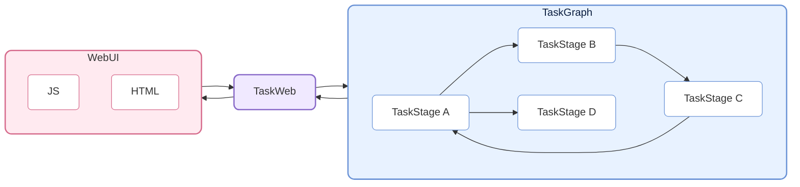
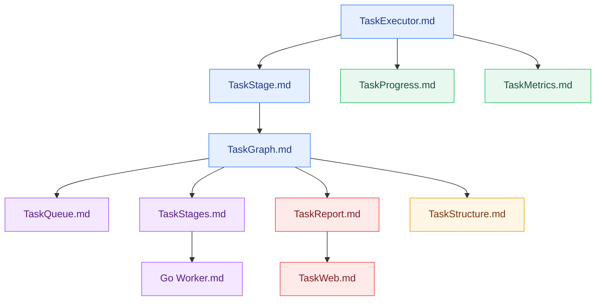

# CelestialFlow — 軽量・並列対応・グラフベースのPythonタスクスケジューリングフレームワーク

> 📅 最終更新日: 2026/05/15

<p align="center">
  
</p>

<p align="center">
  <a href="https://pypi.org/project/celestialflow/"></a>
  <a href="https://pepy.tech/projects/celestialflow"></a>
  <a href="https://pypi.org/project/celestialflow/"></a>
  <a href="https://pypi.org/project/celestialflow/"></a>
</p>

<p align="center">
  
  
  
  
</p>

<p align="center">
  <a href="../../README.md">中文</a> | <a href="../en/README.md">English</a> | <a href="README.md">日本語</a>
</p>

**CelestialFlow** は軽量ながら機能が充実したタスクフローフレームワークです。**複雑な依存関係**、**柔軟な実行モデル**、**デバイス間実行**、**リアルタイム可視化監視** を必要とする中・大規模Pythonタスクシステムに最適です。

- Airflow/Dagsterより軽量で、すぐに使い始められます
- multiprocessing/threadingより構造化されており、ループ・完全グラフなどの複雑な依存パターンをネイティブに表現できます

フレームワークの基本単位は **TaskExecutor** で、独立して実行可能であり、3つの実行モードをサポートします：

* **シリアル（serial）**
* **マルチスレッド（thread）**
* **コルーチン（async）**

TaskExecutorは結果キャッシュ、タスク重複排除、プログレスバー表示、複数実行モードの比較などの機能を備えており、単体でも十分に便利です。

TaskExecutorを直接使用するだけでなく、より重要なのはそのサブクラスである**TaskStage**の活用です。TaskStageは相互に接続でき、上流・下流の依存関係を持つタスクグラフ（**TaskGraph**）を構成します。下流のstageは上流の完了結果を自動的に入力として受け取り、明確なデータフローを形成します。

TaskStageのタスク実行モードはTaskExecutorと同じ3種類です：

* **シリアル（serial）**
* **マルチスレッド（thread）**
* **コルーチン（async）**

グラフレベルでは、各Stageは2つのコンテキストモードをサポートします：

* **シリアル実行（serial layout）**：現在のノードが完了してから次のノードを起動します（下流ノードはタスクを先に受信できますが、即時実行はしません）。
* **スレッド実行（thread layout）**：現在のノードをメインプロセス内の独立スレッドで起動します。I/O集約型タスクやpickle不可の関数（lambdaなど）に適しています。

TaskGraphは完全な**有向グラフ（Directed Graph）**構造を構築でき、従来のDAGだけでなく、**ツリー型**、**ループ型**、さらには**完全グラフ**形式のタスク依存関係も柔軟に表現できます。

実行とスケジューリングに加え、CelestialFlowは**CelestialTree（略称：ctree）イベント追跡システム**を導入しています。すべてのタスクとその派生動作（成功、失敗、リトライ、分割、ルーティングなど）に対して明確な因果関係を記録します。ctreeを使用することで、任意の初期タスクからTaskGraph内での完全な伝播経路と実行軌跡を復元でき、タスクシステムの完全な**トレーサビリティ、分析、説明可能性**を実現します。

これに加えて、CelestialFlowはWebベースの可視化監視をサポートし、Redisを介したプロセス間・デバイス間の連携も可能です。さらに、Goベースの外部ワーカー（Redis経由で通信）を統合し、CPU集約型タスクを処理することで、Pythonのパフォーマンス上の制約を補完します。

## プロジェクト構造



## クイックスタート

CelestialFlowのインストール：

```bash
# 推奨: `uv` で依存関係と環境を管理
uv pip install celestialflow

# または `pip` を直接使用
pip install celestialflow
```

シンプルな実行可能コード：

```python
from celestialflow import TaskStage, TaskGraph

def add(x, y): 
    return x + y

def square(x): 
    return x ** 2

if __name__ == "__main__":
    # 2つのタスクノードを定義
    stage1 = TaskStage(name="Adder", func=add, execution_mode="thread", unpack_task_args=True, stage_mode="thread")
    stage2 = TaskStage(name="Squarer", func=square, execution_mode="thread", stage_mode="thread")

    graph = TaskGraph()
    graph.set_stages(stages=[stage1, stage2])
    graph.connect([stage1], [stage2])

    # タスクを初期化して開始
    graph.start_graph({stage1.get_tag(): [(1, 2), (3, 4), (5, 6)]})
```

注意：.ipynbノートブックでは実行しないでください。

👉 完全なクイックスタートガイドは [クイックスタート](https://github.com/Mr-xiaotian/CelestialFlow/blob/main/docs/ja/quick_start.md) をご覧ください。

## 参考ドキュメント

フレームワークの全体構造とコアコンポーネントを理解するために、以下のリファレンスドキュメントが参考になります：

- [stage/core_executor.md](https://github.com/Mr-xiaotian/CelestialFlow/blob/main/docs/ja/src/stage/core_executor.md)
- [stage/core_stage.md](https://github.com/Mr-xiaotian/CelestialFlow/blob/main/docs/ja/src/stage/core_stage.md)
- [graph/core_graph.md](https://github.com/Mr-xiaotian/CelestialFlow/blob/main/docs/ja/src/graph/core_graph.md)
- [observability/core_progress.md](https://github.com/Mr-xiaotian/CelestialFlow/blob/main/docs/ja/src/observability/core_progress.md)
- [runtime/core_metrics.md](https://github.com/Mr-xiaotian/CelestialFlow/blob/main/docs/ja/src/runtime/core_metrics.md)
- [runtime/core_queue.md](https://github.com/Mr-xiaotian/CelestialFlow/blob/main/docs/ja/src/runtime/core_queue.md)
- [stage/core_stages.md](https://github.com/Mr-xiaotian/CelestialFlow/blob/main/docs/ja/src/stage/core_stages.md)
- [observability/core_report.md](https://github.com/Mr-xiaotian/CelestialFlow/blob/main/docs/ja/src/observability/core_report.md)
- [graph/core_structure.md](https://github.com/Mr-xiaotian/CelestialFlow/blob/main/docs/ja/src/graph/core_structure.md)
- [web/core_server.md](https://github.com/Mr-xiaotian/CelestialFlow/blob/main/docs/ja/src/web/core_server.md)
- [other/go_worker.md](https://github.com/Mr-xiaotian/CelestialFlow/blob/main/docs/ja/other/go_worker.md)

推奨する読書順序：



以下は補足資料としてお読みいただけます：

- [runtime/util_queue.md](https://github.com/Mr-xiaotian/CelestialFlow/blob/main/docs/ja/src/runtime/util_queue.md)
- [runtime/util_types.md](https://github.com/Mr-xiaotian/CelestialFlow/blob/main/docs/ja/src/runtime/util_types.md)
- [runtime/util_errors.md](https://github.com/Mr-xiaotian/CelestialFlow/blob/main/docs/ja/src/runtime/util_errors.md)
- [persistence/core_fail.md](https://github.com/Mr-xiaotian/CelestialFlow/blob/main/docs/ja/src/persistence/core_fail.md)
- [persistence/core_log.md](https://github.com/Mr-xiaotian/CelestialFlow/blob/main/docs/ja/src/persistence/core_log.md)

完全な例を通じてフレームワークの動作を理解したい場合は、TaskGraphを使ってゼロからプロジェクトを構築するチュートリアルをご参照ください：

[📘 チュートリアル](https://github.com/Mr-xiaotian/CelestialFlow/blob/main/docs/ja/tutorial.md)

バージョン3.0.7で導入されたctree_clientとその機能に興味がある場合：

[📚 CelestialTreeClient](https://github.com/Mr-xiaotian/CelestialFlow/blob/main/docs/ja/other/ctree_client.md)

さらに多くのデモコードを実行できます。各デモファイルとその関数の説明はこちら：

[🎮 demo/](https://github.com/Mr-xiaotian/CelestialFlow/blob/main/docs/ja/demo/)

テストコードを実行する場合は、まず以下のドキュメントをご確認ください：

[🧪 tests/](https://github.com/Mr-xiaotian/CelestialFlow/blob/main/docs/ja/tests/)

ベンチマーク結果を確認したい場合 — このデータはフレームワークの一部の設計判断の根拠となっています：

[⚡ bench/](https://github.com/Mr-xiaotian/CelestialFlow/blob/main/docs/ja/bench/)

## 動作要件

**CelestialFlow** はPython 3.10以上をベースとし、以下のコアコンポーネントに依存しています。  
お使いの環境でこれらの依存関係が正常にインストールできることを確認してください（`pip install celestialflow` で自動インストールされます）。

| 依存パッケージ      | 説明 |
| ------------------- | ---- |
| **Python ≥ 3.10**   | 実行環境、バージョン3.10以上を推奨 |
| **tqdm**            | オプション、タスク実行の可視化用プログレスバー |
| **fastapi**         | Webサービスフレームワーク（タスクの可視化とリモート制御用） |
| **uvicorn**         | FastAPI用の高性能ASGIサーバー |
| **requests**        | タスクステータスの報告とリモート呼び出し用HTTPクライアント |
| **networkx**        | タスクグラフ（TaskGraph）構造と依存関係分析 |
| **jinja2**          | Web可視化インターフェースレンダリング用のFastAPIテンプレートエンジン |
| **redis**           | オプション、分散タスク通信用（`TaskRedis*`シリーズモジュール） |
| **celestialtree**   | オプション、タスクステータス報告とリモート呼び出し用（`ctree_client`） |

## ファイル構造

<p align="center">
  
  <br/>
  <em>celestial-flow 3.2.0</em>
</p>

（このビューは別プロジェクト [CelestialVault](https://github.com/Mr-xiaotian/CelestialVault) の `inst_file.FileTree.print_tree()` で生成されています。画像変換には [Carbon](https://carbon.now.sh) を使用しています。）

## バージョンログ
- 3.2.0
  - feat:
    - [Important] `stage_mode="process"` を完全に廃止し、すべての multiprocessing 依存（MPValue、MPQueue、multiprocessing.Process）を削除しました。
      - bench_graph_mode のデータにより、process モードはすべてのシナリオで thread モードより遅く、大量のシリアライズオーバーヘッドと pickle の制限を伴うことが判明しました。
    - [Important] set_stages から手動で指定していた `root_stages` パラメータを削除し、SCC 縮合グラフによって計算される `source_stages` のセットに置き換えました。
      - グラフ理論をかなり復習しました
      - 現在はリフレッシュ間隔と履歴長の設定のみサポートしています。今後さらに多くの設定を追加できます
    - graph/stage/executor のデフォルトログレベルを `SUCCESS` から `INFO` に変更しました。つまりデフォルトでは開始/停止メッセージとエラーのみ表示されます
    - Web ページに設定ボタンを追加しました
  - refactor:
    - stage_mode から `process` を削除したことにより、`process` に対応するために設計されていたフレームワークの一部を削除またはリファクタリングしました
      - 例えば、すべての MPValue と MPQueue を int と Queue に変更しました
      - 厳密な bench テストはまだ行っていませんが、一定のパフォーマンス改善が見込まれます
    - NetworkX グラフの構築プロセスをリファクタリングし、ノードと出辺を通じて直接構築するようになり、再帰に依存しなくなりました
    - リトライ検出メカニズムで、元の string 型ではなく bytes 型のハッシュを計算するようにしました
      - bench_hash_memory によると、メモリを約23%節約できます
    - ノードステータスの delta データを Web 側の JS で計算するように移動し、不要な通信データを削減しました
  - fix:
    - InQueue.get のエラーキャッチを削除しました。これにより panic レベルのエラーが見逃される問題がありました

過去のログの詳細：

[change_log.md](https://github.com/Mr-xiaotian/CelestialFlow/blob/main/docs/ja/change_log.md)

## Star履歴

プロジェクトに興味をお持ちの方は、ぜひstarをお願いします。質問やご提案がある場合は、[Issues](https://github.com/Mr-xiaotian/CelestialFlow/issues)を提出するか、[Discussions](https://github.com/Mr-xiaotian/CelestialFlow/discussions)でお知らせください。


## ライセンス
このプロジェクトはMITライセンスの下で公開されています。詳細は[LICENSE](../../LICENSE)ファイルをご覧ください。

## 著者
著者: Mr-xiaotian
メール: mingxiaomingtian@gmail.com
プロジェクトリンク: [https://github.com/Mr-xiaotian/CelestialFlow](https://github.com/Mr-xiaotian/CelestialFlow)
