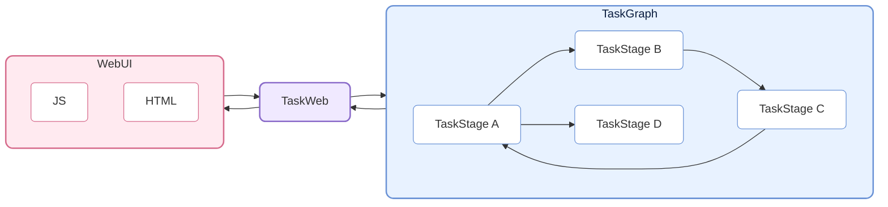
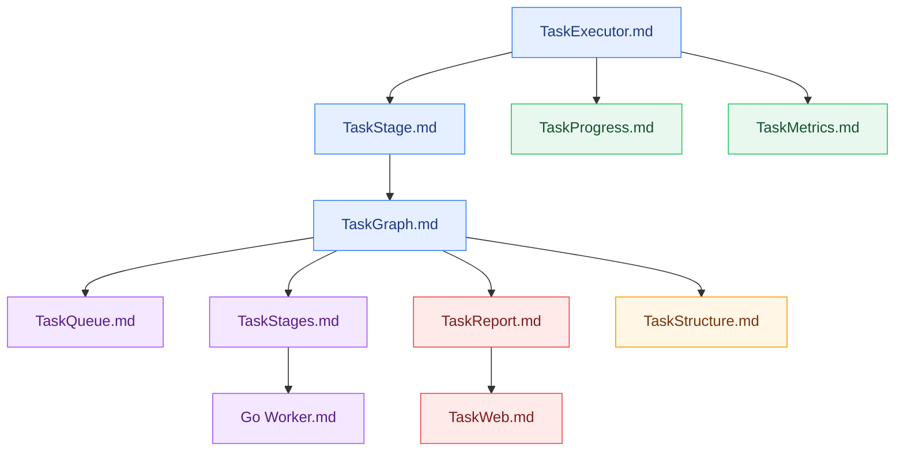

# CelestialFlow —— 軽量で並列可能なグラフ構造ベースの Python タスクスケジューリングフレームワーク

<p align="center">
  
</p>

<p align="center">
  <a href="https://pypi.org/project/celestialflow/"></a>
  <a href="https://pepy.tech/projects/celestialflow"></a>
  <a href="https://pypi.org/project/celestialflow/"></a>
  <a href="https://pypi.org/project/celestialflow/"></a>
</p>

<p align="center">
  
  
  
  
</p>

<p align="center">
  <a href="https://github.com/Mr-xiaotian/CelestialFlow/blob/main/docs/zh-CN/README.md">中文</a> | <a href="https://github.com/Mr-xiaotian/CelestialFlow/blob/main/docs/en/README.md">English</a> | <a href="https://github.com/Mr-xiaotian/CelestialFlow/blob/main/docs/ja/README.md">日本語</a>
</p>

**CelestialFlow** は、軽量でありながら完全な機能を備えたタスクフローフレームワークで、**複雑な依存関係**、**柔軟な実行モデル**、**クロスデバイス実行**、**リアルタイム可視化監視**を必要とする中/大規模 Python タスクシステムに適している。

- Airflow/Dagster より軽量で、より早く開始可能
- multiprocessing/threading より構造化されており、loop / complete graph などの複雑な依存パターンを直接表現可能

フレームワークの基本ユニットは **TaskExecutor** で、独立して実行でき、3 つの実行モードをサポートする：

* **リニア（serial）**
* **マルチスレッド（thread）**
* **コルーチン（async）**

TaskExecutor はタスクの結果キャッシュ、タスク重複排除、プログレスバー表示、多実行モード比較などの機能を実装しており、単独でも非常に使いやすくなっている。

ただし、TaskExecutor を直接使用する以外に、より重要なのはそのサブクラス **TaskStage** の使用である。TaskStage は相互に接続して、上流と下流の依存関係を持つタスクグラフ（**TaskGraph**）を形成できる。下流の stage は上流の実行完了結果を自動的に入力として受け取り、明確なデータフローを形成する。

TaskStage のタスク実行モードも TaskExecutor と同様に 3 つを含む。

グラフレベルでは、各 Stage は 2 つのコンテキストモードをサポートする：

* **リニア実行（serial layout）**：現在のノードが実行完了してから次のノードを起動（下流ノードは事前にタスクを受信可能だが、すぐには実行されない）。
* **スレッド実行（thread layout）**：現在のノードがメインプロセスの独立したスレッドで起動され、I/O 集中型タスクや pickle 不可能な関数（lambda など）に適している。

TaskGraph は完全な **有向グラフ構造（Directed Graph）** を構築でき、従来の有向非巡回グラフ（DAG）だけでなく、**ツリー（Tree）**、**循環（loop）**、さらには **完全グラフ（Complete Graph）** 形式のタスク依存関係も柔軟に表現できる。

実行とスケジューリングに加えて、CelestialFlow はさらに **CelestialTree（略称: ctree）イベント追跡システム**を導入し、各タスクとその派生動作（成功、失敗、リトライ、分割、ルーティングなど）に明確な因果関係を記録する。ctree を利用することで、任意の初期タスクから出発し、TaskGraph 内での伝播経路と実行軌跡を完全に復元でき、タスクシステムの完全な**追跡、分析、解釈**が可能になる。

この基盤の上に、CelestialFlow は Web 可視化監視をサポートし、Redis をベースとした demo や Go Worker 外部協力のサンプルを提供し、オンデマンドでクロスプロセス、クロスデバイスのタスク協力を構築する方法を示す。

## プロジェクト構造（Project Structure）



## クイックスタート（Quick Start）

CelestialFlow のインストール：

```bash
# 依存関係と環境の管理に `uv` の使用を推奨
uv pip install celestialflow

# ただし `pip` を直接使用することも可能
pip install celestialflow
```

CelestialFlow の核心スケジューリング、Web、永続化、demo/test 以外の通常機能だけを使用するのであれば、上記のインストールで十分である。

CelestialTree イベント追跡能力も有効にする必要がある場合は、**追加で** `celestialtree` をインストールする：

```bash
# 公開パッケージの利用者向け
uv pip install celestialtree

# リポジトリを clone した開発者/貢献者向け
uv sync --group dev
```

シンプルな実行可能コード：

```python
from celestialflow import TaskStage, TaskGraph

def add(x, y): 
    return x + y

def square(x): 
    return x ** 2

if __name__ == "__main__":
    # 2 つのタスクノードを定義
    stage1 = TaskStage(name="Adder", func=add, stage_mode="thread", execution_mode="thread", unpack_task_args=True)
    stage2 = TaskStage(name="Squarer", func=square, stage_mode="thread", execution_mode="thread")

    # タスクグラフ構造を構築
    graph = TaskGraph()
    graph.set_stages(stages=[stage1, stage2])
    graph.connect([stage1], [stage2])

    # タスクを初期化して起動
    graph.start_graph({stage1.get_name(): [(1, 2), (3, 4), (5, 6)]})
```

.ipynb での実行は避けてください。

👉 完全な Quick Start は [Quick Start](https://github.com/Mr-xiaotian/CelestialFlow/blob/main/docs/zh-CN/quick_start.md) をご覧ください

## 詳細な読み物（Further Reading）

フレームワークの全体構造とコアコンポーネントを理解したい場合は、以下の参考ドキュメントが役立つ：

- [stage/core_executor.md](https://github.com/Mr-xiaotian/CelestialFlow/blob/main/docs/zh-CN/src/stage/core_executor.md)
- [stage/core_stage.md](https://github.com/Mr-xiaotian/CelestialFlow/blob/main/docs/zh-CN/src/stage/core_stage.md)
- [graph/core_graph.md](https://github.com/Mr-xiaotian/CelestialFlow/blob/main/docs/zh-CN/src/graph/core_graph.md)
- [observability/core_progress.md](https://github.com/Mr-xiaotian/CelestialFlow/blob/main/docs/zh-CN/src/observability/core_progress.md)
- [runtime/core_metrics.md](https://github.com/Mr-xiaotian/CelestialFlow/blob/main/docs/zh-CN/src/runtime/core_metrics.md)
- [runtime/core_queue.md](https://github.com/Mr-xiaotian/CelestialFlow/blob/main/docs/zh-CN/src/runtime/core_queue.md)
- [stage/core_stages.md](https://github.com/Mr-xiaotian/CelestialFlow/blob/main/docs/zh-CN/src/stage/core_stages.md)
- [observability/core_report.md](https://github.com/Mr-xiaotian/CelestialFlow/blob/main/docs/zh-CN/src/observability/core_report.md)
- [graph/core_structure.md](https://github.com/Mr-xiaotian/CelestialFlow/blob/main/docs/zh-CN/src/graph/core_structure.md)
- [web/core_server.md](https://github.com/Mr-xiaotian/CelestialFlow/blob/main/docs/zh-CN/src/web/core_server.md)
- [other/go_worker.md](https://github.com/Mr-xiaotian/CelestialFlow/blob/main/docs/zh-CN/other/go_worker.md)

推奨読書順序：



以下の 3 編は補足読書として参照できる：

- [runtime/util_hash.md](https://github.com/Mr-xiaotian/CelestialFlow/blob/main/docs/zh-CN/src/runtime/util_hash.md)
- [runtime/util_types.md](https://github.com/Mr-xiaotian/CelestialFlow/blob/main/docs/zh-CN/src/runtime/util_types.md)
- [runtime/util_errors.md](https://github.com/Mr-xiaotian/CelestialFlow/blob/main/docs/zh-CN/src/runtime/util_errors.md)
- [persistence/core_fallback.md](https://github.com/Mr-xiaotian/CelestialFlow/blob/main/docs/zh-CN/src/persistence/core_fallback.md)
- [persistence/core_log.md](https://github.com/Mr-xiaotian/CelestialFlow/blob/main/docs/zh-CN/src/persistence/core_log.md)

完全なケースを通じてフレームワークの動作方法を理解したい場合は、TaskGraph を使用してゼロからプロジェクトを構築するこのチュートリアルを参照：

[📘 ケースチュートリアル](https://github.com/Mr-xiaotian/CelestialFlow/blob/main/docs/zh-CN/tutorial.md)

3.0.7 バージョンで追加された ctree_client とその機能に興味がある場合は、こちらをご覧ください：

[📚 CelestialTreeClient](https://github.com/Mr-xiaotian/CelestialFlow/blob/main/docs/zh-CN/other/ctree_client.md)

さらに多くのデモコードを実行できる。各デモファイルとその中のデモ関数の説明はこちらに記録されている：

[🎮 demo/ 総覧](https://github.com/Mr-xiaotian/CelestialFlow/blob/main/docs/zh-CN/demo/README.md)

テストコードを実行したい場合は、まず以下のドキュメント内容を確認：

[🧪 tests/ 総覧](https://github.com/Mr-xiaotian/CelestialFlow/blob/main/docs/zh-CN/tests/README.md)

bench の内容を確認したい場合、ここのデータはフレームワークの一部設計上の意思決定の根拠となっている：

[⚡ bench/ 総覧](https://github.com/Mr-xiaotian/CelestialFlow/blob/main/docs/zh-CN/bench/README.md)

## 環境要件（Requirements）

**CelestialFlow** は Python 3.12+ ベースで、以下の核心コンポーネントに依存する。
`celestialtree` はデフォルトの実行時依存ではなく、追加インストールするオプションコンポーネントとなった。

| 依存パッケージ           | 説明 |
| ----------------- | ---- |
| **Python ≥ 3.12**  | 実行環境、3.12 以上を推奨 |
| **fastapi**       | Web サービスインターフェースフレームワーク（タスク可視化とリモート制御用） |
| **uvicorn**       | FastAPI の高性能 ASGI サーバー |
| **requests**      | HTTP クライアントライブラリ、タスク状態レポートとリモート呼び出し用 |
| **jinja2**        | FastAPI テンプレートエンジン、Web 可視化インターフェースレンダリング用 |
| **tqdm**          | オプションコンポーネント、プログレスバー表示、タスク実行可視化用 |

`demo/demo_redis.py` や Go Worker サンプルを実行する必要がある場合は、追加で `redis` をインストールし Redis サービスを準備する；この部分はデフォルトの実行時依存ではない。

CelestialTree に依存する demo / bench / 追跡クエリを実行する必要がある場合は、追加で `celestialtree` をインストールするか、ソースリポジトリで直接 `uv sync --group dev` を実行する。

## ファイル構造（File Structure）

<p align="center">
  
  <br/>
  <em>celestial-flow 3.2.4</em>
</p>

(このビューは私の別プロジェクト [CelestialVault](https://github.com/Mr-xiaotian/CelestialVault) の `inst_file.FileTree.print_tree()` によって生成された。画像への変換は [Carbon](https://carbon.now.sh) を利用している。)

## バージョンログ（Version Log）
- 3.2.4
  - feat:
    - **[IMPORTANT]** もとの `fail_funnel` と `success_funnel` メカニズムを `fallback` に統合し、`sqlite` で保存するようにした
      - もと `jsonl` 保存ベースの fail 永続化メカニズムは保存時には非常に便利だったが、読み出し時には毎回全量をメモリに読み込んでから検索する必要があり、非常に面倒だった；`redis` のようなデータベースサービスも検討したが、別途サードパーティサービスを起動したくなかった。そこで `sqlite` がすべての要求に完璧に合致していることに気づいた
      - Richard 万歳！
      - また、もとの `success_funnel` 机制は完全に未完成品だった：`executor` にしか使えず、`stage` には使えず、完全にメモリ内保存だった。したがってこの機会に一緒にリファクタリングし、`fallback_funnel` に統合した
      - 現在 `fallback_funnel` は、タスクの`注入/重複/リトライ/失敗/成功`時に sqlite の対応レコードを挿入/更新/削除する
      - タスクタスク成功時はデフォルトでそのレコードを削除するが、`executor` の `perist_result` オプションを有効にするとレコードを残し、`status` フィールドを `success` に更新する
    - **[IMPORTANT]** `stages` 内の 3 つの redis ノードを削除し、demo ファイルを追加して、自分で関連ノードを構築する方法を説明する
      - `TaskSplitter` や `TaskRouter` と比べて、この 3 つのノードはなくても構わず、さらに `redis` 依存パッケージが 1 つ増えるだけだった
    - **[IMPORTANT]** `celestialtree` は依存ライブラリとして継続されなくなり、現在のイベント宣言メカニズムはプロトコルインターフェースに基づき、デフォルトでローカルの超簡易実装を使用する
      - これもまたライブラリ依存を増やしたくないためである。`celestialtree` ライブラリは `grpcio` と `protobuf` に依存しており、これらは Python の free-threading バージョンとの相性があまり良くない。そのためそれらが存在する場合、`celestialflow` は free-threading バージョンで実行できない——これは非常に期待していたことである
      - `bench_gil_vs_nogil` によると、free-threading バージョンでは `executor` が CPU 集約型タスクで 5.25 倍、`graph` が CPU 集約型タスクで 7.55 倍の向上を得る。非常に喜ばしい
    - フロントエンド「ノード指標の推移」カードに「グローバル待機キュー」を追加
    - `graph` に `start_graph_db` メソッドを追加。fallback データベースパスを受け取り、そこから失敗データに基づいて `start_graph` を実行する；`executor` に `start_db` メソッドを追加。fallback データベースパスを受け取り、そこから失敗データに基づいて `start` を実行する
      - とても便利
  - refactor:
    - **[IMPORTANT]** サーバー側の error データ保存方式を Python ネイティブリストから一時的な sqlite データベースに変更
      - ハンマー効果のもと、sqlite の使用をもっと試したくなった
    - 各 `graph` に `name` と `time.time()` に基づく `graph_id` を追加し、一意性識別子とする
    - reporter とサーバー側のインタラクションロジックを書き直す
      - 現在、毎回の refresh 開始時に状態を整合させ、`graph_id` を通じて両者が保持するデータが同じ `graph` オブジェクトからのものかを判定する。一致する場合、structure/analysis データを再度 push する必要がない
      - 状態整合時に両者の graph が一致すれば、サーバーは自身が保持するエラーデータの中で最大の `event_id` 値を返す。厳密に検証された結果、`event_id` はデータベース内で厳密に増加する
      - reporter 内のもとの `push_error_meta` と `push_error_content` を統合し、毎回の refresh 時に新規のエラーデータのみを送信する。新規データはサーバーが返した最大 `event_id` 値とローカルデータベース内の最大 `event_id` 値に基づいて選別する
    - `graph.connect` と `graph_set_stage` により多くの責務を紐付ける
      - 現在、ノードと `graph` の `ctree` `reporter` 上の同期は `graph_set_stage` 内で完了する
      - また、`task_queue` と `result_queue` の上下流バインディング、および `counter` のバインディングはすべて `graph.connect` 内で完了する
    - `TaskEnvelope` 内の無関係なデータを削除し、`task` `hash` `id` の 3 項目のみを保持する
      - `source` フィールドはそもそも追加すべきではなく、一向に機能していなかった
      - `prev` フィールドはもとの `success_funnel` 用であり、現在は不要になった
    - `TaskMetrics` 内では、すべての `counter` を `Lock` で固定して限定し、`executor` の `execution_mode` とは無関係にする
      - この固定モードは一部の性能を犠牲にするが、コードをより安定させる
      - `bench_lock_overhead` によると、これにより `counter` は約 3.2 倍遅くなるが、`counter` の更新はすべて `int` 型に基づいており、もとから速いので許容範囲である
    - `process_task_success` 内の既存の 1 回の `task.success` 宣言を削除し、`result_envelope` が `result_queue` に入る前に `task.input` 宣言を行うようにする
      - fallback の sqlite 内で `event_id` がグローバルに統一されることを保証するため
    - `executor.get_fail_pairs`（旧 `executor.get_error_pairs`）は `tuple[T, PeristedError]` を返す
      - `PeristedError` は記録された `error_type` と `error_message` から構成される
    - `TaskRouter` ノードを書き直し、現在は `router` 関数を必ず渡してタスクのルーティング方向を指定する必要がある
    - いくつかの不要なメソッドを削除
      - 例えば `TaskGraph.get_stage_input_trace`
  - fix:
    - フロントエンドダッシュボードページの構造図がタブ切り替えで空白になる問題を修正
      - これは非常に古いバグで、なぜ以前修正しなかったのか分からない
  - chore:
    - さらに多くの demo を追加
    - さらに多くの benchmark を追加
    - `Agents.md` ファイルを追加
      - AI に対する終わりなき強調にうんざりした

より多くの過去ログは以下をご覧ください：

[change_log.md](https://github.com/Mr-xiaotian/CelestialFlow/blob/main/docs/zh-CN/change_log.md)

## Star 履歴トレンド（Star History）

プロジェクトに興味があれば、star を歓迎する。質問や提案があれば、[Issues](https://github.com/Mr-xiaotian/CelestialFlow/issues) を提出するか、[Discussion](https://github.com/Mr-xiaotian/CelestialFlow/discussions) でお知らせください。


## ライセンス（License）
This project is licensed under the MIT License - see the [LICENSE](https://github.com/Mr-xiaotian/CelestialFlow/blob/main/LICENSE) file for details.

## 作者（Author）
Author: Mr-xiaotian
Email: mingxiaomingtian@gmail.com
Project Link: [https://github.com/Mr-xiaotian/CelestialFlow](https://github.com/Mr-xiaotian/CelestialFlow)
