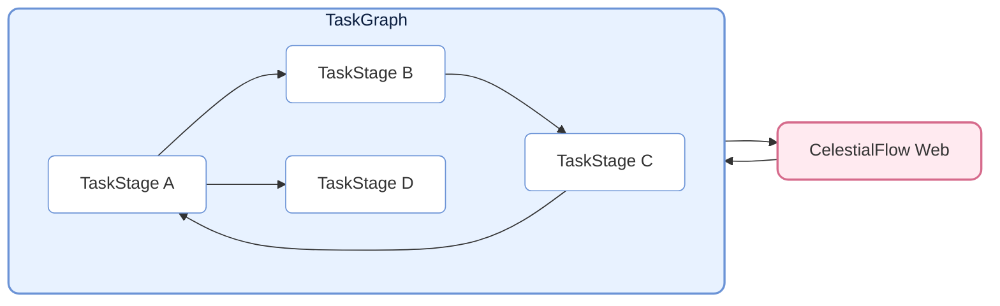
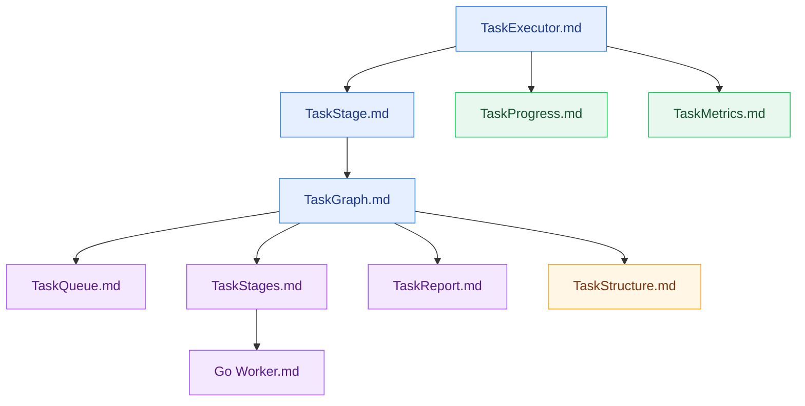

# CelestialFlow —— 軽量で並列処理が可能な、グラフ構造ベースの Python タスクスケジューリングフレームワーク

> 📅 最終更新日: 2026/07/16

<p align="center">
  
</p>

<p align="center">
  <a href="https://pypi.org/project/celestialflow/"></a>
  <a href="https://pepy.tech/projects/celestialflow"></a>
  <a href="https://pypi.org/project/celestialflow/"></a>
  <a href="https://pypi.org/project/celestialflow/"></a>
</p>

<p align="center">
  
  
  
</p>

<p align="center">
  <a href="https://github.com/Mr-xiaotian/CelestialFlow/blob/main/README.md">中文</a> | <a href="https://github.com/Mr-xiaotian/CelestialFlow/blob/main/docs/en/README.md">English</a> | <a href="https://github.com/Mr-xiaotian/CelestialFlow/blob/main/docs/ja/README.md">日本語</a>
</p>

**CelestialFlow** は、**複雑な依存関係**、**柔軟な実行モデル**、**クロスデバイス実行**、**観測可能な実行チェーン**を必要とする中〜大規模 Python タスクシステムに適した、軽量でありながら完全な機能を備えたタスクフローフレームワークです。

- Airflow/Dagster と比較して、より軽量で、より迅速に開始できます
- multiprocessing/threading と比較して、より構造化されており、loop / complete graph などの複雑な依存パターンを直接表現できます

フレームワークの基本単位は **TaskExecutor** で、独立して実行可能であり、3つの実行モードをサポートします：

* **リニア（serial）**
* **マルチスレッド（thread）**
* **コルーチン（async）**

TaskExecutor は、タスク結果のキャッシュ、タスク重複排除、プログレスバー表示、複数実行モードの比較などの機能を実装しており、単体でも便利に使用できます。

しかし、TaskExecutor を直接使用する以外に、より重要なのはそのサブクラスである **TaskStage** を使用することです。TaskStage は相互に接続することで、上流と下流の依存関係を持つタスクグラフ（**TaskGraph**）を形成できます。下流の stage は、上流の実行完了結果を自動的に入力として受け取り、明確なデータフローを形成します。

TaskStage のタスク実行モードも同様に3種類あり、TaskExecutor と一致します。

グラフレベルでは、各 Stage は2つのコンテキストモードをサポートします：

* **リニア実行（serial layout）**：現在のノードの実行が完了してから次のノードを開始します（下流ノードは事前にタスクを受け取ることができますが、すぐには実行されません）。
* **スレッド実行（thread layout）**：現在のノードはメインプロセスの独立したスレッドで開始され、I/O バウンドタスクや pickle 化できない関数（lambda など）に適しています。

TaskGraph は完全な**有向グラフ構造（Directed Graph）**を構築でき、従来の有向非巡回グラフ（DAG）だけでなく、**ツリー（Tree）**、**循環（loop）**、さらには**完全グラフ（Complete Graph）**形式のタスク依存関係も柔軟に表現できます。

実行とスケジューリングに加えて、CelestialFlow はさらに **CelestialTree（略称: ctree）イベントトレーシングシステム**を導入し、各タスクとその派生動作（成功、失敗、リトライ、分割、ルーティングなど）に明確な因果関係を記録します。ctree を活用することで、任意の初期タスクから出発して、TaskGraph 内での伝播経路と実行軌跡を完全に復元でき、タスクシステムの完全な**追跡、分析、説明**が可能になります。

これに基づき、CelestialFlow はイベントトレーシング、状態報告、永続化再生を提供し、Redis ベースのデモと Go Worker 外部連携サンプルを用いて、必要に応じたクロスプロセス・クロスデバイスのタスク連携方法を示します。

## プロジェクト構造（Project Structure）



## クイックスタート（Quick Start）

CelestialFlow のインストール：

```bash
# 推荐使用 `uv` 管理依赖与环境
uv pip install celestialflow

# 不过也可以直接使用 `pip`
pip install celestialflow
```

CelestialFlow のコアスケジューリング、観測可能性、永続化機能のみを使用する場合、上記のインストールで十分です。

CelestialTree イベントトレーシング機能も有効にする必要がある場合は、**追加で** `celestialtree` をインストールする必要があります：

```bash
# 对已发布包使用者
uv pip install celestialtree

# 如果你是 clone 仓库后的开发者/贡献者
uv sync --group dev
```

シンプルな実行可能コード：

```python
from celestialflow import TaskStage, TaskGraph

def add(x, y): 
    return x + y

def square(x): 
    return x ** 2

if __name__ == "__main__":
    # 定义两个任务节点
    stage1 = TaskStage(name="Adder", func=add, stage_mode="thread", execution_mode="thread", unpack_task_args=True)
    stage2 = TaskStage(name="Squarer", func=square, stage_mode="thread", execution_mode="thread")

    # 构建任务图结构
    graph = TaskGraph(name="DemoGraph")
    graph.set_stages(stages=[stage1, stage2])
    graph.connect([stage1], [stage2])

    # 初始化任务并启动
    graph.start_graph({stage1.get_name(): [(1, 2), (3, 4), (5, 6)]})
```

注意：.ipynb では実行しないでください。

👉 完全なクイックスタートを確認するには、[Quick Start](https://github.com/Mr-xiaotian/CelestialFlow/blob/main/docs/zh-CN/quick_start.md) をご覧ください。

## 詳細資料（Further Reading）

フレームワークの全体的な構造とコアコンポーネントを理解したい
場合、以下の参考ドキュメントが役立ちます：

- [TaskExecutor.md](https://github.com/Mr-xiaotian/CelestialFlow/blob/main/docs/zh-CN/src/stage/core_executor.md)
- [TaskStage.md](https://github.com/Mr-xiaotian/CelestialFlow/blob/main/docs/zh-CN/src/stage/core_stage.md)
- [TaskGraph.md](https://github.com/Mr-xiaotian/CelestialFlow/blob/main/docs/zh-CN/src/graph/core_graph.md)
- [TaskProgress.md](https://github.com/Mr-xiaotian/CelestialFlow/blob/main/docs/zh-CN/src/observability/core_progress.md)
- [TaskMetrics.md](https://github.com/Mr-xiaotian/CelestialFlow/blob/main/docs/zh-CN/src/runtime/core_metrics.md)
- [TaskQueue.md](https://github.com/Mr-xiaotian/CelestialFlow/blob/main/docs/zh-CN/src/runtime/core_queue.md)
- [TaskStages.md](https://github.com/Mr-xiaotian/CelestialFlow/blob/main/docs/zh-CN/src/stage/core_stages.md)
- [TaskReport.md](https://github.com/Mr-xiaotian/CelestialFlow/blob/main/docs/zh-CN/src/observability/core_report.md)
- [TaskStructure.md](https://github.com/Mr-xiaotian/CelestialFlow/blob/main/docs/zh-CN/src/graph/core_structure.md)
- [Go Worker.md](https://github.com/Mr-xiaotian/CelestialFlow/blob/main/docs/zh-CN/other/go_worker.md)

推奨読書順序：



以下の5篇は補足資料として参照できます：

- [UtilHash.md](https://github.com/Mr-xiaotian/CelestialFlow/blob/main/docs/zh-CN/src/runtime/util_hash.md)
- [UtilTypes.md](https://github.com/Mr-xiaotian/CelestialFlow/blob/main/docs/zh-CN/src/runtime/util_types.md)
- [UtilErrors.md](https://github.com/Mr-xiaotian/CelestialFlow/blob/main/docs/zh-CN/src/runtime/util_errors.md)
- [Fallback.md](https://github.com/Mr-xiaotian/CelestialFlow/blob/main/docs/zh-CN/src/persistence/core_fallback.md)
- [Log.md](https://github.com/Mr-xiaotian/CelestialFlow/blob/main/docs/zh-CN/src/persistence/core_log.md)

完全なケースを通じてフレームワークの動作を理解したい場合は、TaskGraph を使ってゼロからプロジェクトを構築するこのチュートリアルを参照してください：

[📘 ケースチュートリアル](https://github.com/Mr-xiaotian/CelestialFlow/blob/main/docs/zh-CN/tutorial.md)

バージョン3.0.7で追加された ctree_client とその機能に興味がある場合は、こちらをご覧ください：

[📚 CelestialTreeClient](https://github.com/Mr-xiaotian/CelestialFlow/blob/main/docs/zh-CN/other/ctree_client.md)

さらに多くのデモコードを実行できます。各デモファイルとそのデモ関数の説明は以下に記載されています：

[🎮 demo/ 概要](https://github.com/Mr-xiaotian/CelestialFlow/blob/main/docs/zh-CN/demo/README.md)

テストコードを実行したい場合は、まず以下のドキュメントを確認してください：

[🧪 tests/ 概要](https://github.com/Mr-xiaotian/CelestialFlow/blob/main/docs/zh-CN/tests/README.md)

ベンチマーク内容を確認したい場合、これらのデータはフレームワークの設計上の意思決定の一部の根拠にもなっています：

[⚡ bench/ 概要](https://github.com/Mr-xiaotian/CelestialFlow/blob/main/docs/zh-CN/bench/README.md)

## 環境要件（Requirements）

**CelestialFlow** は Python 3.12+ ベースで、デフォルトのランタイムは以下のコアコンポーネントに依存します。
なお、`celestialtree` はデフォルトのランタイム依存ではなく、追加インストールが必要なオプションコンポーネントです。

| 依存パッケージ           | 説明 |
| ----------------- | ---- |
| **Python ≥ 3.12**  | 実行環境、3.12 以上のバージョンを推奨 |
| **requests**      | HTTP クライアントライブラリ、タスク状態報告とリモート呼び出しに使用 |
| **tqdm**          | オプションコンポーネント、プログレスバー表示、タスク実行の可視化に使用 |

- `demo/demo_redis.py` または Go Worker サンプルを実行する必要がある場合は、`redis` を追加インストールし、Redis サービスを準備してください。この部分はデフォルトのランタイム依存ではありません。

- CelestialTree に依存する demo / bench / トレースクエリを実行する必要がある場合は、`celestialtree` を追加インストールするか、ソースリポジトリで直接 `uv sync --group dev` を実行してください。

- ビジュアル Web サービスを使用する必要がある場合は、`celestialflow-web` を追加インストールし、`celestialflow-web --host 0.0.0.0 --port 5000` を実行してください。

## ファイル構造（File Structure）

<p align="center">
  
  <br/>
  <em>celestial-flow 3.2.6</em>
</p>

（このビューは、私の別プロジェクト [CelestialVault](https://github.com/Mr-xiaotian/CelestialVault) の inst_file.FileTree.print_tree() によって生成されました。画像への変換は [Carbon](https://carbon.now.sh) を使用しています。）

## バージョン履歴（Version Log）
- 3.2.6
  - feat:
    - `graph` と `stage` に、DB ファイルを直接読み取ってタスクをリトライ/続行するメソッドを追加
      - それぞれ `start_graph_db` と `start_db`
  - refactor:
    - **[IMPORTANT]** Web 部分を別プロジェクト [celestialflow-web](https://github.com/Mr-xiaotian/celestialflow-web) に移行
      - 長らく検討した末の決定で、現在の Web 側コードはプロジェクト全体のスタイルと大きく異なり、もはや統合を続けるのに適していません
      - もちろん、これは `celestialflow-web` コマンドが現在のプロジェクトで無効になることを意味し、別途 `pip install celestialflow-web` のインストールが必要です
  - chore:
    - ドキュメントを全量更新し、en/ja の2言語に翻訳
    - docs/zh-CN 以下の `README.md` を削除、中国語の README はルートディレクトリのこの1つのみを保持

過去の履歴の詳細は以下をご覧ください：

[change_log.md](https://github.com/Mr-xiaotian/CelestialFlow/blob/main/docs/zh-CN/change_log.md)

## Star 履歴トレンド（Star History）

プロジェクトに興味があれば、スターを付けていただけると嬉しいです。質問や提案がある場合は、[Issues](https://github.com/Mr-xiaotian/CelestialFlow/issues) や [Discussion](https://github.com/Mr-xiaotian/CelestialFlow/discussions) でお知らせください。


## ライセンス（License）
This project is licensed under the MIT License - see the [LICENSE](https://github.com/Mr-xiaotian/CelestialFlow/blob/main/LICENSE) file for details.

## 作者（Author）
Author: Mr-xiaotian
Email: mingxiaomingtian@gmail.com
Project Link: [https://github.com/Mr-xiaotian/CelestialFlow](https://github.com/Mr-xiaotian/CelestialFlow)
