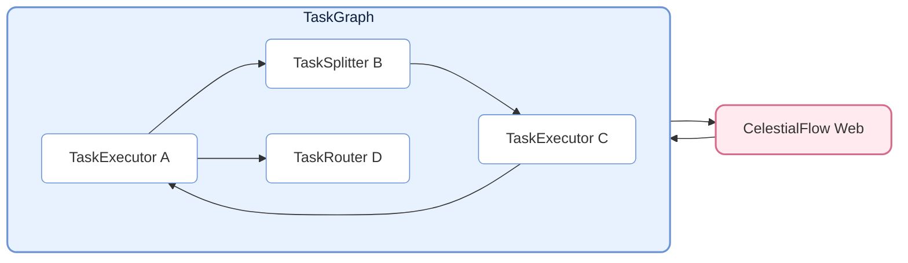
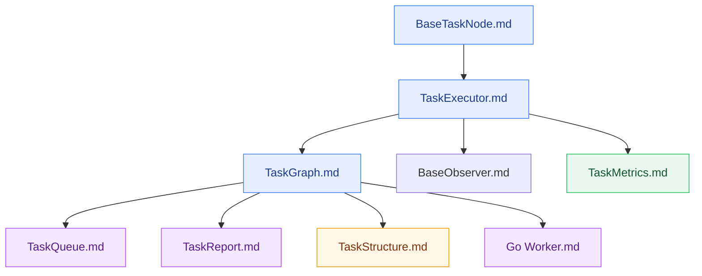

# CelestialFlow —— 軽量で並列処理可能なグラフ構造ベースの Python タスクスケジューリングフレームワーク

<p align="center">
  
</p>

<p align="center">
  <a href="https://pypi.org/project/celestialflow/"></a>
  <a href="https://pepy.tech/projects/celestialflow"></a>
  <a href="https://pypi.org/project/celestialflow/"></a>
  <a href="https://pypi.org/project/celestialflow/"></a>
</p>

<p align="center">
  
  
  
</p>

<p align="center">
  <a href="https://github.com/Mr-xiaotian/CelestialFlow/blob/main/README.md">中文</a> | <a href="https://github.com/Mr-xiaotian/CelestialFlow/blob/main/docs/en/README.md">English</a> | <a href="https://github.com/Mr-xiaotian/CelestialFlow/blob/main/docs/ja/README.md">日本語</a>
</p>

**CelestialFlow** は、**複雑な依存関係**、**柔軟な実行モデル**、**クロスデバイス実行**、**観測可能な実行チェーン** を必要とする中〜大規模 Python タスクシステムに適した、軽量でありながら完全な機能を備えたタスクフローフレームワークです。

- Airflow/Dagster と比較して、より軽量でより迅速に開始できます
- multiprocessing/threading と比較して、より構造化されており、loop / complete graph などの複雑な依存パターンを直接表現できます

フレームワークの基本単位は **タスクノード**（内部基底クラス `BaseTaskNode` を統一継承）で、現在は3種類の具体的なノード実装を公開しており、独立して実行することも、互いに接続してグラフにすることもできます：

* **TaskExecutor** — 汎用タスクエグゼキュータ
* **TaskSplitter** — 1つの入力を複数のサブタスクに分割
* **TaskRouter** — 条件に応じてタスクを異なる下流にルーティング

3つのノードはすべて以下の実行モードをサポートします：

* **リニア（serial）**
* **マルチスレッド（thread）**
* **コルーチン（async）**

`TaskExecutor` は、タスク結果のキャッシュ、タスク重複排除、プログレスバー表示、複数実行モードの比較などの機能を実装しており、単独使用でも十分に実用的です。

ノード間は **TaskGraph** を介して相互に接続され、上流と下流の依存関係を持つタスクグラフを形成します。下流ノードは上流の実行完了結果を自動的に入力として受け取り、明示的なデータフローを形成します。TaskGraph は `TaskChain` / `TaskCross` / `TaskGrid` / `TaskLoop` / `TaskWheel` / `TaskComplete` などの事前定義トポロジー構造も提供し、一般的な依存パターンを迅速に構築できます。

グラフレベルでは、`graph_mode` でグラフ内全ノードの動作方式を統一制御します：

* **リニア（serial layout）**：現在のノードの実行が完了してから次のノードを開始（下流ノードは事前にタスクを受け取れますが、すぐには実行されません）。
* **マルチスレッド（thread layout）**：現在のノードはメインプロセスの独立スレッドで起動。I/O 集中型タスクや pickle 化できない関数（lambda など）に適しています。
* **コルーチン（async layout）**：現在のノードはコルーチン方式で起動。I/O 集中型非同期タスクに適しています。

`graph_mode` × `execution_mode` で合計9種類の実行モードを構成でき、ほとんどのシナリオをカバーします。

TaskGraph は完全な**有向グラフ構造（Directed Graph）**を構築でき、従来の有向非巡回グラフ（DAG）だけでなく、**ツリー（Tree）**、**循環（loop）**、**完全グラフ（Complete Graph）** 形式のタスク依存関係も柔軟に表現できます。

実行とスケジューリングに加え、CelestialFlow は **CelestialTree（略称: ctree）イベントトレーシングシステム** を導入し、各タスクとその派生動作（成功、失敗、リトライ、分割、ルーティングなど）に明確な因果関係を記録します。ctree を活用することで、任意の初期タスクから出発して、TaskGraph 内での伝播経路と実行軌跡を完全に復元でき、タスクシステムの完全な**追跡、分析、説明**が可能になります。3.2.4 以降、`ctree` はデフォルトでローカルの超簡易実装を使用し、`celestialtree` 外部パッケージへの強制依存はありません。gRPC によるリモート追跡機能が必要な場合は、追加でインストールできます。

これに基づき、CelestialFlow はイベント追跡、状態レポート、永続化再生などの機能を提供します。Web 可視化インターフェースは独立プロジェクト [celestialflow-web](https://github.com/Mr-xiaotian/celestialflow-web) が提供し、両者は HTTP プロトコルで連携します。

## プロジェクト構造（Project Structure）


```mermaid
flowchart LR

    %% ===== TaskGraph =====
    subgraph TG[TaskGraph]
        direction LR

        S1[TaskExecutor A]
        S2[TaskSplitter B]
        S3[TaskExecutor C]
        S4[TaskRouter D]

        S1 --> S2 --> S3 --> S1
        S1 --> S4

    end

    %% TaskGraph 外枠を美化
    style TG fill:#e8f2ff,stroke:#6b93d6,stroke-width:2px,color:#0b1e3f,rx:10px,ry:10px

    %% 統一美化形式
    classDef blueNode fill:#ffffff,stroke:#6b93d6,rx:6px,ry:6px;

    %% TaskNodes を美化
    class S1,S2,S3,S4 blueNode;

    %% ===== Links =====
    TG --> CFB[CelestialFlow Web]
    CFB --> TG

    style CFB fill:#ffeaf0,stroke:#d66b8c,stroke-width:2px,rx:10px,ry:10px

```

## クイックスタート（Quick Start）

CelestialFlow のインストール：

```bash
# `uv` での依存関係と環境管理を推奨
uv pip install celestialflow

# ただし `pip` も直接使用可能
pip install celestialflow
```

CelestialFlow のコアスケジューリング、観測可能性、永続化機能のみを使用する場合、上記のインストールで十分です。

CelestialTree イベント追跡機能も有効にする必要がある場合は、**追加で** `celestialtree` をインストールする必要があります：

```bash
# 公開パッケージ使用者向け
uv pip install celestialtree

# クローンしたリポジトリの開発者/コントリビューター向け
uv sync --group dev
```

シンプルな実行可能コード：

```python
from celestialflow import TaskExecutor, TaskGraph


def add(x, y):
    return x + y


def square(x):
    return x**2


if __name__ == "__main__":
    # 2つのタスクノードを定義
    executor_1 = TaskExecutor(
        name="Adder",
        func=add,
        execution_mode="thread",
        max_workers=4,
    )
    executor_2 = TaskExecutor(
        name="Squarer",
        func=square,
        execution_mode="thread",
        max_workers=4,
    )

    # タスクグラフ構造を構築
    graph = TaskGraph(name="DemoGraph", graph_mode="thread")
    graph.set_nodes(nodes=[executor_1, executor_2])
    graph.connect([executor_1], [executor_2])

    # タスクを初期化して起動
    graph.run({"Adder": [(1, 2), (3, 4), (5, 6)]})
```

.ipynb では実行しないでください。

👉 完全なクイックスタートを確認するには、[Quick Start](https://github.com/Mr-xiaotian/CelestialFlow/blob/main/docs/zh-CN/quick_start.md) をご覧ください。

## 詳細資料（Further Reading）

フレームワークの全体構造とコアコンポーネントを理解したい場合、以下の参考ドキュメントが役立ちます：

- [BaseTaskNode.md](https://github.com/Mr-xiaotian/CelestialFlow/blob/main/docs/zh-CN/src/node/core_node.md)
- [TaskExecutor.md](https://github.com/Mr-xiaotian/CelestialFlow/blob/main/docs/zh-CN/src/node/core_nodes.md)
- [TaskGraph.md](https://github.com/Mr-xiaotian/CelestialFlow/blob/main/docs/zh-CN/src/graph/core_graph.md)
- [TaskMetrics.md](https://github.com/Mr-xiaotian/CelestialFlow/blob/main/docs/zh-CN/src/runtime/core_metrics.md)
- [TaskQueue.md](https://github.com/Mr-xiaotian/CelestialFlow/blob/main/docs/zh-CN/src/runtime/core_queue.md)
- [TaskReport.md](https://github.com/Mr-xiaotian/CelestialFlow/blob/main/docs/zh-CN/src/observability/core_report.md)
- [TaskStructure.md](https://github.com/Mr-xiaotian/CelestialFlow/blob/main/docs/zh-CN/src/graph/core_structure.md)
- [BaseObserver.md](https://github.com/Mr-xiaotian/CelestialFlow/blob/main/docs/zh-CN/src/observability/core_observer.md)
- [Go Worker.md](https://github.com/Mr-xiaotian/CelestialFlow/blob/main/docs/zh-CN/other/go_worker.md)

推奨読書順序：


```mermaid
flowchart TD
    classDef core fill:#e6efff,stroke:#3b82f6,color:#1e3a8a;
    classDef runtime fill:#e9f8ef,stroke:#22c55e,color:#14532d;
    classDef structure fill:#fff6e6,stroke:#f59e0b,color:#78350f;
    classDef execution fill:#f3e8ff,stroke:#a855f7,color:#581c87;

    BTN[BaseTaskNode.md] --> TE[TaskExecutor.md] --> TG[TaskGraph.md]
    TE --> OB[BaseObserver.md]
    TE --> TME[TaskMetrics.md]

    TG --> TQ[TaskQueue.md]
    TG --> TR[TaskReport.md]
    TG --> TSR[TaskStructure.md]

    TG --> GW[Go Worker.md]

    class BTN,TE,TG core;
    class TME runtime;
    class TSR structure;
    class TQ,GW execution;
    class TR execution;
```

以下5篇は補足資料として参照できます：

- [UtilHash.md](https://github.com/Mr-xiaotian/CelestialFlow/blob/main/docs/zh-CN/src/runtime/util_hash.md)
- [UtilTypes.md](https://github.com/Mr-xiaotian/CelestialFlow/blob/main/docs/zh-CN/src/runtime/util_types.md)
- [UtilErrors.md](https://github.com/Mr-xiaotian/CelestialFlow/blob/main/docs/zh-CN/src/runtime/util_errors.md)
- [Lifecycle.md](https://github.com/Mr-xiaotian/CelestialFlow/blob/main/docs/zh-CN/src/persistence/core_lifecycle.md)
- [Log.md](https://github.com/Mr-xiaotian/CelestialFlow/blob/main/docs/zh-CN/src/persistence/core_log.md)

完全なケースを通じてフレームワークの動作を理解したい場合は、TaskGraph を使ってゼロからプロジェクトを構築するこのチュートリアルを参照してください：

[📘 ケースチュートリアル](https://github.com/Mr-xiaotian/CelestialFlow/blob/main/docs/zh-CN/tutorial.md)

バージョン 3.0.7 で追加された ctree_client とその機能に興味がある場合は、こちらをご覧ください：

[📚 CelestialTreeClient](https://github.com/Mr-xiaotian/CelestialFlow/blob/main/docs/zh-CN/other/ctree_client.md)

さらに多くのデモコードを実行できます。各デモファイルとそのデモ関数の説明は以下に記載されています：

[🎮 demo/ 概要](https://github.com/Mr-xiaotian/CelestialFlow/blob/main/docs/zh-CN/demo/README.md)

テストコードを実行したい場合は、まず以下のドキュメントを確認してください：

[🧪 tests/ 概要](https://github.com/Mr-xiaotian/CelestialFlow/blob/main/docs/zh-CN/tests/README.md)

ベンチマーク内容を確認したい場合、これらのデータはフレームワークの設計上の意思決定の一部の根拠にもなっています：

[⚡ bench/ 概要](https://github.com/Mr-xiaotian/CelestialFlow/blob/main/docs/zh-CN/bench/README.md)

## 環境要件（Requirements）

**CelestialFlow** は Python 3.12+ ベースで、デフォルトのランタイムは最小限のコアコンポーネントのみに依存します。

| 依存パッケージ           | 説明 |
| ----------------- | ---- |
| **Python ≥ 3.12**  | 実行環境、3.12 以上のバージョンを推奨 |
| **requests**      | HTTP クライアントライブラリ、タスク状態レポートとリモート呼び出しに使用 |

- `tqdm` はデフォルトのランタイム依存ではなくなりました（3.2.7 以降削除）。demo で `TaskProgress` プログレスバーを体験したい場合は、手動で `uv pip install tqdm` を実行してください。
- `celestialtree` も**必須依存ではなくなりました**（3.2.4 以降）：イベント追跡はデフォルトでローカルの超簡易実装を使用し、外部依存ゼロで実行できます。gRPC によるリモート追跡機能が必要な場合は、追加で `celestialtree` をインストールするか、ソースリポジトリで `uv sync --group dev` を実行してください。
- 旧バージョンの demo / bench の Redis ノードは 3.2.4 で削除され、本プロジェクトのランタイムは Redis に依存しません。

- 可視化 Web サービスを使用する必要がある場合は、独立プロジェクト [celestialflow-web](https://github.com/Mr-xiaotian/celestialflow-web) をインストールし、`celestialflow-web --host 0.0.0.0 --port 5000` を実行してください。

## ファイル構造（File Structure）

```
📁 CelestialFlow	(664MB 611KB 462B)
    📁 bench           	(296KB 101B)
        📁 [1項除外のディレクトリ]                  	(194KB 222B)
        🐍 bench_datastructures.py          	(6KB 690B)
        🐍 bench_execution_mode.py          	(2KB 707B)
        🐍 bench_futures_memory.py          	(2KB 269B)
        🐍 bench_gil_vs_nogil.py            	(10KB 101B)
        🐍 bench_graph_mode.py              	(6KB 774B)
        🐍 bench_hash.py                    	(7KB 67B)
        🐍 bench_hash_container.py          	(3KB 1009B)
        🐍 bench_hash_memory.py             	(3KB 642B)
        🐍 bench_http_grpc.py               	(2KB 536B)
        🐍 bench_ipc_queue.py               	(7KB 104B)
        🐍 bench_lock_overhead.py           	(9KB 421B)
        🐍 bench_mpqueue_vs_shared_memory.py	(13KB 127B)
        🐍 bench_observer.py                	(7KB 860B)
        🐍 bench_persistence_spout.py       	(4KB 340B)
        🐍 bench_queue.py                   	(5KB 857B)
        🐍 bench_requests.py                	(6KB 813B)
        🐍 bench_tqdm.py                    	(1KB 235B)
        🐍 bench_utils.py                   	(543B)
    📁 demo            	(146KB 197B)
        📁 [1項除外のディレクトリ]  	(100KB 9B)
        🐍 demo_executor.py 	(1KB 495B)
        🐍 demo_funnel.py   	(2KB 289B)
        🐍 demo_graph.py    	(3KB 222B)
        🐍 demo_network.py  	(3KB 756B)
        🐍 demo_nodes.py    	(4KB 212B)
        🐍 demo_observer.py 	(4KB 270B)
        🐍 demo_redis.py    	(9KB 131B)
        🐍 demo_structure.py	(11KB 737B)
        🐍 demo_utils.py    	(6KB 148B)
    📁 docs            	(1MB 914KB 89B)
        📁 en[折り畳み]   	(632KB 604B)
        📁 ja[折り畳み]   	(718KB 778B)
        📁 zh-CN[折り畳み]	(586KB 755B)
    📁 experiments     	(3KB 21B)
        🐍 experiment_networkx.py	(1KB 908B)
        🐍 experiment_tqdm.py    	(1KB 137B)
    📁 img             	(5MB 871KB 242B)
        📷 file_structure.svg  	(4MB 918KB 1000B)
        📷 logo(old).png       	(836KB 542B)
        📷 logo.png            	(122KB 747B)
        📷 scc_condensation.svg	(17KB 1B)
    📁 src             	(1MB 822KB 642B)
        📁 celestialflow[折り畳み]         	(1MB 822KB 642B)
    📁 tests           	(4MB 290KB 989B)
        📁 benchmark[折り畳み]    	(45KB 270B)
        📁 funnel[折り畳み]       	(96KB 339B)
        📁 graph[折り畳み]        	(768KB 424B)
        📁 node[折り畳み]         	(451KB 840B)
        📁 observability[折り畳み]	(188KB 1001B)
        📁 persistence[折り畳み]  	(393KB 151B)
        📁 runtime[折り畳み]      	(1MB 290KB 858B)
        📁 [1項除外のディレクトリ]      	(487KB 637B)
        🐍 conftest.py          	(1KB 38B)
    📁 [12項除外のディレクトリ]	(650MB 21KB 212B)
    ❓ .env            	(468B)
    ❓ .gitignore      	(1KB 315B)
    📝 AGENTS.md       	(1KB 434B)
    ❓ LICENSE         	(1KB 65B)
    ❓ Makefile        	(149B)
    ⚙️ pyproject.toml  	(2KB 668B)
    📝 README.md       	(17KB 298B)
    🔒 uv.lock         	(120KB 752B)
```
<p align="center">
  <em>celestial-flow 3.3.0</em>
</p>

（このビューは、私の別プロジェクト [CelestialVault](https://github.com/Mr-xiaotian/CelestialVault) の inst_file.FileTree.print_tree() によって生成されました。画像への変換は [Carbon](https://carbon.now.sh) を使用しています。）

## バージョン履歴（Version Log）
- 3.3.0
  - feat:
    - 現在 `TaskExecutor` から `func_name` パラメータを完全削除
      - `executor_name` でノードを表現できるようになった今、この層の露出は不要
      - 同時に `CelestialGraw` の状態との統一のため
    - `reporter` への状態送信時、グラフの `class_name` 情報を含める
    - `OrderGraph` から `from_edges` メソッドを削除
  - refactor:
    - [IMPORTANT] 元の `executor/stage` 構造をリファクタリング
      - 元は `executor -> stage -> splitter/router` の3層構造で過度に複雑
      - 現在は `stage` 層を削除し、`BaseTaskNode` を追加。graph が唯一識別するノードとし、`executor` は `splitter/router` と同レベルのノードとみなす
      - 現在の構造は `BaseTaskNode -> executor/splitter/router`
    - `render_structure_list`（元 `format_structure_list_from_graph`）の実装をリファクタリング
      - 元の再帰から BFS に変更
      - 同時に入力パラメータは `list[str]` 形式のノード名リストを直接使用。これは `func_name` `execution_mode` 等の情報を表示しないことを意味する
    - 元の奇妙な `collect_runtime_snapshot` 呼び出し方式を修正
      - 現在 reporter 端は `_push_status` 内で `collect_runtime_snapshot` を直接呼び出す
    - `TaskExecutor` の `get_summary` を削除。この層のパッケージングは実際には冗長
      - 同時にすべての `event_client.emit` も `summary` 情報を添付しない
    - `OrderGraph` の `_node` パラメータを削除
      - 以前このパラメータは：全ノード名、ノードの挿入順序、を提供
      - 前者は現在 `_out` が提供し、後者は重視しない
    - `LifecycleInlet` の `task_in` を `task_input` にリネームし、log 端との一貫性を保つ
  - fix:
    - `execution_mode = async` 時、worker クラッシュが無視される問題を修正
    - タスクリトライログの `retry_times` の意味が曖昧な問題を修正。`fail_times` を使用
    - reporter の `_push_*` メソッドで返り値を処理しない問題を修正
    - `TaskReporter._pull_injection` で、プルしたタスクリストを誤って `put_task` する問題を修正

過去のログの詳細は以下をご覧ください：

[change_log.md](https://github.com/Mr-xiaotian/CelestialFlow/blob/main/docs/zh-CN/change_log.md)

## Star 履歴トレンド（Star History）

プロジェクトに興味があれば、スターを付けていただけると嬉しいです。質問や提案がある場合は、[Issues](https://github.com/Mr-xiaotian/CelestialFlow/issues) や [Discussion](https://github.com/Mr-xiaotian/CelestialFlow/discussions) でお知らせください。


## ライセンス（License）
This project is licensed under the MIT License - see the [LICENSE](https://github.com/Mr-xiaotian/CelestialFlow/blob/main/LICENSE) file for details.

## 作者（Author）
Author: Mr-xiaotian
Email: mingxiaomingtian@gmail.com
Project Link: [https://github.com/Mr-xiaotian/CelestialFlow](https://github.com/Mr-xiaotian/CelestialFlow)
