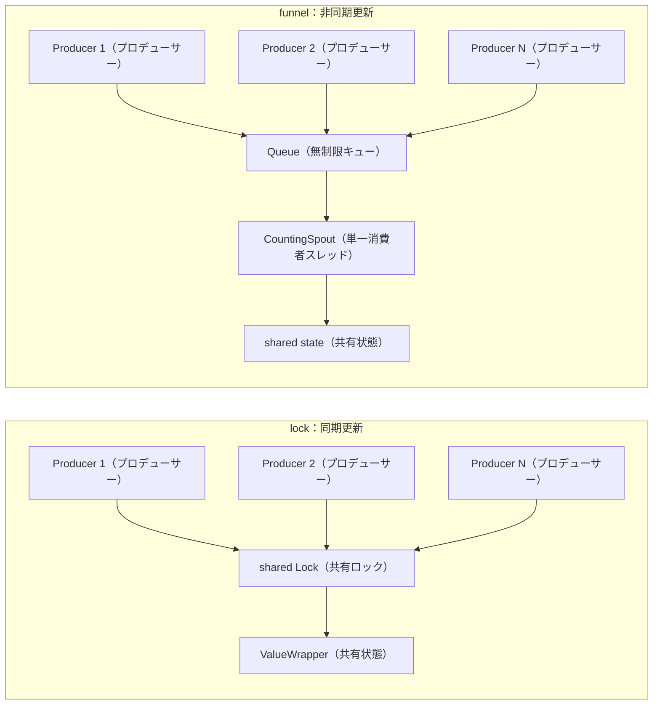

# bench/bench_funnel_vs_lock.py

> 📅 最終更新日: 2026/09/24

## 目的

複数のプロデューサースレッドが同一の共有状態を安全に更新する 2 つの仕組みを比較する：

- **ファネル（funnel）**：プロデューサーはレコードをキューに投入するだけで、単一の `BaseSpout` バックグラウンドスレッドが直列に消費する。すなわち同期的には状態を更新しない。
- **ロック（`ValueWrapper`）**：プロデューサーが共有 `Lock` を保持して直接状態を更新する。すなわち同期的に更新する。

スクリプトは**同一の負荷**（同一のプロデューサー数、同一の総レコード数、同一の 1 レコードあたり処理コスト）で 2 種類の仕組みを実行し、次の問いに答える：

1. 送信側コスト（プロデューサーがどれだけ待つか）の差はどれくらいか？
2. エンドツーエンドのスループット差はどれくらいか？
3. 非同期化にはどんな代償（バックログ / メモリ）が必要か？
4. 読み取り圧力は両者の書き込みパスにどれだけ干渉するか？

> ⚠️ **結論を先に**：ファネルはスループット最適化の手段ではない。エンドツーエンドのスループット上限は受信側によって決まり、両者が直列に処理する作業量は同じである。
> ファネルの真の利益は**送信側の待機を減らす**ことと**自然に順序付き単一書き込みストリームを得る**ことであり、代償は**バックプレッシャー制約のないキューのバックログ**である。

## テスト内容

### シナリオ

| シナリオ | 同期方式 | 説明 |
|------|---------|------|
| `lock` | `ValueWrapper` + 共有 `Lock` | プロデューサーがロックを保持して更新し、書き込みは同期的に可視化される。`TaskMetrics` でカウンターが同一のロックを共有する用法に対応 |
| `nolock` | `ValueWrapper`、ロックなし | 意図的にロックしないベースライン。正しさのデモではなく、ロック自体のオーバーヘッドを定量化するために使用（下記「発生し得る問題」を参照） |
| `sharded` | プロデューサーごとにロックなしの `ValueWrapper` | 最後に集計する。スレッド間の競合は一切ないが、集約可能な負荷にのみ適用でき、共有レコードストリームを表現できない |
| `funnel` | `BaseInlet` + `BaseSpout` | プロデューサーは `emit` を呼び出してエンキューする。`CountingSpout` が単一スレッドで直列に消費して状態を更新 |

`funnel` シナリオのレコードは `(producer_id, seq)` の形をとり、`CountingSpout` は消費時に同一プロデューサー内で `seq` が厳密に連続しているかを検証する。したがって `order_violations` はファネルの「順序付き単一書き込みストリーム」という保証の実測検証である。
`lock` / `nolock` / `sharded` はレコードストリームをモデル化しないため、この次元は `n/a` となる：ロックは単一更新の原子性のみを保証し、プロデューサー間の FIFO 順序を得るには追加の設計（シャーディング + マージなど）が必要である。

### 測定次元

| 指標 | 意味 |
|------|------|
| `submit` | プロデューサー側の所要時間、すなわち「全レコードを送信し終える」までに消費したウォールクロック時間。送信側コストを反映 |
| `drain` | プロデューサーの送信完了後、受信側が残りのレコードを処理し終えるまでの時間。非同期バックログの代償を反映 |
| `total` | エンドツーエンドの所要時間、`submit + drain`（`lock` 系シナリオでは両者は同一） |
| `peak_pending` | キューバックログのピーク、すなわちファネルのメモリコスト。キューがないシナリオでは常に `0` |
| `order_violations` | 単一プロデューサー内でのシーケンス乱れの回数。レコードストリームをモデル化しないシナリオでは `n/a` と表示 |
| `reader_ops` | `--readers` で指定した読み取りスレッドが書き込みフェーズ中に完了した読み取り回数 |

### 2 つの仕組みのデータフロー



重要な違い：`lock` パスでは、ユーザー負荷（シリアライズ、ファイル書き込み、SQLite 書き込みなど）とクリティカルセクションが同一スレッド内で連続して発生し、プロデューサーは待たなければならない。
`funnel` パスはこの負荷を丸ごと受信側スレッドに移し、プロデューサーは 1 回のエンキューコストのみを負担するが、上流が下流より速いとキューは増え続ける。

## 主要設定

| パラメータ | デフォルト値 | 説明 |
|------|-------|------|
| `--items` | `400000` | 各ラウンドの総レコード数 / 更新回数 |
| `--producers` | `4` | プロデューサースレッド数 |
| `--readers` | `0` | 読み取りスレッド数。`lock` シナリオでは `ValueWrapper.get()` を、`funnel` シナリオでは `get_pending_count()` をポーリング |
| `--work-iters` | `0` | 1 レコードあたりの模擬処理コスト（純粋な CPU 変換の反復回数）。`0` は模擬なしを意味する |
| `--repeats` | `3` | 各シナリオの繰り返しラウンド数 |
| `--scenarios` | `lock,nolock,sharded,funnel` | カンマ区切り。選択したシナリオのみ実行 |

スクリプト内の定数：

- `PENDING_SAMPLE_INTERVAL = 0.0005`：キューバックログをサンプリングする間隔（秒）。プラットフォームのタイマー精度に制限され、`peak_pending` は真のピークの**下限**である。
- ワークロード関数 `apply_work(seed, iters)`：`seed` に対して `iters` 回の `((acc * 33) ^ (i + seed)) & 0x7FFF_FFFF` 変換を行う。`lock` シナリオではプロデューサースレッドで、`funnel` シナリオでは消費スレッドで実行される。これこそが 2 つの仕組みの差の源である。

引数の妥当性は `validate_args()` で検証される（`--items >= 0`、`--producers >= 1`、`--readers >= 0`、`--work-iters >= 0`、`--repeats >= 1`）。不正な値は設定ヘッダーを表示する前にエラーで終了する。

スクリプトはプロジェクトの `src/` ディレクトリを `sys.path` に挿入するため、パッケージをインストールせずに直接実行できる。

## 発生し得る問題

1. **`nolock` は「ロックなしだと計算が狂う」ことを示すのには使えない**：GIL が有効なインタープリターでは、`counter.value += 1` の競合ウィンドウ（数バイトコード）はスレッド切り替えの粒度よりはるかに小さく、本機での実測では 200 万回の更新でもカウント落ちは発生しなかった。このシナリオは「同期なしの性能上限」としてのみ見なせる。更新が実際に失われるのは free-threaded ビルドのみである。
2. **`peak_pending` は下限である**：0.5ms 間隔でサンプリングするため、短時間のバックログピークは見落とされる可能性がある。
3. **エンドツーエンドのスループットは受信側で決まる**：`funnel` は処理を単一の消費スレッドに集中させ、直列作業量は `lock` がクリティカルセクション内で行う作業量と同じであるため、`total` が明確に良くなると期待すべきではない。
4. **`--readers` は重度の干渉を引き起こす**：すべての読み取りスレッドが書き込みパス上の同一のロック（`lock` シナリオでは `ValueWrapper` のロック、`funnel` シナリオでは `PendingCounter` のロック）をスピンして競合する。どちらの設計も読み取りに代償を払い、`funnel` のエンキューパスも同様に遅くなる。
5. **`--work-iters` は GIL に制限された純粋 CPU 負荷である**：本機で GIL が有効なときは両端のスループットは近い。free-threaded ビルドでは結論が異なる可能性がある。
6. **`sharded` は汎用解ではない**：共有レコードストリームがなく、集約可能な負荷にのみ適用でき、ここに置かれているのは「競合なし」の参照点を与えるためである。
7. **キューがないシナリオの `drain` はノイズである**：`lock` / `nolock` / `sharded` の `drain` は `0` と見なすべきで、実測で現れる `0.0000s ~ 0.0008s` は読み取りスレッドの回収に由来する。
8. **小サンプルバイアス**：レコード数が少なすぎると、スレッド起動と `spout` の起動/停止の固定コストの比率が顕著に上がる。

## ベンチマーク結果（実測）

> 🟢 本セクションの各表の所要時間/スループットはすべて過去の実測データであり、ソースコードからは検証できないため、手動での確認が必要である。

3 組の結果はすべて同一の Windows マシン、ローカル `.venv`、Python 3.14.3、**GIL 有効**、プロデューサー数 `4` によるものである。

### 2026/09/14 - 純粋なハンドオフオーバーヘッド（`--items 400000 --work-iters 0 --repeats 2`）

移し替えられるユーザー負荷がなく、純粋な「ハンドオフコスト」を調べる。

| シナリオ | `submit` 平均 | `drain` 平均 | `total` 平均 | エンドツーエンドスループット | 正しさ | `peak_pending` | `order_violations` |
|------|--------------|-------------|-------------|-----------|--------|---------------|-------------------|
| `lock` | 0.0608s | 0.0000s | 0.0608s | 6,589,743 items/s | 2/2 | 0 | n/a |
| `nolock` | 0.0520s | 0.0000s | 0.0521s | 7,685,825 items/s | 2/2 | 0 | n/a |
| `sharded` | 0.0533s | 0.0000s | 0.0533s | 7,508,702 items/s | 2/2 | 0 | n/a |
| `funnel` | 0.4590s | 0.1782s | 0.6372s | 627,859 items/s | 2/2 | 266,001 | 0 |

**今回の結論**：

- ロック自体のコストは限定的である：`lock` は `nolock` に対してスループットが約 **14%** 低下し、`sharded` は `nolock` とほぼ同等である。これはこの共有ロックが純粋なカウントのボトルネックではないことを示す。
- `funnel` はこのシナリオでは約 **10x** 遅い：移し替えられる時間のかかる負荷がない場合、スレッド間のハンドオフは純粋なオーバーヘッドであり、`submit` はむしろ `lock` の 7.5 倍になる。
- `funnel` の `peak_pending` は `266,001 / 400,000` に達する：プロデューサーのスループットが消費者を上回り、ほぼ 3 分の 2 のレコードがキューに滞留する。これがバックプレッシャーなし設計の直接的なメモリコストである。
- 4 シナリオすべてのカウントが正しく、`funnel` の `order_violations` は `0` である。

### 2026/09/14 - 1 レコードあたりの処理コストあり（`--items 30000 --work-iters 200 --repeats 2`）

各レコードに CPU 処理コストを加え、「負荷を受信側に移せる」ケースを模擬する。

| シナリオ | `submit` 平均 | `drain` 平均 | `total` 平均 | エンドツーエンドスループット | 正しさ | `peak_pending` | `order_violations` |
|------|--------------|-------------|-------------|-----------|--------|---------------|-------------------|
| `lock` | 0.4992s | 0.0000s | 0.4992s | 60,106 items/s | 2/2 | 0 | n/a |
| `nolock` | 0.5012s | 0.0000s | 0.5012s | 59,852 items/s | 2/2 | 0 | n/a |
| `sharded` | 0.5092s | 0.0000s | 0.5092s | 58,931 items/s | 2/2 | 0 | n/a |
| `funnel` | 0.1450s | 0.4092s | 0.5543s | 54,126 items/s | 2/2 | 23,247 | 0 |

**今回の結論**：

- 処理コストが支配的になると、ロックありとロックなしはほとんど区別がつかない（`lock` 0.4992s 対 `nolock` 0.5012s）：クリティカルセクションは 1 レコードの所要時間のごく一部を占めるにすぎない。
- 送信側の差が顕著に拡大する：`funnel` の `submit` は `0.1450s` で `lock` の **1/3.4**、すなわちプロデューサーの待機時間が大幅に減少する。
- しかしエンドツーエンドではむしろわずかに遅くなる（`0.5543s` 対 `0.4992s`、約 **11%**）。GIL 下では CPU 負荷が真に並列化できないため、処理はプロデューサースレッドから消費スレッドに移っただけである。
- バックログは `23,247 / 30,000` に達する：**非同期化の利益（低い送信遅延）と代償（高いメモリ使用量）がこのラウンドで同時に現れている**。

### 2026/09/14 - 読み取り圧力の注入（`--items 300000 --readers 2 --repeats 1`）

追加で 2 つの読み取りスレッドを起動し、書き込みフェーズ中に共有状態を継続的にポーリングする。

| シナリオ | `submit` 平均 | `drain` 平均 | `total` 平均 | エンドツーエンドスループット | 正しさ | `peak_pending` | `reader_ops` |
|------|--------------|-------------|-------------|-----------|--------|---------------|-------------|
| `lock` | 0.4052s | 0.0008s | 0.4060s | 738,935 items/s | 1/1 | 0 | 2,333,379 |
| `nolock` | 0.4033s | 0.0003s | 0.4035s | 743,437 items/s | 1/1 | 0 | 2,726,586 |
| `funnel` | 1.2632s | 0.1186s | 1.3818s | 217,114 items/s | 1/1 | 210,553 | 5,547,967 |

**今回の結論**：

- 読み取りスレッドが同一のロックをスピンして競合するコストは極めて大きい：`lock` の書き込みスループットは第 1 ラウンドの 6,589,743 items/s から 738,935 items/s に低下し、**約 8.9x の低下**となる。
- `funnel` のエンキューパスも同様に遅くなる（`submit` `1.2632s`）：`PendingCounter` のロックはまさにエンキューパス上にあり、読み取り側のコストは非同期化では隔離できない。
- 逆に、読み取り側は「より割に合う」：同じ時間内に `funnel` シナリオは 5,547,967 回の読み取りを完了した（`lock` は 2,333,379 回）。書き込みパスが遅くなったことで、読み取りスレッドがより多くのスケジューリング機会を得たためである。
- 結論は**読み取りは無料ではない**ということである：どちらの仕組みでも、読み取り圧力は書き込みパスを直接損なう。損なわれる位置が異なるだけである。

### 総合参考

- **ファネルをスループット最適化と見なしてはならない**：エンドツーエンドの上限は受信側に依存し、両者の直列作業量は同じである。
- **ファネルの価値は送信側にある**：`submit` の削減、バーストトラフィックの吸収、そして単一消費者に結びついた順序付き単一書き込みストリーム（`order_violations` は常に 0）。
- **ファネルの代償はバックログである**：実測の `peak_pending` は全レコードに迫る可能性があり、現在の `Queue` は無制限でバックプレッシャーがない。
- **ロックのコスト自体は高くない**：GIL 環境では、共有 `int` カウントのロックオーバーヘッドは約 14% であり、コストを真に増幅させるのはロック自体ではなく読み取り競合である。

## 実行方法

```bash
python bench/bench_funnel_vs_lock.py
```

`uv` で実行：

```bash
uv run python bench/bench_funnel_vs_lock.py
```

プロジェクトがインポート可能なパッケージとしてインストールされていない場合、ローカル仮想環境のインタープリターを直接使用することもできる：

```bash
.\.venv\Scripts\python.exe bench/bench_funnel_vs_lock.py
```

## パラメータ調整

### ファネルとロックのみを比較

```bash
python bench/bench_funnel_vs_lock.py --scenarios lock,funnel
```

### レコード数とプロデューサー数を拡大

```bash
python bench/bench_funnel_vs_lock.py --items 800000 --producers 8
```

### 移し替え可能なユーザー負荷を模擬

```bash
python bench/bench_funnel_vs_lock.py --work-iters 200 --scenarios lock,funnel
```

### 読み取り圧力を注入

```bash
python bench/bench_funnel_vs_lock.py --readers 2 --scenarios lock,funnel
```

### 繰り返しラウンド数を増やして安定性を観察

```bash
python bench/bench_funnel_vs_lock.py --repeats 5
```

## 依存関係

- Python 標準ライブラリ：`argparse`、`statistics`、`sys`、`threading`、`time`、`dataclasses`、`pathlib`
- プロジェクトソース内の `celestialflow.funnel`（`BaseInlet`、`BaseSpout`）
- プロジェクトソース内の `celestialflow.runtime.util_types`（`ValueWrapper`、`NoOpContext`）
