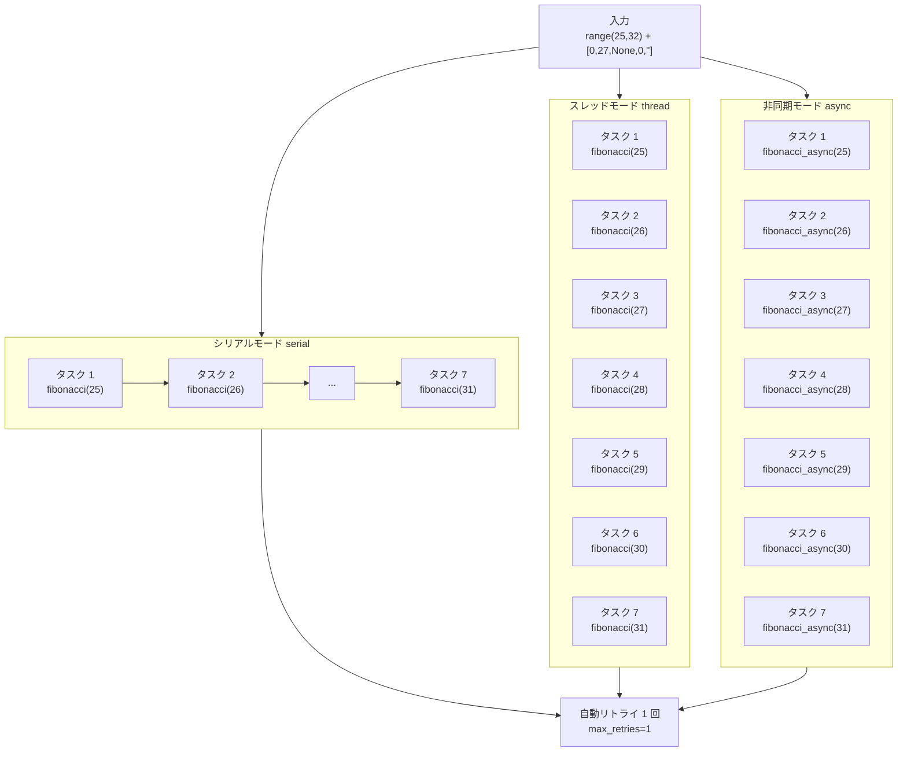

# demo_executor.py デモ説明

> 📅 最終更新日: 2026/05/28

## 目的

`TaskExecutor` の3つの実行モード（`serial`、`thread`、`async`）でのスタンドアロン実行能力をデモンストレーションします。例外リトライ、進捗表示、タスク統計の完全なライフサイクルを示し、フレームワーク入門の最初の体験として適しています。

## デモ内容

3 つの実行モードのコア戦略比較：



| 関数 | モード | タスク | 特徴 |
|------|--------|--------|------|
| `demo_fibonacci_serial` | serial | フィボナッチ計算 | シングルスレッド逐次実行 |
| `demo_fibonacci_thread` | thread | フィボナッチ計算 | 6スレッド並行実行 |
| `demo_fibonacci_async` | async | 非同期フィボナッチ | コルーチンベース並行処理 |

- **入力**: `range(25, 32) + [0, 27, None, 0, ""]`
- **例外設計**: `0`、`None`、`""` は `ValueError` をトリガーし、フレームワークが自動的に1回リトライします

## 主要設定

- `max_workers = 6`
- `max_retries = 1`
- `executor.add_observer(TaskProgress())` でプログレスバーを追加

## 起こりうる問題

1. **再帰深度と所要時間**: `fibonacci(31)` は膨大な再帰呼び出しを含み、serial モードでは10秒以上かかる場合があります。
2. **`asyncio` 環境**: `demo_fibonacci_async` は `asyncio.run()` を使用しており、Jupyter Notebook で直接実行するとエラーになります（Notebook には既にイベントループが存在するため）。
3. **アサーションなし**: このファイルは**デモスクリプト**であり、`assert` を含みません。実行成功はキャッチされない例外がなかったことのみを意味し、結果の正確性は検証しません。

## 実行方法

```bash
python demo/demo_executor.py
```

## 期待される動作

スクリプトを実行すると、3 つのモードが順次実行され、以下のような出力が生成されます：

```
========================================
[serial] Fibonacci benchmark (N=12 tasks, max_workers=6)
========================================
 80%|████████████████░░░░| ...

--- Summary ---
  mode=serial  success=07  fail=05  dup=0  pending=0  elapsed=0.90s

========================================
[thread] Fibonacci benchmark (N=12 tasks, max_workers=6)
========================================
 80%|████████████████░░░░| ...

--- Summary ---
  mode=thread  success=07  fail=05  dup=0  pending=0  elapsed=0.86s

========================================
[async] Fibonacci benchmark (N=12 tasks, max_workers=6)
========================================
 80%|████████████████░░░░| ...

--- Summary ---
  mode=async  success=07  fail=05  dup=0  pending=0  elapsed=0.01s
```

> **説明**：12 タスク中、5 つのエッジケース入力（`0`、`27`、`None`、`0`、`""`）が `ValueError` をトリガーし、リトライ後も最終的に失敗とマークされます。`success=07` は正常に実行された 7 つのフィボナッチタスクです。
> 3 つのモードすべてが `demo_utils` のイテレーティブ版フィボナッチ（O(n)）を使用しており、パフォーマンスの比較が可能です。

## 依存関係

- `celestialflow`（`TaskExecutor`、`TaskProgress`）
- `demo_utils`（`fibonacci`、`fibonacci_async`）
