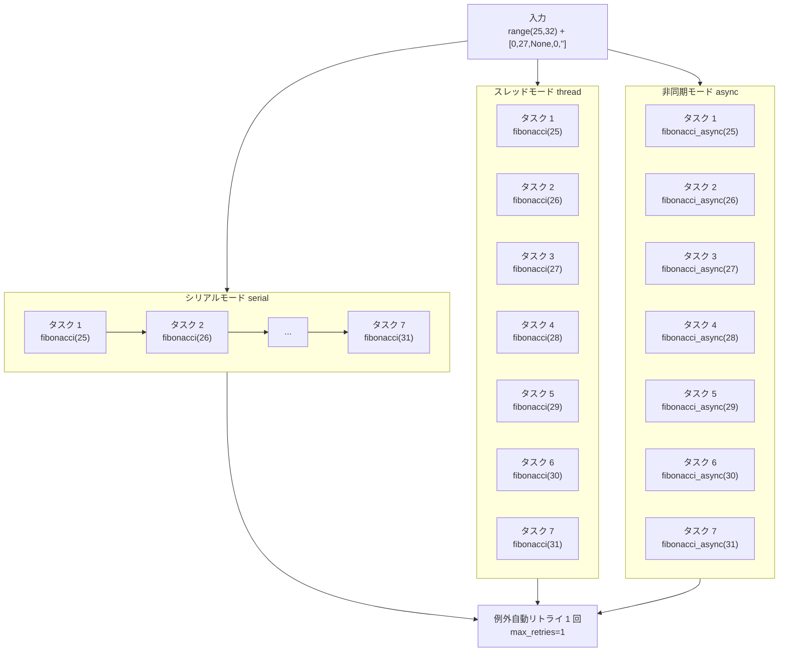

# demo_executor.py デモ説明

> 📅 最終更新日: 2026/06/22

## 目標

`TaskExecutor` の 3 つの実行モード（`serial`、`thread`、`async`）における独立実行能力をデモする。例外リトライ、進捗表示、タスク統計の完全なライフサイクルを示し、フレームワーク入門の第一歩として最適である。

## デモ内容

3 つの実行モードのコア戦略比較は以下の通り：



| 関数 | モード | タスク | 特性 |
|------|--------|--------|------|
| `demo_fibonacci_serial` | serial | フィボナッチ計算 | シングルスレッド順次実行 |
| `demo_fibonacci_thread` | thread | フィボナッチ計算 | 6 スレッド並行 |
| `demo_fibonacci_async` | async | 非同期フィボナッチ | コルーチン並行 |

- **入力**：`range(25, 32) + [0, 27, None, 0, ""]`
- **例外設計**：2 つの `0` は `ValueError` をトリガーし、フレームワークが自動で 1 回リトライする。`None` と `""` は型エラーをトリガーし、リトライ対象外のため即座に失敗する

## 主要設定

- `max_workers = 6`
- `max_retries = 1`
- `executor.add_observer(TaskProgress())` でプログレスバーを追加

## 発生しうる問題

1. **反復計算の時間コスト**：`fibonacci(31)` の反復計算は serial モードで約 1 秒必要であるが、全体実行にはリトライとスケジューリングのオーバーヘッドが含まれ、実際の合計時間はさらに長くなる可能性がある。
2. **`asyncio` 環境**：`demo_fibonacci_async` は `asyncio.run()` を使用するため、Jupyter Notebook で直接実行するとエラーになる（Notebook には既にイベントループが存在する）。
3. **アサーションなし**：このファイルは**デモスクリプト**であり、`assert` を含まない。実行成功は未捕捉例外がスローされなかったことのみを意味し、結果の正確性は検証しない。

## 実行方法

```bash
python demo/demo_executor.py
```

## 想定される動作

実行後、3 つのモードが順に実行され、以下のようなフローが出力される：

```
========================================
[serial] Fibonacci benchmark (N=12 tasks, max_workers=6)
========================================
 80%|████████████████░░░░| ...

--- Summary ---
  mode=serial  success=08  fail=04  dup=0  pending=0  elapsed=0.90s

========================================
[thread] Fibonacci benchmark (N=12 tasks, max_workers=6)
========================================
 80%|████████████████░░░░| ...

--- Summary ---
  mode=thread  success=08  fail=04  dup=0  pending=0  elapsed=0.86s

========================================
[async] Fibonacci benchmark (N=12 tasks, max_workers=6)
========================================
 80%|████████████████░░░░| ...

--- Summary ---
  mode=async  success=08  fail=04  dup=0  pending=0  elapsed=0.01s
```

> **説明**：12 タスクのうち、4 つの不正入力（2 つの `0`、`None`、`""`）が失敗する。残りの 8 つは正常なフィボナッチタスクであり、最終的に `success=08`/`fail=04` となる。2 つの `0` は `ValueError` をトリガーし 1 回リトライされるが、それでも失敗する。`None`/`""` は型エラーをトリガーする。
> 3 つのモードはすべて `demo_utils` の反復版フィボナッチ（O(n)）を使用し、パフォーマンスは同等である。

## 依存

- `celestialflow`（`TaskExecutor`、`TaskProgress`）
- `demo_utils`（`fibonacci`、`fibonacci_async`）
