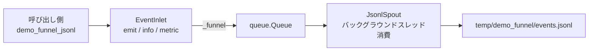

# demo_funnel.py デモ説明

> 📅 最終更新日: 2026/07/16

## 目標

`funnel` モジュールが `TaskGraph`、`TaskStage`、`TaskExecutor` から独立して使用できることを示します。この例では `BaseInlet` と `BaseSpout` を直接ベースにして、最小限の「イベント収集 -> バックグラウンド消費 -> JSONL 出力」パイプラインを構築します。

## デモ内容

### `demo_funnel_jsonl`



このデモは 2 つのカスタムクラスと 1 つの実行エントリポイントで構成されます：

- `JsonlSpout`
  - `BaseSpout` を継承
  - `_before_start()` でディレクトリを作成し出力ファイルを開く
  - `_handle_record()` でレコードを JSONL として書き込む
  - `_after_stop()` でファイルを閉じる
- `EventInlet`
  - `BaseInlet` を継承
  - `_funnel()` を軽量にラップし、`emit()` / `info()` / `metric()` の 3 つのビジネスメソッドを提供
  - `EventInlet(spout.get_queue())` でキューを渡し、対応する `JsonlSpout` にバインドする
- `demo_funnel_jsonl()`
  - `JsonlSpout` と `EventInlet` を作成
  - バックグラウンド消費スレッドを起動
  - 3 件のイベントレコードを送信
  - スレッド停止後、出力ファイルと内容を表示

## このデモが価値を持つ理由

- `funnel` が persistence の下位実装であるだけでなく、独立した producer-consumer チャネルの構築にも直接使用できることを示しています。
- `BaseSpout` の完全なライフサイクルをカバーしています：`start()`、`_before_start()`、`_handle_record()`、`stop()`、`_after_stop()`。
- `BaseInlet` の典型的な使い方も示しています：ビジネス側はキューを直接操作せず、カスタムメソッドを通じてレコードを `_funnel()` に送信します。

## 主要実装

### イベントレコード形式

`EventInlet.emit()` は以下の構造のレコードを生成します：

```json
{
  "timestamp": "2026-06-18 11:50:29",
  "event": "metric",
  "payload": {
    "name": "processed",
    "value": 3
  }
}
```

### 出力ファイル

- パス: `temp/demo_funnel/events.jsonl`
- 形式: 1 行に 1 件の JSON レコード。後続の grep、ストリーミング読み取り、ログシステムへのインポートに便利

## 主要設定

- 出力ファイルは `buffering=1` で開き、行バッファリングを使用
- `spout.stop()` は終了シグナルを送信し、バックグラウンドスレッドの終了を待機
- サンプルではデフォルトで 3 件のレコードを書き込み：
  - `info`
  - `metric`
  - `batch_finished`

## 発生しうる問題

1. **API バインド方式**：現在のソースコードは `EventInlet(spout.get_queue())` でキューを渡す。`BaseInlet` は既に `__init__` を定義しておらず、`bind_spout()` メソッドによるバインドに変更されている。実行時に初期化エラーが発生した場合、`BaseInlet` のバージョンと呼び出し方式の一致を確認する必要がある。
2. **同期書き込みではない**: `BaseInlet` はレコードをキューに入れるだけで、実際の消費は `JsonlSpout` のバックグラウンドスレッドで発生します。
3. **出力ディレクトリが変わる**: JSONL ファイルは現在の作業ディレクトリ下の `temp/demo_funnel/` に書き込まれるため、別のディレクトリからスクリプトを起動すると出力場所が変わります。
4. **アサーションなし**: これはデモスクリプトであり、実行成功はパスが通っていることを示すだけで、ビジネスセマンティクスが自動検証されるわけではありません。

## 実行方法

```bash
python demo/demo_funnel.py
```

## 期待される動作

実行後、出力ファイルパス、処理件数、書き込まれた JSONL の内容が表示されます。例：

```text
Output file: D:\Project\CelestialFlow\temp\demo_funnel\events.jsonl
Handled records: 3
{"timestamp": "2026-06-18 11:50:29", "event": "info", "payload": {"message": "funnel demo start"}}
{"timestamp": "2026-06-18 11:50:29", "event": "metric", "payload": {"name": "processed", "value": 3}}
{"timestamp": "2026-06-18 11:50:29", "event": "batch_finished", "payload": {"items": ["A", "B", "C"], "success": true}}
```

## 他モジュールとの関係

- `funnel` がフレームワークの低レベル機能としてどのように再利用されるかを知りたい場合は、以下を参照してください：
  - [__init__.md](https://github.com/Mr-xiaotian/CelestialFlow/blob/main/docs/zh-CN/src/funnel/__init__.md)
  - [core_inlet.md](https://github.com/Mr-xiaotian/CelestialFlow/blob/main/docs/zh-CN/src/funnel/core_inlet.md)
  - [core_spout.md](https://github.com/Mr-xiaotian/CelestialFlow/blob/main/docs/zh-CN/src/funnel/core_spout.md)
- フレームワーク内での典型的な着地例を知りたい場合は、以下を参照してください：
  - `persistence` 内の `LogSpout` / `LogInlet`
  - `FailSpout` / `FailInlet`
  - `SuccessSpout`

## 依存

- `celestialflow.funnel`（`BaseInlet`、`BaseSpout`）
- Python 標準ライブラリ: `json`、`pathlib`、`time`
