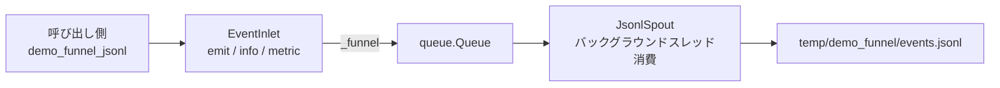

# demo_funnel.py デモ説明

> 📅 最終更新日: 2026/08/31

## 目標

`funnel` モジュールが `TaskGraph`、`TaskStage`、`TaskExecutor` から独立して使用できることを示す。この例では `BaseInlet` と `BaseSpout` を直接ベースにして、最小限の「イベント収集 -> バックグラウンド消費 -> JSONL 出力」パイプラインを構築する。

## デモ内容

### `demo_funnel_jsonl`


```mermaid
flowchart LR
    Caller["呼び出し側<br/>demo_funnel_jsonl"] --> Inlet["EventInlet<br/>emit / info / metric"]
    Inlet -->|_funnel| Queue["queue.Queue"]
    Queue --> Spout["JsonlSpout<br/>バックグラウンドスレッド消費"]
    Spout --> File["temp/demo_funnel/events.jsonl"]
```

このデモは 2 つのカスタムクラスと 1 つの実行エントリポイントで構成される：

- `JsonlSpout`
  - `BaseSpout` を継承
  - `_before_start()` でディレクトリを作成し出力ファイルを開く
  - `_handle_record()` でレコードを JSONL として書き込む
  - `_after_stop()` でファイルを閉じる
- `EventInlet`
  - `BaseInlet` を継承
  - `_funnel()` を軽量にラップし、`emit()` / `info()` / `metric()` の 3 つのビジネスメソッドを提供
  - `EventInlet().bind_spout(spout)` で対応する `JsonlSpout` にバインドする
- `demo_funnel_jsonl()`
  - `JsonlSpout` と `EventInlet` を作成
  - バックグラウンド消費スレッドを起動
  - 3 件のイベントレコードを送信
  - スレッド停止後、出力ファイルと内容を表示

## このデモが価値を持つ理由

- `funnel` が persistence の低層実装であるだけでなく、独立した生産者-消費者チャネルの構築にも直接使用できることを示している
- `BaseSpout` の完全なライフサイクルをカバーしている：`start()`、`_before_start()`、`_handle_record()`、`stop()`、`_after_stop()`
- `BaseInlet` の典型的な使い方も示している：ビジネス側はキューを直接操作せず、カスタムメソッドを通じてレコードを `_funnel()` に送信する

## 主要実装

### イベントレコード形式

`EventInlet.emit()` は以下の構造のレコードを生成する：

```json
{
  "timestamp": "2026-06-18 11:50:29",
  "event": "metric",
  "payload": {
    "name": "processed",
    "value": 3
  }
}
```

### 出力ファイル

- パス：`temp/demo_funnel/events.jsonl`
- 形式：1 行に 1 件の JSON レコード。後続の grep、ストリーミング読み取り、ログシステムへのインポートに便利

## 主要設定

- 出力ファイルは `buffering=1` で開き、行バッファリングを使用
- `spout.stop()` は終了シグナルを送信し、バックグラウンドスレッドの終了を待機
- サンプルではデフォルトで 3 件のレコードを書き込む：
  - `info`
  - `metric`
  - `batch_finished`

## 発生しうる問題

1. **同期書き込みではない**：`BaseInlet` はレコードをキューに入れるだけで、実際の消費は `JsonlSpout` のバックグラウンドスレッドで行われる。
2. **出力ディレクトリが変わる**：JSONL ファイルは現在の作業ディレクトリ下の `temp/demo_funnel/` に書き込まれるため、別のディレクトリからスクリプトを起動すると出力場所が変わる。
3. **アサーションなし**：これはデモスクリプトであり、実行成功はパスが通っていることを示すだけで、ビジネスセマンティクスが自動検証されるわけではない。

## 実行方法

```bash
python demo/demo_funnel.py
```

## 期待される動作

実行後、出力ファイルパス、処理件数、書き込まれた JSONL の内容が表示される。例：

```text
Output file: D:\Project\CelestialFlow\temp\demo_funnel\events.jsonl
Handled records: 3
{"timestamp": "2026-06-18 11:50:29", "event": "info", "payload": {"message": "funnel demo start"}}
{"timestamp": "2026-06-18 11:50:29", "event": "metric", "payload": {"name": "processed", "value": 3}}
{"timestamp": "2026-06-18 11:50:29", "event": "batch_finished", "payload": {"items": ["A", "B", "C"], "success": true}}
```

## 他モジュールとの関係

- `funnel` がフレームワークの低レベル機能としてどう再利用されるかを知りたい場合は、以下を参照：
  - [__init__.md](https://github.com/Mr-xiaotian/CelestialFlow/blob/main/docs/zh-CN/src/funnel/__init__.md)
  - [core_inlet.md](https://github.com/Mr-xiaotian/CelestialFlow/blob/main/docs/zh-CN/src/funnel/core_inlet.md)
  - [core_spout.md](https://github.com/Mr-xiaotian/CelestialFlow/blob/main/docs/zh-CN/src/funnel/core_spout.md)
- フレームワーク内での典型的な着地例を知りたい場合は、以下を参照：
  - `persistence` 内の `LogSpout` / `LogInlet`（`logs/` ディレクトリに書き込み）
  - `persistence` 内の `LifecycleSpout` / `LifecycleInlet`（SQLite ライフサイクルライブラリに書き込み）

> **歴史的変更の説明**：旧バージョンには `FailSpout` / `FailInlet` や `SuccessSpout` などの独立したチャネルが存在していたが、バージョン 3.2.4 以降、`fail_funnel` と `success_funnel` は SQLite ベースの `fallback` メカニズムに統合され、関連するクラスは保持されなくなった。

## 依存関係

- `celestialflow.funnel`（`BaseInlet`、`BaseSpout`）
- Python 標準ライブラリ：`json`、`pathlib`、`time`
