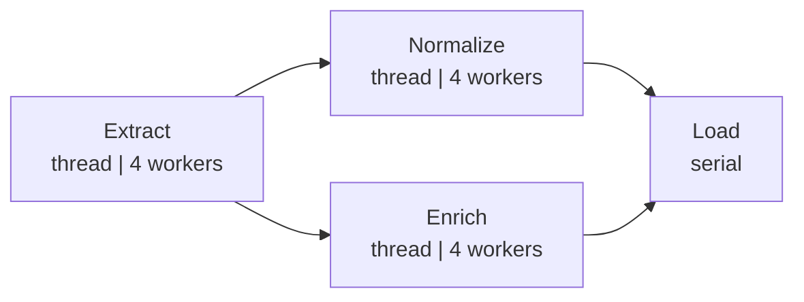
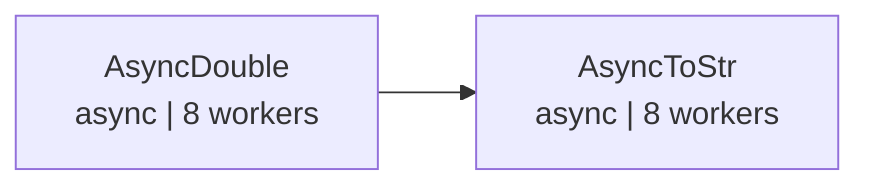

# demo_graph.py デモ説明

> 📅 最終更新日: 2026/05/24

## 目的

CelestialFlow における `TaskGraph` の高度なグラフトポロジー構築をデモンストレーションします：ファンアウト/ファンイン（fan-out/fan-in）ETL パイプライン、および非同期段階的パイプライン。

## デモシナリオ

### `demo_etl_fan_out_fan_in`
ETL パイプライン、ファンアウト/ファンイントポロジー：



ASCII 補足図：

```
Extract ──┬── Normalize ──┬── Load
          └── Enrich ─────┘
```

- `Extract` → ID に基づいてレコードを生成（thread モード、4 worker）
- `Normalize` → レコード値を正規化（thread モード、4 worker）
- `Enrich` → レコードにカテゴリラベルを追加（thread モード、4 worker）
- `Load` → レコードを保存（serial モード）

**グラフ構造**：DAG、一対多ファンアウト + 多対一ファンイン
**スケジューリングモード**：`eager`
**実行後**：`graph.get_graph_summary()` を呼び出して成功/失敗タスク数を出力

### `demo_async_staged_pipeline`
2段階非同期パイプライン：



ASCII 補足図：

```
AsyncDouble ──> AsyncToStr
```

- `AsyncDouble` → 入力を非同期で2倍にする（async モード、8 worker）
- `AsyncToStr` → 結果を非同期で文字列に変換（async モード、8 worker）

**グラフ構造**：DAG、線形2段階
**スケジューリングモード**：`staged`（レイヤーごとの実行）
**実行後**：`graph.get_status_snapshot()` を呼び出して各ステージの成功/失敗タスク数を出力

## 主要設定

- すべての stage は `stage_mode="thread"` を使用
- ETL パイプラインは `schedule_mode="eager"`、非同期パイプラインは `schedule_mode="staged"` を使用
- `execution_mode="async"` はコルーチンタスク関数に使用

## 起こりうる問題

1. **アサーションなし**：デモスクリプトであり、結果の正確性は検証しません。
2. **ETL 関数に sleep を含む**：`extract_record`（0.5秒）、`transform_normalize`/`transform_enrich`（0.3秒）、`load_record`（0.2秒）、完全な実行には一定の時間がかかります。

## 実行方法

```bash
python demo/demo_graph.py
```

## 期待される動作

### ETL パイプライン（`demo_etl_fan_out_fan_in`）

Extract → Normalize/Enrich → Load の順に実行され、出力には sleep ログと最終サマリーが含まれます：

```
[Extract] Input: 0 -> Output: {'id': 0, 'value': 101}
[Extract] Input: 1 -> Output: {'id': 1, 'value': 102}
[Normalize] Input: {'id': 0, 'value': 101} -> Output: {'id': 0, 'value': 0.01}
[Enrich] Input: {'id': 0, 'value': 101} -> Output: {'id': 0, 'label': 'odd'}
...
--- Graph Summary ---
Extract    : success=5  fail=0
Normalize  : success=5  fail=0
Enrich     : success=5  fail=0
Load       : success=10 fail=0
```

> 各 Extract は 1 件のレコードを生成し、Normalize と Enrich でそれぞれ処理された後、Load で集約されます。入力が `range(5)` の場合、Load ノードは合計 10 個のタスクを受け取ります（5 × 2 下流）。

### 非同期パイプライン（`demo_async_staged_pipeline`）

ステージごとにレイヤー実行され、まず AsyncDouble を完了してから AsyncToStr を開始します：

```
--- Staged 1: AsyncDouble ---
[AsyncDouble] Input: 1 -> Output: 2
[AsyncDouble] Input: 2 -> Output: 4
...
--- Staged 2: AsyncToStr ---
[AsyncToStr] Input: 2 -> Output: 'Result: 2'
[AsyncToStr] Input: 4 -> Output: 'Result: 4'
...
--- Status Snapshot ---
AsyncDouble : success=5  fail=0  pending=0
AsyncToStr  : success=5  fail=0  pending=0
```

> 総実行時間は約 3-5 秒で、主に内蔵の `sleep` の影響を受けます。

## 依存関係

- `celestialflow`（`TaskGraph`、`TaskStage`）
- `demo_utils`（`extract_record`、`transform_normalize`、`transform_enrich`、`load_record`、`async_double`、`async_to_str`）
- `python-dotenv`
- 外部サービス：CelestialTree（オプション）、Reporter（オプション）
