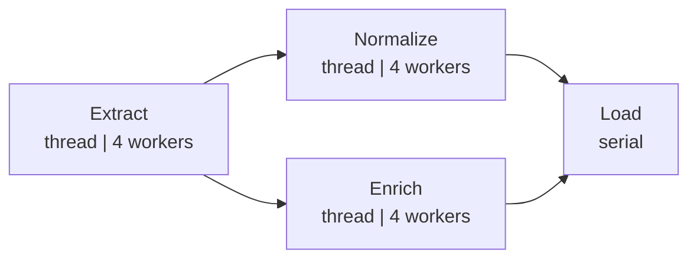
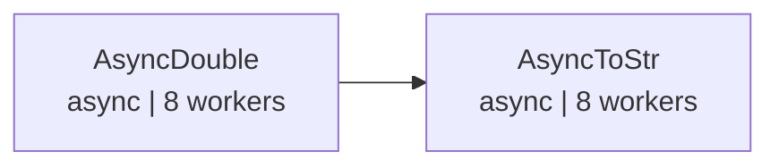

# demo_graph.py デモ説明

> 📅 最終更新日: 2026/08/31

## 目標

CelestialFlow における `TaskGraph` の高度なグラフトポロジー構築をデモする：ファンアウト/ファンイン（fan-out/fan-in）ETL パイプライン、および非同期ステージ分割パイプライン。

## デモシナリオ

### `demo_etl_fan_out_fan_in`
ETL パイプライン、ファンアウト/ファンイン トポロジー：


```mermaid
flowchart LR
    Extract["Extract<br/>thread | 4 workers"] --> Normalize["Normalize<br/>thread | 4 workers"]
    Extract --> Enrich["Enrich<br/>thread | 4 workers"]
    Normalize --> Load["Load<br/>serial"]
    Enrich --> Load
```

ASCII 補足図：

```
Extract ──┬── Normalize ──┬── Load
          └── Enrich ─────┘
```

- `Extract` → ID に基づいてレコードを生成（thread モード、4 worker）
- `Normalize` → レコード値を正規化（thread モード、4 worker）
- `Enrich` → レコードに分類ラベルを追加（thread モード、4 worker）
- `Load` → レコードを保存（serial モード）

**グラフ構造**：DAG、一対多ファンアウト + 多対一ファンイン
**グラフモード**：`graph_mode="thread"`

### `demo_async_pipeline`
2 ステージ非同期パイプライン：


```mermaid
flowchart LR
    AsyncDouble["AsyncDouble<br/>async | 8 workers"] --> AsyncToStr["AsyncToStr<br/>async | 8 workers"]
```

ASCII 補足図：

```
AsyncDouble ──> AsyncToStr
```

- `AsyncDouble` → 入力を非同期で倍にする（async モード、8 worker）
- `AsyncToStr` → 結果を非同期で文字列に変換（async モード、8 worker）

**グラフ構造**：DAG、線形 2 ステージ
**グラフモード**：`graph_mode="async"`

## 主要設定

- 各 Stage は `TaskStage(..., execution_mode="thread" | "async")` で実行モードを明示的に指定
- ETL パイプラインと非同期パイプラインはそれぞれ `TaskGraph(..., graph_mode="thread")` と `graph_mode="async"` でグラフモードを指定
- `execution_mode="async"` はコルーチンタスク関数（`async_double`、`async_to_str`）に使用

## 発生しうる問題

1. **アサーションなし**：デモスクリプトであり、結果の正確性は検証しない。
2. **ETL 関数に sleep を含む**：`extract_record`（0.5s）、`transform_normalize`/`transform_enrich`（0.3s）、`load_record`（0.2s）があり、完全な実行には一定の時間がかかる。

## 実行方法

```bash
python demo/demo_graph.py
```

> **注意**：現在の `__main__` は `demo_etl_fan_out_fan_in()` と `asyncio.run(demo_async_pipeline())` を順に呼び出し、両方のデモシナリオが実行される。

## 想定される動作

### ETL パイプライン（`demo_etl_fan_out_fan_in`）

Extract → Normalize/Enrich → Load の順に実行され、各 Stage は内部で `print` または sleep 休止により実行ログを出力する。スクリプト自身は最終的な Graph Summary や各 Stage のカウントを能動的には出力しないため、手動で確認が必要（mock 出力は参考のみ）。

```
[Extract] Input: 1 -> Output: {'id': 1, 'value': 10, 'label': 'item_1'}
[Extract] Input: 2 -> Output: {'id': 2, 'value': 20, 'label': 'item_2'}
[Normalize] Input: {'id': 1, 'value': 10} -> Output: {'id': 1, 'value': 10, 'normalized': 0.1}
[Enrich] Input: {'id': 1, 'value': 10} -> Output: {'id': 1, 'value': 10, 'category': 'odd'}
...
```

> 各 Extract は 1 件のレコードを生成し、Normalize と Enrich でそれぞれ処理された後、Load で集約される。入力が `range(1, 16)` の場合、Extract は 15 件のレコードを処理し、Normalize と Enrich はそれぞれ 15 件を受け取り、Load ノードは合計 30 件のタスク（15 × 2 下流）を受け取る。

### 非同期パイプライン（`demo_async_pipeline`）

2 ステージが順次実行される。まず `AsyncDouble` が 20 タスクすべてを完了し、その後 `AsyncToStr` が個別に受信してフォーマット出力する。

```
[AsyncDouble] Input: 1 -> Output: 2
[AsyncDouble] Input: 2 -> Output: 4
...
[AsyncToStr] Input: 2 -> Output: 'result=2'
[AsyncToStr] Input: 4 -> Output: 'result=4'
...
```

> 総実行時間は約 1〜3 秒（手動確認が必要）で、主に組み込みの `sleep`（`async_double` 0.3s + `async_to_str` 0.2s）と 8 コルーチン並行スケジューリングの影響を受ける。

## 依存関係

- `celestialflow`（`TaskGraph`、`TaskStage`、`TaskReporter`）
- `demo_utils`（`extract_record`、`transform_normalize`、`transform_enrich`、`load_record`、`async_double`、`async_to_str`）
- `python-dotenv`
- 外部サービス：CelestialTree（オプション）、Reporter（オプション）
