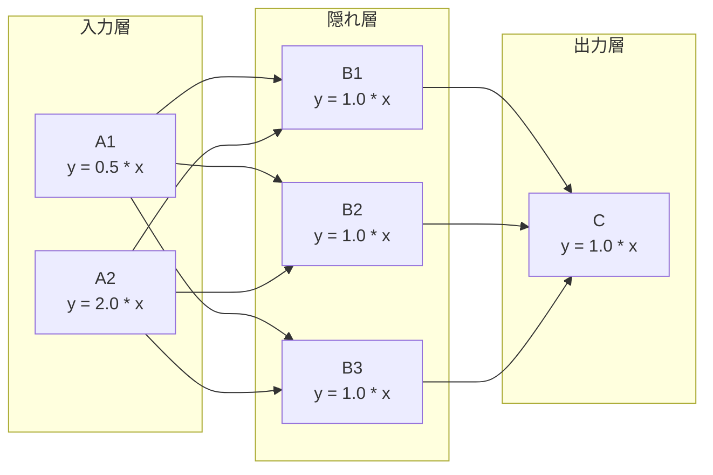

# demo_network.py デモ説明

> 📅 最終更新日: 2026/08/26

## 目的

`TaskCross` を使って多層ニューラルネットワークトポロジー（2→3→1 全結合）を構築し、
クロージャファクトリ関数を通じて各ノードに異なる重みパラメータを付与する方法をデモし、
ニューラルネット風のシナリオにおける CelestialFlow のグラフ表現能力を示します。

本ファイルは `demo_structure.py` の `demo_network` をベースに最初の進化版となっています：
各ノードの演算を固定の `add_one_sleep`（`x + 1`）から、設定可能な線形関数
`y = w * x + b` に置き換え、各ノードが独立した重みとバイアスを持つようにします。

## デモ内容

### `demo_network_step1`



#### 構築方法

- `TaskCross` を使って 2-3-1 の 3 層トポロジーを構築し、`graph_mode="thread"` を使用する
- **入力層**：`A1(x) = 0.5x`、`A2(x) = 2.0x` で、それぞれ異なる入力範囲を受け取る
- **隠れ層**：`B1..B3(x) = 1.0x`、3 つのノードが 2 つの入力層の Fan-in 結果を並列処理する
- **出力層**：`C(x) = 1.0x`、B1~B3 のすべての結果を集約する
- 実行後、`C.get_success_pairs()`（ライフサイクルストレージから成功結果を読み取り）で先頭 10 件の `(入力 → 出力)` ペアを収集して出力する

#### コア関数

**`linear(w, b)`**：クロージャファクトリ関数で、`_forward(x) -> w * x + b` を返します。`TaskStage`
が `func` に位置引数 1 つのみを要求する制約を満たしつつ、クロージャで重みとバイアスを固定するため、
各重み組み合わせに対して関数を個別に定義する必要がありません。

```python
def linear(w: float, b: float):
    def _forward(x):
        return w * x + b
    return _forward
```

## 主要設定

| ノード | 関数 | 重み w | バイアス b | max_workers | 入力 |
|--------|------|:------:|:------:|:-----------:|------|
| A1 | `linear(0.5, 0.0)` | 0.5 | 0.0 | 2 | `[1, 2, 3, 4, 5]` |
| A2 | `linear(2.0, 0.0)` | 2.0 | 0.0 | 2 | `[11, 12, 13, 14, 15]` |
| B1~B3 | `linear(1.0, 0.0)` | 1.0 | 0.0 | 2 | A1/A2 からの Fan-in |
| C | `linear(1.0, 0.0)` | 1.0 | 0.0 | 2 | B1~B3 からの Fan-in |

- すべての Stage は `execution_mode="thread"` を使用し、`TaskCross` 全体は `graph_mode="thread"` を使用する
- 出力層 C は実行後に `get_success_pairs()` を呼び出してすべての成功結果を読み取る（追加の永続化設定は不要）

## 設計意図

本ファイルの位置付けは **Step 1** です。`demo_structure.py` の `demo_network` の
2-3-1 トポロジーを維持しつつ、ノード関数を固定のハードコード演算からパラメータ化された線形変換へと
アップグレードします。後続のステップでは、これを基に以下を拡張できます：

- 活性化関数（ReLU / Sigmoid）
- サンプルペアリング（A1 と A2 の同じ入力番号が同じサンプルに対応する）
- 損失計算と誤差逆伝播

## 発生しうる問題

1. **アサーションなし**：デモスクリプトであり、実行が成功してもグラフ構築とスケジューリングが正しいことを示すだけで、重みや計算結果は検証しません。
2. **サンプルペアリングなし**：A1 と A2 のタスクは独立して処理されており、「同じ元サンプルをそれぞれ
   A1 と A2 で処理した後、同じ B ノードに集約する」というペアリングロジックはまだ実装されていません。
3. **sleep なし**：`linear` 関数には遅延が含まれていないため、実行は非常に高速（マイクロ秒オーダー）で、
   他のデモのような明らかな待ち時間は発生しません。
4. **30 タスクが C に集約**：A1（5 タスク）× 3 つの隠れノード + A2（5 タスク）× 3 つの隠れノード
   = 30 個の隠れ層出力をすべて C で処理し、30 件の結果レコードが得られます。

## 実行方法

```bash
python demo/demo_network.py
```

## 期待される動作

実行後、ノード設定情報と C ノードが収集した入力 → 出力マッピングが出力されます：

```
─── Step 1: 各ノード y = w*x + b ───

  A1(x) = 0.5 * x,  入力: [1, 2, 3, 4, 5]
  A2(x) = 2.0 * x,  入力: [11, 12, 13, 14, 15]
  B1..B3(x) = 1.0 * x
  C(x) = 1.0 * x
  実行中...
  C は合計 30 個のタスクを受信

  C の (入力 → 出力) 先頭 10 件:
     0.5  →  0.5
     1.0  →  1.0
     1.5  →  1.5
     2.0  →  2.0
     2.5  →  2.5
    22.0  →  22.0
    24.0  →  24.0
    26.0  →  26.0
    28.0  →  28.0
    30.0  →  30.0
```

> 現在、各隠れノードの重みがすべて 1.0 であるため、C の出力値はそのまま入力値と等しくなります。
> A1（5 値）と A2（5 値）はそれぞれ B1/B2/B3 の 3 つの隠れノードを経由して C に流れ込み、
> 合計 30 件の結果レコードが生成されます。

## 依存関係

- `celestialflow`（`TaskCross`、`TaskStage`）
