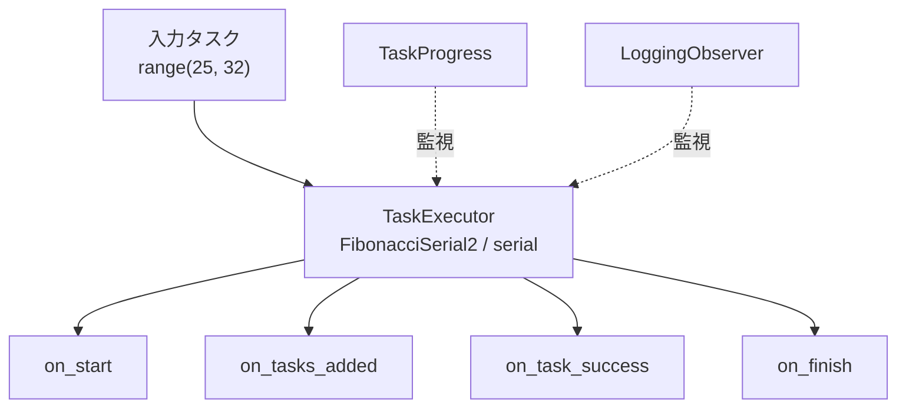

# demo_observer.py デモ説明

> 📅 最終更新日: 2026/06/17

## 目標

CelestialFlow において `TaskExecutor` に異なるタイプの observer を登録する方法を示します。

現在のファイルでは 2 つの方法を同時に紹介しています：

- 組み込みの `TaskProgress` を使用して `tqdm` ベースのプログレスバーを表示
- `BaseObserver` を直接継承してカスタム `LoggingObserver` を実装

## デモ内容

現在のデモには 2 つのエントリ関数が含まれています：

| 関数 | 説明 |
|------|------|
| `demo_progress_observer` | `TaskExecutor` を作成し、`TaskProgress` を登録してプログレスバーを表示 |
| `demo_custom_observer` | `TaskExecutor` を作成し、`LoggingObserver` を登録して observer ライフサイクルログを出力 |

2 種類の observer の位置づけは以下の通りです：



## 主要設定

- `execution_mode="serial"`
- `max_workers=6`
- `max_retries=1`
- 両方の例で `executor.add_observer(...)` により observer を登録

組み込み observer：

| observer | 役割 |
|----------|------|
| `TaskProgress` | `tqdm` で実行進捗を表示。CLI インタラクションシーンに適している |

現在の `LoggingObserver` は以下のコールバックを実装しています：

| コールバック | 役割 |
|------|------|
| `on_start` | executor 名と初期総タスク数を記録 |
| `on_tasks_added` | 追加タスク数を受信し総数を更新 |
| `on_task_success` | 成功タスク数を集計 |
| `on_task_fail` | 失敗タスク数を集計 |
| `on_task_duplicate` | 重複タスク数を集計 |
| `on_finish` | 最終サマリー情報を出力 |

## 発生しうる問題

1. **デフォルトの `main()` は現在 `demo_custom_observer` のみを実行**: プログレスバーの効果を見たい場合は、`__main__` 内の呼び出しを `demo_progress_observer()` に変更する必要があります。
2. **現在のサンプルは成功パスのみを表示**: `test_task` は現在 `range(25, 32)` であるため、実行時には通常 `on_start`、`on_tasks_added`、`on_task_success`、`on_finish` のみが表示されます。
3. **`on_start` の初期 total が 0 になる可能性がある**: executor はまず起動イベントを発火し、その後 `on_tasks_added` を通じて実際に追加されたタスク数を通知します。これは現在の通知順序による正常な現象です。
4. **アサーションなし**: これはデモスクリプトであり、結果の数値を検証せず、observer の呼び出しタイミングを示すためだけに使用されます。
5. **計算所要時間は入力に影響される**: `fibonacci(31)` の所要時間は `fibonacci(25)` よりも顕著に高く、総時間は入力範囲によって変わります。

## 実行方法

```bash
python demo/demo_observer.py
```

## 期待される動作

実行後、以下のような observer ライフサイクルログが表示されます：

### `demo_progress_observer`

エントリを `demo_progress_observer()` に切り替えた場合、ターミナルには以下のようなプログレスバーが表示されます：

```text
FibonacciSerial2(serial): 100%|████████████████████████████| 7/7 [00:00<00:00, ...it/s]
```

### `demo_custom_observer`

`demo_custom_observer()` を実行した場合、以下のような observer ライフサイクルログが表示されます：

```text
[observer] start executor=FibonacciSerial2(serial), total=0
[observer] tasks added +7, total=7
[observer] success +1, succeeded=1
[observer] success +1, succeeded=2
[observer] success +1, succeeded=3
[observer] success +1, succeeded=4
[observer] success +1, succeeded=5
[observer] success +1, succeeded=6
[observer] success +1, succeeded=7
[observer] finish executor=FibonacciSerial2(serial), total=7, succeeded=7, failed=0, duplicated=0
```

失敗イベントや重複イベントを観察したい場合は、入力を例外値や重複値を含むリストに変更してください。例：

```python
test_task = list(range(25, 32)) + [0, 27, None, 0, ""]
```

これにより以下がトリガーされやすくなります：

- `on_task_fail`
- `on_task_duplicate`

## 依存

- `celestialflow`（`BaseObserver`、`TaskExecutor`、`TaskProgress`）
- `demo_utils`（`fibonacci`）
