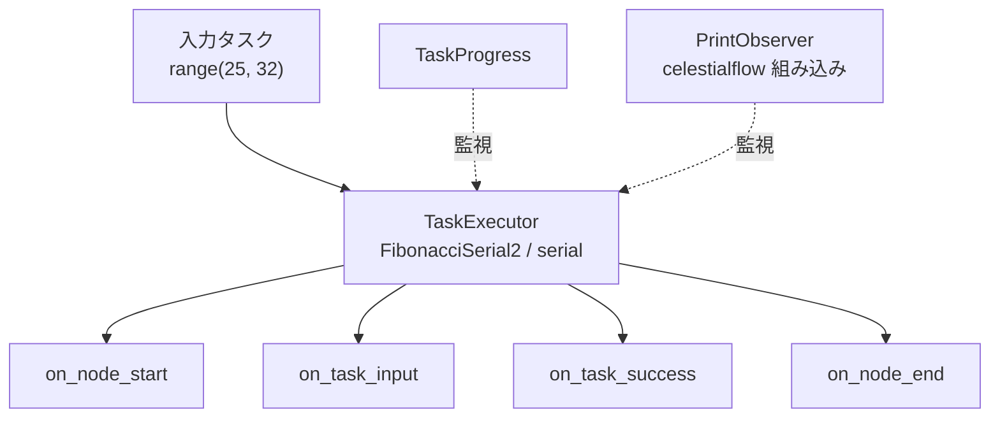

# demo/demo_observer.py

> 📅 最終更新日: 2026/10/09

## 目標

CelestialFlow において `TaskExecutor` に異なるタイプの observer を登録する方法を示す。

現在のファイルでは 2 つの方法を同時に紹介している：

- 本ファイル内のカスタム `TaskProgress` を使用（`Observer` を継承し、`tqdm` ベースのプログレスバー observer）
- `celestialflow` に組み込みの `PrintObserver` を直接使用（構築時に `name` を出力プレフィックスとして渡し、例では `executor.get_name()` を渡す）

## デモ内容

現在のデモには 2 つのエントリ関数が含まれている：

| 関数 | 説明 |
|------|------|
| `demo_progress_observer` | `TaskExecutor` を作成し、`TaskProgress` を登録してプログレスバーを表示 |
| `demo_print_observer` | `TaskExecutor` を作成し、組み込みの `PrintObserver(executor.get_name())` を登録して observer ライフサイクルログを出力 |

2 種類の observer の位置づけは以下の通り：


```mermaid
flowchart TB
    Input["入力タスク<br/>range(25, 32)"] --> Executor["TaskExecutor<br/>FibonacciSerial2 / serial"]
    Progress["TaskProgress"] -.監視.-> Executor
    Custom["PrintObserver<br/>celestialflow 組み込み"] -.監視.-> Executor
    Executor --> NodeStart["on_node_start"]
    Executor --> TaskInput["on_task_input"]
    Executor --> Success["on_task_success"]
    Executor --> NodeEnd["on_node_end"]
```

## 主要設定

- `execution_mode="serial"`
- `max_workers=6`
- `max_retries=1`
- 両方の例で `executor.add_observer(...)` により observer を登録

observer 一覧：

| observer | 提供元 | 役割 |
|----------|------|------|
| `TaskProgress` | 本ファイルでローカル定義 | `tqdm` で実行進捗を表示。CLI インタラクションシーンに適している |
| `PrintObserver` | `celestialflow` 組み込み | `print` で各コールバックのカウントを出力。構築パラメータ `name` が出力プレフィックスとなる |

`PrintObserver` は以下のコールバックを実装している（`name` は構築時に渡されるプレフィックス）。すべてのコールバックは `core_event.py` 内の対応するイベント `dataclass` を受け取る：

| コールバック | 出力 / 役割 |
|------|------|
| `on_node_start` | `[{name}] start total={total}` を出力 |
| `on_task_input` | 総数を加算し `[{name}] total={total}(+1)` を出力 |
| `on_task_success` | 成功数を集計し `[{name}] succeeded={n}(+1), total={total}` を出力 |
| `on_task_fail` | 失敗数を集計し `[{name}] failed={n}(+1), total={total}` を出力 |
| `on_task_skip` | スキップ数を集計し `[{name}] skipped={n}(+1), total={total}` を出力 |
| `on_node_end` | `[{name}] finish total=..., skipped=..., succeeded=..., failed=...` を出力 |

## 発生しうる問題

1. **`__main__` は `demo_progress_observer` と `demo_print_observer` を同時に実行する**：2 つの observer が順次実行され、まず tqdm プログレスバーが表示され、その後ログが出力される。
2. **現在のサンプルは成功パスのみを表示**：`test_task` は現在 `range(25, 32)` であるため、実行時には通常 `on_task_input`、`on_node_start`、`on_task_success`、`on_node_end` のみが表示される。
3. **`on_task_input` と `on_node_start` の順序**：`run()` はまずすべてのタスクを注入してから executor を起動するため、`on_node_start` が発火した時点で `total` はすでに最終値まで累加されている（`PrintObserver` は先に数件の `total=...(+1)` を出力した後に `start total=7` を出力する）。`TaskProgress` もまさにこの性質に依存しており、`on_node_start` 時に累加された `_total` でプログレスバーを作成する。
4. **アサーションなし**：これはデモスクリプトであり、結果の数値を検証せず、observer の呼び出しタイミングを示すためだけに使用される。
5. **計算所要時間は入力に影響される**：現在は反復 O(n) フィボナッチであり、単一タスクの所要時間は `n` に比例して線形増加するが、`fibonacci(31)` と `fibonacci(25)` の差は依然としてマイクロ秒レベルであり、合計所要時間に顕著な影響を与えない。

## 実行方法

```bash
python demo/demo_observer.py
```

## 期待される動作

実行後、以下のような observer ライフサイクルログが出力される：

### `demo_progress_observer`

`demo_progress_observer()` を実行すると、ターミナルには以下のようなプログレスバーが表示される（`TaskProgress` は `desc` を設定していないため、プレフィックスは付かない）：

```text
 0%|          | 0/7 [00:00<?, ?it/s]100%|████████████████████████████| 7/7 [00:00<00:00, ...it/s]
```

### `demo_print_observer`

`demo_print_observer()` を実行すると、以下のような observer ライフサイクルログが出力される（プレフィックスは `executor.get_name()` が返す `FibonacciSerial2`）：

```text
[FibonacciSerial2] total=1(+1)
[FibonacciSerial2] total=2(+1)
...
[FibonacciSerial2] total=7(+1)
[FibonacciSerial2] start total=7
[FibonacciSerial2] succeeded=1(+1), total=7
[FibonacciSerial2] succeeded=2(+1), total=7
...
[FibonacciSerial2] succeeded=7(+1), total=7
[FibonacciSerial2] finish total=7, skipped=0, succeeded=7, failed=0
```

失敗やスキップ、リトライなどのイベントを観察したい場合は、入力を例外値や重複値、不正入力を含むリストに戻してください。例：

```python
test_task = list(range(25, 32)) + [0, 27, None, 0, ""]
```

これにより以下がトリガーされやすくなる：

- `on_task_fail`
- `on_task_skip`
- `on_task_retry`

## 依存関係

- `celestialflow`（`Observer`、`PrintObserver`、`TaskExecutor`；`TaskProgress` は本リポジトリ同ディレクトリの `demo_observer.py` でローカル定義）
- `demo_utils`（`fibonacci`）
- `tqdm`（`TaskProgress` プログレスバーの依存）
