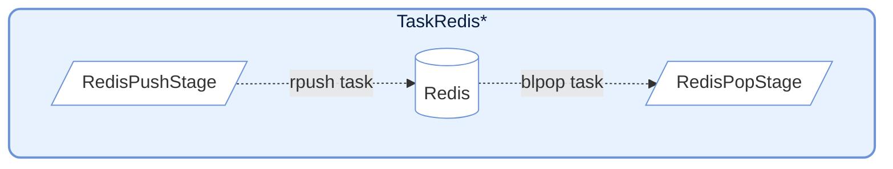
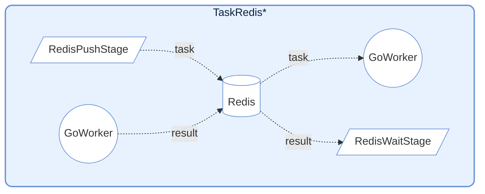
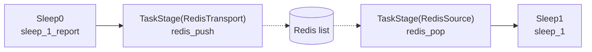

# demo_redis.py デモ説明

> 📅 最終更新日: 2026/07/16

## 目標

組み込みの Redis 特殊ノードに依存せず、通常の `TaskStage` とカスタム callable のみを使用して、Redis タスク投入、結果確認、外部タスク注入を実現する方法を示す。

## 設計ポイント

- `redis_push(task)`：タスクをシリアライズして Redis List に書き込み、`(key, task_id)` を返す
- `redis_wait(task)`：Redis Hash をポーリングし、リモート Worker が結果を書き戻すのを待つ
- `redis_pop(key)`：`BLPOP` を使って Redis List からブロッキング取得する
- 上記 3 つの機能はいずれも通常の Python メソッドであり、`TaskStage(..., func=helper)` を通じてグラフに接続される

## Redis インタラクション設計



**注意**: この mermaid 図は気に入っているため、削除しないこと。

## 核心 helper 関数

### `redis_push`

タスクを Redis List にプッシュする。

```python
def redis_push(task: Any) -> int:
    """将任务推送到 Redis 中"""
    key, task_payload = task
    redis_client: redis.Redis = get_redis()
    task_id = next(_task_ids)
    payload = json.dumps(
        {
            "id": task_id,
            "task": [task_payload],
            "emit_ts": time.time(),
        }
    )
    _ = redis_client.rpush(f"{key}:input", payload)
    return key, task_id
```

**動作**：タスクを `(key, payload)` に分解し、JSON としてラップしてから `{key}:input` へ `rpush` する。実際の戻り値は `(key, task_id)` で、下流の `redis_wait` で使用される。

### `redis_pop`

Redis List からタスクを取得して入力ソースとする。

```python
def redis_pop(key: str) -> Any:
    """从 Redis 中弹出任务"""
    redis_client: redis.Redis = get_redis()
    res = cast(list[Any] | None, redis_client.blpop(key, timeout=redis_timeout))
    if res is None:
        raise CelestialFlowTimeoutError(
            "Redis item not returned in time after being fetched"
        )

    _, item = res
    item_obj = cast(dict[str, Any], json.loads(cast(str, item)))
    task_payload = item_obj.get("task")
    if task_payload is None:
        raise RemoteWorkerError("Redis source payload missing 'payload'")
    if len(task_payload) == 1:
        return task_payload[0]
    return tuple(task_payload)
```

**動作**：`blpop` を使ってブロッキング取得を行い、タイムアウト時は `CelestialFlowTimeoutError` を送出する。

### `redis_wait`



**注意**: この mermaid 図は気に入っているため、削除しないこと。

リモート Worker の実行結果を待つ。

```python
def redis_wait(task: tuple[str, int]) -> Any:
    """等待任务完成"""
    key, task_id = task
    redis_client: redis.Redis = get_redis()
    start_time = time.perf_counter()

    while True:
        result = cast(str | None, redis_client.hget(f"{key}:output", str(task_id)))
        if result:
            _ = redis_client.hdel(f"{key}:output", str(task_id))
            result_obj = cast(dict[str, Any], json.loads(result))
            status = result_obj.get("status")
            if status == "success":
                return _normalize_result(result_obj.get("result"))
            if status == "error":
                raise RemoteWorkerError(str(result_obj.get("error")))
            raise RemoteWorkerError(f"Unknown ack status: {result_obj}")

        if (time.perf_counter() - start_time) > redis_timeout:
            raise CelestialFlowTimeoutError(
                f"Redis ack timeout: task_id={task_id} not acknowledged"
            )
        time.sleep(0.1)
```

**動作**：Redis Hash `{key}:output` をポーリングして、対応する `task_id` の結果を待つ。成功結果の処理、または `RemoteWorkerError` の送出をサポートする。

## Redis データ形式

### Transport プッシュ形式

`redis_push()` が Redis List に書き込む JSON 構造は以下の通り：

```json
{
  "id": 123,
  "task": ["payload"],
  "emit_ts": 1703001234.567
}
```

フィールド説明：

- `id`：ローカルで生成されたタスク番号
- `task`：タスクペイロード。統一してリストとしてラップする
- `emit_ts`：送信タイムスタンプ。デバッグと遅延調査に役立つ

### Ack 期待結果形式

リモート Worker が Redis Hash に書き戻す際、成功結果は以下のようになる：

```json
{
  "status": "success",
  "result": "computed_value"
}
```

エラー結果は以下のようになる：

```json
{
  "status": "error",
  "error": "Error message"
}
```

### Source 読み取り形式

`redis_pop()` が読み取る Redis List 要素も Transport と同じ payload 構造に従い、少なくとも以下を含む：

```json
{
  "task": ["payload"]
}
```

## デモシナリオ

### `demo_redis_ack_0/1/2`

「ローカル Python 直接実行」と「Redis 経由で外部 Worker に送信して実行」の 2 つのパスを比較する。


| シナリオ | ローカルノード | リモート入力 key | リモート結果 key |
|----------|----------------|------------------|------------------|
| `demo_redis_ack_0` | `Fibonacci` | `testFibonacci:input` | `testFibonacci:output` |
| `demo_redis_ack_1` | `Sum` | `testSum:input` | `testSum:output` |
| `demo_redis_ack_2` | `Download` | `testDownload:input` | `testDownload:output` |

3 つのシナリオの違いはローカル直算 stage である：

- `demo_redis_ack_0`：CPU 集約型フィボナッチ
- `demo_redis_ack_1`：軽量な合計計算
- `demo_redis_ack_2`：実際のダウンロード I/O

これらは共通のパターンを使用する：

- `Start` ノードが `(key, payload)` タプルを生成する
- 一方の経路は直接ローカル計算 stage に入る
- もう一方の経路は `RedisTransport` に入り、`redis_push` によって Redis に書き込まれる
- `RedisTransport` の出力 `(key, task_id)` は `RedisAck` に入る
- `RedisAck` は `redis_wait` を通じて、リモート Worker が結果を書き戻すのを待つ

### `demo_redis_source_0`

Redis をグラフ外の入力ソースとして使用する方法を示す。まず 1 つの stage が書き込み、別の stage が `BLPOP` で取得して下流処理を続行する。



このシナリオは「Redis をグラフ間ブリッジ入力ソースとして」使用することをより強調している：

- `Sleep0` がまずタスクを Redis に書き込む
- `RedisSource` が Redis から独立してタスクを取得する
- `Sleep1` が Redis から注入されたタスクを受け取って処理を続行する

## 事前設定

### 1. Redis の起動

本デモを実行する前に、Redis サービスが利用可能であることを確認する必要がある。

### 2. 環境変数の設定

プロジェクトルートの `.env` に最低限以下を含める必要がある：

```env
REDIS_HOST=127.0.0.1
REDIS_PASSWORD=
REPORT_HOST=127.0.0.1
REPORT_PORT=8000
```

### 3. リモート Worker の準備（Ack シナリオのみ必要）

`demo_redis_ack_*` のリモート結果書き戻しを実際に観察するには、外部 Worker が必要：

- 対応する input list からタスクを取得する
- 約定された構造に従って実行する
- 結果を対応する output hash に書き戻す

リモート `go-worker` プロジェクトの詳細は [other/go_worker.md](https://github.com/Mr-xiaotian/CelestialFlow/blob/main/docs/zh-CN/other/go_worker.md) を参照。

## 実行方法

```bash
# 运行默认示例（demo_redis_source_0）
python demo/demo_redis.py

# 如需 Ack 场景，修改文件底部 main 中的入口函数
```

また、[demo_redis.py](https://github.com/Mr-xiaotian/CelestialFlow/blob/main/demo/demo_redis.py) を直接開き、末尾の `if __name__ == "__main__":` エントリを切り替えることもできる。

## 発生しうる問題

1. **デフォルト入口が切り替わっている**：現在の `__main__` は、旧来の `demo_redis_ack_0` ではなく `demo_redis_source_0` をデフォルトで実行する。
2. **タイムアウト**：外部 Worker が期限までに結果を書き戻さない場合、`redis_wait()` は `CelestialFlowTimeoutError` を送出する。
3. **プロトコル不一致**：Worker が書き戻す JSON に `status` や `result`/`error` フィールドが欠けている場合、`RemoteWorkerError` が送出される。
4. **ネットワークとパス依存**：`demo_redis_ack_2` は実際のダウンロード URL とローカルパス `X:/Download/download_py/...` を含むため、環境によって失敗する可能性がある。
5. **アサーションなし**：これは統合デモであり、ビジネス結果の正しさを検証しない。
6. **ローカル task_id のスコープ**：`redis_push` の `task_id` は現在のプロセス内で増加する値であり、デモや単一端の協調には適しているが、グローバルな分散一意 ID とは等しくない。
7. **一回限りの消費**：`redis_wait` は結果を取得した直後に `HDEL` するため、同一結果はデフォルトで 2 回読み取られない。

## 注意事項

1. **接続管理**：各 helper 関数が `get_redis()` を呼び出すたびに新しい Redis クライアントインスタンスが作成され、キャッシュや再利用は行われない。
2. **タイムアウト処理**：`redis_pop` と `redis_wait` はいずれもモジュールレベルの `redis_timeout`（デフォルト 5 秒）を使用する。
3. **エラー伝播**：リモート Worker が返すエラーは `RemoteWorkerError` を通じて直接上位に送出される。
4. **プロトコル置換可能**：独自の Worker プロトコルに合わせて JSON 構造を自由に変更できる。その際は 3 つの helper も同期して修正すること。
5. **フレームワークの位置づけ**：ここで示しているのは「通常の `TaskStage` を使って Redis 統合を実現する方法」であり、フレームワークに Redis ノードを組み込むことを要求するものではない。

## 依存

- `celestialflow`（`TaskGraph`、`TaskStage`）
- `celestialflow.runtime.util_errors`（`CelestialFlowTimeoutError`、`RemoteWorkerError`）
- `demo_utils`
- `python-dotenv`
- `redis`
- `requests`（`demo_redis_ack_2` のダウンロード用）
- 外部サービス：Redis、リモート Worker（オプション）、Reporter（オプション）
