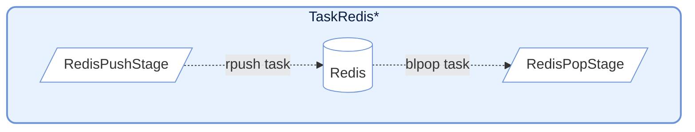
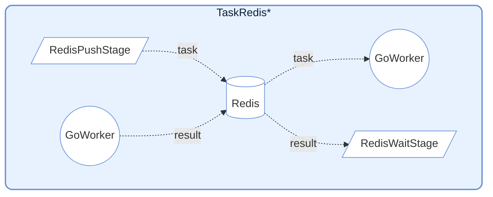
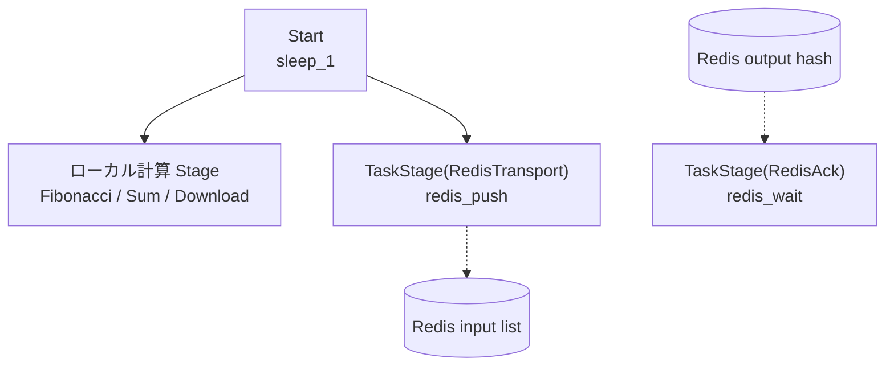

# demo_redis.py デモ説明

> 📅 最終更新日: 2026/06/17

## 目標

組み込みの Redis 特殊ノードに依存せず、通常の `TaskStage` とカスタム callable のみを使用して、Redis タスク投入、結果確認、外部タスク注入を実現する方法を示します。

## 設計ポイント

- `redis_push()`: タスクをシリアライズして Redis List に書き込み、`task_id` を返す
- `redis_wait()`: Redis Hash をポーリングし、リモート Worker が結果を書き戻すのを待つ
- `redis_pop()`: `BLPOP` で Redis List からブロッキング取得
- 上記 3 つの機能はいずれも通常の Python メソッドであり、`TaskStage(..., func=helper.method)` を通じてグラフに接続される

## Redis インタラクション設計



Redis と対話する関数を提供し、言語/プロセスを跨いだ協調（Go Worker との連携など）によく使用されます。

### RedisPush

タスクを Redis List にプッシュします。

```python
def redis_push(task: Any) -> int:
    """タスクを Redis にプッシュする"""
    key, task_payload = task
    redis_client: redis.Redis = get_redis()
    task_id = next(_task_ids)
    payload = json.dumps(
        {
            "id": task_id,
            "task": [task_payload],
            "emit_ts": time.time(),
        }
    )
    _ = redis_client.rpush(f"{key}:input", payload)
    return key, task_id
```

**動作**: タスクを JSON にシリアライズし、Redis List に `rpush` します。内部では `execution_mode="thread"` と `max_workers=4` で並行書き込みを行います。

### RedisPop

Redis List からタスクを取得して入力ソースとします。

```python
def redis_pop(key: str) -> Any:
    """Redis からタスクをポップする"""
    redis_client: redis.Redis = get_redis()
    res = cast(list[Any] | None, redis_client.blpop(key, timeout=redis_timeout))
    if res is None:
        raise CelestialFlowTimeoutError(
            "Redis item not returned in time after being fetched"
        )

    _, item = res
    item_obj = cast(dict[str, Any], json.loads(cast(str, item)))
    task_payload = item_obj.get("task")
    if task_payload is None:
        raise RemoteWorkerError("Redis source payload missing 'payload'")
    if len(task_payload) == 1:
        return task_payload[0]
    return tuple(task_payload)
```

**動作**: `blpop` を使用してブロッキング取得します。内部では `execution_mode="serial"` を使用し、パイプラインのエントリノードに適しています。

### RedisWait



リモート Worker の実行結果を待ちます。

```python
def redis_wait(task: tuple[str, int]) -> Any:
    """タスクの完了を待つ"""
    key, task_id = task
    redis_client: redis.Redis = get_redis()
    start_time = time.perf_counter()

    while True:
        result = cast(str | None, redis_client.hget(f"{key}:output", str(task_id)))
        if result:
            _ = redis_client.hdel(f"{key}:output", str(task_id))
            result_obj = cast(dict[str, Any], json.loads(result))
            status = result_obj.get("status")
            if status == "success":
                return _normalize_result(result_obj.get("result"))
            if status == "error":
                raise RemoteWorkerError(str(result_obj.get("error")))
            raise RemoteWorkerError(f"Unknown ack status: {result_obj}")

        if (time.perf_counter() - start_time) > redis_timeout:
            raise CelestialFlowTimeoutError(
                f"Redis ack timeout: task_id={task_id} not acknowledged"
            )
        time.sleep(0.1)
```

**動作**: Redis Hash をポーリングして対応する `task_id` の結果を待ちます。成功結果の処理または `RemoteWorkerError` の送出をサポートします。

## Redis データ形式

### TaskRedisTransport プッシュ形式

```json
{
    "id": 12345678,
    "task": ["arg1", "arg2"],
    "emit_ts": 1703001234.567
}
```

### TaskRedisAck 期待結果形式

```json
{
    "status": "success",
    "result": "computed_value"
}
```

またはエラー形式：
```json
{
    "status": "error",
    "error": "Error message"
}
```

---

## 注意事項

1. **接続管理**: Redis クライアントは初回使用時に遅延初期化されます。
2. **タイムアウト処理**: `TaskRedisSource` と `TaskRedisAck` はタイムアウト設定をサポートし、タイムアウト時には `TimeoutError` が送出されます。
3. **エラー伝播**: リモート Worker が返すエラーは `RemoteWorkerError` を通じて伝播されます。
4. **冪等性**: `TaskRedisAck` は結果取得後に Redis 内のレコードを削除し、一回限りの消費を保証します。

## データプロトコル

このデモはデフォルトで 2 種類の Redis データ構造を約定しています：

- 入力キュー: Redis List
- 出力結果: Redis Hash

### Transport プッシュ形式

`redis_push()` が Redis List に書き込む JSON 構造は以下の通りです：

```json
{
  "id": 123,
  "task": ["payload"],
  "emit_ts": 1703001234.567
}
```

フィールド説明：

- `id`: ローカル生成のタスク番号
- `task`: タスクペイロード。リストに統一して包む
- `emit_ts`: 送信タイムスタンプ。デバッグと遅延調査に便利

### Ack 期待結果形式

リモート Worker が Redis Hash に書き戻す際、成功結果は以下のようになります：

```json
{
  "status": "success",
  "result": "computed_value"
}
```

エラー結果は以下のようになります：

```json
{
  "status": "error",
  "error": "Error message"
}
```

### Source 読み取り形式

`redis_pop()` が読み取る Redis List 要素も Transport と同じ payload 構造に従います。すなわち最低限以下を含みます：

```json
{
  "task": ["payload"]
}
```

## デモシナリオ

### `demo_redis_ack_0/1/2`

「ローカル Python 直接実行」と「Redis 経由で外部 Worker に送信して実行」の 2 つのパスを比較します。



| シナリオ | ローカルノード | リモート入力 key | リモート結果 key |
|------|----------|--------------|---------------|
| `demo_redis_ack_0` | `Fibonacci` | `testFibonacci:input` | `testFibonacci:output` |
| `demo_redis_ack_1` | `Sum` | `testSum:input` | `testSum:output` |
| `demo_redis_ack_2` | `Download` | `testDownload:input` | `testDownload:output` |

3 つのシナリオの違いはローカル直接計算ステージにあります：

- `demo_redis_ack_0`: CPU 集中型フィボナッチ
- `demo_redis_ack_1`: 軽量な合計計算
- `demo_redis_ack_2`: 実際のダウンロード I/O

これらは同じパターンを共有しています：

- `Start` ノードが元のタスクを生成
- 一方は直接ローカル計算 stage へ
- もう一方は `RedisTransport` へ
- `RedisTransport` の出力 `task_id` がさらに `RedisAck` へ
- 最終的に「ローカル直接実行」と「リモート Redis 協調実行」の効果を比較するために使用

### `demo_redis_source_0`

Redis をグラフ外部の入力ソースとして使用する方法を示します。まず 1 つの stage が書き込み、別の stage が `BLPOP` で取得して下流処理を続行します。


このシナリオは「Redis をグラフ間ブリッジ入力ソースとして」使用することをより強調しています：

- `Sleep0` がまずタスクを Redis に書き込む
- `RedisSource` が Redis から独立してタスクを取得
- `Sleep1` が Redis から注入されたタスクを受け取って処理を続行

## 事前設定

### 1. Redis の起動

本デモを実行する前に、Redis サービスが利用可能であることを確認する必要があります。

### 2. 環境変数の設定

プロジェクトルートの `.env` に最低限以下を含める必要があります：

```env
REDIS_HOST=127.0.0.1
REDIS_PASSWORD=
REPORT_HOST=127.0.0.1
REPORT_PORT=8000
```

### 3. リモート Worker の準備（Ack シナリオのみ必要）

`demo_redis_ack_*` のリモート結果書き戻しを実際に観察するには、外部 Worker が必要です：

- 対応する input list からタスクを取得
- 約定された構造に従って実行
- 結果を対応する output hash に書き戻す

リモート `go-worker` プロジェクトの詳細は [other/go_worker.md](https://github.com/Mr-xiaotian/CelestialFlow/blob/main/docs/zh-CN/other/go_worker.md) を参照してください。

## 実行方法

```bash
# デフォルトサンプル（demo_redis_ack_0）を実行
python demo/demo_redis.py

# 他のシナリオが必要な場合は、ファイル末尾の main 内のエントリ関数を変更
```

[demo_redis.py](https://github.com/Mr-xiaotian/CelestialFlow/blob/main/demo/demo_redis.py) を直接開き、末尾の `if __name__ == "__main__":` エントリを切り替えることもできます。

## 発生しうる問題

1. **タイムアウト**: 外部 Worker が期限内に書き戻さない場合、`RedisTaskAck.wait()` がタイムアウト例外を送出します
2. **プロトコル不一致**: Worker が書き戻す JSON に `status` や `result/error` フィールドが欠けている場合、`RemoteWorkerError` が送出されます
3. **ネットワークとパス依存**: `demo_redis_ack_2` は実際のダウンロード URL とローカルパスを含むため、環境によって失敗する可能性があります
4. **アサーションなし**: これは統合デモであり、ビジネス結果の正しさを検証しません
5. **ローカル task_id のスコープ**: `RedisTaskTransport` の `task_id` は現在のプロセス内でのインクリメンタル値であり、デモや単一端の協調には適していますが、グローバルな分散一意 ID とは等しくありません
6. **一回限りの消費**: `RedisTaskAck` は結果取得後すぐに `HDEL` するため、同一結果はデフォルトで 2 回読み取られません

## 注意事項

1. **接続管理**: Redis クライアントは初回使用時に遅延初期化され、helper のライフサイクル内で再利用されます
2. **タイムアウト処理**: `RedisTaskSource` と `RedisTaskAck` はいずれも `timeout` をサポートします
3. **エラー伝播**: リモート Worker が返すエラーは `RemoteWorkerError` を通じて直接上位に送出されます
4. **プロトコル置換可能**: 自前の Worker プロトコルに合わせて JSON 構造を自由に変更できます。その際は 3 つの helper も同期して修正してください
5. **フレームワークの位置づけ**: ここで示しているのは「通常の `TaskStage` を使って Redis 統合を実現する方法」であり、フレームワークに Redis ノードを組み込むことを要求するものではありません

## 依存

- `celestialflow`（`TaskGraph`、`TaskStage`）
- `demo_utils`
- `python-dotenv`
- `redis`
- 外部サービス: Redis、リモート Worker（任意）、Reporter（任意）
