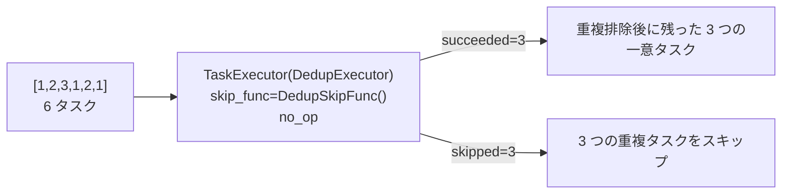
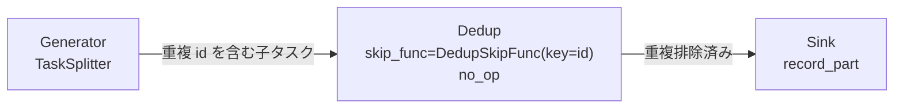

# demo/demo_skip_dedup.py

> 📅 最終更新日: 2026/10/09

## 目標

`TaskExecutor` の `skip_func` メカニズムを利用して、ノード内でタスクの重複排除を行う方法を示す。フレームワークは重複判定ロジックを内蔵せず、「そのタスクがすでに出現したか」という判定を呼び出し側が `skip_func` で提供する。`skip_func` が `True` を返した場合、タスクは `func` を実行せずに直接「スキップ」として記録され、単一の `Executor` やグラフ中間ノードで重複排除能力を実現する。

このデモは 2 種類の重複排除シナリオをカバーする：

- **単一 Executor シナリオ**：`TaskExecutor` に直接重複判定関数を設定する。
- **Graph シナリオ**：グラフ内のいずれかの中間ノードで重複排除し、重複タスクを下流へこれ以上伝播させない。

## デモ内容

### 重複判定器 `DedupSkipFunc`

```python
class DedupSkipFunc:
    def __init__(self, key: Callable[[Any], Any] | None = None) -> None: ...
    def __call__(self, task: Any) -> bool: ...
```

「既に見た集合」ベースの重複判定器で、そのまま `skip_func` として使用できる：

- 初めて出現した key は通過（`False` を返す）、再度出現した key はスキップ（`True` を返す）。
- 構築パラメータ `key`：タスクから重複排除鍵を抽出する関数。デフォルトではタスク自体をキーとする。
- クラス内部は `Lock` で「重複チェック + 登録」を保護するため、thread / async 実行モードでも安全に再利用できる。

> 注：判定関数は使用側が自らスレッドセーフを保証する必要があります（本例ではロックでカプセル化）。また、タスク自体または派生 key はハッシュ可能でなければなりません。

### シナリオ 1：単一 Executor の重複排除（`demo_skip_dedup_executor`）

入力 `[1, 2, 3, 1, 2, 1]`（6 タスク。うち 3 つは重複排除後に残り、3 つは重複）：



- スキップされたタスクは `no_op` を実行せず、リトライ回数も消費しません。
- そのため `succeeded` は重複排除後の数、`skipped` は重複タスク数になります。
- 実行後は `PrintObserver` でノードログを出力し、`MetricsObserver` から `input_total` / `succeeded` / `skipped` を読み取って集計を出力します。

### シナリオ 2：Graph 中間ノードの重複排除（`demo_skip_dedup_graph`）



- `Generator`（`TaskSplitter`）：各シードタスクを 3 つの子タスクに分割。隣接する子タスクの `id` は重複します（`split_with_duplicates`）。
- `Dedup`（`TaskExecutor`）：`task["id"]` を重複排除鍵とし、`skip_func=DedupSkipFunc(key=lambda task: task["id"])` で `id` に基づいて重複子タスクをブロックします。
- `Sink`（`TaskExecutor`）：重複排除後の子タスクのみを受け取り、`record_part` を呼び出して可読なレコードを生成します。

`TaskExecutor` は `func` の戻り値を下流に配布するため、`Dedup` は `no_op` でタスクをそのまま透過させ、`Sink` が受け取るのは引き続き子タスクの辞書です。3 つのシードタスクは重複 `id` を含む 9 つの子タスクに分割され、重複排除後は 4 つのみが `Sink` に流れます。

実行後に各ノードのカウントを出力：

```text
[demo] 各ノードのカウント:
  Generator  input=3    ok=3    fail=0  skip=0    pending=0
  Dedup      input=9    ok=4    fail=0  skip=5    pending=0
  Sink       input=4    ok=4    fail=0  skip=0    pending=0
```

> `Dedup` の `input_total` は実際に受信した全子タスク数、`succeeded` はそのうちの一意な `id` 数、`skipped` はブロックされた重複数です。

## 主要な実装

- **`_metrics_of(target)`**：実行オブジェクトの `ObserverHub`（`target.observers._snapshot()`）から `MetricsObserver` を検索して返す。グラフ/ノード自身はもはや `metrics` フィールドを保持しない。見つからない場合は `RuntimeError` を送出する。
- **`split_with_duplicates(n)`**：1 つのタスクを `[{"id": n, "part": "x"}, {"id": n, "part": "y"}, {"id": n + 1, "part": "x"}]` に分割し、意図的に重複 `id` を生成する。
- **`record_part(task)`**：子タスクを `f"#{task['id']}:{task['part']}"` に整形する。

## 発生しうる問題

1. **スレッドセーフは使用側の責任**：`skip_func` はフレームワークのコールバックです。カスタム判定器内に共有の可変状態（集合やカウンターなど）がある場合は、自らロックする必要があります。そうしないと thread / async モードでエラーになる可能性があります。本デモでは `Lock` で標準的な方法を示しています。
2. **key はハッシュ可能でなければならない**：デフォルトではタスク自体をキーとするため、タスクまたは派生 key はハッシュ可能である必要があります。そうでない場合、`set` による重複チェックが型エラーを送出します。
3. **出力はローカル統計**：両方のシナリオとも `_metrics_of` で `MetricsObserver` を読み取ってカウントを出力し、外部サービスには依存しません。

## 実行方法

```bash
python demo/demo_skip_dedup.py
```

`__main__` は `demo_skip_dedup_executor()` と `demo_skip_dedup_graph()` を順に呼び出します。

## 依存関係

- `celestialflow`（`PrintObserver`、`TaskExecutor`、`TaskGraph`、`TaskSplitter`）
- `celestialflow.observer`（`MetricsObserver`）
- `demo_utils`（`no_op`）