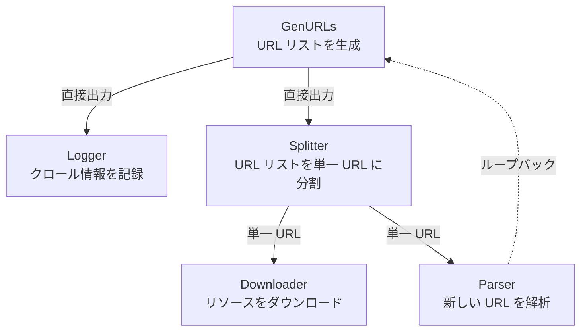
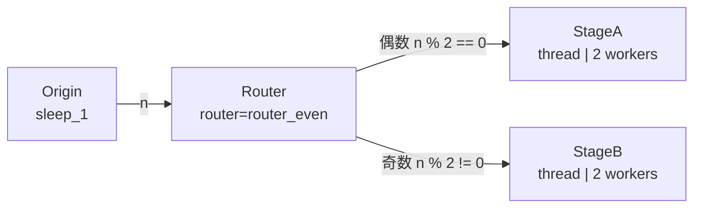

# demo_stages.py デモ説明

> 📅 最終更新日: 2026/07/16

## 目標

CelestialFlow における構造型特殊 Stage ノードの使用方法をデモします：`TaskSplitter`（タスク分割）と `TaskRouter`（タスクルーティング）。循環依存、バッチ分割、条件分岐などのグラフ構造能力を示します。

## デモシナリオ

### `demo_splitter_0`
クローラーワークフローのシミュレーション：



- `GenURLs` → URL リストを生成
- `Logger` → クロール情報を記録
- `Splitter` → URL リストを単一 URL に分割
- `Downloader` → リソースをダウンロード
- `Parser` → 新しい URL を解析し、`GenURLs` にループバック

**グラフ構造**：循環グラフ（`parse_stage → generate_stage`）

### `demo_splitter_1`
大規模データ分割のデモ：入力 `range(100_000)` がリストにラップされて `TaskSplitter` に渡され、下流が 1 つずつ受信処理することで、一度に大量のタスクをメモリにロードするのを回避します。

### `demo_router_0`
`TaskRouter` が偶奇性に基づいてタスクを異なる下流ノードに振り分けるデモです。



ルーティングロジック：`Origin` ステージは入力整数をそのまま出力し、`TaskRouter` は `router_even(n) -> str` を持ち、`_route()` 内で偶奇性に基づいて `StageA`（偶数）または `StageB`（奇数）を選択し、元のタスクをさらに振り分けます。

## 主要設定

- 各 stage の `stage_mode` はシナリオによって異なる：`demo_splitter_0` は `graph.set_graph_mode("thread", "thread")` で統一して `"thread"` に設定。`demo_router_0` では `Origin` と `Router` が `stage_mode="serial"`、下流の `StageA`/`StageB` が `"thread"` を使用。`demo_splitter_1` は `TaskChain` で `stage_mode="thread"` を指定
- `set_reporter(True)` で監視レポートを有効化
- デフォルトで `LocalEventClient()` を使用してローカルイベント ID を生成
- `demo_splitter_0` と `demo_router_0` では `set_ctree(ctree_client)` がコメントアウトされており、デフォルトで CelestialTree は無効。接続するにはまず `celestialtree` を追加インストールし、対応する呼び出しのコメントを解除すること
- Redis リモート協調サンプルは `demo_redis.py` に移行されました

## 発生しうる問題

1. **長時間実行**：`demo_splitter_0` の各ステージには 4〜6 秒のランダム sleep が含まれ、完全な実行には 1 分以上かかる場合があります。
2. **アサーションなし**：デモスクリプトであり、結果の正確性は検証しません。
3. **Redis サンプルの移行**：以前の `demo_redis_ack_*` と `demo_redis_source_0` は [demo_redis.md](https://github.com/Mr-xiaotian/CelestialFlow/blob/main/docs/zh-CN/demo/demo_redis.md) に移行されました。

## 実行方法

```bash
# デフォルトデモ（demo_splitter_0）を実行
python demo/demo_stages.py

# main() を変更して他のシナリオを実行可能
# 例：demo_splitter_0() を demo_router_0() に置き換え
```

## 想定される動作

### `demo_splitter_0`（クローラーワークフロー）

URL 生成後に Splitter で分割され、Downloader と Parser が並行処理し、Parser の結果が Generator にループバックされます：

```
[GenURLs] Generated 3 URLs
[Splitter] Splitting 3 URLs...
[Downloader] Downloading url_0...
[Parser] Parsing url_0...
[Logger] Logging: url_0
[Downloader] Downloading url_1...
...
```

> ランダム sleep（4〜6 秒）を含み、総実行時間は 1 分以上かかる場合があります。

### `demo_router_0`（偶奇ルーティング）

Origin は元の整数のみを生成し、Router が内部で偶奇性に基づいてタスクを StageA（偶数）または StageB（奇数）に振り分けます：

```
[Origin] Input: 0 -> sleep_1(0) -> 0
[Origin] Input: 1 -> sleep_1(1) -> 1
[Router] router_even(0) -> StageA
[Router] router_even(1) -> StageB
[StageA] Received: 0
[StageB] Received: 1
...
```

### `demo_splitter_1`（大規模データ分割）

`range(100000)` をリストにラップして Splitter に渡し、1 つずつ下流に出力して処理します。追加の出力ログはありません。

## 依存

- `celestialflow`（`TaskGraph`、`TaskStage`、`TaskChain`、`TaskSplitter`、`TaskRouter`）
- `demo_utils`
- `python-dotenv`
- 外部サービス：CelestialTree（オプション）、Reporter（オプション）
