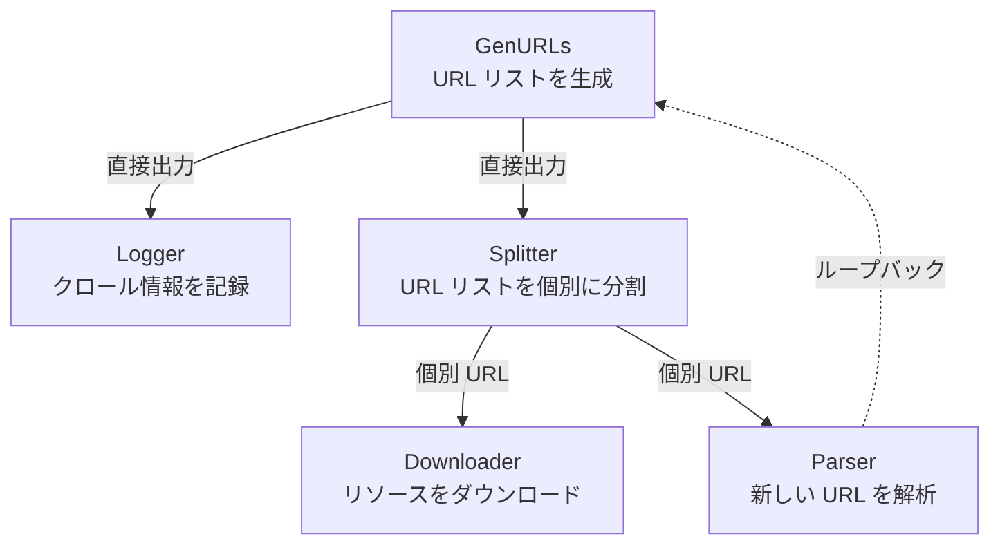
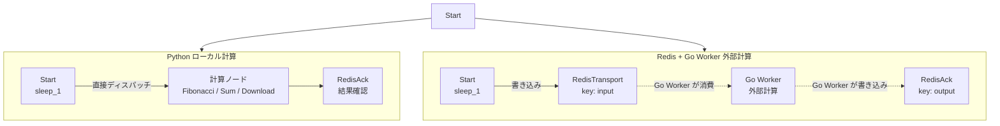
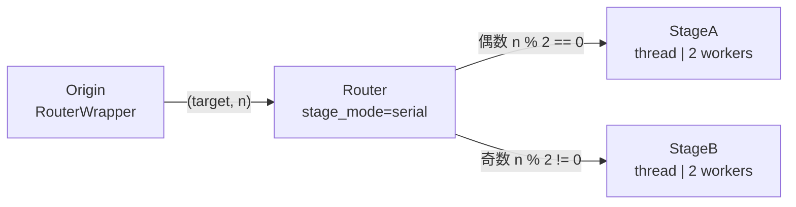

# demo_stages.py デモ説明

> 📅 最終更新日: 2026/05/24

## 目的

CelestialFlow の特殊 Stage ノードの使用方法をデモンストレーションします：`TaskSplitter`（タスク分割）、`TaskRouter`（タスクルーティング）、`TaskRedisTransport` / `TaskRedisAck` / `TaskRedisSource`（Redis 分散トランスポート）。循環依存関係やクロスデバイス連携を含む複雑なタスクグラフを構築します。

## カスタムサブクラス

- `DownloadRedisTransport`：`TaskRedisTransport` を継承し、`get_args` メソッドをオーバーライドして `/tmp/` パスを `X:/Download/download_go/` に置換（Go Worker 用）。
- `DownloadStage`：`TaskStage` を継承し、`get_args` メソッドをオーバーライドして `/tmp/` パスを `X:/Download/download_py/` に置換（Python ローカルダウンロード用）。

## デモシナリオ

### `demo_splitter_0`
クローラーワークフローのシミュレーション：



- `GenURLs` → URL リストを生成
- `Logger` → クロール情報を記録
- `Splitter` → URL リストを個別の URL に分割
- `Downloader` → リソースをダウンロード
- `Parser` → 新しい URL を解析し `GenURLs` にループバック

**グラフ構造**：循環グラフ（`parse_stage → generate_stage`）

### `demo_splitter_1`
大データパッケージの分割をデモンストレーション：入力 `range(int(1e5))` をリストでラップして `TaskSplitter` に渡し、下流ステージが1つずつ受信・処理することで、一度に大量のタスクをメモリに読み込むことを回避します。

### `demo_redis_ack_0/1/2`
Python ローカル計算と Redis + Go Worker 外部計算の所要時間を比較：



| シナリオ | 計算タイプ | Python ローカルノード | Go Worker ノード |
|------|---------|----------------|----------------|
| `demo_redis_ack_0` | CPU 密集型 | `Fibonacci` | フィボナッチ計算 |
| `demo_redis_ack_1` | 通信オーバーヘッド主導 | `Sum`（`sum_int`） | 合計計算 |
| `demo_redis_ack_2` | I/O 密集型 | `Download`（`download_to_file`、パス `download_py/`） | 画像ダウンロード（`download_go/`） |

> 図中の破線矢印はクロスプロセス/クロスデバイスのデータフローを示します。すべての `demo_redis_ack_*` の Python パスと Go Worker パスは同じ `Start` ノードを共有します：`graph.connect([start_stage], [redis_tranport, compute_stage])`。

### `demo_redis_source_0`
`TaskRedisSource` が Redis から独立してタスクを読み取り、クロスデバイス/クロス TaskGraph のデータ転送を実現することをデモンストレーションします。

### `demo_router_0`
`TaskRouter` が奇偶性に基づいてタスクを異なる下流ノードに分配することをデモンストレーションします。



ルーティングロジック：`Origin` ステージの `RouterWrapper` が入力 `n` の奇偶性に基づいて `(target, n)` タプルを生成し、`Router` が `target` フィールドに基づいてタスクを `StageA`（偶数）または `StageB`（奇数）に分配します。

## 主要設定

- すべての stage のデフォルトは `stage_mode="thread"`（マルチスレッド）
- `set_reporter(True)` でモニタリングレポートを有効化
- `set_ctree(True)` でイベントトレーシングを有効化

## 起こりうる問題

1. **Redis 依存**：`demo_redis_*` シリーズは利用可能な Redis サービスが必要です（`.env` で `REDIS_HOST`、`REDIS_PASSWORD` を設定）。
2. **Go Worker の事前設定**：外部 Worker の使用には[事前設定](https://github.com/Mr-xiaotian/CelestialFlow/blob/main/docs/reference/other/go_worker.md#前期設置)の完了が必要です。
3. **ハードコードされたネットワークパス**：`DownloadStage` と `DownloadRedisTransport` には Windows パスのハードコード（`X:/Download/...`）が含まれており、非 Windows 環境やパスが存在しない場合に失敗します。
4. **長時間実行**：`demo_splitter_0` の各ステージには4-6秒のランダム sleep が含まれ、完全な実行は1分を超える場合があります。
5. **アサーションなし**：デモスクリプトであり、結果の正確性は検証しません。

## 実行方法

```bash
# デフォルトのデモを実行（demo_splitter_0）
python demo/demo_stages.py

# main() を修正して他のシナリオを実行可能
# 例：demo_splitter_0() を demo_router_0() に置き換え
```

## 期待される動作

### `demo_splitter_0`（クローラーワークフロー）

URL 生成後、Splitter で分割され、Downloader と Parser が並列処理され、Parser の結果が Generator にループバックされます：

```
[GenURLs] Generated 3 URLs
[Splitter] Splitting 3 URLs...
[Downloader] Downloading url_0...
[Parser] Parsing url_0...
[Logger] Logging: url_0
[Downloader] Downloading url_1...
...
```

> ランダム sleep（4-6 秒）を含み、総実行時間は 1 分を超える場合があります。

### `demo_router_0`（奇偶ルーティング）

Origin が入力の奇偶性に基づいて `(target, n)` を生成し、Router が StageA（偶数）または StageB（奇数）に分配します：

```
[Origin] Input: 0 -> RouterWrapper(0) -> ('stage_a', 0)
[Origin] Input: 1 -> RouterWrapper(1) -> ('stage_b', 1)
[Router] Routing 0 to stage_a
[Router] Routing 1 to stage_b
[StageA] Received: 0
[StageB] Received: 1
...
```

### `demo_redis_ack_0/1/2`（Redis 分散計算）

Python ローカル計算と Go Worker 外部計算が並列実行され、結果がそれぞれ Redis Ack に書き込まれます：

```
[Fibonacci] Computing fibonacci for n=10...
[RedisTransport] Writing 10 to Redis key 'input:0'
[RedisAck] Acknowledging fibonacci result: 55
...
```

> Redis と Go Worker の事前起動が必要です（[事前設定]を参照）。自動停止しないため、手動で Ctrl+C で終了してください。

### `demo_splitter_1`（大データ分割）

`range(100000)` をリストにラップして Splitter に渡し、1つずつ下流に出力して処理します。追加の出力ログはありません。

## 依存関係

- `celestialflow`（`TaskGraph`、`TaskStage`、`TaskChain`、`TaskSplitter`、`TaskRouter`、`TaskRedisTransport`、`TaskRedisAck`、`TaskRedisSource`）
- `demo_utils`
- `python-dotenv`
- 外部サービス：Redis、CelestialTree（オプション）、Reporter（オプション）、Go Worker（オプション）
