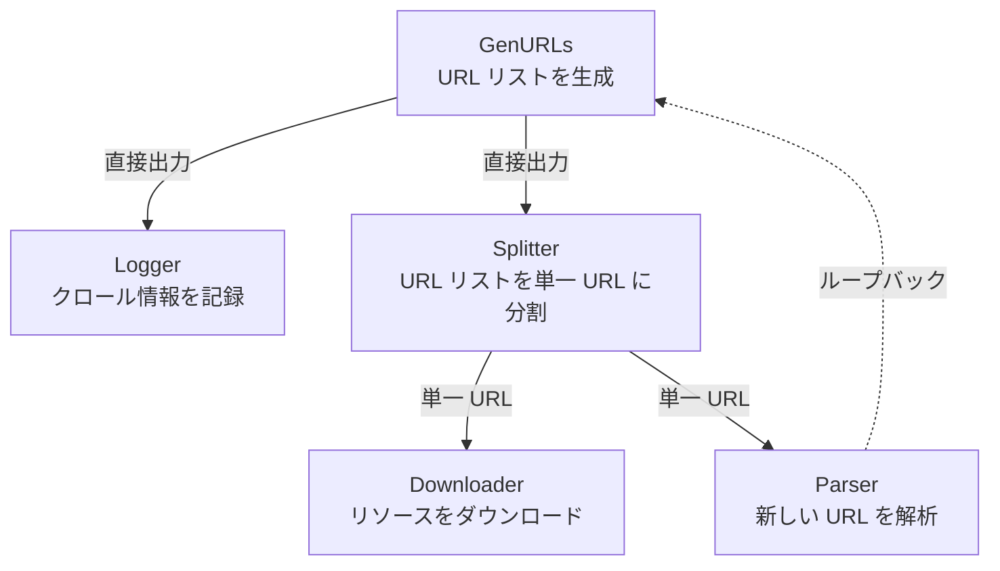
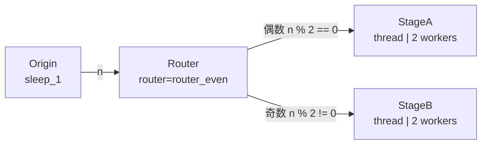

# demo_stages.py デモ説明

> 📅 最終更新日: 2026/08/26

## 目標

CelestialFlow における構造型特殊 Stage ノードの使用方法をデモする：`TaskSplitter`（タスク分割）と `TaskRouter`（タスクルーティング）。循環依存、バッチ分割、条件分岐などのグラフ構造能力を示す。

## デモシナリオ

### `demo_splitter_0`
クローラーワークフローのシミュレーション：


```mermaid
flowchart TD
    GenURLs["GenURLs<br/>URL リストを生成"] -->|直接出力| Logger["Logger<br/>クロール情報を記録"]
    GenURLs -->|直接出力| Splitter["Splitter<br/>URL リストを単一 URL に分割"]
    Splitter -->|単一 URL| Downloader["Downloader<br/>リソースをダウンロード"]
    Splitter -->|単一 URL| Parser["Parser<br/>新しい URL を解析"]
    Parser -.->|ループバック| GenURLs
```

- `GenURLs` → URL リストを生成
- `Logger` → クロール情報を記録
- `Splitter` → URL リストを単一 URL に分割
- `Downloader` → リソースをダウンロード
- `Parser` → 新しい URL を解析し、`GenURLs` にループバック

**グラフ構造**：循環グラフ（`parse_stage → generate_stage`）

### `demo_splitter_1`
大規模データ分割のデモ：入力 `range(100_000)` がリストにラップされて `TaskSplitter` に渡され、下流が 1 つずつ受信処理することで、一度に大量のタスクをメモリにロードするのを回避する。

### `demo_router_0`
`TaskRouter` が偶奇性に基づいてタスクを異なる下流ノードに振り分けるデモ。


```mermaid
flowchart LR
    Origin["Origin<br/>sleep_1"] -->|"n"| Router["Router<br/>router=router_even"]
    Router -->|偶数 n % 2 == 0| StageA["StageA<br/>thread | 2 workers"]
    Router -->|奇数 n % 2 != 0| StageB["StageB<br/>thread | 2 workers"]
```

ルーティングロジック：`Origin` ステージは入力整数をそのまま出力し、`TaskRouter` は `router_even(n) -> str` を保持し、`_route()` 内で偶奇性に基づいて `StageA`（偶数）または `StageB`（奇数）を選択し、元のタスクを更に下流に振り分ける。

## 主要設定

- 各 stage はデフォルトで `execution_mode="thread"` を使用（明示的に設定しない場合はフレームワークが決定）。`demo_splitter_0` は `graph.set_graph_mode("thread")` と `graph.set_stage_execution_mode("thread")` の 2 つの独立した呼び出しで `"thread"` に統一設定。`demo_splitter_1` は `TaskChain` を介して間接的に `execution_mode="thread"`、`max_workers=50` で動作
- `demo_router_0` では `Origin`/`StageA`/`StageB` がいずれも `execution_mode="thread"` を使用し（`max_workers=4` / `2` / `2`）、`Router` は `TaskRouter` ノードであり、自身は `execution_mode` を使用しない
- 監視は `graph.set_reporter(TaskReporter(report_host, report_port, graph))` を通じて `REPORT_HOST`/`REPORT_PORT` 環境変数に対応するリモート Reporter に接続。`graph.set_ctree(ctree_client)` はデフォルトでコメントアウトされており、CelestialTree は有効にならない。接続する必要がある場合は、まず `celestialtree` を追加インストールし、対応するコメントを解除すること
- Redis リモート協調のサンプルは `demo_redis.py` に移行済み

## 発生しうる問題

1. **長時間実行**：`demo_splitter_0` の各ステージには 4〜6 秒のランダム sleep が含まれ、完全な実行には 1 分以上かかる可能性がある。
2. **ループバックが含まれ、自動的に終了しない可能性がある**：`demo_splitter_0` には `Parser → GenURLs` のループバックが存在し、`graph.run(..., if_put_signal=False)` は自動終了シグナルを注入しない。一部の URL（解析に成功した `url_1_1` など）は新しい URL を生成し続けてループするため、長時間新しい出力がない場合は **Ctrl+C** で手動終了することを推奨。
3. **アサーションなし**：デモスクリプトであり、結果の正確性は検証しない。
4. **Redis サンプルの移行**：以前の `demo_redis_ack_*` と `demo_redis_source_0` は [demo_redis.md](https://github.com/Mr-xiaotian/CelestialFlow/blob/main/docs/zh-CN/demo/demo_redis.md) に移行済み。

## 実行方法

```bash
# デフォルトデモ（demo_splitter_0）を実行
python demo/demo_stages.py

# main() を変更した後、他のシナリオを実行可能
# 例：demo_splitter_0() を demo_router_0() に置き換え
```

> **注意**：現在の `__main__` はデフォルトで `demo_splitter_0()` のみを呼び出す。`demo_splitter_1()` と `demo_router_0()` はいずれも呼び出されないため、`main()` 内で手動で実行するか、コメントを解除する必要がある。

## 期待される動作

以下の出力はすべて期待される出力（mock）であり、具体的なログ形式はフレームワークの出力に依存する。

### `demo_splitter_0`（クローラーワークフロー）

URL 生成後に Splitter で分割され、Downloader と Parser が並行処理し、Parser の結果が Generator にループバックされる：

```
[GenURLs] Generated 3 URLs
[Splitter] Splitting 3 URLs...
[Downloader] Downloading url_0...
[Parser] Parsing url_0...
[Logger] Logging: url_0
[Downloader] Downloading url_1...
...
```

> ランダム sleep（4〜6 秒）を含み、総実行時間は 1 分以上かかる可能性がある。

### `demo_router_0`（偶奇ルーティング）

Origin は元の整数のみを生成し、Router が内部で偶奇性に基づいてタスクを StageA（偶数）または StageB（奇数）に振り分ける：

```
[Origin] Input: 0 -> sleep_1(0) -> 0
[Origin] Input: 1 -> sleep_1(1) -> 1
[Router] router_even(0) -> StageA
[Router] router_even(1) -> StageB
[StageA] Received: 0
[StageB] Received: 1
...
```

### `demo_splitter_1`（大規模データ分割）

`range(100000)` をリストにラップして Splitter に渡し、1 つずつ下流に出力して処理する。追加の出力ログはない。

## 依存関係

- `celestialflow`（`TaskGraph`、`TaskStage`、`TaskChain`、`TaskSplitter`、`TaskRouter`、`TaskReporter`）
- `demo_utils`
- `python-dotenv`
- 外部サービス：CelestialTree（オプション）、Reporter（オプション）
