# demo_structure.py デモ説明

> 📅 最終更新日: 2026/05/24

## 目的

`core_structure.py` で事前定義された複数のグラフ構造（DAG および循環グラフ）をデモンストレーションし、チェーン、クロス、グリッド、ループ、ホイール、完全グラフなど、さまざまなトポロジーでの CelestialFlow の構築と実行方法を示します。

## デモ構造

### DAG（有向非巡回グラフ）

| 関数 | 構造 | 説明 |
|------|------|------|
| `demo_chain` | TaskChain | 5ノード線形チェーン、スレッドモード |
| `demo_forest` | TaskGraph | 2つの独立したツリー型 DAG の共存 |
| `demo_cross` | TaskCross | 3層クロス構造（3→1→3） |
| `demo_network` | TaskCross | 多層多分岐ネットワーク（2→3→1） |
| `demo_star` | TaskCross | 中心ノードが複数のエッジノードを指す |
| `demo_fanin` | TaskCross | 複数のソースノードが1つのマージノードに収束 |
| `demo_grid` | TaskGrid | 4×4 スレッドグリッド、staged スケジューリング |

#### Chain（チェーン）— `demo_chain`

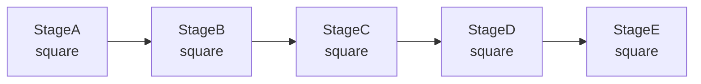

線形5ノードチェーン。データは `StageA → StageB → StageC → StageD → StageE` の順に流れ、各ノードで平方演算を実行します。`TaskChain` で構築し、`start_chain()` で起動します。

#### Cross（クロス）— `demo_cross`

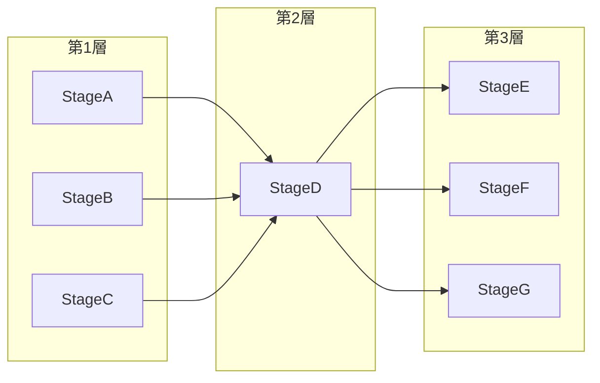

3層クロス構造（3→1→3）。`TaskCross` で構築し、`start_cross()` で起動します。

#### Network（ネットワーク）— `demo_network`

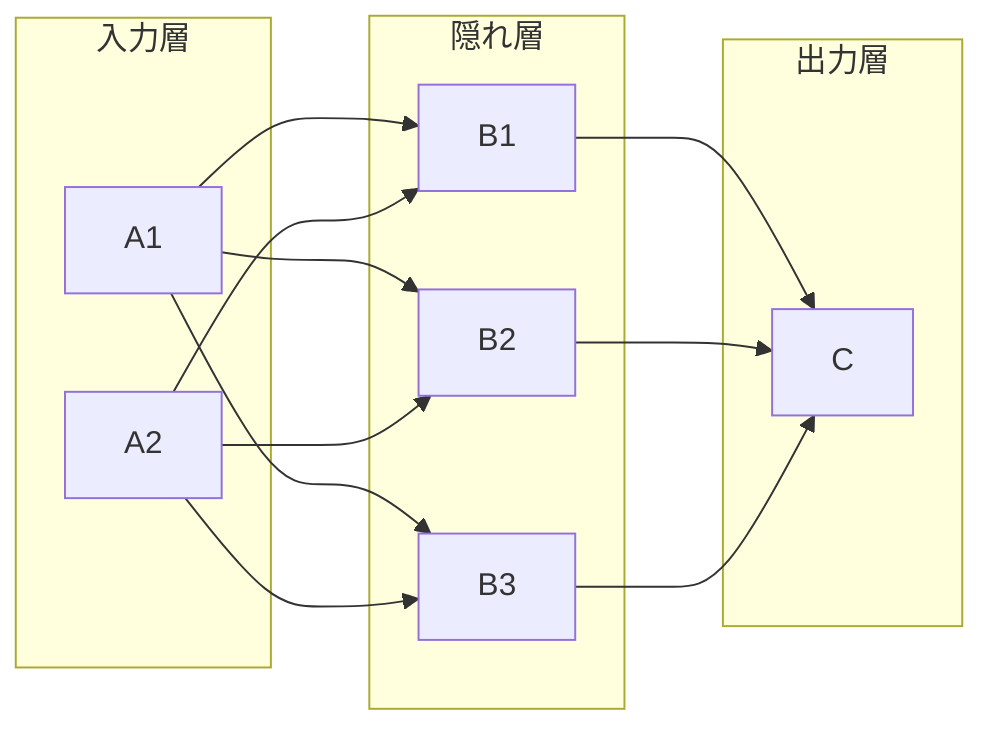

多層多分岐ネットワークトポロジー（2→3→1）。ニューラルネットワークの順伝播構造をシミュレートします。

#### Star（スター型）— `demo_star`

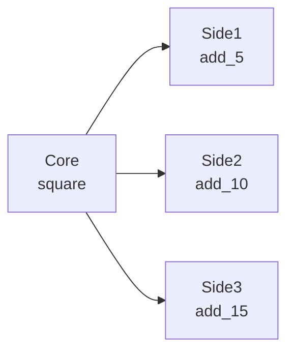

中心ノード `Core` が計算結果を複数のエッジノードに分配し、各エッジノードが独立して処理します。

#### Fan-In（ファンイン）— `demo_fanin`

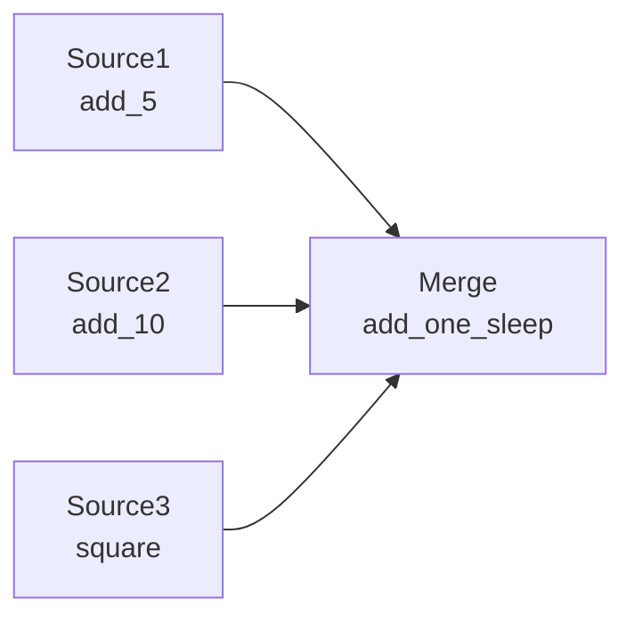

複数のソースノード `Source1`、`Source2`、`Source3` の計算結果が1つのマージノード `Merge` に収束します。

#### Grid（グリッド）— `demo_grid`

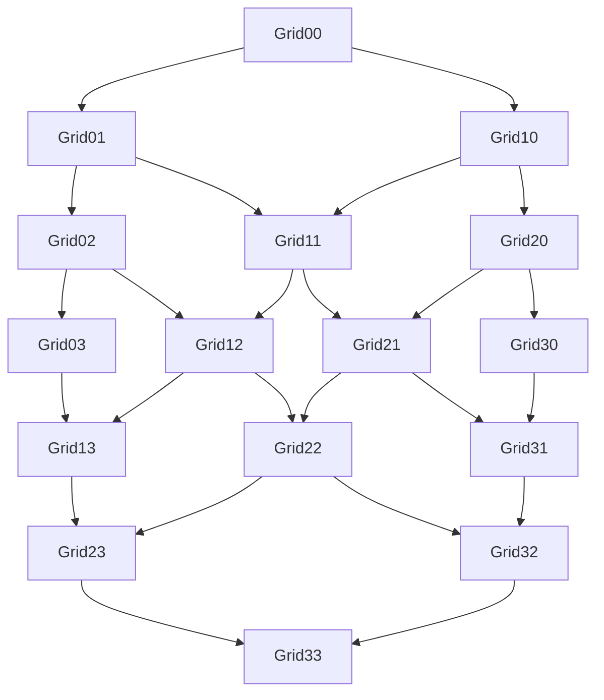

4×4 グリッドトポロジー。データは左上 `Grid00` から注入され、右下 `Grid33` に向かってレイヤーごとに伝播します。

### 循環グラフ

| 関数 | 構造 | 説明 |
|------|------|------|
| `demo_loop` | TaskLoop | 3ノード閉ループ、セルフロック構造 |
| `demo_wheel` | TaskWheel | 中心ノード + 4つのリングノード |
| `demo_complete` | TaskComplete | 3ノード完全グラフ、全結合 |
| `demo_multi_cycle` | TaskGraph | マルチサイクル相互接続グラフ：3組の2ノードサイクル（A/B/C）、A2 が B1 と C1 に分岐 |

#### Loop（ループ）— `demo_loop`

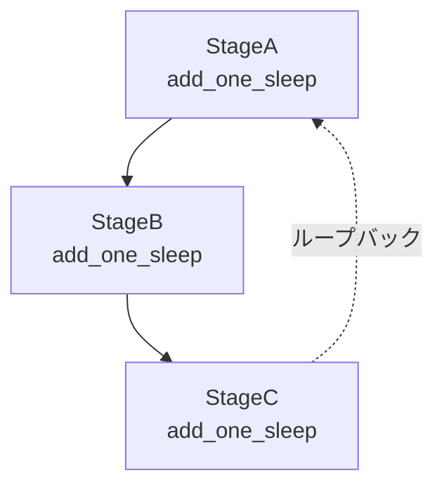

3ノード閉ループセルフロック構造。`TaskLoop` で構築します。タスクは投入後、A → B → C → A の間を継続的に循環し、外部から終了されるまで続きます。

#### Wheel（ホイール）— `demo_wheel`

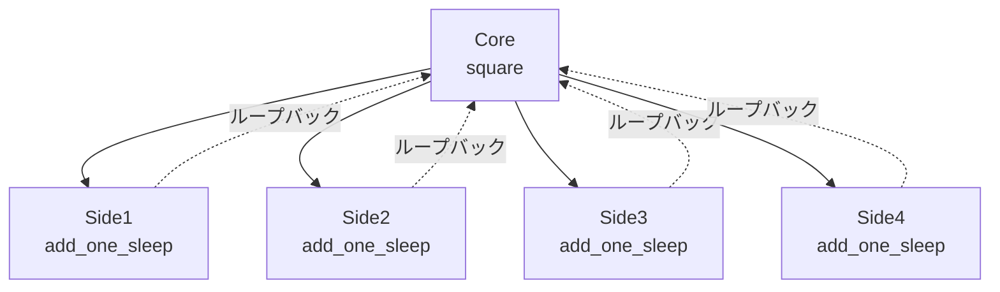

ホイールトポロジー：中心 `Core` がタスクを4つのリングノードに分配し、リングノードが処理完了後に `Core` にループバックして継続的に回転します。`TaskWheel` で構築します。

#### Complete（完全グラフ）— `demo_complete`

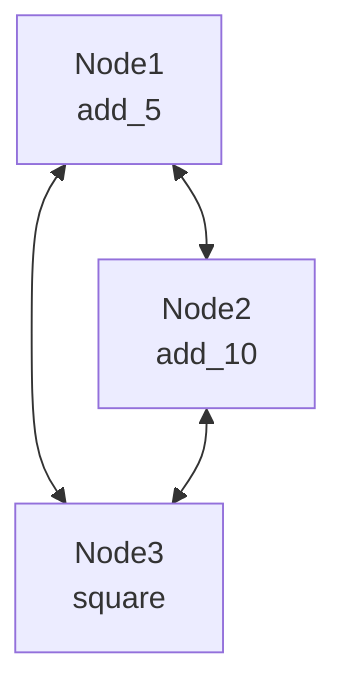

3ノード完全グラフ。すべてのノードが互いに接続されています。`TaskComplete` で構築し、データは全結合トポロジー内を流れます。

#### Multi-Cycle（マルチサイクル相互接続）— `demo_multi_cycle`

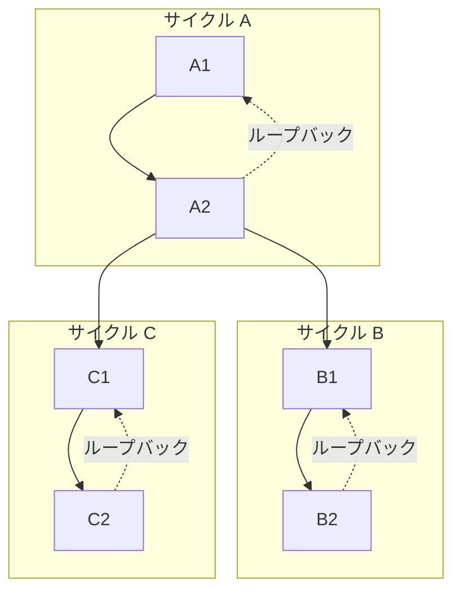

3組の2ノードサイクル（A/B/C）。`A2` が `B1` と `C1` に分岐し、マルチサイクル相互接続を実現します。

### Forest（フォレスト）— `demo_forest`

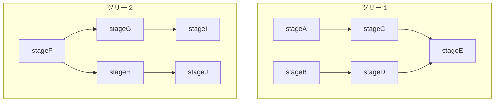

2つの独立したツリー型 DAG が同一の `TaskGraph` 内に共存し、互いに干渉しません。ツリー 1（A→C→E, B→D→E）とツリー 2（F→G→I, F→H→J）がそれぞれ独立して実行されます。

## 主要設定

- DAG 構造：`stage_mode="thread"`、`execution_mode="thread"`
- `demo_grid`：`staged` スケジューリングモードを使用（レイヤーごとの実行）
- 循環グラフ：`put_termination_signal=False`（外部からの停止制御を推奨）
- すべてのデモで `Reporter` と `CelestialTree` を有効化

## 起こりうる問題

1. **循環グラフは自動停止しない**：`demo_loop`、`demo_complete` などは `put_termination_signal=False` を使用し、プロセスを手動で終了するまで継続的にループします。
2. **sleep 遅延の蓄積**：`add_one_sleep` には1秒の sleep が含まれ、20タスク × 複数ノード = 長い合計所要時間となります。
3. **アサーションなし**：フレームワークが起動・実行できることのみを検証し、結果の数値は確認しません。

## 実行方法

```bash
python demo/demo_structure.py
```

## 期待される動作

実行後、各構造デモが順次実行され、各 Stage の入出力ログと最終サマリーが出力されます。

### DAG 構造

```
=== demo_chain (5-node linear chain) ===
[StageA] Input: 2 -> Output: 4
[StageB] Input: 4 -> Output: 16
[StageC] Input: 16 -> Output: 256
[StageD] Input: 256 -> Output: 65536
[StageE] Input: 65536 -> Output: 4294967296
```

```
=== demo_grid (4x4 grid, staged scheduling) ===
[Grid00] -> [Grid01] [Grid10]
[Grid01] -> [Grid02] [Grid11]
...
--- Summary ---
Grid00: success=5  fail=0
Grid33: success=5  fail=0
```

### 循環グラフ

```
=== demo_loop (3-node closed loop) ===
[StageA] Input: 1 -> Output: 2
[StageB] Input: 2 -> Output: 3
[StageC] Input: 3 -> Output: 4
[StageA] Input: 4 -> Output: 5
... (継続的に循環し、自動停止しません)
```

```
=== demo_complete (3-node complete graph) ===
[Node1] Input: 5 -> Output: 10
[Node2] Input: 10 -> Output: 20
[Node3] Input: 20 -> Output: 400
... (継続的に循環)
```

> **重要**：`demo_loop`、`demo_wheel`、`demo_complete` などの循環グラフは `put_termination_signal=False` を使用し、実行後に自動停止しません。**Ctrl+C** で手動終了してください。

### Forest（フォレスト）

2つの独立した DAG がそれぞれ実行され、互いに干渉しません：

```
=== demo_forest (disjoint DAGs) ===
[stageA] Input: 1 -> Result: 2
[stageB] Input: 2 -> Result: 3
[stageF] Input: 3 -> Result: 4
[stageC] Input: ...
```

> 各構造の実行前に `=== demo_xxx ===` の区切り線が表示され、`Summary` セクションで各ノードの成功/失敗カウントが表示されます。

## 依存関係

- `celestialflow`（`TaskGraph`、`TaskChain`、`TaskCross`、`TaskGrid`、`TaskLoop`、`TaskWheel`、`TaskComplete`、`TaskStage`）
- `demo_utils`
- `python-dotenv`
- 外部サービス：CelestialTree（オプション）、Reporter（オプション）
