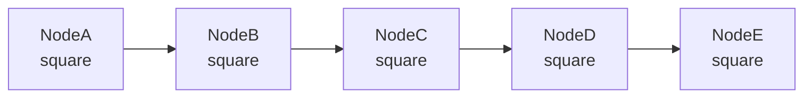
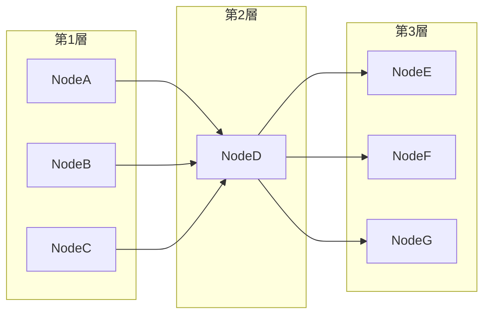
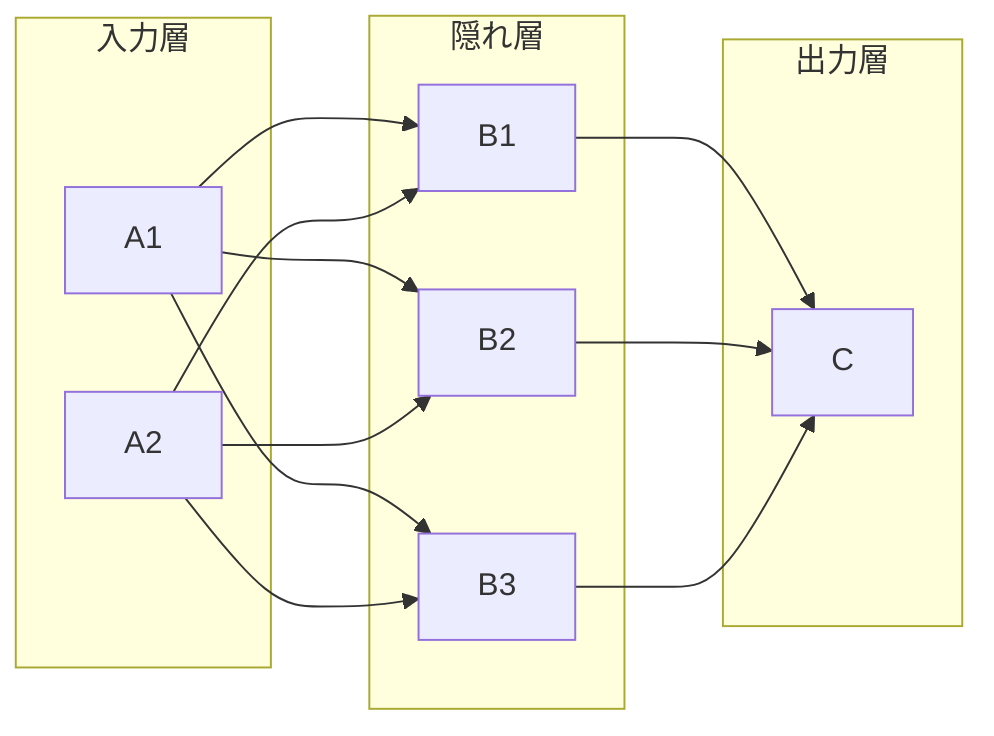
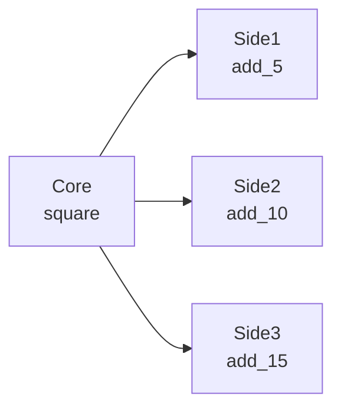
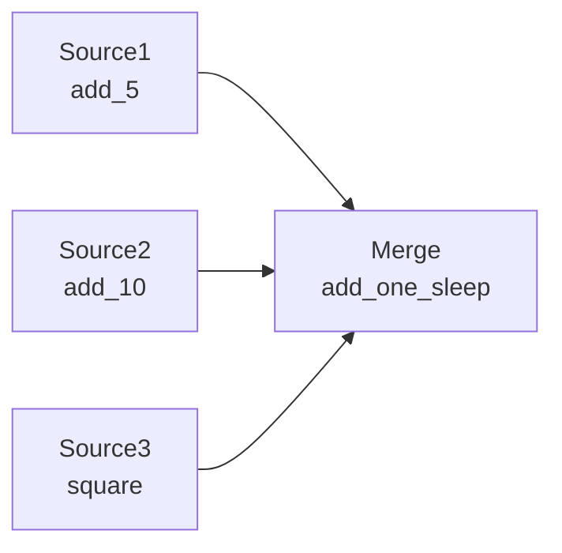
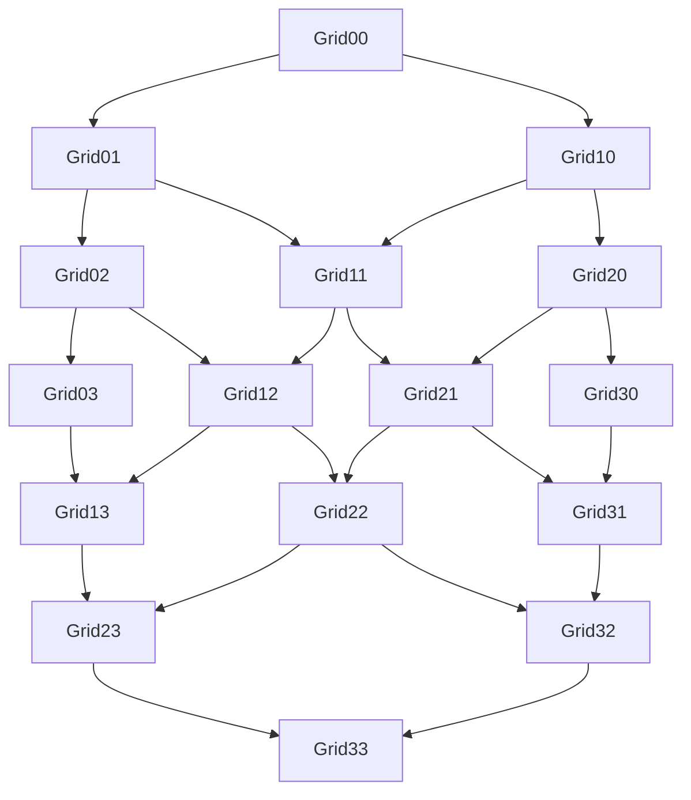
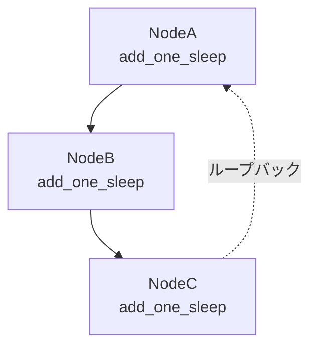
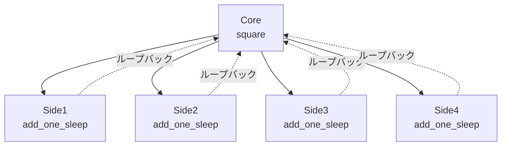
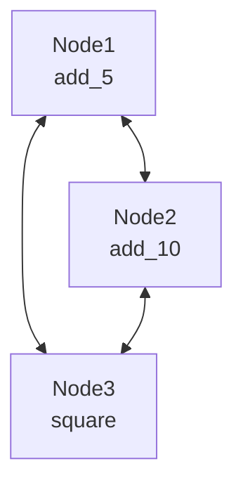
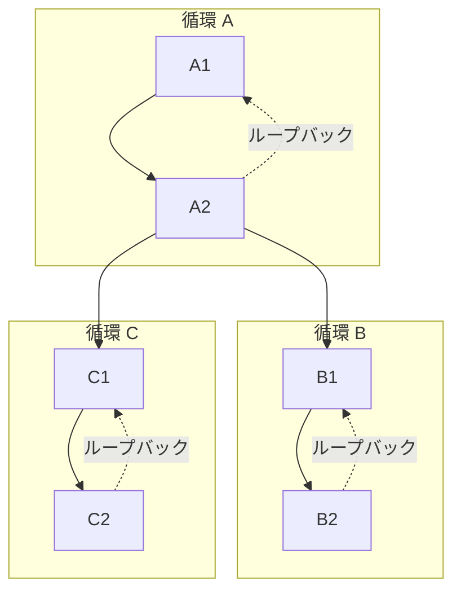

# demo/demo_structure.py

> 📅 最終更新日: 2026/09/24

## 目標

`core_structure.py` であらかじめ定義された複数のグラフ構造（DAG と循環グラフ）をデモし、CelestialFlow におけるチェーン、クロス、グリッド、ループ、ホイール、完全グラフなど多様なトポロジーでの構築と実行方法を示す。

> `demo_structure.py` に元々あった `demo_forest`（2 つの独立したツリー状 DAG）は削除され、フォレストのサンプルは現在 [demo_web.py](https://github.com/Mr-xiaotian/CelestialFlow/blob/main/docs/zh-CN/demo/demo_web.md) の `demo_forest()` に存在する。

## デモ構造

### DAG（有向非巡回グラフ）

| 関数 | 構造 | 説明 |
|------|------|------|
| `demo_chain` | TaskChain | 5 ノード線形チェーン（`NodeA`~`NodeE`）、各ノードは `execution_mode="serial"` |
| `demo_cross` | TaskCross | 3 層クロス構造（3→1→3） |
| `demo_network` | TaskCross | 多層多分岐ネットワーク（2→3→1） |
| `demo_star` | TaskCross | 中心ノードが複数のエッジノードを指す |
| `demo_fanin` | TaskCross | 複数のソースノードが 1 つのマージノードに合流 |
| `demo_grid` | TaskGrid | 4×4 スレッドグリッド |

#### Chain（チェーン）— `demo_chain`


```mermaid
flowchart LR
    A["NodeA<br/>square"] --> B["NodeB<br/>square"]
    B --> C["NodeC<br/>square"]
    C --> D["NodeD<br/>square"]
    D --> E["NodeE<br/>square"]
```

線形 5 ノードチェーン。データは `NodeA → NodeB → NodeC → NodeD → NodeE` の順に流れ、各ノードは二乗演算（`square`、1 秒の sleep を含む）を実行する。`TaskChain` で構築され、`chain.run({"NodeA": list(range(20))}, if_put_signal=False)` で起動する。

#### Cross（クロス）— `demo_cross`


```mermaid
flowchart LR
    subgraph Layer1["第1層"]
        A["NodeA"]
        B["NodeB"]
        C["NodeC"]
    end
    subgraph Layer2["第2層"]
        D["NodeD"]
    end
    subgraph Layer3["第3層"]
        E["NodeE"]
        F["NodeF"]
        G["NodeG"]
    end

    A --> D
    B --> D
    C --> D
    D --> E
    D --> F
    D --> G
```

3 層クロス構造（3→1→3）。`TaskCross` で構築され、`cross.run(...)` で起動する。各ノードは `add_one_sleep` を使用し、うち `NodeD` の `max_workers=5`、残りは 2。

#### Network（ネットワーク）— `demo_network`


```mermaid
flowchart LR
    subgraph Input["入力層"]
        A1["A1"]
        A2["A2"]
    end
    subgraph Hidden["隠れ層"]
        B1["B1"]
        B2["B2"]
        B3["B3"]
    end
    subgraph Output["出力層"]
        C["C"]
    end

    A1 --> B1
    A1 --> B2
    A1 --> B3
    A2 --> B1
    A2 --> B2
    A2 --> B3
    B1 --> C
    B2 --> C
    B3 --> C
```

多層多分岐ネットワークトポロジー（2→3→1）で、ニューラルネットワークのフォワード伝播構造をシミュレートする。すべてのノードは `add_one_sleep` を使用する。

#### Star（スター）— `demo_star`


```mermaid
flowchart LR
    Core["Core<br/>square"] --> Side1["Side1<br/>add_5"]
    Core --> Side2["Side2<br/>add_10"]
    Core --> Side3["Side3<br/>add_15"]
```

中心ノード `Core`（`square`）が計算結果を複数のエッジノード（`add_5` / `add_10` / `add_15`）に配信し、各エッジノードが独立して処理する。

#### Fan-In（ファンイン）— `demo_fanin`


```mermaid
flowchart LR
    Source1["Source1<br/>add_5"] --> Merge["Merge<br/>add_one_sleep"]
    Source2["Source2<br/>add_10"] --> Merge
    Source3["Source3<br/>square"] --> Merge
```

複数のソースノード `Source1`、`Source2`、`Source3` の計算結果が 1 つのマージノード `Merge` に合流する。

#### Grid（グリッド）— `demo_grid`


```mermaid
flowchart TD
    Grid00["Grid00"] --> Grid01["Grid01"]
    Grid00 --> Grid10["Grid10"]
    Grid01 --> Grid02["Grid02"]
    Grid01 --> Grid11["Grid11"]
    Grid10 --> Grid11["Grid11"]
    Grid10 --> Grid20["Grid20"]
    Grid02 --> Grid03["Grid03"]
    Grid02 --> Grid12["Grid12"]
    Grid11 --> Grid12["Grid12"]
    Grid11 --> Grid21["Grid21"]
    Grid20 --> Grid21["Grid21"]
    Grid20 --> Grid30["Grid30"]
    Grid03 --> Grid13["Grid13"]
    Grid12 --> Grid13["Grid13"]
    Grid12 --> Grid22["Grid22"]
    Grid21 --> Grid22["Grid22"]
    Grid21 --> Grid31["Grid31"]
    Grid30 --> Grid31["Grid31"]
    Grid13 --> Grid23["Grid23"]
    Grid22 --> Grid23["Grid23"]
    Grid22 --> Grid32["Grid32"]
    Grid31 --> Grid32["Grid32"]
    Grid23 --> Grid33["Grid33"]
    Grid32 --> Grid33["Grid33"]
```

4×4 グリッドトポロジー。データは左上 `Grid00` から注入され、右下 `Grid33` へ層ごとに伝播する。

### 循環グラフ

| 関数 | 構造 | 説明 |
|------|------|------|
| `demo_loop` | TaskLoop | 3 ノード閉ループ、自己ロック構造 |
| `demo_wheel` | TaskWheel | 中心ノード + 4 つのループノード |
| `demo_complete` | TaskComplete | 3 ノード完全グラフ、全ペア接続 |
| `demo_multi_cycle` | TaskGraph | 多環相互接続グラフ：3 組の 2 ノード循環（A/B/C）、A2 から B1 と C1 に出力 |

#### Loop（ループ）— `demo_loop`


```mermaid
flowchart TD
    A["NodeA<br/>add_one_sleep"] --> B["NodeB<br/>add_one_sleep"]
    B --> C["NodeC<br/>add_one_sleep"]
    C -.->|ループバック| A
```

3 ノード閉ループ自己ロック構造。`TaskLoop` で構築。タスクが入ると A → B → C → A の間を継続的に循環し、外部から終了されるまで続く。

#### Wheel（ホイール）— `demo_wheel`


```mermaid
flowchart TD
    Core["Core<br/>square"] --> Side1["Side1<br/>add_one_sleep"]
    Core --> Side2["Side2<br/>add_one_sleep"]
    Core --> Side3["Side3<br/>add_one_sleep"]
    Core --> Side4["Side4<br/>add_one_sleep"]
    Side1 -.->|ループバック| Core
    Side2 -.->|ループバック| Core
    Side3 -.->|ループバック| Core
    Side4 -.->|ループバック| Core
```

ホイールトポロジー：中心 `Core` がタスクを 4 つのループノードに配信し、ループノードが処理完了後に `Core` にループバックし、継続的にローテーションする。`TaskWheel` で構築。

#### Complete（完全グラフ）— `demo_complete`


```mermaid
flowchart TD
    N1["Node1<br/>add_5"] <--> N2["Node2<br/>add_10"]
    N1 <--> N3["Node3<br/>square"]
    N2 <--> N3
```

3 ノード完全グラフ。すべてのノードが相互に接続されている。`TaskComplete` で構築され、データは全接続トポロジー内を流れる。

#### Multi-Cycle（多環相互接続）— `demo_multi_cycle`


```mermaid
flowchart TD
    subgraph CycleA["循環 A"]
        A1["A1"] --> A2["A2"]
        A2 -.->|ループバック| A1
    end

    subgraph CycleB["循環 B"]
        B1["B1"] --> B2["B2"]
        B2 -.->|ループバック| B1
    end

    subgraph CycleC["循環 C"]
        C1["C1"] --> C2["C2"]
        C2 -.->|ループバック| C1
    end

    A2 --> B1
    A2 --> C1
```

3 組の 2 ノード循環（A/B/C）。`A2` が `B1` と `C1` に出力し、多環相互接続を実現する。汎用 `TaskGraph` + `set_nodes` / `connect` で手動組み立てする。

## 主要設定

- DAG 構造：`demo_chain` の `TaskChain` は `graph_mode` を明示的に渡さず、その 5 つのノードはすべて `execution_mode="serial"` を使用する。`demo_cross` / `demo_network` / `demo_star` / `demo_fanin` / `demo_grid` のノードはほとんどが `execution_mode="thread"`
- `demo_grid`：`TaskGrid` はデフォルトの `graph_mode="thread"` を使用する（ソースコードでは `graph_mode` を明示的に渡していない）
- 循環グラフ：`demo_loop` / `demo_wheel` / `demo_complete` / `demo_multi_cycle` はいずれも明示的に `if_put_signal=False` を渡す（つまり自動終了シグナルを注入しない）。`demo_chain` も同様に `if_put_signal=False` を渡す。循環グラフを実行するときは手動終了の準備を推奨
- 各デモは `<graph>.set_reporter(TaskReporter(report_host, report_port, <graph>))` を通じて Reporter に接続する。各サンプルの `<graph>.set_ctree(ctree_client)` はすべてコメントアウトされており、デフォルトでは CelestialTree を有効化しない。実際に有効かどうかは `REPORT_HOST`/`REPORT_PORT`/`CTREE_HOST` などの環境変数とサービス側の準備状況に依存する
- `demo_network`、`demo_star`、`demo_fanin`、`demo_wheel` は定義済みだが、`__main__` からは呼び出されない

## 発生しうる問題

1. **`__main__` が未定義の `demo_forest` を呼び出す**：`__main__` は `demo_chain()` の直後に `demo_forest()` を呼び出すが、本ファイルではこの関数はもはや定義されていない（フォレストのサンプルは `demo_web.py` に移行済み）。そのためここで `NameError` がスローされ、後続の `demo_cross()`、`demo_grid()`、`demo_loop()`、`demo_complete()`、`demo_multi_cycle()` は実行されない。
2. **循環グラフが自動停止しない可能性がある**：4 つの循環グラフサンプルはいずれも明示的に `if_put_signal=False` を渡す（自動終了シグナルを注入しない）。うち `demo_wheel` の `Core` は `square` を使用するため（例外をスローしない）、タスクは継続的にループバックしてローテーションする。それ以外のサンプルは、タスクが `add_one_sleep` の例外閾値（n>30）まで増加した後、新しいタスクを生成しなくなるため、やはり自動的に終了しない。実行前に **Ctrl+C** で手動終了できるよう準備しておくことを推奨。
3. **sleep 遅延の蓄積**：`square` と `add_one_sleep` はいずれも 1 秒の sleep を含み、タスク数が多いと総所要時間が明らかに増加する。
4. **アサーションなし**：フレームワークが起動・実行できることのみを検証し、結果の数値はチェックしない。

## 実行方法

```bash
python demo/demo_structure.py
```

> **注意**：`__main__` は `demo_chain()`、`demo_forest()`、`demo_cross()`、`demo_grid()`、`demo_loop()`、`demo_complete()`、`demo_multi_cycle()` を順に呼び出す。`demo_forest()` が未定義のため、スクリプトは `demo_chain()` の終了後に `NameError` で中断する。他の構造を実行したい場合は、`__main__` 内で対応する関数を直接呼び出すこと。

## 想定される動作

以下の出力はすべて期待される出力（mock）であり、具体的なログ形式はフレームワークの出力に依存する。

### DAG 構造

```text
=== demo_chain (5-node linear chain) ===
[NodeA] Input: 2 -> Output: 4
[NodeB] Input: 4 -> Output: 16
[NodeC] Input: 16 -> Output: 256
[NodeD] Input: 256 -> Output: 65536
[NodeE] Input: 65536 -> Output: 4294967296
```

```text
=== demo_grid (4x4 grid) ===
[Grid00] -> [Grid01] [Grid10]
[Grid01] -> [Grid02] [Grid11]
...
--- Summary ---
Grid00: success=9  fail=1
Grid33: success=180  fail=0
```

### 循環グラフ

```text
=== demo_loop (3-node closed loop) ===
[NodeA] Input: 1 -> Output: 2
[NodeB] Input: 2 -> Output: 3
[NodeC] Input: 3 -> Output: 4
[NodeA] Input: 4 -> Output: 5
... (継続的に循環、自動停止しない)
```

```text
=== demo_complete (3-node complete graph) ===
[Node1] Input: 5 -> Output: 10
[Node2] Input: 10 -> Output: 20
[Node3] Input: 20 -> Output: 400
... (継続的に循環)
```

> **重要**：循環グラフサンプル（`demo_loop`、`demo_wheel`、`demo_complete`、`demo_multi_cycle`）はいずれも明示的に `if_put_signal=False` を渡すため、終了シグナルが自動注入されず、デフォルト実行時に継続的にループする可能性がある。**Ctrl+C** で手動終了することを推奨。

> 複数の構造を順に実行する場合、`Summary` セクションに各ノードの成功/失敗カウントが表示される。
> `demo_grid` のカウントは mock の推計：`Grid00` は `range(10)` を入力とし、そのうち `0` が `add_one_sleep` の `ValueError` をトリガーして失敗する。残りのタスクは 4×4 グリッドに沿って下方に伝播し、`Grid33` には合計 180 件のタスクが集約される。

## 依存関係

- `celestialflow`（`TaskGraph`、`TaskChain`、`TaskCross`、`TaskGrid`、`TaskLoop`、`TaskWheel`、`TaskComplete`、`TaskExecutor`、`TaskReporter`）
- `demo_utils`
- `python-dotenv`
- 外部サービス：CelestialTree（オプション）、Reporter（オプション）
