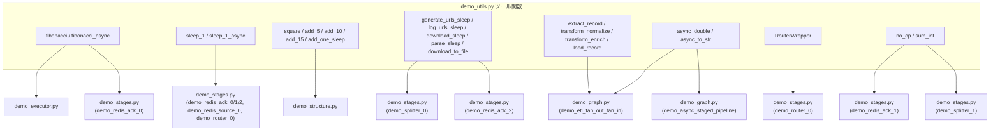

# demo_utils.py デモツール説明

> 📅 最終更新日: 2026/05/24

## 目標

`demo/` ディレクトリ以下のデモスクリプトに共有のテスト関数とヘルパークラスを提供します。`tests/test_utils.py` と内容はほぼ同一で、デモコード専用のツールライブラリです。

## 関数とデモファイルの関係

以下の Mermaid 図は `demo_utils.py` の各関数/クラスがどのデモファイルで使用されるかを示します：



> 図は主要な関数とデモスクリプトの対応関係のみを示し、補助関数や非コア依存は省略しています。

## 内容分類

### 汎用計算関数
- `fibonacci` / `fibonacci_async`：反復フィボナッチ O(n)（`bench/bench_execution_mode.py` とアルゴリズム一致）、async 版は 8 ラウンドごとに `await asyncio.sleep(0)` でイベントループを譲渡
- `no_op` / `sum_int` / `add_one` / `sqrt`：基本演算
- `square` / `add_offset` / `add_5` / `add_10` / `add_15` / `add_20` / `add_25` など：1 秒の sleep を含む模擬時間消費タスク
- `neuron_activation`：Sigmoid 活性化関数（ML 推論のシミュレーション）

### Sleep バリアント
- `sleep_1` / `sleep_1_async`：純粋な 1 秒遅延

### sleep 付き演算（demo_structure 用）
- `operate_sleep` / `operate_sleep_A~E`：二項演算、1 秒遅延
- `add_one_sleep`：複数条件の例外境界を含む（`n>30`、`n==0`、`n is None`）

### URL 処理関数（demo_stages 用）
- `generate_urls_sleep` / `log_urls_sleep` / `download_sleep` / `parse_sleep`
- `download_to_file`：実際の HTTP ダウンロードでローカルファイルに保存

### ETL シミュレーション関数（demo_graph 用）
- `extract_record`：ID に基づいてレコード辞書を生成（0.5s sleep 含む）
- `transform_normalize`：レコード値を正規化（0.3s sleep 含む）
- `transform_enrich`：レコードに偶奇分類を追加（0.3s sleep 含む）
- `load_record`：レコード保存をシミュレートし結果文字列を返す（0.2s sleep 含む）

### 非同期補助関数（demo_graph 用）
- `async_double`：入力を非同期で倍にする（0.3s sleep 含む）
- `async_to_str`：入力を非同期でフォーマット済み文字列に変換（0.2s sleep 含む）

### 特殊クラス
- `RouterWrapper`：`TaskRouter` デモ用のルーティングラッパー

## tests/test_utils.py との関係

2 つのファイルの内容はほぼ完全に同一で、`fibonacci`/`fibonacci_async` は反復 O(n) バージョンに統一されています（`bench/bench_execution_mode.py` と一致）。歴史的な理由として、デモコードがテストコードから分離される際にコピーが保持された可能性があります。メンテナンス時は両者の同期を維持するか、共通ツールを `celestialflow/utils/` 以下の独立モジュールに抽出することを検討してください。

## 発生しうる問題

1. **tests/test_utils.py との重複**：一方を修正する際にもう一方を容易に見落とし、デモとユニットテストの動作が分岐する可能性があります。
2. **Windows パスのハードコード**：パス置換ロジックは `demo_stages.py` 内の `DownloadStage` および `DownloadRedisTransport` カスタムサブクラスにあり、本ファイルには含まれません。
3. **`requests` ネットワーク依存**：`download_to_file` は外部ネットワークアクセスが必要で、隔離されたネットワーク環境では使用できません。

## 実行方法

このファイルは共有モジュールであり、直接実行しません：
```python
from demo_utils import fibonacci, sleep_1, RouterWrapper
```

## 依存

- `requests`
