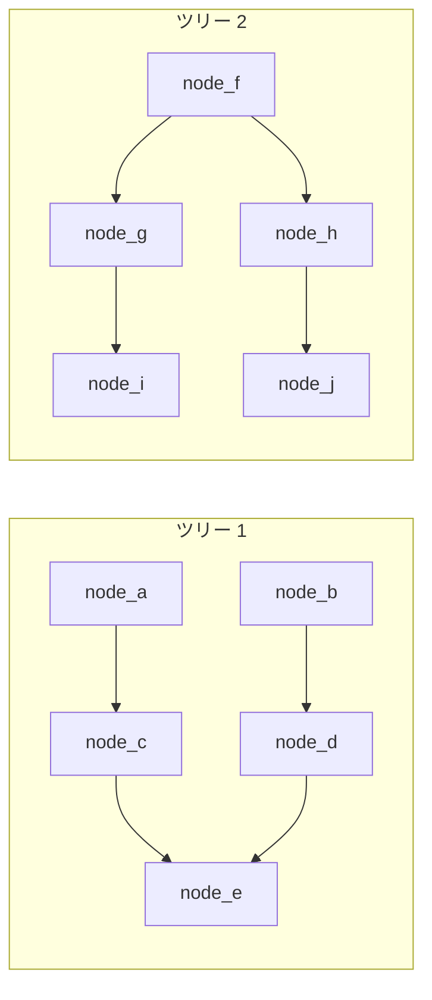
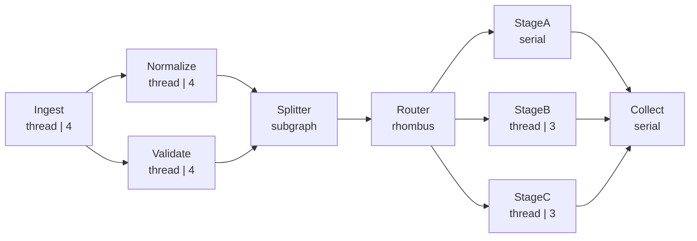

# demo/demo_web.py

> 📅 最終更新日: 2026/09/24

## 目標

本ファイルには 2 つのデモが含まれる：`demo_forest()`（2 つの独立したツリー状 DAG）と `demo_topology_topology()`（6 層で扇出/扇入、`TaskSplitter` と `TaskRouter` を含む複雑なタスクグラフ）。後者は `TaskReporter` を通じて状態、構造、エラー、ライフサイクルの各データを celestialflow-web にプッシュし、**複雑トポロジ** における web ダッシュボードの表示効果（構造図、ノード状態カード、エラーログ、プログレスバー、履歴曲線など）を観察するために用いる。

## デモシナリオ

### 森林（`demo_forest`）

互いに干渉しない 2 つのツリー状 DAG が同じ `TaskGraph` 内に共存する：



- ツリー 1：`node_a → node_c → node_e`、`node_b → node_d → node_e`
- ツリー 2：`node_f → node_g → node_i`、`node_f → node_h → node_j`
- すべてのノードが `add_one_sleep` を使用（`execution_mode="thread"`、`max_workers=2`）、グラフモードは `graph_mode="thread"`
- 初期タスクは `node_a`（`1..10`）、`node_b`（`11..20`）、`node_f`（`21..30`）に注入される

### 複雑トポロジ（`demo_topology_topology`）

> このデモのグラフ名は `demo_web_topology` で、関数名は `demo_topology_topology`。



ASCII 補足図：

```
Ingest ──┬── Normalize ──┐
         └── Validate ───┴── Splitter ── Router ──┬── StageA ──┐
                                                  ├── StageB ──┴── Collect
                                                  └── StageC ──┘
```

- `Ingest` → 24 個のシードタスクを注入（うち 4 個は重複で、判重カウントを示す；thread モード、4 worker）
- `Normalize` → タスク値を正規化して増幅する；`7` は 3 回連続で失敗した後 **リトライを使い果たして失敗** し、`11` は 1 回失敗した後にリトライで成功する（thread モード、4 worker、`max_retries=2`）
- `Validate` → タスクを検証する；`11` は **リトライ不可** の `RuntimeError` を直接スローする（thread モード、4 worker）
- `Splitter` → 上流から渡されたイテラブルな結果を個別のエントリに分割する（各タスクは 2〜3 個のエントリに分割される）
- `Router` → `item % 3` に従ってエントリを `StageA` / `StageB` / `StageC` に振り分ける。3 本の下流エッジの転送量はそれぞれ異なる
- `StageA`（serial）/ `StageB`、`StageC`（thread、3 worker）→ 3 つの並列処理ブランチ
- `Collect` → 3 つの stage の出力を集約する（serial）

**グラフ構造**：DAG、多層扇出/扇入 + 分割 + ルーティング
**グラフモード**：`graph_mode="thread"`、ノード内部は serial / thread 実行モードが混在

## Web ダッシュボードで観察できるポイント

| パネル | 観察内容 |
|------|---------|
| 構造図 | 9 ノードの多層トポロジ。Splitter は subgraph、Router は菱形で表示される。「エッジラベル」（増分/累計）を有効にすると、`Router → StageA/B/C` の 3 本のエッジに異なる転送量が表示される |
| ノード状態カード | 実行モードと並行度が異なる（serial は `-`、thread は worker 数を表示）。成功/失敗/重複/待機の 4 段プログレスバー |
| エラーログ | `ValueError`（2 回リトライ後に失敗、retry 列 = 2）と `RuntimeError`（リトライ不可、retry 列 = 0）の 2 件のエラー |
| エラー種別分布 | `ValueError` / `RuntimeError` の 2 種類のエラー統計 |
| ノードメトリクスの推移 | 各ノードの成功/失敗/待機曲線のリアルタイム増分 |

## 主要設定

- 各 Stage は `TaskExecutor(..., execution_mode="thread" | "serial")` で実行モードを明示的に指定
- `normalize.set_retry_exceptions(ValueError)` でリトライ可能な例外を指定；`max_retries=2` で 2 回のリトライ機会を提供
- `Ingest` は 24 個のシードタスクを注入し、うち `3`、`5`、`8`、`12` は先行するシードと重複する（デフォルトの判重ロジックにより `dup` に計上）。重複判重カウントを示すため
- レポートのリフレッシュ間隔を `reporter.interval = 2`（デフォルト 5s）に調整し、ダッシュボードを素早く更新できるようにする
- グラフモードは `graph_mode="thread"` で、ノード内部は実行モードを混在できる

## 発生しうる問題

1. **アサーションなし**：デモスクリプトであり、結果の正確性は検証しない。
2. **タスク関数に sleep を含む**：各ステージの sleep は 0.02s（`route_task`）から 1s（`ingest_task`）までさまざまで、完全な実行には数十秒かかると見込まれる。その間、ダッシュボードで複数回の状態更新を観察できる。
3. **レポートアドレスが未設定**：`REPORT_HOST` / `REPORT_PORT` が空の場合、レポートはスキップされる。demo 自体は独立して実行できるが、ダッシュボードにはデータがない。

## 実行方法

1. celestialflow-web サービスを起動する（`uvicorn` または `make run`。詳細は web プロジェクトのドキュメントを参照）。
2. 環境変数を設定して demo を実行する：

```bash
python demo/demo_web.py
```

Windows PowerShell：

```powershell
$env:REPORT_HOST = "127.0.0.1"
$env:REPORT_PORT = "8000"
python demo/demo_web.py
```

3. ブラウザで web ダッシュボードにアクセスし、構造図、状態カード、エラーログを観察する。

## 想定される動作

demo 終了後、各ノードのカウントサマリーがおおよそ以下のように出力される：

```
[demo] 24 個のタスクを注入（4 個の重複を含む）
[demo] 各ノードのカウント:
  Ingest    input=24   ok=20    fail=0   dup=4
  Normalize input=20   ok=19    fail=1   dup=0
  Validate  input=20   ok=19    fail=1   dup=0
  Splitter  input=38   ok=38    fail=0   dup=0
  Router    input=95   ok=95    fail=0   dup=0
  StageA    input=32   ok=32    fail=0   dup=0
  StageB    input=33   ok=33    fail=0   dup=0
  StageC    input=30   ok=30    fail=0   dup=0
  Collect   input=95   ok=95    fail=0   dup=0
```

> 具体的な数値はルーティング分布により多少変動する；`Normalize` の `7` はリトライを使い果たした後に失敗し（retry=2）、`Validate` の `11` は直接失敗する（RuntimeError）。

## 依存関係

- `celestialflow`（`TaskGraph`、`TaskExecutor`、`TaskSplitter`、`TaskRouter`、`TaskReporter`）
- `demo_utils`（`add_one_sleep`）
- `python-dotenv`
- 外部サービス：celestialflow-web（オプション、未準備の場合はレポートをスキップ）
