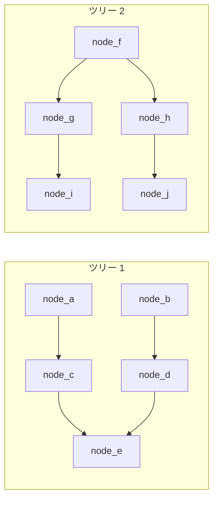
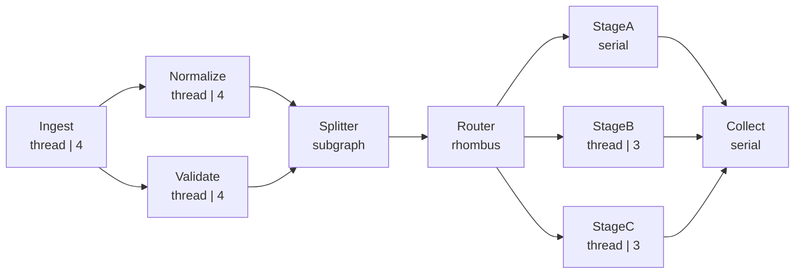

# demo/demo_web.py

> 📅 最終更新日: 2026/10/09

## 目標

本ファイルには 2 つのデモが含まれる：`demo_forest()`（2 つの独立したツリー状 DAG）と `demo_topology_topology()`（6 層で扇出/扇入、`TaskSplitter` と `TaskRouter` を含む複雑なタスクグラフ）。後者は observer イベント体系（`MetricsObserver` を登録）を通じて実行後に各ノードの入力/成功/失敗/スキップなどの指標を読み取り、サマリーを出力し、複雑なトポロジの 1 回の実行における各実行モードとリトライ/破棄パスの統計データを観察するために用いる。

## デモシナリオ

### 森林（`demo_forest`）

互いに干渉しない 2 つのツリー状 DAG が同じ `TaskGraph` 内に共存する：


```mermaid
flowchart LR
    subgraph Tree1["ツリー 1"]
        node_a["node_a"] --> node_c["node_c"]
        node_b["node_b"] --> node_d["node_d"]
        node_c --> node_e["node_e"]
        node_d --> node_e
    end
    subgraph Tree2["ツリー 2"]
        node_f["node_f"] --> node_g["node_g"]
        node_f --> node_h["node_h"]
        node_g --> node_i["node_i"]
        node_h --> node_j["node_j"]
    end
```

- ツリー 1：`node_a → node_c → node_e`、`node_b → node_d → node_e`
- ツリー 2：`node_f → node_g → node_i`、`node_f → node_h → node_j`
- すべてのノードが `add_one_sleep` を使用（`execution_mode="thread"`、`max_workers=2`）、グラフモードは `graph_mode="thread"`
- 初期タスクは `node_a`（`1..10`）、`node_b`（`11..20`）、`node_f`（`21..30`）に注入される

### 複雑トポロジ（`demo_topology_topology`）

> このデモのグラフ名は `demo_web_topology` で、関数名は `demo_topology_topology`。


```mermaid
flowchart LR
    Ingest["Ingest<br/>thread | 4"] --> Normalize["Normalize<br/>thread | 4"]
    Ingest --> Validate["Validate<br/>thread | 4"]
    Normalize --> Splitter["Splitter<br/>subgraph"]
    Validate --> Splitter
    Splitter --> Router["Router<br/>rhombus"]
    Router --> StageA["StageA<br/>serial"]
    Router --> StageB["StageB<br/>thread | 3"]
    Router --> StageC["StageC<br/>thread | 3"]
    StageA --> Collect["Collect<br/>serial"]
    StageB --> Collect
    StageC --> Collect
```

ASCII 補足図：

```
Ingest ──┬── Normalize ──┐
         └── Validate ───┴── Splitter ── Router ──┬── StageA ──┐
                                                  ├── StageB ──┴── Collect
                                                  └── StageC ──┘
```

- `Ingest` → 24 個のシードタスクを注入（thread モード、4 worker）
- `Normalize` → タスク値を正規化して増幅する；`7` は 3 回連続で失敗した後 **リトライを使い果たして失敗** し、`11` は 1 回失敗した後にリトライで成功する（thread モード、4 worker、`max_retries=2`）
- `Validate` → タスクを検証する；`11` は **リトライ不可** の `RuntimeError` を直接スローする（thread モード、4 worker）
- `Splitter` → 上流から渡されたイテラブルな結果を個別のエントリに分割する（各タスクは 2〜3 個のエントリに分割される）
- `Router` → `item % 3` に従ってエントリを `StageA` / `StageB` / `StageC` に振り分ける。3 本の下流エッジの転送量はそれぞれ異なる
- `StageA`（serial）/ `StageB`、`StageC`（thread、3 worker）→ 3 つの並列処理ブランチ
- `Collect` → 3 つの stage の出力を集約する（serial）

**グラフ構造**：DAG、多層扇出/扇入 + 分割 + ルーティング
**グラフモード**：`graph_mode="thread"`、ノード内部は serial / thread 実行モードが混在

## 観察できる出力

実行終了後、demo は `MetricsObserver` で各ノードの指標スナップショットを読み取り、サマリーを出力する。観察できる内容：

| 観点 | 観察内容 |
|------|---------|
| 入力総量 | 各ノードに入るタスク総数（`input_total`、外部注入と上流からの配信を含む） |
| 成功 / 失敗 / スキップ | 各ノードの `succeeded` / `failed` / `skipped` カウント。リトライ成功、リトライ枯渇による失敗、分流後の各ブランチの規模を反映 |
| 実行モード | 実行モード（serial / thread）と並行度の違いがスループットとカウントに与える直感的な影響 |

> このデモは Reporter / レポートチャネルに依存せず、web にもデータをプッシュしない。`demo_web` という名称と `demo_forest` は歴史的経緯によるもので、現在のスクリプトはローカル統計のみを出力する。

## 主要設定

- 各 Stage は `TaskExecutor(..., execution_mode="thread" | "serial")` で実行モードを明示的に指定
- `normalize.set_retry_exceptions(ValueError)` でリトライ可能な例外を指定；`max_retries=2` で 2 回のリトライ機会を提供
- `Ingest` は 24 個のシードタスクを注入し、うち `3`、`5`、`8`、`12` は先行するシード値と重複する。demo は `skip_func` を設定していないため、これらの重複値は判重されず、通常のタスクとして各ノードに入る（現在の重複値は `Normalize` / `Validate` などのノードがより多くの入力を確認できるようにするためだけに用いられ、判重カウントは発生しない）
- グラフモードは `graph_mode="thread"` で、ノード内部は実行モードを混在できる

## 発生しうる問題

1. **アサーションなし**：デモスクリプトであり、結果の正確性は検証しない。
2. **タスク関数に sleep を含む**：各ステージの sleep は 0.02s（`route_task`）から 1s（`ingest_task`）までさまざまで、完全な実行には数十秒かかると見込まれる。その間、各ノードのカウントが徐々に更新される過程を観察できる。
3. **正規化/検証ノードの失敗**：`Normalize` の `7` と `Validate` の `11` は失敗パスを生み出す。スクリプトは起動時に外部サービスに依存せず、単独で実行できる。

## 実行方法

```bash
python demo/demo_web.py
```

`__main__` は `demo_forest()` と `demo_topology_topology()` を順に実行し、両者は独立して動作する。

## 想定される動作

demo 終了後、各ノードのカウントサマリーがおおよそ以下のように出力される：

```
[demo] 24 個のタスクを注入（4 個の重複値を含む）
[demo] 各ノードのカウント:
  Ingest    input=24  ok=20  fail=0  skip=0
  Normalize input=20  ok=19  fail=1  skip=0
  Validate  input=20  ok=19  fail=1  skip=0
  Splitter  input=38  ok=38  fail=0  skip=0
  Router    input=38  ok=38  fail=0  skip=0
  StageA    input=13  ok=13  fail=0  skip=0
  StageB    input=13  ok=13  fail=0  skip=0
  StageC    input=12  ok=12  fail=0  skip=0
  Collect   input=38  ok=38  fail=0  skip=0
```

> 具体的な数値は各ステージの sleep 後のタスクフローとルーティング分布により多少変動する。`Normalize` の `7` はリトライを使い果たした後に失敗し（`failed` に計上）、`Validate` の `11` は直接 `RuntimeError` で失敗し、上記の `ok` 列には現れない。各カウントは `NodeMetrics` の `input_total` / `succeeded` / `failed` / `skipped` フィールドに対応する。

## 依存関係

- `celestialflow`（`TaskGraph`、`TaskExecutor`、`TaskSplitter`、`TaskRouter`）
- `celestialflow.observer`（`MetricsObserver`）
- `demo_utils`（`add_one_sleep`）
- `python-dotenv`
