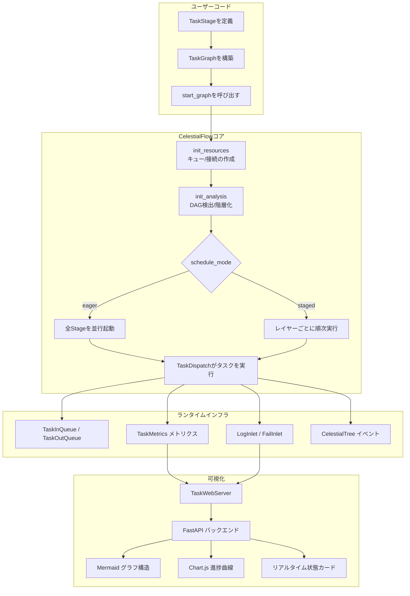
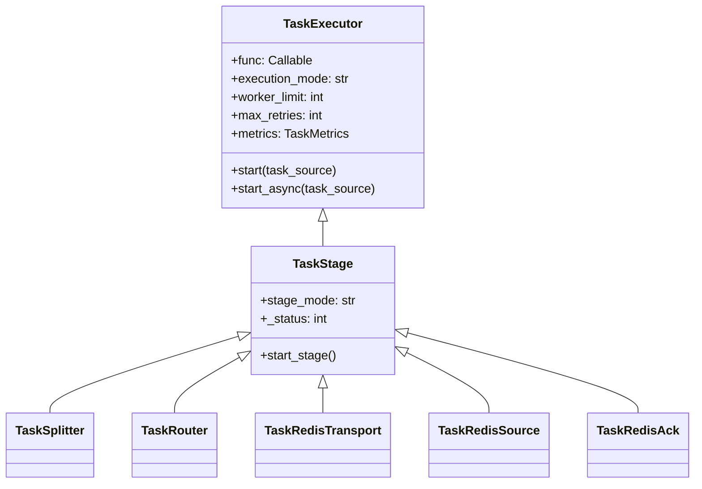
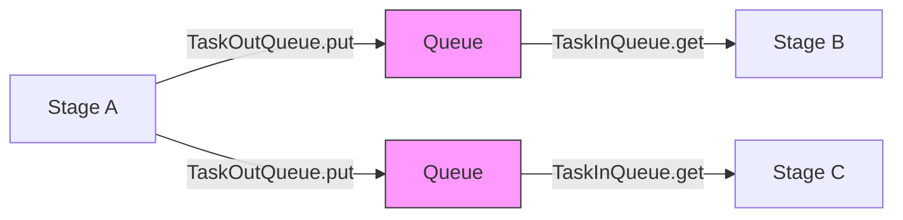
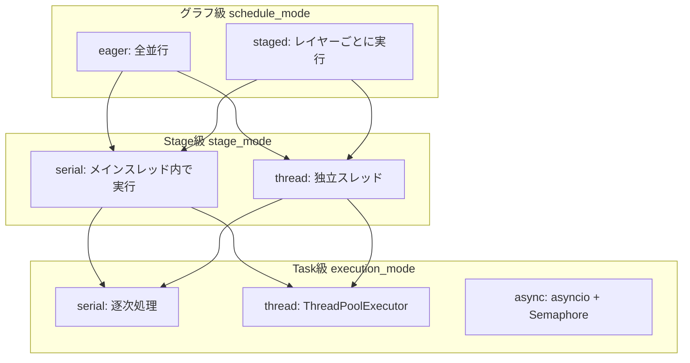
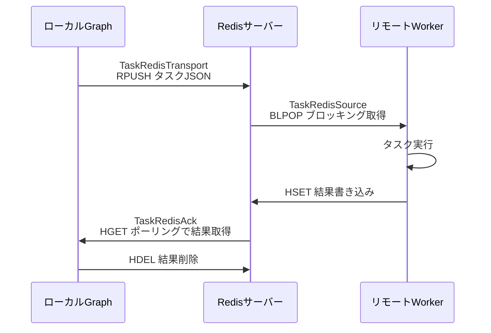
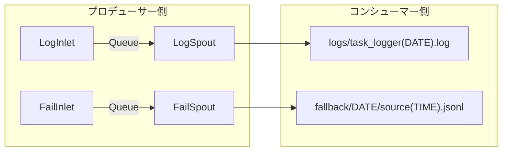
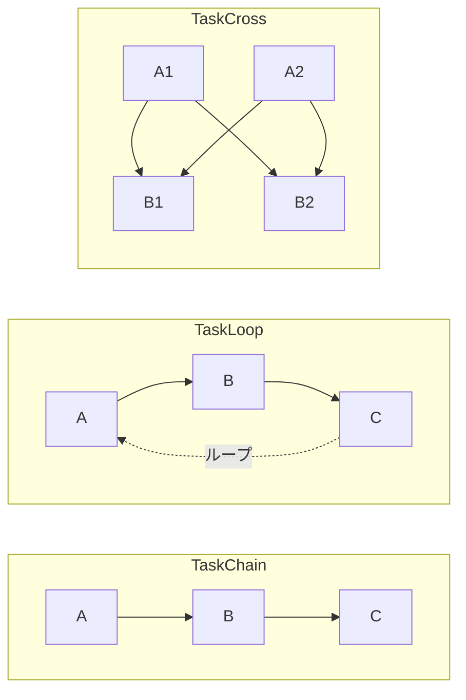
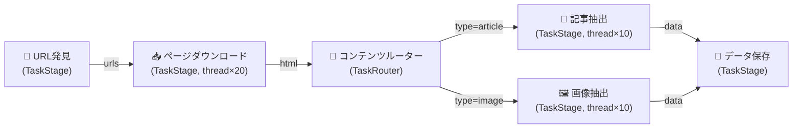
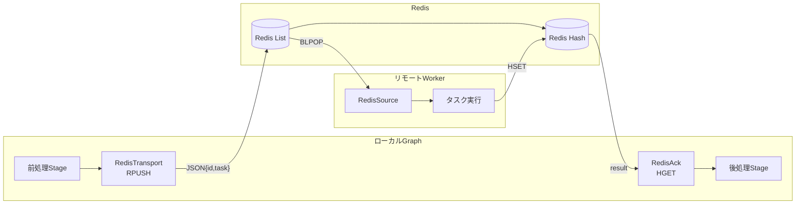

# CelestialFlow 技術プレゼンテーション

> 📅 最終更新日: 2026/05/09

---

## Slide 1: 表紙

# CelestialFlow

**次世代 Python タスクオーケストレーションエンジン**

- 軽量 · グラフ駆動 · 高性能 · 可観測
- バージョン 3.1.4 | Python 3.10+
- DAG / 循環グラフ / 分散実行 / リアルタイム可視化をサポート

---

## Slide 2: プロジェクトの背景と動機

### なぜCelestialFlowが必要なのか？

- **既存フレームワークの課題**: Airflowはデータベーススケジューリングに依存しデプロイが重い。Prefectはクラウド型SaaSモデル寄り。Rayはタスクオーケストレーションではなく計算集約型向け
- **実際のニーズに基づく開発**: Pythonプログラムに組み込み可能で、外部依存ゼロで動作するタスクグラフエンジンが必要
- **柔軟性の要件**: DAGだけでなく、循環グラフ（ループタスクフロー）もサポートする必要がある
- **高性能シナリオ**: データ収集、ETLパイプライン、バッチ処理タスクの並行オーケストレーション
- **組み込み型の可観測性**: 後付けの監視ではなく、フレームワークレベルでメトリクス、ログ、イベントトレーシングをネイティブ提供

備考：
実際のエンジニアリングシナリオから出発しています。「コードを書くように自然な」タスクオーケストレーションツールが必要であり、別途デプロイ・運用が必要なプラットフォームではありません。

---

## Slide 3: CelestialFlowとは

### 一言で定義

> Pythonベースの軽量グラフ駆動タスクオーケストレーションフレームワーク。DAG/循環グラフトポロジー、複数の実行モード、Redisベースの分散処理、イベントソーシング、リアルタイム可視化をサポートします。

### コア機能

- **豊富なグラフトポロジー**: Chain / Cross / Grid / Loop / Wheel / Complete の6種類のプリセット構造
- **多次元実行モデル**: Stage級（serial/thread）× Task級（serial/thread/async）の組み合わせ
- **Redis分散処理**: Transport → Source → Ack の3フェーズ分散タスク伝送
- **イベントソーシング**: CelestialTree統合によるタスクの全ライフサイクル追跡
- **Webダッシュボード**: FastAPI + ECharts + Mermaid によるリアルタイム監視
- **プラットフォーム依存ゼロ**: `pip install celestialflow` — 1行で開始

---

## Slide 4: コア設計理念

### 設計哲学

- **Graph as Program（グラフ即プログラム）**
  - `TaskGraph`を実行単位、ノード（`TaskStage`）を処理ロジック、エッジをデータフローとする
  - オーケストレーションロジックとビジネスロジックの完全分離

- **Envelope Pattern（エンベロープパターン）**
  - `TaskEnvelope`がタスク + ハッシュ + イベントID + ソース情報をラップ
  - 重複排除、トレーシング、ルーティング機能を透過的に提供

- **Termination Protocol（終了プロトコル）**
  - `TerminationSignal` → `TerminationIdPool` による段階的マージ
  - DAGと循環グラフの両方で正しい終了を保証

- **Metrics as First-Class（メトリクスを第一級市民として）**
  - 各Stageに`TaskMetrics`を組み込み、スレッド安全なリアルタイムカウンター

---

## Slide 5: アーキテクチャ概観

### システムアーキテクチャ図



備考：
上から下へのフロー：ユーザーがグラフ構造を定義 → フレームワークがリソースを初期化し分析 → スケジューリングモードに従って実行 → ランタイムインフラがキュー、メトリクス、ログを提供 → Web層がデータを消費して可視化。

---

## Slide 6: コアコンポーネント — TaskGraph

### TaskGraph：グラフ実行エンジン

```python
TaskGraph(
    schedule_mode: str = "eager",   # "eager" | "staged"
    log_level: str = "SUCCESS"
)
```

- **初期化**: 構築後、`graph.set_stages(stages=[...])`でノードを設定し、`graph.connect(...)`で接続を確立します。ソースノードはSCC凝縮により自動計算されます
- **スケジューリングモード**:
  - `eager`: 全Stageが並行起動し、依存関係はキューにより自然に保証されます
  - `staged`: DAG専用。レイヤーごとに実行し、レイヤー間は同期ブロッキングです
- **状態管理**: `stage_runtime_dict`、`status_dict`、`stage_history`（直近20スナップショット）
- **グラフ分析**: NetworkXを使用して有向グラフを構築し、DAG特性を検出し、トポロジカル層を計算します

---

## Slide 7: コアコンポーネント — TaskStage / TaskExecutor

### 継承関係



- **TaskExecutor**: タスク実行のコア。リトライ、重複排除、キャッシュ、並行戦略を管理します
- **TaskStage**: グラフノード。トポロジカル関係は`TaskGraph`が管理します（`graph.out_edges` / `graph.in_edges`）
- **`graph.connect()`** がノード間の上下流接続を確立します
- **`stage_mode`/`name`** は`TaskStage.__init__()`のコンストラクタパラメータとして渡されます

---

## Slide 8: コアコンポーネント — フロー制御ノード

### TaskSplitter & TaskRouter

| 特性 | TaskSplitter | TaskRouter |
|------|-------------|------------|
| セマンティクス | 1 → N（1対多の分割） | 1 → 1（条件付きルーティング） |
| 入力 | 単一タスク | 単一タスク |
| 出力 | タプル内の各要素が独立したタスクになる | `(target_tag, task)` で指定の下流にルーティング |
| カウンター | `split_counter` が下流の `task_counter` に伝播 | `route_counters[tag]` がそれぞれ個別に伝播 |
| 実行モード | serialのみ | serialのみ |
| リトライ | なし（`max_retries=0`） | なし（`max_retries=0`） |

- **カウンター伝播**は`is_tasks_finished()`が正しく判定されるための重要な設計要素です
- Splitter/Routerは並行をサポートせず、分割/ルーティングの決定論性を保証します

---

## Slide 9: コアコンポーネント — キューとエンベロープ

### データフローインフラ



- **TaskEnvelope**: `task` + `hash`(SHA1) + `id`(CelestialTreeイベント) + `source`(ソース)
- **TaskInQueue**:
  - 複数上流の集約、`source_tag`による終了シグナルの追跡
  - すべての上流が`TerminationSignal`を送信後、`TerminationIdPool`にマージして返します
- **TaskOutQueue**:
  - ブロードキャストモード `put()` → すべての下流
  - ターゲットモード `put_target(item, tag)` → 指定の下流（Routerが使用）
- **終了プロトコル**: DAGと循環グラフの両方で、すべてのStageが優雅に終了することを保証します

---

## Slide 10: 実行モデル

### 3層の実行次元



| レベル | オプション | 説明 |
|--------|----------|------|
| グラフ級 `schedule_mode` | `eager` / `staged` | Stage間の並行 vs 順次実行を制御 |
| Stage級 `stage_mode` | `serial` / `thread` | Stageが独立スレッドで実行されるかどうか |
| Task級 `execution_mode` | `serial` / `thread` | Stage内のタスクの並行戦略 |

備考：
TaskGraphモードでは、Task級の`async`は使用できません（スタンドアロンの`TaskExecutor.start()`でのみサポートされます）。

---

## Slide 11: メトリクスと重複排除システム

### TaskMetrics — スレッド安全なリアルタイムカウンター

- **4つのコアカウンター**:
  - `task_counter`: 総入力タスク数（Splitter/Routerによる追加を含む）
  - `success_counter`: 成功処理数
  - `error_counter`: 最終失敗数（リトライ回数超過）
  - `duplicate_counter`: 重複排除数

- **終了判定**: `is_tasks_finished()` = `total == success + error + duplicate`

- **重複排除メカニズム**:
  - `TaskEnvelope.hash` = `SHA1(pickle.dumps(task))`
  - `processed_set` が処理済みハッシュを記録
  - ゼロコスト重複排除 — ハッシュはエンベロープ作成時に一度だけ計算

- **SumCounter集約**: Splitter/Routerシナリオで複数ソースのカウンターを正確にマージ

---

## Slide 12: 分散機能 — Redis統合

### 3フェーズRedisタスク伝送



| コンポーネント | 役割 | Redis操作 | 実行モード |
|---------------|------|-----------|-----------|
| `TaskRedisTransport` | シリアライズしてタスクを送信 | `RPUSH` | thread, worker_limit=4 |
| `TaskRedisSource` | ブロッキングでタスクを取得 | `BLPOP` | serial |
| `TaskRedisAck` | リモート結果を待機 | `HGET` → `HDEL` | serial |

- **JSONシリアライゼーション**: タスク → `{id, task, emit_ts}` JSON文字列
- **At-most-onceセマンティクス**: 結果は読み取り後即座に削除
- **タイムアウト機構**: Source/Ackともに`timeout`パラメータをサポートし、タイムアウト時に`TimeoutError`をスロー

---

## Slide 13: CelestialTree統合

### イベントソーシングとタスクリネージ

- **CelestialTree**: 階層的イベント追跡システム（独立プロジェクト `celestialtree>=0.1.2`）
- **統合ポイント**:
  - `TaskExecutor.set_ctree(host, http_port, grpc_port)` で追跡を有効化
  - `TaskExecutor.set_nullctree()` で追跡を無効化（NullClientを使用）
  - `TaskEnvelope.id` にCelestialTreeのイベントIDを格納
  - `TerminationSignal.id` / `TerminationIdPool.ids` が終了イベントを伝播

- **追跡粒度**:
  - 各タスクがエンベロープ作成時にユニークなイベントIDを取得
  - Splitter分割 → 子イベントが親イベントに関連付けられる
  - 終了シグナルのマージ → イベントIDプールの集約
  - 入力から完了までの完全なトレーサビリティ

- **設計トレードオフ**: イベント追跡はオプション依存 — 無効時はゼロオーバーヘッド（NullClientモード）

---

## Slide 14: 永続化とエラーハンドリング

### Persistenceモジュール



- **Spout-Inletパターン**:
  - Inlet側（スレッド安全）: レコードをフォーマットし、共有キューに書き込み
  - Spout側（デーモンスレッド）: キューから消費し、ファイルに書き込み
  - `TerminationSignal`による優雅なシャットダウン

- **ログレベル**: `TRACE(0) → DEBUG(10) → SUCCESS(20) → INFO(30) → WARNING(40) → ERROR(50) → CRITICAL(60)`

- **エラー永続化**: JSONL形式。`timestamp`、`stage`、`error_repr`、`task_repr`、および完全にシリアライズされた`error`と`task`を含む

- **エラー分析ツール**: `load_task_by_stage()`、`load_task_by_error()` — 次元ごとに失敗タスクを集約

---

## Slide 15: 例外体系

### 構造化された例外階層

```
CelestialFlowError (基底クラス)
├── ConfigurationError
│   └── InvalidOptionError
│       ├── ExecutionModeError    (serial/thread/async)
│       ├── StageModeError        (serial/thread)
│       └── LogLevelError         (TRACE~CRITICAL)
├── RemoteWorkerError             (Redisリモート実行失敗)
└── UnconsumedError               (未消費のキュータスク)
```

- **InvalidOptionError**: "field=value, allowed=[...]" のヒントメッセージを自動生成
- **高速フィードバック**: 設定レベルのエラーは実行時ではなく、グラフ起動前にスローされます

---

## Slide 16: Web可視化システム — アーキテクチャ

### 技術スタック

| レイヤー | 技術 | 用途 |
|---------|------|------|
| バックエンド | FastAPI + Uvicorn | REST API、デフォルトポート5000 |
| テンプレート | Jinja2 | HTMLテンプレートレンダリング |
| グラフ構造 | Mermaid.js v10 | タスクグラフの有向グラフ可視化 |
| 時系列チャート | Chart.js | ノード完了進捗の折れ線グラフ |
| インタラクション強化 | Sortable.js | ダッシュボードカードのドラッグ&ドロップ並び替え |
| テーマ | CSS Variables | ライト/ダークテーマの動的切り替え |

- **CLIエントリポイント**: `celestialflow-web --port 5000`
- **フロントエンドのモジュール化**: 9つの独立したJSモジュール、それぞれが専門の役割を担当
- **効率的な更新**: `JSON.stringify`比較による変更検出 — 変更された部分のみ再レンダリング

---

## Slide 17: Web可視化システム — 機能

### 3つのコアページ

**1. ダッシュボード (Dashboard)**
- 3カラムレイアウト: 左（Mermaidグラフ + トポロジー情報）| 中央（状態カード）| 右（進捗曲線 + 全体概要）
- 状態カード: 実行中/停止/未起動バッジ、成功/待機中/失敗/重複排除カウント、プログレスバー、時間推定
- カードのドラッグ&ドロップ並び替え、レイアウトの`config.json`への永続化

**2. エラーログ (Error Logs)**
- ページネーションテーブル: error_id / エラーメッセージ / ノード / タスク / タイムスタンプ
- キーワード検索 + ノードフィルタリング
- ダッシュボードの失敗カウントをクリックすると、フィルター付きで直接ジャンプ

**3. タスク注入 (Task Injection)**
- 検索可能なノードリスト（実行状態を表示。停止中のノードは選択不可）
- JSONテキスト入力またはファイルアップロード
- ワンクリック`TerminationSignal`注入

---

## Slide 18: Web API一覧

### REST APIの設計

| 方向 | エンドポイント | データ |
|------|-------------|------|
| Pull | `/api/pull_config` | フロントエンド設定 |
| Pull | `/api/pull_structure` | グラフ構造JSON |
| Pull | `/api/pull_status` | リアルタイムノード状態 |
| Pull | `/api/pull_errors` | エラーログ（キャッシュ付き） |
| Pull | `/api/pull_topology` | DAG/スケジューリングモード/レイヤー情報 |
| Pull | `/api/pull_summary` | グローバル集約統計 |
| Pull | `/api/pull_history` | 履歴スナップショット（進捗曲線のデータソース） |
| Push | `/api/push_status` | 状態の更新 |
| Push | `/api/push_structure` | グラフ構造の更新 |
| Push | `/api/push_injection_tasks` | ランタイムでのタスク注入 |
| Push | `/api/push_config` | フロントエンド設定の保存 |

- **Pydanticバリデーション**: すべてのPushエンドポイントで強い型付けモデルを使用
- **エラーキャッシュ**: `push_errors_meta`がファイルパスとバージョン番号をキャッシュし、JSONLファイルの再読み込みを回避

---

## Slide 19: パフォーマンス設計と最適化

### 主要なパフォーマンス決定

- **ゼロコピー終了検出**
  - `is_tasks_finished()` = アトミックカウンター比較 — キューの走査や状態スキャン不要

- **一度ハッシュ、永遠に重複排除**
  - `TaskEnvelope.hash`はエンベロープ作成時にSHA1を一度計算。以降の重複排除はsetルックアップのみ（O(1)）

- **ファクトリベースのキューバックエンド**
  - `make_queue_backend()`がstage_modeに基づいて`ThreadQueue` / `AsyncQueue`を自動選択
  - シリアルモード: 同期オーバーヘッドゼロ

- **階層化メトリクスカウンター**
  - serial/async: `ValueWrapper` — 通常のint
  - thread: `ValueWrapper` + `threading.Lock`
  - 必要に応じて最も軽量な同期メカニズムを選択

- **フロントエンドの差分レンダリング**
  - `JSON.stringify`比較による変更検出 — 変更されたDOM領域のみ再レンダリング

---

## Slide 20: プリセットグラフ構造

### 6種類のすぐに使えるトポロジーテンプレート



| 構造 | トポロジータイプ | 説明 |
|------|---------------|------|
| `TaskChain` | DAG（線形） | 順次チェーン A→B→C |
| `TaskCross` | DAG（全結合） | レイヤー間の全結合 |
| `TaskGrid` | DAG（グリッド） | 右方向 + 下方向の接続 |
| `TaskLoop` | 循環 | 末尾ノードが先頭ノードに接続 |
| `TaskWheel` | 循環 + ハブ | ハブノードがリング上の全ノードに接続 |
| `TaskComplete` | 全結合 | すべてのノードが相互接続 |

- **DAG強制**: ChainとGridは構築時に`schedule_mode="staged"`を使用可能
- **循環グラフ**: Loop / Wheel / Complete は`schedule_mode="eager"`を使用する必要があります

---

## Slide 21: 他のフレームワークとの比較

### CelestialFlow vs 主要フレームワーク

| 特性 | CelestialFlow | Airflow | Prefect | Ray |
|------|--------------|---------|---------|-----|
| **コア定位** | 組み込み型タスクグラフエンジン | プラットフォーム級スケジューリングシステム | クラウドネイティブワークフロー | 分散計算フレームワーク |
| **インストール複雑度** | `pip install`で即使用 | データベース + スケジューラーが必要 | Server/Cloudが必要 | Ray Clusterが必要 |
| **グラフタイプ** | DAG + 循環グラフ | DAGのみ | DAGのみ | 制限なし（Actorモデル） |
| **循環タスクサポート** | ネイティブサポート（Loop/Wheel） | サポートなし | サポートなし | 手動実装 |
| **実行モード** | serial/thread/async | Celery/K8s/Local | Dask/K8s | Ray Worker |
| **プロセス級隔離** | なし（スレッド級隔離） | Executor級 | Dispatch級 | デフォルト隔離 |
| **リアルタイム可視化** | 組み込みWeb UI | 組み込みWeb UI | 組み込みCloud UI | Ray Dashboard |
| **イベントソーシング** | CelestialTree統合 | ネイティブサポートなし | ネイティブサポートなし | ネイティブサポートなし |
| **タスク重複排除** | 組み込みSHA1ハッシュ重複排除 | ネイティブサポートなし | ネイティブサポートなし | ネイティブサポートなし |
| **学習曲線** | 低（純粋なPython API） | 中〜高 | 中 | 中〜高 |
| **デプロイ形態** | ライブラリ / CLI | 独立プラットフォーム | 独立プラットフォーム/SaaS | 独立クラスター |

---

## Slide 22: ユースケース

### CelestialFlowに適したシナリオ

- **データ収集パイプライン**
  - 多段階クローラー: URL発見 → ページダウンロード → コンテンツ抽出 → データ投入
  - 組み込みの重複排除機能により重複リクエストを防止

- **ETL / データ処理**
  - Splitterで大量バッチを分割 → 複数Workerが並行処理 → Routerで結果を分流
  - JSONL失敗ログ → 精確なリトライ

- **バッチAPIコール**
  - `thread`モードで外部APIへの高並行コール
  - 組み込みリトライ + エラーキャッシュ

- **軽量リアルタイムストリーム処理**
  - ループ構造で継続的なプル → 処理 → 書き戻し
  - Redis分散処理で水平スケーリング

- **機械学習パイプライン**
  - データ前処理 → 特徴量エンジニアリング → モデル学習 → 評価
  - threadモードでデータパイプラインを並行処理

---

## Slide 23: デモデータフロー

### 典型的なパイプライン例



**実行設定の例**:
```python
from celestialflow import TaskStage, TaskRouter, TaskGraph

discover = TaskStage(discover_urls, execution_mode="serial")
download = TaskStage(download_page, execution_mode="thread", worker_limit=20)
router   = TaskRouter(classify_content)
extract_article = TaskStage(extract_article, execution_mode="thread", worker_limit=10)
extract_image   = TaskStage(extract_image, execution_mode="thread", worker_limit=10)
store    = TaskStage(save_to_db, execution_mode="serial")

graph = TaskGraph(schedule_mode="eager")
graph.set_stages(stages=[discover, download, router, extract_article, extract_image, store])
graph.connect([discover], [download])
graph.connect([download], [router])
graph.connect([router], [extract_article, extract_image])
graph.connect([extract_article, extract_image], [store])

graph.start_graph({"discover": [seed_urls]})
```

---

## Slide 24: 分散デモデータフロー

### Redis分散実行の例



- ローカルGraphが`TaskRedisTransport`を通じてRedis Listにタスクを送信します
- リモートWorkerが`TaskRedisSource`でブロッキング取得します
- 結果はRedis Hashに書き戻され、ローカルの`TaskRedisAck`がポーリングで取得します
- **水平スケーリング**: 複数のWorkerインスタンスを起動するだけで並列消費が可能

---

## Slide 25: 設計トレードオフ

### 主要な設計上の決定

| 決定 | 選択 | トレードオフ |
|------|------|------------|
| 循環グラフサポート | シグナルマージプロトコル | トポロジーの柔軟性と引き換えに終了ロジックの複雑さが増加 |
| Graph内のexecution_mode | serial/threadのみ | シンプルで信頼性の高いスレッドモデルを維持 |
| ログアーキテクチャ | Queue + Spoutスレッド | マルチプロセス安全な書き込みと引き換えにデーモンスレッドが1つ追加 |
| 重複排除戦略 | SHA1(pickle) | 汎用オブジェクトハッシュ機能と引き換えにpickleの不安定性リスク |
| Redis結果取得 | ポーリングHGET（0.1秒） | シンプルで信頼性が高いが、リアルタイムプッシュではない |
| Web変更検出 | JSON.stringify比較 | 実装のシンプルさと引き換えにO(n)の文字列比較コスト |
| CelestialTree統合 | オプション依存 + NullClient | 追跡しない場合ゼロオーバーヘッドだが、追加設定が必要 |

備考：
すべての設計決定にはトレードオフがあります。CelestialFlowは「シンプルさ + 信頼性 + デプロイ依存ゼロ」を優先し、複雑さと機能性のバランスを取っています。

---

## Slide 26: 拡張性設計

### モジュール分離の思想

- **StageはPluginである**
  - `func`を実装 → `TaskStage`でラップ → 任意のグラフに接続
  - 組み込みのSplitter / Router / Redisシリーズはすべて Stageの特殊化

- **置き換え可能なキューバックエンド**
  - `make_queue_backend(mode)` ファクトリメソッドで統一インターフェース
  - ThreadQueue / AsyncQueue — 必要に応じて切り替え

- **拡張可能なメトリクスバックエンド**
  - `ValueWrapper` — 実行モードに応じて適応
  - `SumCounter` — 複数ソースのカウンターを透過的に集約

- **カスタマイズ可能な永続化**
  - Spout-Inletパターン — `_handle_record()`を実装するだけで出力先をカスタマイズ可能

- **設定可能なWebフロントエンド**
  - `config.json`でレイアウト、テーマ、更新間隔を制御
  - ダッシュボードカードのドラッグ&ドロップ並び替えをサポート

---

## Slide 27: 今後のロードマップ

### 進化の方向性

- **スケジューリング強化**
  - 優先度ベースのタスクスケジューリング
  - 動的リソース感知（CPU/メモリ）によるworker_limitの自動調整

- **分散処理強化**
  - Kafka / RabbitMQ をオプションのトランスポートバックエンドとして
  - 分散一貫性の保証（exactly-onceセマンティクス）

- **可観測性強化**
  - OpenTelemetry統合
  - Prometheusメトリクスのエクスポート
  - アラートルール設定

- **開発者体験**
  - デコレータ構文によるStage定義（`@stage(mode="thread")`）
  - グラフビジュアルエディター（Web IDE）
  - より豊富な組み込みStageテンプレート

- **エコシステム**
  - CelestialTreeとの深い統合（因果推論、影響分析）
  - プラグインマーケットプレイスの仕組み

---

## Slide 28: まとめ

### CelestialFlow — コアバリュー

- **軽量組み込み**: `pip install`で即使用。外部サービス依存なし。任意のPythonプロジェクトに組み込み可能
- **トポロジーの柔軟性**: DAG + 循環グラフ、6種のプリセット構造、任意のカスタムトポロジー
- **豊富な実行モデル**: 3層次元の組み合わせ（グラフ × Stage × Task）、あらゆる並行シナリオに対応
- **分散処理対応**: Redis 3フェーズ伝送、コード変更なしで水平スケーリング
- **フルチェーン追跡**: CelestialTreeイベントソーシング + JSONLエラー永続化
- **組み込み可視化**: Mermaidグラフ構造 + Chart.js進捗曲線 + リアルタイム状態パネル

### 一言で

> **Pythonを書くように、任意に複雑なタスクフローをオーケストレーションする。**

---

## Slide 29: Q&A

# ご清聴ありがとうございました

**CelestialFlow** — グラフ駆動 · 軽量 · 高性能 · 可観測

- バージョン: 3.1.4
- Python: 3.10+
- インストール: `pip install celestialflow`
- Web: `celestialflow-web`

---
