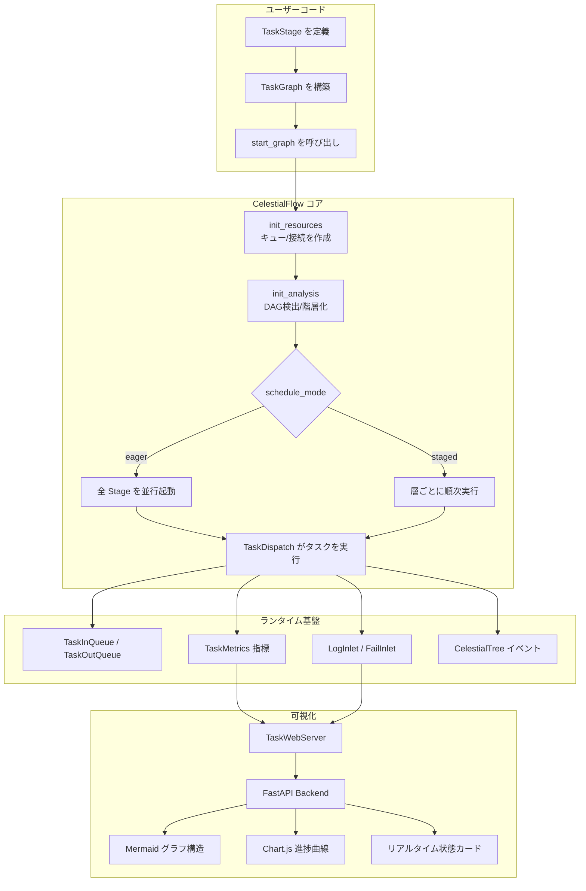
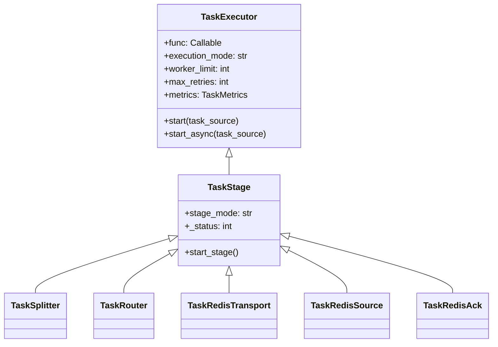
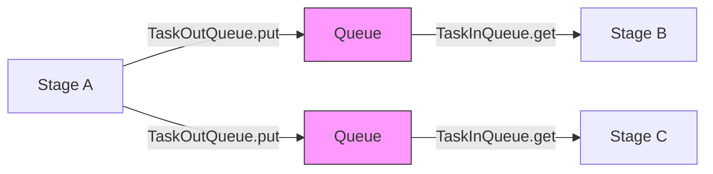
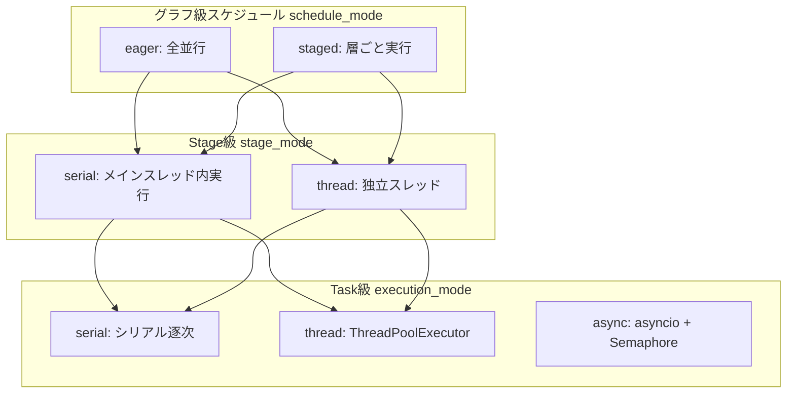
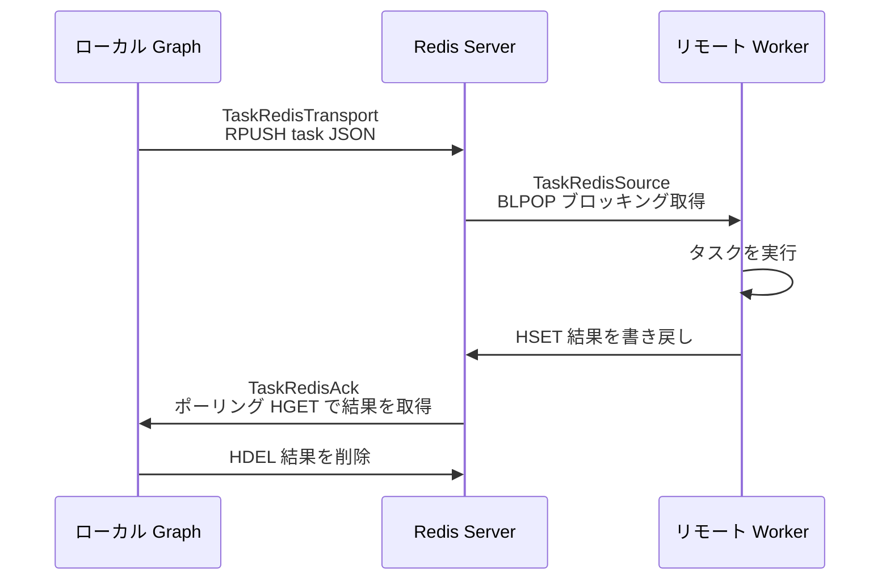
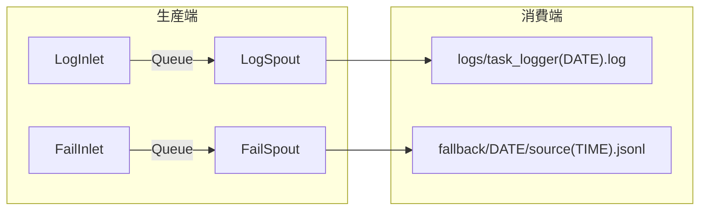
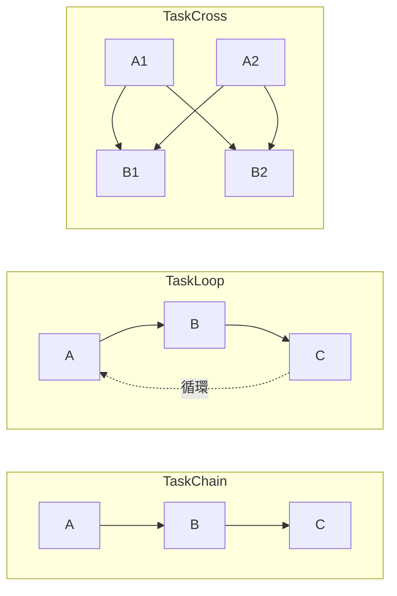
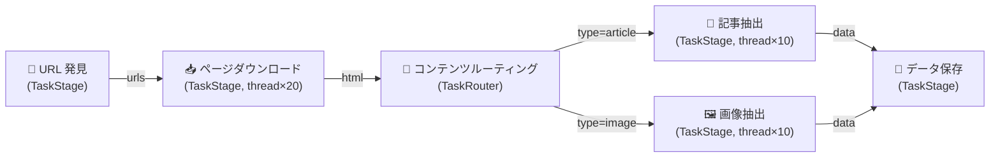
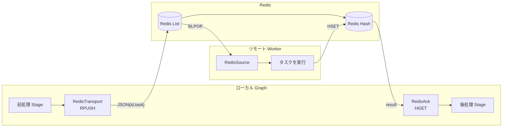

# CelestialFlow 技術共有

> 📅 最終更新日: 2026/05/09

---

## Slide 1: 表紙

# CelestialFlow

**次世代 Python タスクオーケストレーションエンジン**

- 軽量 · グラフ駆動 · 高性能 · 可観測
- バージョン 3.1.4 | Python 3.10+
- DAG / 循環グラフ / 分散実行 / リアルタイム可視化をサポート

---

## Slide 2: プロジェクト背景と動機

### なぜ CelestialFlow が必要か？

- **既存フレームワークの課題**：Airflow はデータベーススケジューリングに依存しデプロイが重い；Prefect はクラウド SaaS モデル寄り；Ray は計算集中指向でタスクオーケストレーション向きではない
- **実需要駆動**：Python プログラムに埋め込み可能で、ゼロ外部依存で実行できるタスクグラフエンジンが必要
- **柔軟性要件**：DAG だけでなく、循環グラフ（循環タスクフロー）もサポートする必要がある
- **高性能シナリオ**：データ収集、ETL パイプライン、バッチ処理タスクの並行オーケストレーション
- **可観測性の内蔵**：後付けの監視ではなく、フレームワークレベルでネイティブに metrics、ログ、イベントソーシングを提供

備考：
実際のエンジニアリングシナリオから出発——「コードを書くように自然な」タスクオーケストレーションツールが必要であり、独立したデプロイ運用プラットフォームではない。

---

## Slide 3: CelestialFlow とは

### 一言定義

> Python ベースの軽量グラフ駆動タスクオーケストレーションフレームワーク。DAG/循環グラフトポロジー、多実行モード、Redis 分散、イベントソーシング、リアルタイム可視化をサポート。

### コア特性

- **グラフトポロジー豊富**：Chain / Cross / Grid / Loop / Wheel / Complete の 6 種のプリセット構造
- **多次元実行モデル**：Stage 級 (serial/thread) × Task 級 (serial/thread/async) の組み合わせ
- **Redis 分散**：Transport → Source → Ack の 3 段階分散タスク転送
- **イベントソーシング**：CelestialTree と統合、タスクの全ライフサイクルを追跡可能
- **Web ダッシュボード**：FastAPI + ECharts + Mermaid によるリアルタイム監視
- **ゼロプラットフォーム依存**：`pip install celestialflow`、1 行のコードで実行可能

---

## Slide 4: コア設計理念

### 設計哲学

- **グラフすなわちプログラム (Graph as Program)**
  - `TaskGraph` を実行ユニットとし、ノード (`TaskStage`) を処理ロジック、エッジをデータフローとする
  - オーケストレーションロジックとビジネスロジックを完全に分離

- **エンベロープパターン (Envelope Pattern)**
  - `TaskEnvelope` がタスク + ハッシュ + イベント ID + ソース情報をカプセル化
  - 透過的に重複排除、トレーサビリティ、ルーティング能力を提供

- **終了信号プロトコル (Termination Protocol)**
  - `TerminationSignal` → `TerminationIdPool` の段階的マージ
  - DAG および循環グラフの両方で正しい終了を保証

- **指標を第一級市民に (Metrics as First-Class)**
  - 各 Stage に `TaskMetrics` を内蔵、スレッドセーフなリアルタイムカウント

---

## Slide 5: アーキテクチャ概要

### システムアーキテクチャ図



備考：
上から下へ：ユーザーがグラフ構造を定義 → フレームワークがリソースと分析を初期化 → スケジュールモードに従って実行 → ランタイム基盤がキュー、指標、ログを提供 → Web 層がデータを消費して可視化。

---

## Slide 6: コアコンポーネント — TaskGraph

### TaskGraph：グラフ実行エンジン

```python
TaskGraph(
    schedule_mode: str = "eager",   # "eager" | "staged"
    log_level: str = "SUCCESS"
)
```

- **初期化**: 構築後に `graph.set_stages(stages=[...])` でノードを設定し、`graph.connect(...)` で接続を確立。ソースノードは SCC 凝縮により自動計算
- **スケジュールモード**：
  - `eager`：全 Stage を並行起動、依存関係はキューが自然に保証
  - `staged`：DAG のみ利用可能、層ごとに実行、層間は同期ブロック
- **状態管理**：`stage_runtime_dict`、`status_dict`、`stage_history`（直近 20 スナップショット）
- **グラフ分析**：NetworkX ベースで有向グラフを構築、DAG 性質を検出、トポロジー階層を計算

---

## Slide 7: コアコンポーネント — TaskStage / TaskExecutor

### 継承関係



- **TaskExecutor**：タスク実行コア。リトライ、重複排除、キャッシュ、並行戦略を管理
- **TaskStage**：グラフノード。トポロジー関係は `TaskGraph` が管理（`graph.out_edges` / `graph.in_edges`）
- **`graph.connect()`** でノード間の接続関係（上流・下流依存）を確立
- **`stage_mode`/`name`** は `TaskStage.__init__()` の構築パラメータで渡す

---

## Slide 8: コアコンポーネント — フロー制御ノード

### TaskSplitter & TaskRouter

| 特性 | TaskSplitter | TaskRouter |
|------|-------------|------------|
| セマンティクス | 1 → N（一対多分割） | 1 → 1（条件ルーティング） |
| 入力 | 単一タスク | 単一タスク |
| 出力 | tuple の各要素が独立タスクに | `(target_tag, task)` で指定下流にルーティング |
| カウンター | `split_counter` が下流の `task_counter` に伝播 | `route_counters[tag]` がそれぞれ伝播 |
| 実行モード | serial のみ | serial のみ |
| リトライ | なし（`max_retries=0`） | なし（`max_retries=0`） |

- **カウンター伝播**は `is_tasks_finished()` の正確な判定を保証する重要な設計
- Splitter/Router は並行をサポートせず、分割/ルーティングの決定性を保証

---

## Slide 9: コアコンポーネント — キューとエンベロープ

### データフロー基盤



- **TaskEnvelope**：`task` + `hash`(SHA1) + `id`(CelestialTree イベント) + `source`(ソース)
- **TaskInQueue**：
  - 多上流集約、`source_tag` で終了信号を追跡
  - 全上流が `TerminationSignal` を送信後、`TerminationIdPool` にマージして返却
- **TaskOutQueue**：
  - ブロードキャストモード `put()` → 全下流
  - 指向モード `put_target(item, tag)` → 指定下流（Router が使用）
- **終了プロトコル**：DAG でも循環グラフでも、全 Stage が優雅に終了できることを保証

---

## Slide 10: 実行モデル

### 3 層実行次元



| 階層 | オプション | 説明 |
|------|------|------|
| グラフ級 `schedule_mode` | `eager` / `staged` | Stage 間の並行 vs 順序を制御 |
| Stage 級 `stage_mode` | `serial` / `thread` | Stage を独立スレッドで実行するかどうか |
| Task 級 `execution_mode` | `serial` / `thread` | Stage 内タスクの並行戦略 |

備考：
TaskGraph モードでは、task 級の `async` は使用不可（スタンドアロン `TaskExecutor.start()` のみサポート）。

---

## Slide 11: 指標と重複排除システム

### TaskMetrics — スレッドセーフなリアルタイムカウント

- **4 大コアカウンター**：
  - `task_counter`：総入力タスク数（Splitter/Router 追加分を含む）
  - `success_counter`：成功処理数
  - `error_counter`：最終失敗数（リトライ回数超過）
  - `duplicate_counter`：重複排除インターセプト数

- **終了判定**：`is_tasks_finished()` = `total == success + error + duplicate`

- **重複排除メカニズム**：
  - `TaskEnvelope.hash` = `SHA1(pickle.dumps(task))`
  - `processed_set` が処理済みハッシュを記録
  - ゼロコスト重複排除——ハッシュはカプセル化段階で 1 回計算

- **SumCounter 集約**：Splitter/Router シナリオでの多ソースカウンターの正確なマージをサポート

---

## Slide 12: 分散能力 — Redis 統合

### 3 段階 Redis タスク転送



| コンポーネント | 役割 | Redis 操作 | 実行モード |
|------|------|-----------|---------|
| `TaskRedisTransport` | シリアライズしてタスクをプッシュ | `RPUSH` | thread, worker_limit=4 |
| `TaskRedisSource` | ブロッキングでタスクをプル | `BLPOP` | serial |
| `TaskRedisAck` | リモート結果を待機 | `HGET` → `HDEL` | serial |

- **JSON シリアライズ**：タスク → `{id, task, emit_ts}` JSON 文字列
- **At-most-once セマンティクス**：結果読み取り後即座に削除
- **タイムアウトメカニズム**：Source/Ack ともに `timeout` パラメータをサポート、タイムアウト時は `TimeoutError` をスロー

---

## Slide 13: CelestialTree との統合

### イベントソーシングとタスクリネージ

- **CelestialTree**：階層的イベント追跡システム（独立プロジェクト `celestialtree>=0.1.2`）
- **統合ポイント**：
  - `TaskExecutor.set_ctree(host, http_port, grpc_port)` で追跡を有効化
  - `TaskExecutor.set_nullctree()` で追跡を無効化（NullClient を使用）
  - `TaskEnvelope.id` が CelestialTree イベント ID を保存
  - `TerminationSignal.id` / `TerminationIdPool.ids` が終了イベントを伝播

- **追跡粒度**：
  - 各タスクのカプセル化時に一意のイベント ID を取得
  - Splitter 分割 → 子イベントが親イベントに関連付け
  - 終了信号マージ → イベント ID プール集約
  - 全リンクが入力から完了まで遡及可能

- **設計トレードオフ**：イベント追跡はオプション依存、無効時はゼロオーバーヘッド（NullClient モード）

---

## Slide 14: 永続化とエラー処理

### Persistence モジュール



- **Spout-Inlet パターン**：
  - Inlet 端（スレッドセーフ）：レコードをフォーマットし、共有キューに書き込み
  - Spout 端（デーモンスレッド）：キューから消費し、ファイルに書き込み
  - `TerminationSignal` で優雅に停止

- **ログレベル**：`TRACE(0) → DEBUG(10) → SUCCESS(20) → INFO(30) → WARNING(40) → ERROR(50) → CRITICAL(60)`

- **エラー永続化**：JSONL 形式、`timestamp`、`stage`、`error_repr`、`task_repr`、完全にシリアライズされた `error` と `task` を含む

- **エラー分析ツール**：`load_task_by_stage()`、`load_task_by_error()` で次元ごとに失敗タスクを集約

---

## Slide 15: 例外体系

### 構造化例外階層

```
CelestialFlowError (基底クラス)
├── ConfigurationError
│   └── InvalidOptionError
│       ├── ExecutionModeError    (serial/thread/async)
│       ├── StageModeError        (serial/thread)
│       └── LogLevelError         (TRACE~CRITICAL)
├── RemoteWorkerError             (Redis リモート実行失敗)
└── UnconsumedError               (未消費のキュー内タスク)
```

- **InvalidOptionError**：「field=value, allowed=[...]」のヒント情報を自動生成
- **迅速なフィードバック**：設定レベルのエラーはグラフ起動前にスローされ、実行時ではない

---

## Slide 16: Web 可視化システム — アーキテクチャ

### 技術スタック

| 層 | 技術 | 用途 |
|----|------|------|
| Backend | FastAPI + Uvicorn | REST API、デフォルトポート 5000 |
| Template | Jinja2 | HTML テンプレートレンダリング |
| グラフ構造 | Mermaid.js v10 | タスクグラフ有向グラフ可視化 |
| 時系列チャート | Chart.js | ノード完了進捗折れ線グラフ |
| インタラクション強化 | Sortable.js | Dashboard カードドラッグソート |
| テーマ | CSS Variables | ダーク/ライトテーマ動的切替 |

- **CLI エントリ**：`celestialflow-web --port 5000`
- **フロントエンドモジュール化**：9 個の独立 JS モジュール、各々役割分担
- **効率的な更新**：`JSON.stringify` 比較で変更を検出し、差分部分のみレンダリング

---

## Slide 17: Web 可視化システム — 機能

### 3 大コアページ

**1. ダッシュボード (Dashboard)**
- 3 カラムレイアウト：左（Mermaid 図 + トポロジー情報）| 中（状態カード）| 右（進捗曲線 + 全体サマリー）
- 状態カード：実行中/停止/未起動 バッジ、成功/保留/失敗/重複排除カウント、プログレスバー、所要時間推定
- カードドラッグ再配置、レイアウトは `config.json` に永続化

**2. エラーログ (Error Logs)**
- ページングテーブル：error_id / エラー情報 / ノード / タスク / タイムスタンプ
- キーワード検索 + ノードフィルター
- ダッシュボードから失敗カウントをクリックして直接ジャンプ・フィルター可能

**3. タスク注入 (Task Injection)**
- 検索可能なノードリスト（実行状態を表示、停止済みノードは選択不可）
- JSON テキスト入力またはファイルアップロード
- ワンクリックで `TerminationSignal` を注入

---

## Slide 18: Web API 一覧

### REST インターフェース設計

| 方向 | エンドポイント | データ |
|------|------|------|
| Pull | `/api/pull_config` | フロントエンド設定 |
| Pull | `/api/pull_structure` | グラフ構造 JSON |
| Pull | `/api/pull_status` | ノードリアルタイム状態 |
| Pull | `/api/pull_errors` | エラーログ（キャッシュ付き） |
| Pull | `/api/pull_topology` | DAG/スケジュールモード/階層情報 |
| Pull | `/api/pull_summary` | グローバル集計統計 |
| Pull | `/api/pull_history` | 履歴スナップショット（進捗曲線データソース） |
| Push | `/api/push_status` | 状態を更新 |
| Push | `/api/push_structure` | グラフ構造を更新 |
| Push | `/api/push_injection_tasks` | ランタイムタスク注入 |
| Push | `/api/push_config` | フロントエンド設定を保存 |

- **Pydantic 検証**：全 Push インターフェースは強型モデルを使用
- **エラーキャッシュ**：`push_errors_meta` がファイルパスとバージョン番号をキャッシュし、JSONL の重複読み取りを回避

---

## Slide 19: パフォーマンス設計と最適化

### 主要パフォーマンス決定

- **ゼロコピー終了検出**
  - `is_tasks_finished()` = アトミックカウンター比較、キュー走査や状態スキャン不要

- **ハッシュ 1 回、重複排除一生**
  - `TaskEnvelope.hash` はカプセル化段階で SHA1 を 1 回計算、以降の重複排除は set lookup (O(1)) のみ

- **ファクトリ化キューバックエンド**
  - `make_queue_backend()` が stage_mode に応じて `ThreadQueue` / `AsyncQueue` を自動選択
  - シリアルモードはゼロ同期オーバーヘッド

- **指標カウンターのレベル分け**
  - serial/async：`ValueWrapper` 通常の int
  - thread：`ValueWrapper` + `threading.Lock`
  - 必要に応じて最も軽量な同期メカニズムを選択

- **フロントエンド増分レンダリング**
  - `JSON.stringify` 比較によるクモ型変更検出、変更された DOM 領域のみ再レンダリング

---

## Slide 20: プリセットグラフ構造

### 6 種のそのまま使えるトポロジーテンプレート



| 構造 | トポロジータイプ | 説明 |
|------|---------|------|
| `TaskChain` | DAG (線形) | 順次直列 A→B→C |
| `TaskCross` | DAG (全結合) | 層間全結合 |
| `TaskGrid` | DAG (グリッド) | 右+下方向接続 |
| `TaskLoop` | 循環 | 末尾ノードが先頭ノードに戻る |
| `TaskWheel` | 循環+Hub | 中心ノードが環上の全ノードに接続 |
| `TaskComplete` | 全結合 | 全ノード相互接続 |

- **強制 DAG**：Chain と Grid は構築時に `schedule_mode="staged"` を設定して利用可能
- **循環グラフ**：Loop / Wheel / Complete は `schedule_mode="eager"` 必須

---

## Slide 21: 他フレームワークとの比較

### CelestialFlow vs 主流フレームワーク

| 特性 | CelestialFlow | Airflow | Prefect | Ray |
|------|--------------|---------|---------|-----|
| **コア位置付け** | 埋め込みタスクグラフエンジン | プラットフォーム級スケジューリングシステム | クラウドネイティブワークフロー | 分散計算フレームワーク |
| **インストール複雑度** | `pip install` 即利用 | データベース + スケジューラが必要 | Server/Cloud が必要 | Ray Cluster が必要 |
| **グラフタイプ** | DAG + 循環グラフ | DAG のみ | DAG のみ | 無制限（Actor モデル） |
| **循環タスクサポート** | ネイティブサポート（Loop/Wheel） | 非サポート | 非サポート | 手動実装 |
| **実行モード** | serial/thread/async | Celery/K8s/Local | Dask/K8s | Ray Worker |
| **プロセス級隔離** | なし（スレッド級隔離） | Executor 級 | Dispatch 級 | デフォルト隔離 |
| **リアルタイム可視化** | 内蔵 Web UI | 内蔵 Web UI | 内蔵 Cloud UI | Ray Dashboard |
| **イベントソーシング** | CelestialTree 統合 | ネイティブサポートなし | ネイティブサポートなし | ネイティブサポートなし |
| **タスク重複排除** | 内蔵 SHA1 ハッシュ重複排除 | ネイティブサポートなし | ネイティブサポートなし | ネイティブサポートなし |
| **学習曲線** | 低（純粋 Python API） | 中高 | 中 | 中高 |
| **デプロイ形態** | ライブラリ / CLI | 独立プラットフォーム | 独立プラットフォーム/SaaS | 独立クラスター |

---

## Slide 22: ユースケース

### CelestialFlow に適したシナリオ

- **データ収集 Pipeline**
  - 多段階クローラー：URL 発見 → ページダウンロード → コンテンツ抽出 → データ保存
  - ネイティブ重複排除能力が重複リクエストを回避

- **ETL / データ処理**
  - Splitter で大量分割 → 多 Worker 並行処理 → Router で結果を分流
  - JSONL 失敗ログ → 精密リトライ

- **バッチ API 呼び出し**
  - `thread` モードで高並行外部 API 呼び出し
  - 内蔵リトライ + エラーキャッシュ

- **リアルタイムストリーム処理（軽量級）**
  - Loop 構造で継続的プル → 処理 → 書き戻しを実現
  - Redis 分散水平拡張

- **機械学習 Pipeline**
  - データ前処理 → 特徴量エンジニアリング → モデル訓練 → 評価
  - thread モードでデータパイプラインを並行処理

---

## Slide 23: デモデータフロー

### 典型的な Pipeline 例



**実行設定例**：
```python
from celestialflow import TaskStage, TaskRouter, TaskGraph

discover = TaskStage(discover_urls, execution_mode="serial")
download = TaskStage(download_page, execution_mode="thread", worker_limit=20)
router   = TaskRouter(classify_content)
extract_article = TaskStage(extract_article, execution_mode="thread", worker_limit=10)
extract_image   = TaskStage(extract_image, execution_mode="thread", worker_limit=10)
store    = TaskStage(save_to_db, execution_mode="serial")

graph = TaskGraph(schedule_mode="eager")
graph.set_stages(stages=[discover, download, router, extract_article, extract_image, store])
graph.connect([discover], [download])
graph.connect([download], [router])
graph.connect([router], [extract_article, extract_image])
graph.connect([extract_article, extract_image], [store])

graph.start_graph({"discover": [seed_urls]})
```

---

## Slide 24: 分散デモデータフロー

### Redis 分散実行例



- ローカル Graph が `TaskRedisTransport` でタスクを Redis List にプッシュ
- リモート Worker が `TaskRedisSource` でブロッキングプル
- 結果を Redis Hash に書き戻し、ローカル `TaskRedisAck` がポーリング取得
- **水平拡張**：複数 Worker インスタンスを起動すれば並行消費可能

---

## Slide 25: 設計トレードオフ (Trade-offs)

### 主要設計決定

| 決定 | 選択 | トレードオフ |
|------|------|------|
| 循環グラフサポート | 信号マージプロトコル | 終了ロジックの複雑度増加と引き換えにトポロジー柔軟性を獲得 |
| Graph 内 execution_mode | serial/thread のみ | シンプルで信頼性の高いスレッドモデルを維持 |
| ログアーキテクチャ | Queue + Spout スレッド | 1 つのデーモンスレッド増加と引き換えにスレッドセーフ書き込みを獲得 |
| 重複排除戦略 | SHA1(pickle) | pickle 不安定性リスクと引き換えに汎用オブジェクトハッシュ能力を獲得 |
| Redis 結果取得 | ポーリング HGET (0.1s) | シンプルで信頼性が高いが、リアルタイムプッシュではない |
| Web 変更検出 | JSON.stringify 比較 | O(n) 文字列比較コストと引き換えに実装の簡潔さを獲得 |
| CelestialTree 統合 | オプション依存 + NullClient | 追跡なし時はゼロオーバーヘッドだが、追加設定が必要 |

備考：
すべての設計決定にはトレードオフがあります。CelestialFlow は「簡潔 + 信頼性 + ゼロデプロイ依存」のソリューションを優先し、複雑性と機能性のバランスを取っています。

---

## Slide 26: 拡張性設計

### モジュール疎結合の思想

- **Stage すなわちプラグイン**
  - 1 つの `func` を実装 → `TaskStage` にラップ → 任意のグラフに接続
  - 内蔵 Splitter / Router / Redis シリーズはすべて Stage の特化

- **キューバックエンド交換可能**
  - `make_queue_backend(mode)` ファクトリメソッドで統一インターフェース
  - ThreadQueue / AsyncQueue を必要に応じて切替

- **指標バックエンド拡張可能**
  - `ValueWrapper` が実行モードに応じて適応
  - `SumCounter` が多ソースカウンターを透過的に集約

- **永続化カスタマイズ可能**
  - Spout-Inlet パターン、`_handle_record()` を実装するだけで出力先をカスタマイズ可能

- **Web フロントエンド設定化**
  - `config.json` がレイアウト、テーマ、リフレッシュ間隔を制御
  - Dashboard カードはドラッグ再配置可能

---

## Slide 27: 将来計画 (Roadmap)

### 進化の方向性

- **スケジューリング強化**
  - 優先度ベースのタスクスケジューリング
  - 動的リソース感知（CPU/メモリ）による worker_limit の自動調整

- **分散強化**
  - Kafka / RabbitMQ をオプションの転送バックエンドとして
  - 分散一貫性保証（exactly-once セマンティクス）

- **可観測性強化**
  - OpenTelemetry 統合
  - Prometheus metrics エクスポート
  - アラートルール設定

- **開発者体験**
  - デコレータ構文で Stage を定義（`@stage(mode="thread")`）
  - グラフ可視化エディタ（Web IDE）
  - より豊富な内蔵 Stage テンプレート

- **エコシステム**
  - CelestialTree 深層統合（因果推論、影響分析）
  - プラグインマーケットプレイスメカニズム

---

## Slide 28: まとめ

### CelestialFlow — コアバリュー

- **軽量埋め込み**：`pip install` 即利用、外部サービス依存なし、任意の Python プロジェクトに埋め込み可能
- **トポロジー柔軟**：DAG + 循環グラフ、6 種のプリセット構造、任意トポロジーをカスタマイズ可能
- **実行モデル豊富**：3 層次元の組み合わせ（グラフ級 × Stage 級 × Task 級）、あらゆる並行シナリオに適応
- **分散準備完了**：Redis 3 段階転送、コード変更不要で水平拡張
- **全リンク追跡**：CelestialTree イベントソーシング + JSONL エラー永続化
- **可視化内蔵**：Mermaid グラフ構造 + Chart.js 進捗曲線 + リアルタイム状態パネル

### 一言

> **Python を書くように、任意の複雑なタスクフローをオーケストレーションする。**

---

## Slide 29: Q&A

# ご清聴ありがとうございました

**CelestialFlow** — グラフ駆動 · 軽量 · 高性能 · 可観測

- バージョン：3.1.4
- Python：3.10+
- 依存：`pip install celestialflow`
- Web：`celestialflow-web`

---
